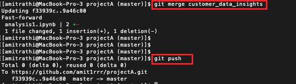

# Jupyter Notebook 版控結合 Git

原文: [How to use Git / GitHub with Jupyter Notebook](https://blog.reviewnb.com/github-jupyter-notebook/)


這是針對 Jupyter Notebook 用戶的綜合 Git 教程。如果您已經熟悉某個部分，請隨意跳過。最後你將能夠:

- 將您的 notebook 推送到 GitHub 存儲庫
- 開始對 notebook 進行版本控制
- 查看 GitHub 上的 Jupyter Notebook 拉取請求
- 了解如何恢復到特定 notebook 版本
- 獲取反饋並與同事討論 notebook 更改
- 輕鬆共享您的 notebook 供其他人查看

## 創建 GitHub 帳戶

如果您沒有 GitHub 帳戶，請在[此處](https://github.com/)創建一個。

## 本地設置 Git

- 下載並安裝最新版本的 Git。
- 通過在終端上運行以下命令在 git 中設置您的姓名和電子郵件

    ```bash
    $ git config --global user.name "Mona Lisa"
    $ git config --global user.email "email@example.com"
    ```

- 通過[帳密將本地 git 客戶端與 GitHub 連接起來](https://help.github.com/en/github/using-git/caching-your-github-password-in-git)。

##　創建新存儲庫

GitHub 存儲庫就像雲中的超級文件夾。您可以存儲文件（ notebook 、數據、程式碼）、查看這些文件的歷史更改、打開問題、討論更改等等。人們通常為每個專案創建一個存儲庫。

讓我們繼續在 GitHub 上創建一個存儲庫。創建後，您將看到如下所示的頁面，複製突出顯示的存儲庫 URL。


## Clone 存儲庫

讓我們通過在終端上運行以下命令來 clone 我們機器上的 GitHub 存儲庫。它將在我們的計算機上創建 `projectA` 目錄，該目錄鏈接到 GitHub 上的 `amit1rrr/projectA` 存儲庫。

```bash
git clone https://github.com/amit1rrr/projectA.git
```

結果:

```
Cloning into 'projectA'...
warning: You appear to have cloned an empty repository.
```

## 將 notebook 推送到 GitHub

我們的存儲庫現在是空的，讓我們向其中推送一些 notebook 。我們將兩個 notebook 複製到我們克隆的 projectA 存儲庫的目錄中，

```bash
cp /some/path/analysis1.ipynb /path/of/projectA/

cp /some/path/scratch.ipynb /path/of/projectA/
```

假設我們想將 `analysis1.ipynb` 推送到 GitHub。我們首先需要告訴本地 git 客戶端開始追踪文件。

```bash
git add analysis1.ipynb
```

您可以使用 `git status` 檢查正在追踪哪些文件，


您可以看到 `analysis1.ipynb` 位於 “Changes to be committed:” 下，因此我們的本地 git 客戶端正在追踪它。現在讓我們提交更改，

```bash
# -m flag is used to provide a human friendly message describing the change
git commit -m "Adds customer data analysis notebook"
```

提交只是創建一個可以隨時恢復的檢查點。讓我們將此提交推送到 GitHub。

```bash
git push
```

現在您可以訪問 GitHub 上的存儲庫頁面來查看您的提交。

## 在分支中開發

假設您正在處理一個跨越多天的大型項目，但您需要定期推送正在進行的工作提交作為備份。做到這一點的方法是創建一個 feature branch。

每個存儲庫都有一個默認分支（通常是 master 或 main），用於存儲已完成工作的最新版本。團隊的每個成員都可以創建自己的功能分支來存儲他們的 WIP 提交。當他們在功能分支中的工作準備好共享時，他們可以創建拉取請求以進行同行評審，然後將功能分支合併到主分支中。讓我們通過具體步驟來解開它。

假設我即將開始一個新項目來分析客戶數據。首先，我將創建一個新分支，

```bash
git checkout -b customer_data_insights
```

然後我將創建/編輯一些 notebook 和其他文件來進行實際分析。當我準備好提交 WIP 時，我將執行通常的 `git add`、`git commit`、`git push`。在 `git push` 中，您將看到以下錯誤，因為 GitHub 上尚不存在該分支。


只需複制錯誤中顯示的命令，首先推送分支，

```bash
git push --set-upstream origin customer_data_insights
```

然後執行 `git push`` 將您的提交推送到這個新創建的分支。

## 創建 Pull Request

假設您已經在功能分支上工作了一段時間，並且已經準備好迎接黃金時段了。最有可能的是，您希望首先與同事分享，在將其合併到主分支之前獲取他們的反饋。這就是 pull requests 的用途。

您可以從 GitHub UI 創建 pull requests。轉到您的 Project 頁面 -> Pull requests tab -> 點擊 “New pull request”。


在下一頁上提供標題，簡要描述您的更改並再次點擊 “Create pull request”。


GitHub 的 pull request 非常適合 peer review，因為它們可以讓您並排查看更改並對其進行評論。


一旦您的更改獲得批准，您可以從 GitHub UI 合併它們。


或者從命令行運行 `git merge` + `git push`，




## 恢復到特定 notebook 版本

如果您想暫時返回到某個 commit，簽出文件，然後返回到您所在的位置，那麼您只需 checkout 所需的 commit 即可。最後運行 “git checkout master” 返回當前狀態。


如果您想實際恢復到舊狀態並在那裡進行一些更改，您可以從該提交開始一個新分支。

```bash
git checkout -b old-state f33939cd63004e3e67b111f7bcb350ffd2b0608a
```

您還可以通過轉至您的 `專案頁面 -> commits` 來瀏覽 GitHub 上的舊提交。打開所需的 commit 並點擊 “View File” 以查看該 commit 的 notebook 狀態。

## 唯讀的共享 notebook 

當您瀏覽 GitHub 存儲庫中的 notebook 時，它會將它們呈現為 HTML。因此，像這樣共享 notebook 的唯讀鏈接非常方便。如果它是私有存儲庫，則您與之共享鏈接的人需要擁有 GitHub 帳戶並有權訪問您的存儲庫。

## 結論

如果您是 Git 新手，可能需要一些時間才能習慣所有命令。但這是一種經過驗證的軟件項目協作方式，並且也廣泛應用於數據科學工作。

