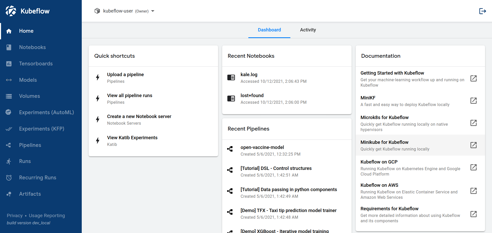

# 從零開始的基本 Kubeflow 管道

原文: [Tutorial — Basic Kubeflow Pipeline From Scratch](https://towardsdatascience.com/tutorial-basic-kubeflow-pipeline-from-scratch-5f0350dc1905)

Kubeflow 是一個機器學習平台，有助於在 Kubernetes 上部署機器學習專案。儘管最近，Kubeflow 越來越多地出現在科技公司的技術棧中，並且由於網路上使用 Kubeflow 來進行 AI/ML 的範例相對稀少，對於新手來說，開始使用 Kubeflow 可能會讓人不知該如何入門。

儘管 Kubeflow 的文檔並不缺乏，但在您從頭開始創建機器學習管道時，一個簡單易理解的範例總是有幫助的。

在本教程中，我們將介紹設計可正常運行的管道所需的每個步驟。你將學到如何:

- 創建 Kubernetes 集群
- 安裝 Kubeflow
- 創建容器註冊服務 (container registry)
- 構建容器鏡像並將其推送到您的器註冊服務
- 授予 Kubeflow 訪問您的 S3 存儲桶的權限
- 使用輸入和輸出工件創建 Kubeflow 組件
- 創建 Kubeflow 流水線，上傳並運行

## 1. 部署 Kubernetes 集群並安裝 Kubeflow

在 Kubernetes 集群上安裝 Kubeflow。您可以在 [Kubeflow 文檔](https://www.kubeflow.org/docs/started/installing-kubeflow/)中找到更多信息。

也可參考[手動安裝 Kubeflow](../../env/kubeflow-install.md)來構建一個本機 Kubeflow 練習環境。

如果所有 pod 都成功啟動，您可以使用 kubectl 檢查:

```bash
$ kubectl get pod -A
NAMESPACE                   NAME                                                     READY   STATUS    RESTARTS      AGE
kube-system                 local-path-provisioner-79f67d76f8-qjnn9                  1/1     Running   0             20h
kube-system                 coredns-597584b69b-9d5d9                                 1/1     Running   0             20h
kube-system                 metrics-server-5f9f776df5-x6h6q                          1/1     Running   0             20h
metallb-system              metallb-speaker-fr9nc                                    1/1     Running   0             20h
metallb-system              metallb-controller-8764f5bd5-lmhxm                       1/1     Running   1 (20h ago)   20h
kube-system                 ingress-nginx-controller-6b8bfd7f69-qfqsf                1/1     Running   0             20h
default                     nginx-76d6c9b8c-gtt2w                                    1/1     Running   0             20h
cert-manager                cert-manager-cainjector-d9bc5979d-tlm75                  1/1     Running   0             20h
cert-manager                cert-manager-74d949c895-5zgth                            1/1     Running   0             20h
istio-system                istiod-56f7cf9bd6-q8lbc                                  1/1     Running   0             20h
knative-eventing            eventing-webhook-79cd6767-p48r2                          1/1     Running   0             20h
cert-manager                cert-manager-webhook-84b7ddd796-ps2m6                    1/1     Running   0             20h
knative-eventing            eventing-controller-c6f5fd6cd-2zbrn                      1/1     Running   0             20h
istio-system                cluster-local-gateway-6955b67f54-95lfn                   1/1     Running   0             20h
auth                        dex-56d9748f89-5j224                                     1/1     Running   0             20h
istio-system                istio-ingressgateway-67f7b5f88d-v5vfc                    1/1     Running   0             20h
kubeflow                    training-operator-7589458f95-5dmn6                       1/1     Running   0             20h
istio-system                authservice-0                                            1/1     Running   0             20h
knative-serving             net-istio-webhook-7ff9fdf999-bhst7                       2/2     Running   0             20h
kubeflow                    metacontroller-0                                         1/1     Running   0             20h
kubeflow                    cache-server-76cb8f97f9-7wscc                            2/2     Running   0             20h
kubeflow                    notebook-controller-deployment-6bb6578dd8-zkwhw          2/2     Running   1 (20h ago)   20h
knative-serving             net-istio-controller-5fcd96d76f-jhbmx                    2/2     Running   0             20h
knative-serving             autoscaler-6dbcdd95c7-2xt5s                              2/2     Running   0             20h
kubeflow                    katib-controller-8bb4fdf4f-2jzl9                         1/1     Running   0             20h
kubeflow                    katib-db-manager-f8dc7f465-l4tsp                         1/1     Running   1 (20h ago)   20h
knative-serving             domain-mapping-75cc6d667f-gkbgn                          2/2     Running   0             20h
knative-serving             domainmapping-webhook-6dfb78c944-gsgns                   2/2     Running   0             20h
kubeflow                    profiles-deployment-786df9d89d-nd2gs                     3/3     Running   0             20h
knative-serving             webhook-69cc5b9849-tdrrf                                 2/2     Running   0             20h
kubeflow                    ml-pipeline-persistenceagent-798dbf666f-vk2bb            2/2     Running   0             20h
kubeflow                    admission-webhook-deployment-6db8bdbb45-d5l9z            1/1     Running   0             20h
kubeflow                    kserve-models-web-app-99849d9f7-9z48b                    2/2     Running   0             20h
knative-serving             activator-67849589d6-gc288                               2/2     Running   0             20h
knative-serving             controller-b9b8855b8-jm75z                               2/2     Running   0             20h
kubeflow                    katib-mysql-db6dc68c-5w5ss                               1/1     Running   0             20h
kubeflow                    katib-ui-7859bc4c67-wvv67                                2/2     Running   0             20h
kubeflow                    workflow-controller-6547f784cd-c7c6b                     2/2     Running   1 (20h ago)   20h
kubeflow                    tensorboards-web-app-deployment-58469c74bc-whz6x         2/2     Running   0             20h
kubeflow                    centraldashboard-655c7d894c-qvtfb                        2/2     Running   0             20h
kubeflow                    jupyter-web-app-deployment-cbf78fc7d-x5qms               2/2     Running   0             20h
kubeflow                    kserve-controller-manager-85b6b6c47d-n7sg9               2/2     Running   0             20h
kubeflow                    ml-pipeline-viewer-crd-56f7cfd7d9-dnlrr                  2/2     Running   0             20h
kubeflow                    ml-pipeline-scheduledworkflow-859ff9cf7b-dcrrr           2/2     Running   0             20h
kubeflow                    tensorboard-controller-deployment-6664b8866f-gcdhf       3/3     Running   2 (20h ago)   20h
kubeflow                    volumes-web-app-deployment-75b88664f4-r8sg5              2/2     Running   0             20h
kubeflow                    metadata-envoy-deployment-5b6c575b98-rdv4k               1/1     Running   0             20h
kubeflow                    ml-pipeline-ui-6d69549787-p266n                          2/2     Running   0             20h
kubeflow                    kubeflow-pipelines-profile-controller-59ccbd47b9-d5zsg   1/1     Running   0             20h
kubeflow                    mysql-c999c6c8-tl47w                                     2/2     Running   0             20h
kubeflow-user-example-com   ml-pipeline-ui-artifact-6cb7b9f6fd-czl8h                 2/2     Running   0             20h
kubeflow                    minio-65dff76b66-wngnf                                   2/2     Running   0             20h
kubeflow                    metadata-grpc-deployment-784b8b5fb4-g72s8                2/2     Running   3 (20h ago)   20h
kubeflow                    metadata-writer-5899c74595-prr4j                         2/2     Running   0             20h
kubeflow                    ml-pipeline-7d5658846f-vdmjb                             2/2     Running   1 (20h ago)   20h
kubeflow-user-example-com   ml-pipeline-visualizationserver-7b5889796d-fzbv7         2/2     Running   0             20h
kubeflow                    ml-pipeline-visualizationserver-64447ffc76-sz78r         2/2     Running   0             20h
```

## 2. 訪問 Kubeflow 中央儀表板

部署完所有內容後，您可以使用以下命令進行端口轉發：

```bash
kubectl port-forward svc/istio-ingressgateway -n istio-system 7080:80
```

並通過 `http://localhost:7080` 遠程訪問 Kubeflow Central Dashboard。



!!! tip
  Kubeflow 安裝時會預設產生一個使用者 `user@example.com`, 請使用下列用戶帳戶來登入 Kubeflow:

  - User: `user@example.com`
  - Password: `12341234`

## 3. 創建容器

在您的計算機上，創建一個文件夾，您將從現在開始在該文件夾上工作。如果您想對您的工作進行版本控制，它可以是 Git 存儲庫文件夾。

創建一個文件並將其命名為 `Dockerfile`。在 linux 和 mac 上，您可以為此鍵入 touch Dockerfile 命令。使用您想要的任何 IDE 打開它，甚至可以使用記事本 (Windows) 或 TextEdit (Mac)。

在 Dockerfile 中，我們將聲明一個父映像（這裡我將使用 ubuntu:20.04），安裝 pip，然後安裝一些運行腳本所需的包。我們的 Dockerfile 將如下所示：

```Dockerfile
FROM ubuntu:20.04
RUN set -xe \
 && apt-get update -y \
 && apt-get install -y python3-pip \
 && apt install -y python-is-python3
RUN pip3 --no-cache-dir install numpy scikit-learn pandas boto3
```

現在使用此命令構建容器鏡像，並將 <image_name> 更改為您想要為鏡像指定的任何名稱。不要忘記最後的點！

```bash
docker build -t <image_name> .
```

例如:

```bash
docker build -t witlab/kf-pipeline-base .
```

## 4. 將鏡像推送進 container registry

登入 dockerhub:

```bash
docker login --username userxxx --password pwdxxx
```

運行以下命令將此鏡像推送到 docker hub 存儲庫:

```bash
docker push witlab/kf-pipeline-base:latest
```

結果:

```bash
The push refers to repository [docker.io/witlab/kf-pipeline-base]
1c26de0048ba: Pushed 
da453ee07848: Pushed 
6f37ca73c74f: Mounted from library/ubuntu 
latest: digest: sha256:f4d02ee174b2e522f96a8379e4d9cb7af9ba2c04707b09a31f053ca87773e519 size: 955
```


## 5. 在 S3 (Minio) 上傳測試/訓練數據集

快速部署一個單機版 minio 服務：

```yaml title="docker-compose.yml"
version: "3.7"

services:
  minio:
    image: "quay.io/minio/minio:RELEASE.2022-08-02T23-59-16Z"
    ports:
      - "9000:9000"
      - "9001:9001"
    volumes:
      - "./minio/data1:/data1"
      - "./minio/data2:/data2"
    command: server --console-address ":9001" http://minio/data{1...2}
    environment:
      - MINIO_ROOT_USER=admin
      - MINIO_ROOT_PASSWORD=12341234
    healthcheck:
      test: ["CMD", "curl", "-f", "http://localhost:9000/minio/health/live"]
      interval: 30s
      timeout: 20s
      retries: 3
```

執行下列命令來啟動 minio 服務實例:

```bash
$ docker compose up

[+] Running 8/8
 ✔ minio 7 layers [⣿⣿⣿⣿⣿⣿⣿]      0B/0B      Pulled                                                                     14.7s 
   ✔ a96e4e55e78a Pull complete                                                                                         6.5s 
   ✔ 67d8ef478732 Pull complete                                                                                         6.6s 
   ✔ 7e8ac213354d Pull complete                                                                                         6.6s 
   ✔ f9808ec3136d Pull complete                                                                                         6.7s 
   ✔ 1bd4364fc9fa Pull complete                                                                                         6.8s 
   ✔ 5d5c32fa1464 Pull complete                                                                                         6.9s 
   ✔ 6fb1e1fbcd87 Pull complete                                                                                        10.5s 
[+] Running 2/2
 ✔ Network minio_default    Created                                                                                     0.1s 
 ✔ Container minio-minio-1  Created                                                                                     0.3s 
Attaching to minio-minio-1
minio-minio-1  | Formatting 1st pool, 1 set(s), 2 drives per set.
minio-minio-1  | WARNING: Host minio has more than 1 drives of set. A host failure will result in data becoming unavailable.
minio-minio-1  | MinIO Object Storage Server
minio-minio-1  | Copyright: 2015-2022 MinIO, Inc.
minio-minio-1  | License: GNU AGPLv3 <https://www.gnu.org/licenses/agpl-3.0.html>
minio-minio-1  | Version: RELEASE.2022-08-02T23-59-16Z (go1.18.5 linux/amd64)
minio-minio-1  | 
minio-minio-1  | Status:         2 Online, 0 Offline. 
minio-minio-1  | API: http://172.18.0.2:9000  http://127.0.0.1:9000 
minio-minio-1  | Console: http://172.18.0.2:9001 http://127.0.0.1:9001 
minio-minio-1  | 
minio-minio-1  | Documentation: https://docs.min.io
minio-minio-1  | 
minio-minio-1  |  You are running an older version of MinIO released 9 months ago 
minio-minio-1  |  Update: Run `mc admin update` 
minio-minio-1  | 
minio-minio-1  | 
```

使用瀏覽器來瀏覽 Minio 管理 UI 端點 `http://localhost:9001`, 使用下面的帳密來登入:

- User: `admin`
- Password: `12341234`


