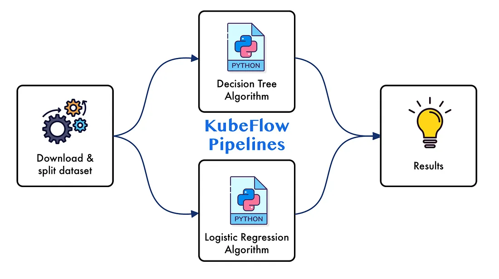
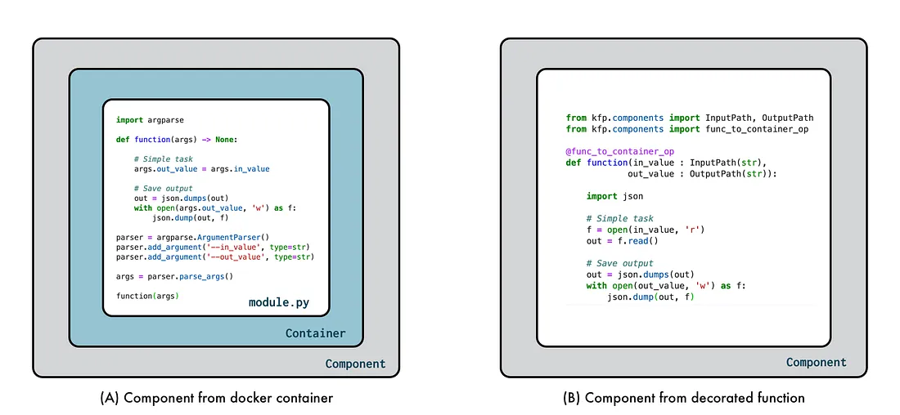
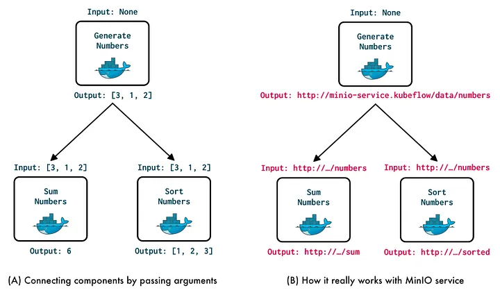
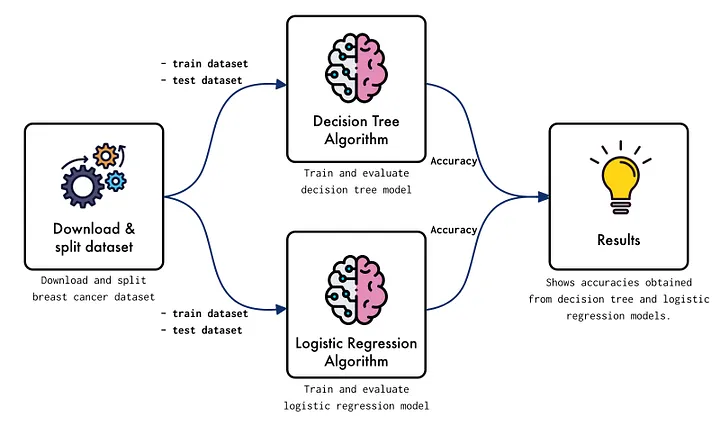
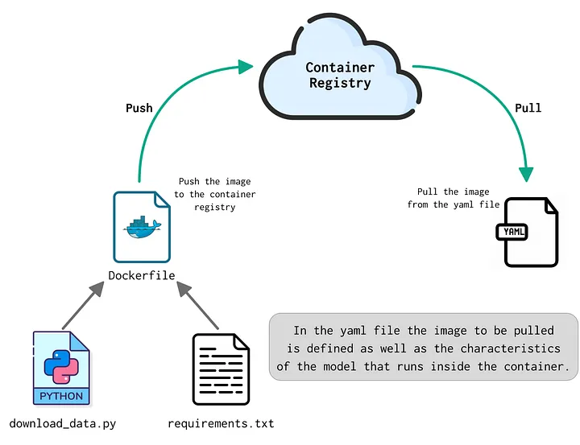
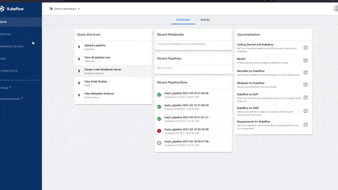
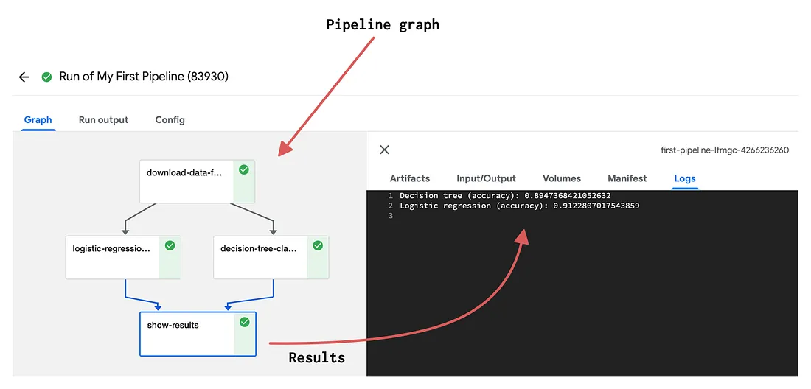

# 如何從頭開始構建第一個 Kubeflow 管道

原文: [Kubeflow Pipelines: How to Build your First Kubeflow Pipeline from Scratch](https://towardsdatascience.com/kubeflow-pipelines-how-to-build-your-first-kubeflow-pipeline-from-scratch-2424227f7e5)

**有關如何設計、構建和運行 Kubeflow 管道的 step-by-step 指南**



Kubeflow 是一個 AI/ML 平台，它提供了一組工具來開發和維護機器學習生命週期，並且在 kubernetes 集群之上運行。

Kubeflow Pipelines 是 Kubeflow 一個關鍵元件，它允許我們製作原型、自動化、部署和編排機器學習工作流。這樣的工作流由一組組件組成，這些組件僅僅是獨立的功能，而這些功能又存在於 docker 容器中。

然而，當您第一次使用 kubeflow 時，理解如何設計、構建和連接這些組件來創建和部署 kubeflow 管道時會不知道該怎麼上手，這就是為什麼在本教程中我們將看到如何創建 Kubeflow 管道了解其組成部分以及它們如何相互作用。

## 什麼是 Kubeflow 管道？

Kubeflow Pipelines 是 Kubeflow 擴展，它提供了創建機器學習工作流的工具。基本上，這些工作流是以圖形形式設計的任務鏈(tasks chain)，並表示為有向無環圖 (DAG)。圖中的每個節點都稱為一個組件，其中該組件代表一個位於 docker 容器內的獨立執行的任務。在圖 2 中，我們可以看到管道組件的可視化描述。



Kubeflow Pipelines 基於 Argo Workflows，後者是 kubernetes 的容器原生工作流引擎。一般而言，Kubeflow Pipelines 由下列元件組合而成：

- **Python SDK**：它允許您使用 Kubeflow 管道領域特定語言 (DSL) 創建和操作管道及其組件。
- **DSL compiler**：它允許您將 python 代碼中定義的管道轉換為 IR YAML 文件。
- **Pipeline Service**：從靜態配置或 IR YAML 文件創建管道運行。
- **Kubernetes Resources**：管道服務連接到 kubernetes API，以定義運行 YAML 文件中定義的管道所需的資源。
- **Artifact Storage**：Kubeflow Pipelines 存儲元數據和工件。實驗、作業、運行和指標等元數據​​存儲在 MySQL 數據庫中。管道包、大規模指標和視圖等工件存儲在 MinIO 服務器等工件存儲中。

此外，Kubeflow Pipelines 還提供了一個 UI 和一個客戶端 API，用於管理管道、組件、實驗、運行和工件。

構建 Kubeflow Pipelines 的一個基本要素是{==組件之間的連接==}。這個連接是通過第三個服務來實現的，默認情況下是 MinIO。基本上每個組件的每個 `input` 和 `output` 都表示為存儲在 MinIO 中的一個工件，這個工件將由一個 URI 定義和引用，該 URI 指示將分別讀取或寫入此類 `input` 或 `output` 的位置。在圖 3 中，我們可以看到如何使用 MinIO 服務進行組件通信的直觀描述。



在上圖中，在左側，我們可以看到組件之間的連接是如何通過每個元素的輸入和輸出進行的。從右側我們觀察它是如何真正發生的，即每個進入或離開組件的工件都存儲在存儲服務（如 MinIO）中，因此作為輸入或輸出值傳遞的是此類工件的引用。我們將在下一節中詳細了解這一點，我們將在下一節中構建我們的第一個管道。

現在我們了解了 Kubeflow Pipelines 是什麼、它的組件以及它們如何相互交互，讓我們創建並自動化一個涵蓋構建 Kubeflow Pipelines 的大部分基礎知識的管道，讓我們開始吧！

## 構建第一個 Kubeflow 管道

在此示例中，我們將構建一個管道來解決眾所周知的乳腺癌數據集的分類問題。該管道將由 4 個組件組成，涵蓋以下任務：下載和拆分數據集，訓練和驗證兩個分類模型（決策樹和邏輯回歸），最後顯示結果。在圖 4 中，您可以看到此示例中要構建的管道體系結構的直觀描述。



該示例將分為以下步驟：

- 流程說明
- 組件：download_data
- 組件：decision_tree 與 logistic_regression
- 組件：show_results
- 編譯運行

範例 repo: [FernandoLpz / Kubeflow_Pipelines](https://github.com/FernandoLpz/Kubeflow_Pipelines)

### 流程說明

首先，我們將為管道中的每個組件創建一個容器。出於實際和可解釋的目的，組件 `download_data` 、`decision_tree` 和 `logistic_regression` 將是手動構建的 docker 容器，其容器鏡像託管在 Docker Hub 上。組件 `show_results` 將是由來自 kfp.components 的擴展 `@func_to_container_op` 生成的容器（我們稍後會看到）。然後將為每個 docker 容器生成一組 yaml 清單。稍後，我們將生成 python 腳本，該腳本的目的是定義管道圖。最後，我們將編譯管道，將其託管在 Kubeflow Pipelines 中並運行管道！

### 組件：download_data

該組件的目標是下載和拆分數據集。正如我們已經提到的，我們將要使用的數據集是眾所周知的乳腺癌，它被發現是 scikit-learn 的擴展。然後，組件將如下所示：

```python
import json

import argparse
from pathlib import Path

from sklearn.datasets import load_breast_cancer
from sklearn.model_selection import train_test_split

def _download_data(args):

    # Gets and split dataset
    x, y = load_breast_cancer(return_X_y=True)
    x_train, x_test, y_train, y_test = train_test_split(x, y, test_size=0.2)

    # Creates `data` structure to save and 
    # share train and test datasets.
    data = {'x_train' : x_train.tolist(),
            'y_train' : y_train.tolist(),
            'x_test' : x_test.tolist(),
            'y_test' : y_test.tolist()}

    # Creates a json object based on `data`
    data_json = json.dumps(data)

    # Saves the json object into a file
    with open(args.data, 'w') as out_file:
        json.dump(data_json, out_file)

if __name__ == '__main__':
    
    # This component does not receive any input
    # it only outpus one artifact which is `data`.
    parser = argparse.ArgumentParser()
    parser.add_argument('--data', type=str)
    
    args = parser.parse_args()
    
    # Creating the directory where the output file will be created 
    # (the directory may or may not exist).
    Path(args.data).parent.mkdir(parents=True, exist_ok=True)

    _download_data(args)
```

正如我們所見，在第 12 行和第 13 行，我們分別下載和拆分數據集。接下來有趣的事情來了，我們生成一個名為 `data` 的 `dict` 類型的結構（第 23 行），以託管訓練和測試資料集。然後我們將這個結構轉換為 `json` 類型的對象，最後我們在 `args.data` 參數中定義的文件中轉儲此類對象。這個轉儲數據對象的過程是能夠將生成的數據（在本例中為訓練和測試數據集）公開給其他組件（決策樹和邏輯回歸模型）的關鍵。關鍵是將我們的數據保存在文件中，在本例中我們將其設為 `json` 類型（推薦），但它可以是任何格式。

好吧，一旦我們有了 python 腳本，我們就需要生成 Dockerfile 來生成我們將上傳到 DockerHub 的鏡像。在這種情況下，我們的鏡像非常簡單，看起來像這樣：

```dockerfile
ROM python:3.8-slim
WORKDIR /pipeline
COPY requirements.txt /pipeline
RUN pip install -r requirements.txt
COPY download_data.py /pipeline
```

一旦 Dockerfile 準備就緒，我們將繼續構建映像並將其上傳到容器註冊表。

太好了，我們幾乎已經為 `download_data` 組件準備好了一切，我們唯一缺少的是 yaml 清單，它旨在描述我們組件的行為以及定義此類組件所需的輸入和輸出類型。因此，download_data 組件的清單如下所示：

```yaml title="download_data.yaml"
name: Download Data Function
description: Download toy data from sklearn datasets

outputs:
- {name: Data, type: LocalPath, description: 'Path where data will be stored.'}

implementation:
  container:
    image: fernandolpz/only-tests:download_data_v3
    command: [
      python, download_data.py,

      --data,
      {outputPath: Data},
    ]
```

如我們所見，在第 5 行中，我們定義了組件的輸出，在本例中，它使用名稱 `Data` 定義，其類型為 `LocalPath` 。需要注意的是，數據類型指的是組件輸出的內容，在這種情況下，因為它是一個包含訓練和測試數據集的結構，所以數據類型就是這個文件存儲的地方。然而，有不同用途的不同數據類型（例如 String 、 Float 、 Integer 等），對於數據類型，建議查看相關文檔。在第 9 行中，我們引用將從 DockerHub 中提取的鏡像（此時我們假設鏡像已經構建並上傳到容器註冊表）。最後從第10行到第14行我們提到了鏡 像的使用，本例只接收一個參數，即 `data`。

太好了，到目前為止，我們已經了解瞭如何構建構成 `download_data` 組件的每個元素。在下圖中，我們可以看到該組件生成過程的可視化描述。



開發 `decision_trees` 和 `logisti_regression` 組件的過程實際上與 `dowload_data` 相同，唯一的區別在於參數的定義，因為這些組件接收由 `download_data` 下載的數據集所在的路徑作為輸入，所以讓我們看看我們如何做這個。

## 組件：decision_tree 與 logistic_regression

`decision_tree` 和 `logistic_regression` 組件的構造實際上是相同的，唯一的區別在於要實現的模型，因此，出於實際目的，我們將只展示 `decision_tree` 組件是如何完成的。

`decision_tree.py` 模塊如下：

```python title="decision_tree.py"
import json

import argparse
from pathlib import Path

from sklearn.metrics import accuracy_score
from sklearn.tree import DecisionTreeClassifier

def _decision_tree(args):

    # Open and reads file "data"
    with open(args.data) as data_file:
        data = json.load(data_file)
    
    # The excted data type is 'dict', however since the file
    # was loaded as a json object, it is first loaded as a string
    # thus we need to load again from such string in order to get 
    # the dict-type object.
    data = json.loads(data)

    x_train = data['x_train']
    y_train = data['y_train']
    x_test = data['x_test']
    y_test = data['y_test']
    
    # Initialize and train the model
    model = DecisionTreeClassifier(max_depth=3)
    model.fit(x_train, y_train)

    # Get predictions
    y_pred = model.predict(x_test)
    
    # Get accuracy
    accuracy = accuracy_score(y_test, y_pred)

    # Save output into file
    with open(args.accuracy, 'w') as accuracy_file:
        accuracy_file.write(str(accuracy))

if __name__ == '__main__':

    # Defining and parsing the command-line arguments
    parser = argparse.ArgumentParser(description='My program description')
    parser.add_argument('--data', type=str)
    parser.add_argument('--accuracy', type=str)

    args = parser.parse_args()

    # Creating the directory where the output file will be created (the directory may or may not exist).
    Path(args.accuracy).parent.mkdir(parents=True, exist_ok=True)
    
    _decision_tree(args)
```

首先，讓我們看一下第 44 和 45 行。正如我們所見，我們定義了兩個參數 `data` 和 `accuracy` 。 `data` 參數指的是 `download_data` 組件生成的數據集存放的路徑，`accuracy` 參數指的是我們將在該組件中得到的精度保存的路徑。

正如我們在第 50 行中觀察到的那樣，生成了將此類精度存儲為文件的路徑。然後剩下的就是讀取數據集作為 `json` 對象的文件（第 12-19 行），訓練模型，對其進行評估並將準確性保存在 `args.accuracy` 參數定義的路徑中（第 38 行），僅此而已！

現在我們必須為該組件創建如下所示的 docker 文件：

```dockerfile
ROM python:3.8-slim
WORKDIR /pipelines
COPY requirements.txt /pipelines
RUN pip install -r requirements.txt
COPY decision_tree.py /pipelines
view raw
```

最後我們只需要在一個 yaml manifest 中定義 `decision_tree` 組件的使用，如下：

```yaml title="decision_tree.yaml"
name: Decision Tree classifier
description: Trains a  decision tree classifier

inputs:
- {name: Data, type: LocalPath, description: 'Path where data is stored.'}
outputs:
- {name: Accuracy, type: Float, description: 'Accuracy metric'}

implementation:
  container:
    image: fernandolpz/only-tests:decision_tree_v3
    command: [
      python, decision_tree.py,

      --data,
      {inputPath: Data},

      --accuracy,
      {outputPath: Accuracy},

    ]
```

有兩件事需要考慮。第一個是我們正在定義一個輸入和輸出變量，它們分別對應於數據和精度。第二個是將輸入參數分別定義為數據和精度的 `InputPath` 和 `OutputPath`。

一旦定義了清單，`decision_tree` 組件就準備好了（正如我們所討論的，`logistic_regression` 組件的構建方式與 `decision_tree` 相同）。

好的，現在讓我們繼續構建我們的最後一個組件，讓我們開始吧！

### 組件：show_results

`show_results` 組件的目的是顯示從 `decision_tree` 和 `logistic_regression` 組件獲得的準確性。該組件也將在容器內定義，但是，與 `download_data` 、 `decision_tree` 和 `logistic_regression` 組件相比，`show_results` 組件將使用 kfp.componentes 的 `@func_to_container_op` 擴展轉換為容器。當要開發的任務不需要多個依賴項或者要解決的任務不像這個組件那樣非常廣泛時，這個擴展非常有用，因此，組件如下：

```python title="show_results.py"
from kfp.components import func_to_container_op

@func_to_container_op
def show_results(decision_tree : float, logistic_regression : float) -> None:
    # Given the outputs from decision_tree and logistic regression components
    # the results are shown.
    
    print(f"Decision tree (accuracy): {decision_tree}")
    print(f"Logistic regression (accuracy): {logistic_regression}")
```

由於此組件未在容器註冊表中定義，因此我們不需要 `yaml` 清單。在這種情況下，`@func_to_container_op` 擴展負責為我們定義這樣的清單。

太棒了，到目前為止，我們已經創建了管道的每個組件，我們只需要生成 python 腳本來定義組件之間的交互，從而能夠執行管道，讓我們開始吧！

### 編譯運行

最後，我們生成將定義管道架構的腳本，即組件將如何交互。那麼，這樣的文件將如下所示：

```python title="first_pipeline.py"
import kfp
from kfp.components import func_to_container_op

@func_to_container_op
def show_results(decision_tree : float, logistic_regression : float) -> None:
    # Given the outputs from decision_tree and logistic regression components
    # the results are shown.

    print(f"Decision tree (accuracy): {decision_tree}")
    print(f"Logistic regression (accuracy): {logistic_regression}")


@dsl.pipeline(name='First Pipeline', description='Applies Decision Tree and Logistic Regression for classification problem.')
def first_pipeline():

    # Loads the yaml manifest for each component
    download = kfp.components.load_component_from_file('download_data/download_data.yaml')
    decision_tree = kfp.components.load_component_from_file('decision_tree/decision_tree.yaml')
    logistic_regression = kfp.components.load_component_from_file('logistic_regression/logistic_regression.yaml')

    # Run download_data task
    download_task = download()

    # Run tasks "decison_tree" and "logistic_regression" given
    # the output generated by "download_task".
    decision_tree_task = decision_tree(download_task.output)
    logistic_regression_task = logistic_regression(download_task.output)

    # Given the outputs from "decision_tree" and "logistic_regression"
    # the component "show_results" is called to print the results.
    show_results(decision_tree_task.output, logistic_regression_task.output)


if __name__ == '__main__':
    kfp.compiler.Compiler().compile(first_pipeline, 'FirstPipeline.yaml')
```

主要功能稱為 `first_pipeline()` ，由 `dsl.pipeline()` 裝飾。這個主要功能定義了組件將如何集成。因此，在第 17、18 和 19 行中，組件 `download` 、 `decision_tree` 和 `logistic_regression` 從已經創建的 yaml 清單中加載。在第 22 行，執行了 `download_task`。隨後，在第 26 和 27 行中，通過將 `download_task` 的輸出作為輸入參數來執行任務 `decision_tree_task` 和 `logistic_regression_task`。最後，在第 31 行，通過將 `decision_tree_task` 和 `logistic_regression_task` 的輸出作為輸入來執行任務 `show_results`。

轉到 Kubeflow Pipeline UI 之前的最後一步是編譯之前的腳本，該腳本將生成一個 yaml 清單（稱為 `FirstPipeline.yaml`），該清單將上傳到 Kubeflow Pipelines 服務以運行管道。在圖 6 中，您可以看到有關如何上傳和運行 `FirstPipeline.yaml` 文件的直觀描述。



您可以看到組件 `show_restuls` 的輸出。



## 結論

在此教程中，我們了解了什麼是 Kubeflow Pipelines 及其組件。我們還開發了一個 step-by-step 管線，以便說明創建 Kubeflow 流水線的實用方法。

雖然在這篇教程中我們看到了基本管道的開發，但建議查看[文檔](https://www.kubeflow.org/docs/components/pipelines/v2/)，因為它在創建和部署 Kubeflow 管道時提供了多種選擇和可能性。