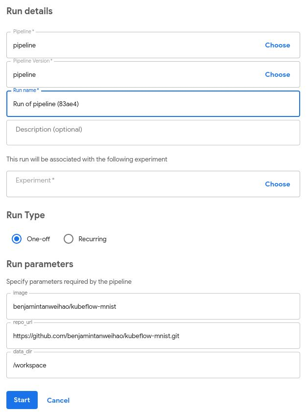

# 使用 Kubeflow 構建機器學習管道

原文: [Building Machine Learning Pipelines with Kubeflow](https://www.suse.com/c/rancher_blog/building-machine-learning-pipelines-with-kubeflow/)

在本教程中，我們將學習如何將現有的機器學習專案轉變為 Kubeflow 機器學習管道，然後再將其部署到 Kubernetes 上。在進行此練習時，請考慮如何將現有的機器學習項目轉換為 Kubeflow 管道。

我將以 Fashion MNIST 為例，因為模型的複雜性不是主要目標。對於這個簡單的例子，我將管道 (pipeline) 分為 3 個階段：

- Git clone 源碼 repository
- 下載並重新處理訓練和測試數據
- 模型訓練與評估

## 取得範例代碼

您可以從 [GitHub](https://github.com/benjamintanweihao/kubeflow-mnist) 下載代碼：

```bash
git clone https://github.com/benjamintanweihao/kubeflow-mnist.git
```

以下是我們將用於創建管道的完整列表。實際上，您的代碼很可能會跨越多個庫和文件。在我們的例子中，我們將把整個代碼分成兩個腳本，`preprocessing.py` 和 `train.py`。

```python title="preprocessing.py"
from tensorflow import keras
import argparse
import os
import pickle


def preprocess(data_dir: str):
    fashion_mnist = keras.datasets.fashion_mnist
    (train_images, train_labels), (test_images, test_labels) = fashion_mnist.load_data()

    train_images = train_images / 255.0
    test_images = test_images / 255.0

    os.makedirs(data_dir, exist_ok=True)

    with open(os.path.join(data_dir, 'train_images.pickle'), 'wb') as f:
	pickle.dump(train_images, f)

    with open(os.path.join(data_dir, 'train_labels.pickle'), 'wb') as f:
	pickle.dump(train_labels, f)

    with open(os.path.join(data_dir, 'test_images.pickle'), 'wb') as f:
        pickle.dump(test_images, f)

    with open(os.path.join(data_dir, 'test_labels.pickle'), 'wb') as f:
        pickle.dump(test_labels, f)

if __name__ == '__main__':
    parser = argparse.ArgumentParser(description='Kubeflow MNIST training script')
    parser.add_argument('--data_dir', help='path to images and labels.')
    args = parser.parse_args()

    preprocess(data_dir=args.data_dir)
```

處理腳本接受一個參數，`data_dir`。它下載並預處理數據並將序列化壓縮化的數據保存在 `data_dir` 中。例如，在生產代碼中，這可能是存儲 TFRecords 的目錄。

```python title="train.py"
import calendar
import os
import time

import tensorflow as tf
import pickle
import argparse

from tensorflow import keras
from constants import PROJECT_ROOT


def train(data_dir: str):
    # Training
    model = keras.Sequential([
          keras.layers.Flatten(input_shape=(28, 28)),
          keras.layers.Dense(128, activation='relu'),
          keras.layers.Dense(10)])

    model.compile(optimizer='adam',
              loss=tf.keras.losses.SparseCategoricalCrossentropy(from_logits=True),
                  metrics=['accuracy'])

    with open(os.path.join(data_dir, 'train_images.pickle'), 'rb') as f:
        train_images = pickle.load(f)

    with open(os.path.join(data_dir, 'train_labels.pickle'), 'rb') as f:
        train_labels = pickle.load(f)

    model.fit(train_images, train_labels, epochs=10)

    with open(os.path.join(data_dir, 'test_images.pickle'), 'rb') as f:
        test_images = pickle.load(f)

    with open(os.path.join(data_dir, 'test_labels.pickle'), 'rb') as f:
        test_labels = pickle.load(f)

    # Evaluation
    test_loss, test_acc = model.evaluate(test_images, test_labels, verbose=2)

    print(f'Test Loss: {test_loss}')
    print(f'Test Acc: {test_acc}')

    # Save model
    ts = calendar.timegm(time.gmtime())
    model_path = os.path.join(PROJECT_ROOT, f'mnist-{ts}.h5')
    tf.saved_model.save(model, model_path)

    with open(os.path.join(PROJECT_ROOT, 'output.txt'), 'w') as f:
        f.write(model_path)
        print(f'Model written to: {model_path}')


if __name__ == '__main__':
    parser = argparse.ArgumentParser(description='Kubeflow FMNIST training script')
    parser.add_argument('--data_dir', help='path to images and labels.')
    args = parser.parse_args()

    train(data_dir=args.data_dir)
```

在 `train.py` 中，構建模型，`data_dir` 用於指定 train 和 test 數據所在的位置。一旦訓練了模型並執行了評估，模型就會被寫入帶有時間戳的路徑。請注意，該路徑也寫入了 `output.txt`。這個以後會參考。

## 開發 Kubeflow 管道

要開始創建 Kubeflow Pipelines，我們需要引入一些依賴項。我已經準備了一個 `environment.yml`，其中包含 `kfp 0.5.0`、`tensorflow` 和其他所需的依賴項。

你需要安裝 `Conda`。然後你需要執行以下步驟:

```bash
% conda env create -f environment.yml
% source activate kubeflow-mnist
% python preprocessing.py --data_dir=/path/to/data
% python train.py --data_dir=/path/to/data
```

讓我們回顧一下管道中的重要步驟:

- Git clone 源碼 repository
- 下載並重新處理訓練和測試數據
- 模型訓練與評估

在我們開始編寫程式碼之前，這裡有一個關於 Kubeflow Pipelines 的高級概述。

Pipeline 由連接的組件組成。一個組件的輸出成為另一個組件的輸入。每個組件本質上都是在一個容器中執行的。

因此我們將需要構建一個運行環境的基礎鏡像，其中包含運行 `preprocessing.py` 和 `train.py` 所需的相關的 package。自然地，這兩個階段會有它們的組成部分。

我們還需要一個額外的 git clone 項目。我們可以將項目烘焙到 Docker 鏡像中，但在實際項目中，這可能會導致 Docker 鏡像的大小膨脹。

說到Docker鏡像，我們首先要創建一個。

### Step 0: 創建運行環境的基礎鏡像

如果你只是想測試一下，這一步是可選的，因為在 Docker Hub 上己經先行準備了一個容器鏡像。無論如何，這是 Dockerfile 的全貌:

```Dockerfile
FROM tensorflow/tensorflow:1.14.0-gpu-py3
LABEL MAINTAINER "Benjamin Tan <benjamintanweihao@gmail.com>"
SHELL ["/bin/bash", "-c"]

# Set the locale
RUN echo 'Acquire {http::Pipeline-Depth "0";};' >> /etc/apt/apt.conf
RUN DEBIAN_FRONTEND="noninteractive"
RUN apt-get update  && apt-get -y install --no-install-recommends locales && locale-gen en_US.UTF-8
ENV LANG en_US.UTF-8
ENV LANGUAGE en_US:en
ENV LC_ALL en_US.UTF-8

RUN apt-get install -y --no-install-recommends 
    wget 
    git 
    python3-pip 
    openssh-client 
    python3-setuptools 
    google-perftools && 
    rm -rf /var/lib/apt/lists/*

# install conda
WORKDIR /tmp
RUN wget --quiet https://repo.anaconda.com/miniconda/Miniconda3-4.7.12-Linux-x86_64.sh -O ~/miniconda.sh && 
    /bin/bash ~/miniconda.sh -b -p /opt/conda && 
    rm ~/miniconda.sh && 
    ln -s /opt/conda/etc/profile.d/conda.sh /etc/profile.d/conda.sh && 
    echo ". /opt/conda/etc/profile.d/conda.sh" >> ~/.bashrc

# build conda environments
COPY environment.yml /tmp/kubeflow-mnist/conda/
RUN /opt/conda/bin/conda update -n base -c defaults conda
RUN /opt/conda/bin/conda env create -f /tmp/kubeflow-mnist/conda/environment.yml
RUN /opt/conda/bin/conda clean -afy

# Cleanup
RUN rm -rf /workspace/{nvidia,docker}-examples && rm -rf /usr/local/nvidia-examples && 
    rm /tmp/kubeflow-mnist/conda/environment.yml

# switch to the conda environment
RUN echo "conda activate kubeflow-mnist" >> ~/.bashrc
ENV PATH /opt/conda/envs/kubeflow-mnist/bin:$PATH
RUN /opt/conda/bin/activate kubeflow-mnist

# make /bin/sh symlink to bash instead of dash:
RUN echo "dash dash/sh boolean false" | debconf-set-selections && 
    DEBIAN_FRONTEND=noninteractive dpkg-reconfigure dash

# Set the new Allocator
ENV LD_PRELOAD /usr/lib/x86_64-linux-gnu/libtcmalloc.so.
```

`Dockerfile` 的重要之處在於 Conda 環境已設置並準備就緒。要構建鏡像：

```bash
% docker build -t your-user-name/kubeflow-mnist . -f Dockerfile
% docker push your-user-name/kubeflow-mnist
```

### Step 1: Git Clone

在此步驟中，我們將從遠程 Git 存儲庫執行 git clone。特別是，我想向您展示如何從私有存儲庫中進行 git clone，因為您的許多項目都位於該存儲庫中。

這也是一個很好的機會來展示 Rancher 的另一個很棒的功能：輕鬆添加秘密（例如 SSH 密鑰）的能力。

#### 在 Kubernetes 中添加 Secrets

現在我們已經添加了 SSH 密鑰，是時候回到程式碼了。我們如何利用新添加的 SSH 密鑰訪問私有 git 存儲庫？

```python
def git_clone_darkrai_op(repo_url: str):

    volume_op = dsl.VolumeOp(
        name="create pipeline volume",
        resource_name="pipeline-pvc",
        modes=["ReadWriteOnce"],
        size="3Gi"
    )

    image = 'alpine/git:latest'

    commands = [
        "mkdir ~/.ssh",
        "cp /etc/ssh-key/id_rsa ~/.ssh/id_rsa",
        "chmod 600 ~/.ssh/id_rsa",
        "ssh-keyscan bitbucket.org >> ~/.ssh/known_hosts",
        f"git clone {repo_url} {PROJECT_ROOT}",
        f"cd {PROJECT_ROOT}"]

    op = dsl.ContainerOp(
        name='git clone',
        image=image,
        command=['sh'],
        arguments=['-c', ' && '.join(commands)],
        container_kwargs={'image_pull_policy': 'IfNotPresent'},
        pvolumes={"/workspace": volume_op.volume}
    )

    # Mount Git Secrets
    op.add_volume(V1Volume(name='ssh-key-volume',
                           secret=V1SecretVolumeSource(secret_name='ssh-key-secret')))
    op.add_volume_mount(V1VolumeMount(mount_path='/etc/ssh-key', name='ssh-key-volume', read_only=True))

    return op
```

1. 首先，創建一個預定義大小為 3Gi 的 Kubernetes 卷。

2. 其次，容器鏡像變量指定我們將使用 `alpine/git` 容器鏡像。接下來是將在容器中執行的命令列表。

    - 這些命令實質上設置了 SSH 密鑰，以便管道步驟可以從私有存儲庫進行 git clone（或者通常只使用 git:// URL 而不是 https://）。
    - 此函數的核心是以下一行，它返回一個 `dsl.ContainerOp`。
    - command 和 arguments 指定在鏡像中要執行的命令。

3. 最後一個有趣的參數是 `pvolumes`，它代表 Pipeline Volumes。它創建一個 Kubernetes 卷並允許管道組件共享單個存儲。此卷安裝在 `/workspace` 上。然後這個組件所做的是將存儲庫 `git clone` 到 `/workspace` 中。

#### 使用 Secrets

再次查看命令以及從何處複製 SSH 密鑰。

Pipeline volume 在哪裡創建？ 當我們將所有組件整合到一個管道中時，就會發生這種情況。我們將 Secret 安裝在 `/etc/ssh-key/`：

```python
op.add_volume_mount(V1VolumeMount(mount_path='/etc/ssh-key', name='ssh-key-volume', read_only=True))
```

請注意，我們將 Secret 命名為 `ssh-key-secret`:

```python
op.add_volume(V1Volume(name='ssh-key-volume',
                           secret=V1SecretVolumeSource(secret_name='ssh-key-secret')))
```

我們使用相同的捲名稱 `ssh-key-volume` 將所有內容連接在一起。

### Step 2: Preprocessing

```bash
def preprocess_op(image: str, pvolume: PipelineVolume, data_dir: str):
    return dsl.ContainerOp(
        name='preprocessing',
        image=image,
        command=[CONDA_PYTHON_CMD, f"{PROJECT_ROOT}/preprocessing.py"],
        arguments=["--data_dir", data_dir],
        container_kwargs={'image_pull_policy': 'IfNotPresent'},
        pvolumes={"/workspace": pvolume}
    )
```

如您所見，預處理步驟看起來很相似。

1. 該鏡像指向我們在步驟 0 中創建的容器鏡像。

2. 這裡的命令只是使用指定的 conda python 執行 `preprocessing.py` 腳本。執行 `preprocessing.py` 腳本需要 `data_dir`。

3. 這個階段的 `pvolume` 將在 `/workspace` 中有源程式碼存儲庫，這意味著我們所有的腳本在這個階段都已經可用。這個階段預處理後的數據存放在 `/workspace` 下的 `data_dir` 中。

### Step 3: Training 與 Evaluation

```python
def train_and_eval_op(image: str, pvolume: PipelineVolume, data_dir: str, ):
    return dsl.ContainerOp(
        name='training and evaluation',
        image=image,
        command=[CONDA_PYTHON_CMD, f"{PROJECT_ROOT}/train.py"],
        arguments=["--data_dir", data_dir],
        file_outputs={'output': f'{PROJECT_ROOT}/output.txt'},
        container_kwargs={'image_pull_policy': 'IfNotPresent'},
        pvolumes={"/workspace": pvolume}
    )
```

最後，是訓練和評估步驟的時候了。這裡唯一的區別是 `file_outputs` 參數。如果我們再次查看 `train.py`，會發現以下程式片段：

```python
    with open(os.path.join(PROJECT_ROOT, 'output.txt'), 'w') as f:
        f.write(model_path)
        print(f'Model written to: {model_path}')
```

發生的事情是我們將模型路徑寫入名為 `output.txt` 的文本文件。通常，這可以被發送到下一個管道組件，在這種情況下，該參數將包含模型的路徑。

#### 把一切都組合起來

指定 pipeline 需要在 pipeline 函數上註解 `dsl.pipeline`。

```bash
@dsl.pipeline(
    name='Fashion MNIST Training Pipeline',
    description='Fashion MNIST Training Pipeline to be executed on KubeFlow.'
)
def training_pipeline(image: str = 'benjamintanweihao/kubeflow-mnist',
                      repo_url: str = 'https://github.com/benjamintanweihao/kubeflow-mnist.git',
                      data_dir: str = '/workspace'):
    git_clone = git_clone_darkrai_op(repo_url=repo_url)

    preprocess_data = preprocess_op(image=image,
                                    pvolume=git_clone.pvolume,
                                    data_dir=data_dir)

    _training_and_eval = train_and_eval_op(image=image,
                                           pvolume=preprocess_data.pvolume,
                                           data_dir=data_dir)

if __name__ == '__main__':
    import kfp.compiler as compiler
    compiler.Compiler().compile(training_pipeline, __file__ + '.tar.gz')
```

還記得管道組件的輸出是另一個組件的輸入嗎？這裡將 `git_clone container_op` 的 `pvolume` 傳入 `preprocess_op`。

最後一部分將 `pipeline.py` 轉換為可執行腳本。最後一步是 `compile pipeline`：

```bash
% dsl-compile --py pipeline.py --output pipeline.tar.gz
```

#### 上傳和執行 Kubeflow 管道

有趣的來了！第一步是上傳 pipeline。點擊 `Upload a pipeline`:


接下來，填寫 `Pipeline Name` 和 `Pipeline Description`，然後選擇 `Choose file` 並指向 `pipeline.tar.gz` 以上傳管道。


下一頁將顯示完整的管道。我們看到的是管道的有向無環圖(DAG)，在這種情況下，這意味著依賴關係是單向的，它不包含循環。點擊藍色的 `Create run` 按鈕開始訓練。


大多數欄位都應該填寫。請注意，Run 參數與在帶有 `@dsl.pipeline` 註釋的 `training_pipeline` 函數中指定的參數相同：



最後，當您單擊藍色的 `Start` 按鈕時，整個流程就開始了！您可以點擊每個組件，然後點擊日誌以觀察發生了什麼。整個 pipeline 完成後，所有組件右側都會有一個綠色的複選標記，如下所示：


## 結論

在本文中，我們經歷了為 Kubeflow 準備機器學習專案，然後構建 Kubeflow 機器學習管道，最後使用 Kubeflow 網頁介面上傳和執行管道的過程。這種方法的妙處在於，您的機器學習專案不管它是簡單或複雜，您仍然可以使用這裡展示的相同技術。

因為 Kubeflow 使用容器作為組件，所以您可以自由地引入喜歡的相關工具。由於 Kubeflow 在 Kubernetes 上運行，您可以讓 Kubernetes 處理機器學習工作負載的調度。
