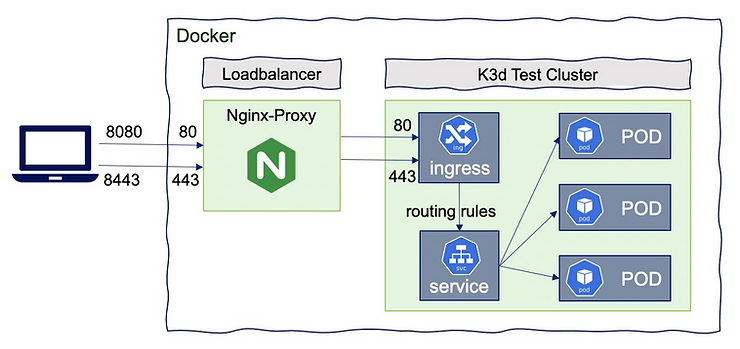
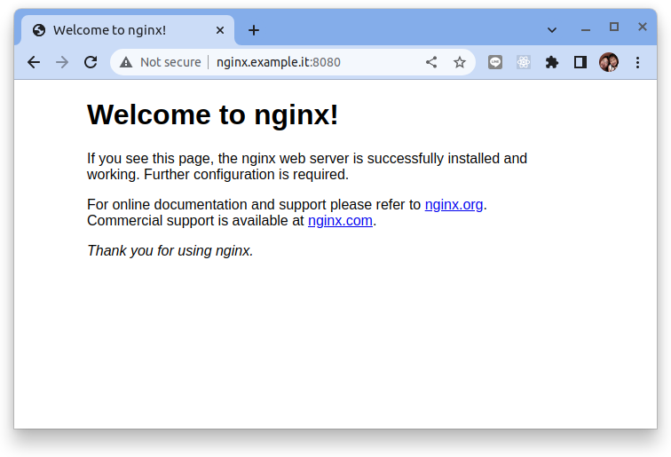
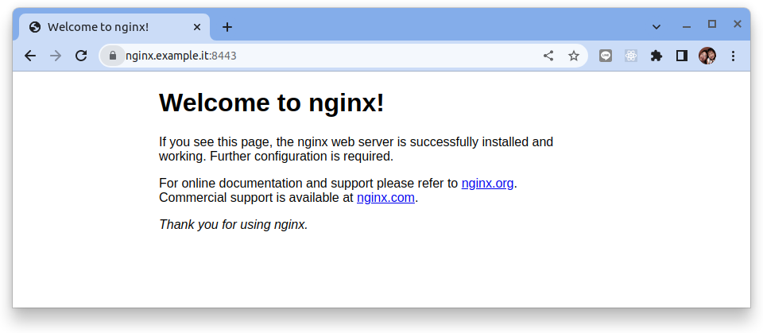
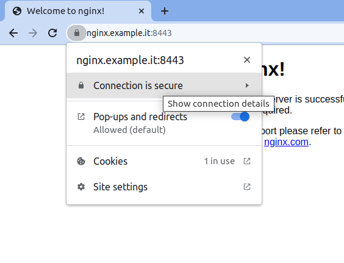
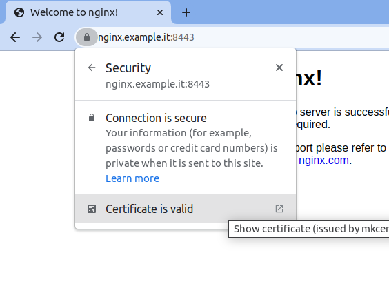
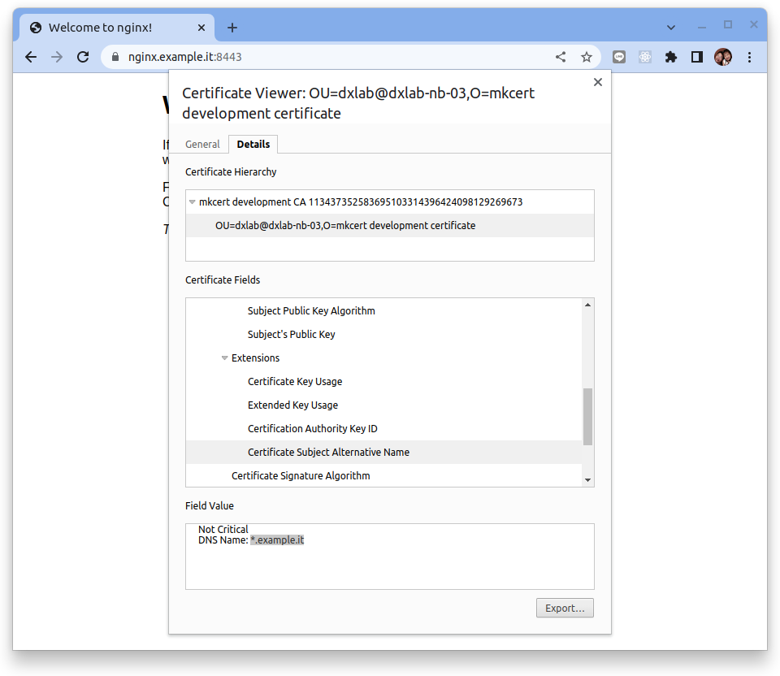

# K3D + Nginx Ingress 控制器



原文: [Ingress Controller](https://github.com/scaamanho/k3d-cluster/blob/master/Ingress-Controller.md)

Ingress Controller 用於管理進出 Kubernetes 集群的四層和七層流量。默認情況下，Kubernetes pod（容器）中運行的應用無法通過外部網路來訪問，只能通過 Kubernetes 集群内的其他 pod 訪問。

Kubernetes 有一個用於 HTTP 負載均衡的內置配置 API 物件，叫做 Ingress。不同的 pod 可能由一個或多個 Kubernetes service 代表，而 Ingress 則定義了 Kubernetes 集群外部的實體連接這些 pod 的方式。

當需要向外部提供對 Kubernetes service 的訪問時，您可以建立一個 Ingress 資源來定義連接規則，包括 URI 路徑、後端 service 名稱及其他資訊。 然而，Ingress 資源本身不執行任何操作。 您必須通過部署和配置 Ingress Controller 應用（使用 Kubernetes API）來實施在 Ingress 資源中定義的規則。

本教程主要是使用了 K3D + Nginx Ingress Controller 來練習相關的概念與配置。同時也整理了如何創建 Self-Signed SSL 憑證來啟動 Ingress Controller 的相關支持。

## 創建 K8S 集群

執行下列命令來創建實驗 Kubernetes 集群:

```bash title="執行下列命令  >_"
k3d cluster create --api-port 6443 \
--k3s-arg "--disable=traefik@server:0" \
--port 8080:80@loadbalancer --port 8443:443@loadbalancer
```

參數說明:

- `--disable=traefik@server:0` 不安裝 K3D 預設的 Traefik (IngressController)


## 佈署 Nginx Ingress Controller

[NGINX Ingress Controller](https://kubernetes.github.io/ingress-nginx/) 是一個開源且穩定的 Ingress Controller 專案，接下來的內容都圍繞在如何配置與使用這個 Ingress Controller。
 

首先讓我們使用官網所提供的 Manifest 來佈置 Nginx Ingress Controller:

```bash title="執行下列命令  >_"
kubectl apply -f https://raw.githubusercontent.com/kubernetes/ingress-nginx/master/deploy/static/provider/cloud/deploy.yaml
```

結果:

```
namespace/ingress-nginx created
serviceaccount/ingress-nginx created
serviceaccount/ingress-nginx-admission created
role.rbac.authorization.k8s.io/ingress-nginx created
role.rbac.authorization.k8s.io/ingress-nginx-admission created
clusterrole.rbac.authorization.k8s.io/ingress-nginx created
clusterrole.rbac.authorization.k8s.io/ingress-nginx-admission created
rolebinding.rbac.authorization.k8s.io/ingress-nginx created
rolebinding.rbac.authorization.k8s.io/ingress-nginx-admission created
clusterrolebinding.rbac.authorization.k8s.io/ingress-nginx created
clusterrolebinding.rbac.authorization.k8s.io/ingress-nginx-admission created
configmap/ingress-nginx-controller created
service/ingress-nginx-controller created
service/ingress-nginx-controller-admission created
deployment.apps/ingress-nginx-controller created
job.batch/ingress-nginx-admission-create created
job.batch/ingress-nginx-admission-patch created
ingressclass.networking.k8s.io/nginx created
validatingwebhookconfiguration.admissionregistration.k8s.io/ingress-nginx-admission created
```

檢查佈署的結果:

```bash title="執行下列命令  >_"
$ kubectl get all

NAME                                            READY   STATUS      RESTARTS   AGE
pod/ingress-nginx-admission-patch-8vbml         0/1     Completed   1          7m31s
pod/ingress-nginx-admission-create-x4rt5        0/1     Completed   0          7m31s
pod/ingress-nginx-controller-6f7bd4bcfb-4vnzl   1/1     Running     0          7m31s

NAME                                         TYPE           CLUSTER-IP      EXTERNAL-IP   PORT(S)                      AGE
service/ingress-nginx-controller-admission   ClusterIP      10.43.60.78     <none>        443/TCP                      7m31s
service/ingress-nginx-controller             LoadBalancer   10.43.174.222   172.21.0.2    80:31117/TCP,443:31088/TCP   7m31s

NAME                                       READY   UP-TO-DATE   AVAILABLE   AGE
deployment.apps/ingress-nginx-controller   1/1     1            1           7m31s

NAME                                                  DESIRED   CURRENT   READY   AGE
replicaset.apps/ingress-nginx-controller-6f7bd4bcfb   1         1         1       7m31s

NAME                                       COMPLETIONS   DURATION   AGE
job.batch/ingress-nginx-admission-patch    1/1           16s        7m31s
job.batch/ingress-nginx-admission-create   1/1           16s        7m31s
```

!!! info
    從上述的結果可發現 `service/ingress-nginx-controller` 使用 `LoadBalaner` 來曝露給外部網路並取得一個 IP: `172.21.0.2`。

### Default IngressClass

您可以將特定 IngressClass 標記為集群的默認值。在 IngressClass 資源上將 `ingressclass.kubernetes.io/is-default-class` 註釋設置為 `true` 將確保沒有指定 ingressClassName 字段的新 Ingresses 將被分配此默認 IngressClass。


修改安裝 Nginx controller 時所創建的 `IngressClass`:

```bash title="執行下列命令  >_"
kubectl edit ingressclass -n nginx-ingress
```

增加 `ingressclass.kubernetes.io/is-default-class: "true"` 的 annotations:

```yaml hl_lines="5"
apiVersion: networking.k8s.io/v1
kind: IngressClass
metadata:
  annotations:
    ingressclass.kubernetes.io/is-default-class: "true"
    kubectl.kubernetes.io/last-applied-configuration: |
      {"apiVersion":"networking.k8s.io/v1","kind":"IngressClass","metadata":{"annotations":{},"labels":{"app.kubernetes.io/component":"controller","app.kubernetes.io/instance":"ingress-nginx","app.kubernetes.io/name":"ingress-nginx","app.kubernetes.io/part-of":"ingress-nginx","app.kubernetes.io/version":"1.5.1"},"name":"nginx"},"spec":{"controller":"k8s.io/ingress-nginx"}}
  creationTimestamp: "2022-12-31T02:11:36Z"
  generation: 1
  labels:
    app.kubernetes.io/component: controller
    app.kubernetes.io/instance: ingress-nginx
    app.kubernetes.io/name: ingress-nginx
    app.kubernetes.io/part-of: ingress-nginx
    app.kubernetes.io/version: 1.5.1
  name: nginx
  resourceVersion: "1039"
  uid: a265874f-513b-4764-9477-b0eb1cd91a57
spec:
  controller: k8s.io/ingress-nginx
```

### 驗證 Ingress 設定

創建一個 `Nginx` 的 `Deployment` 與 `Service`:

```bash title="執行下列命令  >_"
kubectl create deployment nginx --image=nginx

kubectl create service clusterip nginx --tcp=80:80
```

結果:

``` title="執行下列命令  >_"
$ kubectl get all
NAME                        READY   STATUS    RESTARTS   AGE
pod/nginx-8f458dc5b-pww8x   1/1     Running   0          40s

NAME                 TYPE        CLUSTER-IP    EXTERNAL-IP   PORT(S)   AGE
service/kubernetes   ClusterIP   10.43.0.1     <none>        443/TCP   11m
service/nginx        ClusterIP   10.43.23.77   <none>        80/TCP    24s

NAME                    READY   UP-TO-DATE   AVAILABLE   AGE
deployment.apps/nginx   1/1     1            1           40s

NAME                              DESIRED   CURRENT   READY   AGE
replicaset.apps/nginx-8f458dc5b   1         1         1       40s
```

創建 `Ingress` 來曝露這個測試的 Nginx 網站:

```bash title="執行下列命令  >_"
kubectl apply -f -<<EOF
apiVersion: networking.k8s.io/v1
kind: Ingress
metadata:
  name: ingress-nginx-svc
spec:
  rules:
  - host: "nginx.example.it"
    http:
      paths:
      - pathType: Prefix
        path: "/"
        backend:
          service:
            name: nginx
            port:
              number: 80
EOF
```

檢查看這個 ingress 是否有取得 IP ADDRESS:

```bash title="執行下列命令  >_"
$ kubectl get ing

NAME                CLASS   HOSTS              ADDRESS      PORTS   AGE
ingress-nginx-svc   nginx   nginx.example.it   172.21.0.2   80      13m
```

修改本機的 `/etc/hosts` 來增加一筆資料來模擬 DNS 的解析:

```title="/etc/hosts"
127.0.0.1       nginx.example.it
```

使用瀏覽器來瀏覽 `http://nginx.example.it:8080`:




使用瀏覽器來瀏覽 `https://nginx.example.it:8443`:


## 佈署 SSL 憑證

使用 [mkcert](https://github.com/FiloSottile/mkcert) 生成自簽憑證並在本機環境中佈署這個憑證。

在本教程中我想要讓證書匹配 *.example.it 域名。有關詳細信息，請參閱 [mkcert 文檔](../../../03-tasks/tls/reference/mkcert-quickstart.md)。

```bash title="執行下列命令  >_"
mkcert *.example.it
```

結果:

```
Note: the local CA is not installed in the system trust store.
Note: the local CA is not installed in the Firefox and/or Chrome/Chromium trust store.
Run "mkcert -install" for certificates to be trusted automatically ⚠️

Created a new certificate valid for the following names 📜
 - "*.example.it"

Reminder: X.509 wildcards only go one level deep, so this won't match a.b.example.it ℹ️

The certificate is at "./_wildcard.example.it.pem" and the key at "./_wildcard.example.it-key.pem" ✅

It will expire on 31 March 2025 🗓
```

上述的命令會創建出自簽的憑證與私錀:

- 憑證: `_wildcard.example.it-key.pem`
- 私錀: `_wildcard.example.it.pem`


把自簽的憑證應用到本機的憑證庫:

``` title="執行下列命令  >_"
$ mkcert -install

The local CA is now installed in the system trust store! ⚡️
The local CA is now installed in the Firefox and/or Chrome/Chromium trust store (requires browser restart)! 🦊
```

創建一個 Secret 物件來儲存這個憑證與私錀：

```bash title="執行下列命令  >_"
kubectl --namespace ingress-nginx create secret tls nginx-server-certs \
        --key  _wildcard.example.it-key.pem \
        --cert _wildcard.example.it.pem
```


修改 Nginx Conttroller 的 `Deployment` 來設定 `Default SSL Certificate` (見[Default SSL Certificate](https://kubernetes.github.io/ingress-nginx/user-guide/tls/#default-ssl-certificate)):


```bash title="執行下列命令  >_"
kubectl edit deploy/ingress-nginx-controller -n ingress-nginx
```

在 `- args:` 的設定中增加一個參數 `- --default-ssl-certificate=ingress-nginx/nginx-server-certs`:

```yaml hl_lines="49"
apiVersion: apps/v1
kind: Deployment
metadata:
  annotations:
    deployment.kubernetes.io/revision: "2"
  labels:
    app.kubernetes.io/component: controller
    app.kubernetes.io/instance: ingress-nginx
    app.kubernetes.io/name: ingress-nginx
    app.kubernetes.io/part-of: ingress-nginx
    app.kubernetes.io/version: 1.5.1
  name: ingress-nginx-controller
  namespace: ingress-nginx
  ...
  ...
spec:
  progressDeadlineSeconds: 600
  replicas: 1
  revisionHistoryLimit: 10
  selector:
    matchLabels:
      app.kubernetes.io/component: controller
      app.kubernetes.io/instance: ingress-nginx
      app.kubernetes.io/name: ingress-nginx
  strategy:
    rollingUpdate:
      maxSurge: 25%
      maxUnavailable: 25%
    type: RollingUpdate
  template:
    metadata:
      creationTimestamp: null
      labels:
        app.kubernetes.io/component: controller
        app.kubernetes.io/instance: ingress-nginx
        app.kubernetes.io/name: ingress-nginx
    spec:
      containers:
      - args:
        - /nginx-ingress-controller
        - --publish-service=$(POD_NAMESPACE)/ingress-nginx-controller
        - --election-id=ingress-nginx-leader
        - --controller-class=k8s.io/ingress-nginx
        - --ingress-class=nginx
        - --configmap=$(POD_NAMESPACE)/ingress-nginx-controller
        - --validating-webhook=:8443
        - --validating-webhook-certificate=/usr/local/certificates/cert
        - --validating-webhook-key=/usr/local/certificates/key
        - --default-ssl-certificate=ingress-nginx/nginx-server-certs
    ...
    ...
```

使用瀏覽器來瀏覽 `https://nginx.example.it:8443`:



接著使用下列步驟在 Chrome 中查看憑證的詳細資訊:







