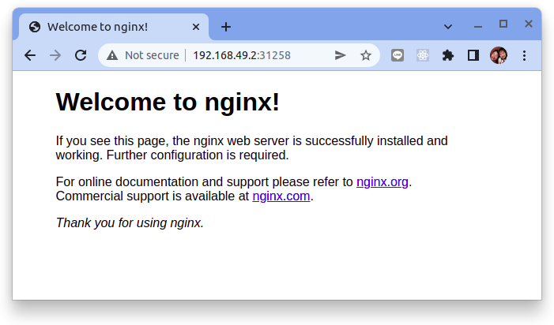
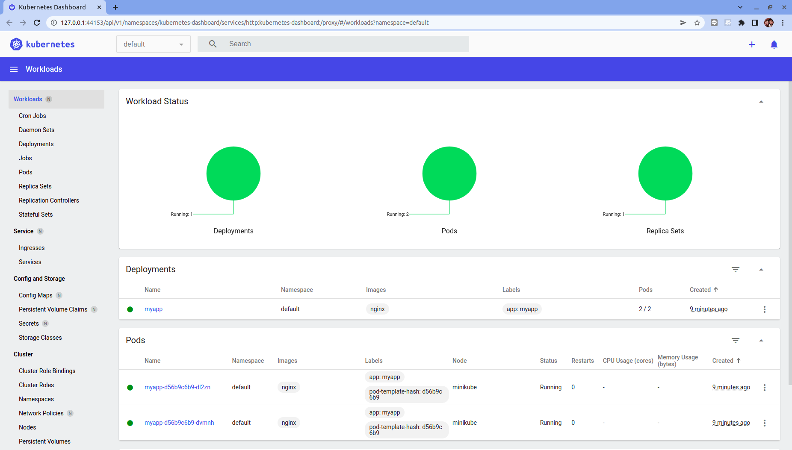

# 如何在 Ubuntu 20.04 LTS 上安裝 Minikube

原文: https://www.linuxbuzz.com/how-to-install-minikube-on-ubuntu/

Minikube 是單節點 Kubernetes (k8s) 集群，可以安裝在虛擬機中。它一般用於測試和開發環境。任何剛接觸 Kubernetes 並想學習它的人都建議使用 minikube。因為它可以非常容易地部署在幾乎所有的 Linux 發行版上，比如 Ubuntu、RHEL、CentOS 和 Debian。

在本指南中，我們將學習如何在 Ubuntu 22.04 (Jammy Jellyfish) 和 Ubuntu 20.04 (Focal Fossa) LTS 上安裝 Minikube。 ubuntu 版本上的步驟是相同的。

## 最低系統要求

- 2GB RAM 或更多
- 2個CPU核心或更多
- 20 GB 硬盤或更多
- 具有 Sudo 權限的用戶
- Docker 或 VirtualBox 或 KVM
- 穩定的互聯網連接 (internet connection)

讓我們深入了解 Minikube 的安裝步驟。

## 1. 安裝 Minikube 包依賴項

登錄到您的 Ubuntu 22.04 / Ubuntu 20.04 系統並運行以下命令來安裝 minikube 包依賴項。

```bash
$ sudo apt update
$ sudo apt install curl wget apt-transport-https -y
```

!!! info
    注意：在本指南中，我使用 docker 作為 Minikube 的基礎，並假設您的系統上已經安裝了它。如果未安裝，請參閱以下內容：
    
    - [How to Install Docker on Ubuntu 22.04 / Ubuntu 20.04 LTS](https://www.linuxbuzz.com/how-to-install-docker-on-ubuntu/)

## 2. 使用 wget 下載 Minikube 二進製文件

在 `wget` 命令下運行以下載 `minikube` 二進製文件，

```bash
$ wget https://storage.googleapis.com/minikube/releases/latest/minikube-linux-amd64
```

使用 cp 命令將下載的 minikube 二進製文件複製到 `/usr/local/bin` 並不要忘記為其設置可執行權限。

```bash
$ sudo cp minikube-linux-amd64 /usr/local/bin/minikube
$ sudo chmod +x /usr/local/bin/minikube
```

運行查看minikube版本，

```bash
$ minikube version

minikube version: v1.25.2
commit: 362d5fdc0a3dbee389b3d3f1034e8023e72bd3a7
```

## 3. 下載 kubectl

`kubectl` 是一個命令行 CLI，用於與 Kubernetes 集群交互。使用 kubectl 我們在 Kubernetes 集群中部署不同的資源。

要下載並安裝 `kubectl`，請使用以下 wget 命令，

```bash
 $ curl -LO https://storage.googleapis.com/kubernetes-release/release/`curl -s https://storage.googleapis.com/kubernetes-release/release/stable.txt`/bin/linux/amd64/kubectl
```

將 `kubectl` 二進製文件移動到 `/usr/local/bin` 並對其設置執行權限。

```bash
$ chmod +x kubectl
$ sudo mv kubectl /usr/local/bin/
```

使用以下命令驗證 `kubectl` 版本，

```bash
$ kubectl version
```

## 4. 使用 Docker 驅動程序啟動 Minikube

由於我們使用 `docker` 作為 `minikube` 的基礎，所以運行以下 `minikube` 命令來啟動它。

```bash
$ minikube start --driver=docker
```

結果:

```
😄  minikube v1.25.2 on Ubuntu 21.10
✨  Using the docker driver based on user configuration
👍  Starting control plane node minikube in cluster minikube
🚜  Pulling base image ...
💾  Downloading Kubernetes v1.23.3 preload ...
    > preloaded-images-k8s-v17-v1...: 505.68 MiB / 505.68 MiB  100.00% 11.91 Mi
    > gcr.io/k8s-minikube/kicbase: 379.06 MiB / 379.06 MiB  100.00% 8.14 MiB p/
🔥  Creating docker container (CPUs=2, Memory=3900MB) ...
🐳  Preparing Kubernetes v1.23.3 on Docker 20.10.12 ...
    ▪ kubelet.housekeeping-interval=5m
    ▪ Generating certificates and keys ...
    ▪ Booting up control plane ...
    ▪ Configuring RBAC rules ...
🔎  Verifying Kubernetes components...
    ▪ Using image gcr.io/k8s-minikube/storage-provisioner:v5
🌟  Enabled addons: storage-provisioner, default-storageclass
🏄  Done! kubectl is now configured to use "minikube" cluster and "default" namespace by default
```

太好了，以上輸出確認 minikube 已成功啟動。

!!! info
    注意：如果您想在啟動 minikube 時傳遞自定義資源參數，請使用下面的範例:
    ```bash
    $ minikube start --addons=ingress --cpus=4 --cni=flannel --install-addons=true --kubernetes-version=stable --memory=6g
    ```

## 5. 驗證 Minikube 和 Kubernetes 集群狀態

要驗證 minikube 狀態，請運行

```bash
$ minikube status

minikube
type: Control Plane
host: Running
kubelet: Running
apiserver: Running
kubeconfig: Configured
```

## 6. 在 Minikube 上啟用插件

當我們安裝 minikube 時，只啟用了幾個插件。要查看所有插件及其狀態，請運行

```bash
$ minikube addons list

|-----------------------------|----------|--------------|--------------------------------|
|         ADDON NAME          | PROFILE  |    STATUS    |           MAINTAINER           |
|-----------------------------|----------|--------------|--------------------------------|
| ambassador                  | minikube | disabled     | third-party (ambassador)       |
| auto-pause                  | minikube | disabled     | google                         |
| csi-hostpath-driver         | minikube | disabled     | kubernetes                     |
| dashboard                   | minikube | disabled     | kubernetes                     |
| default-storageclass        | minikube | enabled ✅   | kubernetes                     |
| efk                         | minikube | disabled     | third-party (elastic)          |
| freshpod                    | minikube | disabled     | google                         |
| gcp-auth                    | minikube | disabled     | google                         |
| gvisor                      | minikube | disabled     | google                         |
| helm-tiller                 | minikube | disabled     | third-party (helm)             |
| ingress                     | minikube | disabled     | unknown (third-party)          |
| ingress-dns                 | minikube | disabled     | google                         |
| istio                       | minikube | disabled     | third-party (istio)            |
| istio-provisioner           | minikube | disabled     | third-party (istio)            |
| kong                        | minikube | disabled     | third-party (Kong HQ)          |
| kubevirt                    | minikube | disabled     | third-party (kubevirt)         |
| logviewer                   | minikube | disabled     | unknown (third-party)          |
| metallb                     | minikube | disabled     | third-party (metallb)          |
| metrics-server              | minikube | disabled     | kubernetes                     |
| nvidia-driver-installer     | minikube | disabled     | google                         |
| nvidia-gpu-device-plugin    | minikube | disabled     | third-party (nvidia)           |
| olm                         | minikube | disabled     | third-party (operator          |
|                             |          |              | framework)                     |
| pod-security-policy         | minikube | disabled     | unknown (third-party)          |
| portainer                   | minikube | disabled     | portainer.io                   |
| registry                    | minikube | disabled     | google                         |
| registry-aliases            | minikube | disabled     | unknown (third-party)          |
| registry-creds              | minikube | disabled     | third-party (upmc enterprises) |
| storage-provisioner         | minikube | enabled ✅   | google                         |
| storage-provisioner-gluster | minikube | disabled     | unknown (third-party)          |
| volumesnapshots             | minikube | disabled     | kubernetes                     |
|-----------------------------|----------|--------------|--------------------------------|

```

要啟用 `ingress` 插件，請運行

```bash
$ minikube addons enable ingress

    ▪ Using image k8s.gcr.io/ingress-nginx/controller:v1.1.1
    ▪ Using image k8s.gcr.io/ingress-nginx/kube-webhook-certgen:v1.1.1
    ▪ Using image k8s.gcr.io/ingress-nginx/kube-webhook-certgen:v1.1.1
🔎  Verifying ingress addon...
🌟  The 'ingress' addon is enabled
```

要啟用 `ingress` 插件，請運行

```bash
$ minikube addons enable dashboard

    ▪ Using image kubernetesui/metrics-scraper:v1.0.7
    ▪ Using image kubernetesui/dashboard:v2.3.1
💡  Some dashboard features require the metrics-server addon. To enable all features please run:

	minikube addons enable metrics-server	


🌟  The 'dashboard' addon is enabled
```

## 7. 測試 Kubernetes 集群

要測試 Kubernetes 集群，讓我們使用以下 kubectl 命令部署基於 nginx 的部署，

```bash
$ kubectl create deployment myapp --image=nginx --replicas=2
$ kubectl get deployment myapp
NAME    READY   UP-TO-DATE   AVAILABLE   AGE
myapp   2/2     2            2           30s
```

通過公開部署創建服務

```bash
$ kubectl expose deployment myapp --type=NodePort --port=80

service/myapp exposed
```

通過運行獲取服務 url

```bash
$ minikube service myapp --url

http://192.168.49.2:31258
```

現在嘗試使用 URL 訪問應用程序，

```bash
$  curl http://192.168.49.2:31258
```



完美，以上輸出確認我們可以訪問 nginx 網頁。

## 8. 訪問 Kubernetes 儀表板


要訪問 Kubernetes 儀表板，請運行以下命令

```bash
$ minikube dashboard --url

🤔  Verifying dashboard health ...
🚀  Launching proxy ...
🤔  Verifying proxy health ...
http://127.0.0.1:44153/api/v1/namespaces/kubernetes-dashboard/services/http:kubernetes-dashboard:/proxy/
```

單擊輸出中顯示的 url，它將打開 Kubernetes 儀表板，



## 9. 管理 Minikube 集群

要停止 minikube，請運行

```bash
$ minikube stop
```

要啟動 minikube，請運行

```bash
$ minikube start
```

刪除minikube集群，先停止再刪除

```bash
$ minikube delete
```
