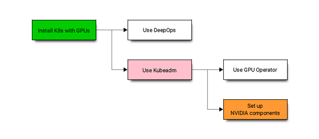

# Kubernetes 與 GPUs

原文:[Install Kubernetes¶](https://docs.nvidia.com/datacenter/cloud-native/kubernetes/install-k8s.html)

## 介紹

Kubernetes 是一個用於自動化部署、擴展和管理容器化應用程序的開源平台。 Kubernetes 包括對 GPU 的支持和對 Kubernetes 的增強，因此用戶可以輕鬆配置和使用 GPU 資源來加速 AI 和 HPC 工作負載。

有許多方法可以使用 NVIDIA 支持的組件安裝上游 Kubernetes，例如驅動程序、插件和運行時。本文檔描述了一些開始使用 Kubernetes 的方法。單擊下面的鏈接以繪製出您想要遵循的選項：

- 選項 1：使用 [DeepOps](https://github.com/NVIDIA/deepops)
- 選項 2：使用 [Kubeadm](https://kubernetes.io/docs/reference/setup-tools/kubeadm/) 安裝 Kubernetes
    - 選項 2-a：使用 [NVIDIA GPU Operator](https://docs.nvidia.com/datacenter/cloud-native/kubernetes/install-k8s.html#gpu-operator) 來自動化/管理 NVIDIA 軟件組件的部署
    - 選項 2-b：在運行應用程序之前將 NVIDIA 軟件組件設置為[先決條件](https://docs.nvidia.com/datacenter/cloud-native/kubernetes/install-k8s.html#nvdp)



## 選項 1: 使用 DeepOps

使用 DeepOps 來自動化部署，尤其是對於許多工作節點的集群。 DeepOps 是 ansible 腳本的模塊化集合，可在您的節點上自動部署 Kubernetes、Slurm 或兩者的混合組合。它還安裝必要的 GPU 驅動程序、NVIDIA Container Toolkit for Docker (`nvidia-docker2`) 以及用於 GPU 加速工作的各種其他依賴項。它封裝了 NVIDIA GPU 的最佳實踐，可以根據需要進行定製或作為單獨的組件運行。

使用以下過程使用 DeepOps 安裝 Kubernetes:

1. 選擇要從中部署的供應節點。這是運行 DeepOps Ansible 腳本的地方，通常是一台連接到目標集群的開發筆記本電腦。在此配置節點上，使用以下命令克隆 DeepOps 存儲庫：

    ```bash
    git clone https://github.com/NVIDIA/deepops.git
    ```

2. 或者，使用以下命令檢查最近發布的標籤:

    ```bash
    cd deepops \
      && git checkout tags/20.10
    ```

  如果您沒有明確使用發布標籤，則會使用最新的開發代碼，而不是官方發布。

3. 按照 [DeepOps Kubernetes 部署指南](https://github.com/NVIDIA/deepops/blob/master/docs/k8s-cluster)中的說明安裝 Kubernetes。

## 選項 2: 使用 Kubeadm

使用 kubeadm，本文檔將逐步介紹安裝單節點 Kubernetes 集群的步驟（我們在其中清除控制平面，以便它可以運行 GPU pod），但可以使用其他節點輕鬆擴展集群。

### Step 0: Before You Begin

在繼續安裝組件之前，請檢查是否滿足所有 [Kubernetes 先決條件](https://kubernetes.io/docs/setup/independent/install-kubeadm/#before-you-begin)。這些先決條件包括：

- 檢查網絡適配器和所需的端口
- 禁用節點上的 swap，以便 kubelet 可以正常工作
- 安裝支持的 container run time，例如 Docker、containerd 或 CRI-O

**Ubuntu LTS**

本節提供了在 Ubuntu 18.04 和 20.04 LTS 發行版上設置 K8s 的步驟。

### Step 1: Install a Container Engine

NVIDIA 支持使用 Docker 和其他 CRI 兼容運行時（例如 containerd 或 CRI-O）運行 GPU 容器。

**containerd**

首先，為 `containerd` 安裝一些先決條件：

```bash
sudo apt-get update \
   && sudo apt-get install -y apt-transport-https \
      ca-certificates curl software-properties-common
```

需要加載 `overlay` 和 `br_netfilter` 模塊：

```bash
cat <<EOF | sudo tee /etc/modules-load.d/containerd.conf
overlay
br_netfilter
EOF
```

```bash
sudo modprobe overlay \
   && sudo modprobe br_netfilter
```

設置所需的 `sysctl` 參數並使它們持久化：

```bash
cat <<EOF | sudo tee /etc/sysctl.d/99-kubernetes-cri.conf
net.bridge.bridge-nf-call-iptables  = 1
net.ipv4.ip_forward                 = 1
net.bridge.bridge-nf-call-ip6tables = 1
EOF
```

```bash
sudo sysctl --system
```

現在繼續設置 Docker 存儲庫：

```bash
curl -fsSL https://download.docker.com/linux/ubuntu/gpg | sudo apt-key --keyring /etc/apt/trusted.gpg.d/docker.gpg add -
```

```bash
sudo add-apt-repository "deb [arch=amd64] https://download.docker.com/linux/ubuntu \
(lsb_release -cs) \
   stable"
```

安裝 containerd：

```bash
sudo apt-get update \
   && sudo apt-get install -y containerd.io
```

創建一個默認的 `config.toml`：

```bash
sudo mkdir -p /etc/containerd \
   && sudo containerd config default | sudo tee /etc/containerd/config.toml
```

通過編輯配置文件並添加以下行，將 `containerd` 配置為使用帶有 `runc` 的 `systemd cgroup` 驅動程序：

```bash title="/etc/containerd/config.toml"
[plugins."io.containerd.grpc.v1.cri".containerd.runtimes.runc.options]
   SystemdCgroup = true
```

現在重新啟動守護進程：

```bash
sudo systemctl restart containerd
```

### Step 2: Install Kubernetes Components

首先，安裝一些依賴項：

```bash
sudo apt-get update \
   && sudo apt-get install -y apt-transport-https curl
```

添加包存儲庫密鑰：

```bash
curl -s https://packages.cloud.google.com/apt/doc/apt-key.gpg | sudo apt-key add -
```

```bash
cat <<EOF | sudo tee /etc/apt/sources.list.d/kubernetes.list
deb https://apt.kubernetes.io/ kubernetes-xenial main
EOF
```

更新軟件包列表並安裝 kubelet：

```bash
sudo apt-get update \
   && sudo apt-get install -y -q kubelet kubectl kubeadm
```

!!! info
    如果您使用 containerd 作為 CRI 運行時，請按照以下步驟操作：

    1. 為 kubelet 配置 `cgroup` 驅動：

    ```bash
    sudo mkdir -p  /etc/systemd/system/kubelet.service.d/
    ```

    ```bash
    sudo cat << EOF | sudo tee  /etc/systemd/system/kubelet.service.d/0-containerd.conf
    [Service]
    Environment="KUBELET_EXTRA_ARGS=--container-runtime=remote --runtime-request-timeout=15m --container-runtime-endpoint=unix:///run/containerd/containerd.sock --cgroup-driver='systemd'"
    EOF
    ```

    2. 重啟 kubelet：

    ```bash
    sudo systemctl daemon-reload \
      && sudo systemctl restart kubelet
    ```

禁用 swap:

```bash
sudo swapoff -a
```

並使用 kubeadm 進行初始化：

```bash
sudo kubeadm init --pod-network-cidr=192.168.0.0/16
```

使用 Kubeadm 完成配置設置：

```bash
mkdir -p $HOME/.kube \
   && sudo cp -i /etc/kubernetes/admin.conf $HOME/.kube/config \
   && sudo chown $(id -u):$(id -g) $HOME/.kube/config
```

### Step 3: Configure Networking

現在，使用 Calico 設置網絡：

```bash
kubectl apply -f https://docs.projectcalico.org/manifests/calico.yaml
```

清除控制平面，以便它可以用於在我們簡單的單節點集群中調度 GPU pod：

```bash
kubectl taint nodes --all node-role.kubernetes.io/master-
```

您的集群現在應該已準備好調度容器化應用程序。

### Step 4: Setup NVIDIA Software

在我們旅程的這一點上，您應該有一個工作的 Kubernetes 控制平面和附加到您的集群的工作節點。我們可以繼續在工作節點上配置 NVIDIA 軟件。如文檔開頭所述，有兩個選項：

#### NVIDIA GPU Operator

使用 [NVIDIA GPU Operator](https://docs.nvidia.com/datacenter/cloud-native/gpu-operator/getting-started.html#install-nvidia-gpu-operator) 自動設置和管理工作節點上的 NVIDIA 軟件組件。

這是首選方式，因為它提供一鍵式安裝體驗。

#### Install NVIDIA Dependencies

Kubernetes 集群中的 GPU worker 節點需要啟用以下組件：

1. NVIDIA drivers
2. NVIDIA Container Toolkit
3. NVIDIA Kubernetes Device Plugin (and optionally GPU Feature Discovery plugin)
4. (Optional) DCGM-Exporter to gather GPU telemetry and integrate into a monitoring stack such as Prometheus

讓我們來看看這些步驟。


##### 1. Install NVIDIA Drivers

本節總結了在 Ubuntu LTS 上使用 apt 包管理器安裝驅動程序的步驟。

