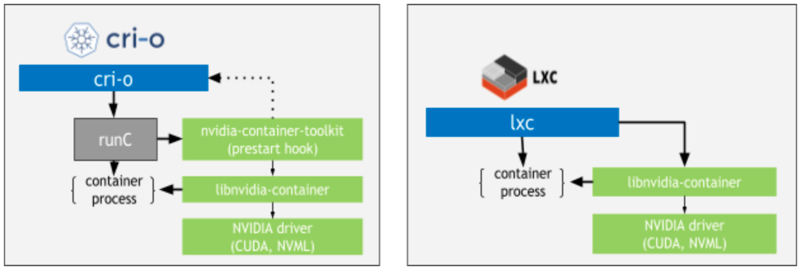

# Nvidia Container Toolkit

原文: [NVIDIA CONTAINER TOOLKIT](https://docs.nvidia.com/datacenter/cloud-native/container-toolkit/overview.html)


NVIDIA Container Toolkit 允許用戶構建和在容器內運行 GPU 來加速特定應用程序的運行。該工具包包括一個 container runtime library 和 utilities，可自動配置容器以利用 NVIDIA GPU。

NVIDIA Container Toolkit 支持不同容器引擎 Docker、LXC、Podman、Containerd 等。

## 動機

容器化 GPU 應用程序提供了幾個好處，其中包括：

1. 易於部署
2. 個別設備的隔離
3. 跨異構驅動程序/工具包環境運行
4. 只需要在主機上安裝 NVIDIA 驅動程序
5. 促進協作：可重現的構建、可重現的性能、可重現的結果。

## 架構

NVIDIA container stack 的架構旨在支持生態系統中的任何 container runtime。堆棧的組件包括：

- `nvidia-docker` wrapper
- NVIDIA Container Runtime (`nvidia-container-runtime`)
- NVIDIA Container Runtime Hook (`nvidia-container-toolkit` / `nvidia-container-runtime-hook`)
- NVIDIA Container Library and CLI (`libnvidia-container`, `nvidia-container-cli`)

除了 `nvidia-docker` wrapper 之外，NVIDIA container stack 的組件都打包為 **NVIDIA Container Toolkit**。

這些組件的使用方式取決於所使用的 **container runtime**。


對於與 `nvidia-docker` wrapper 一起使用的 Docker，通過各種組件的流程如下圖所示：


使用 NVIDIA Container Runtime 的 `containerd` 組件流程類似，如下所示：


!!! tip
    - Rancher `RKE1` 利用 **docker** 部署和管理控制平面組件以及 Kubernetes 的 Container Runtime。
    - Rancher `RKE2` / `K3S` 將控制平面組件作為靜態 pod 啟動，由 kubelet 管理。嵌入式容器運行時是 **containerd**。


下圖顯示了 `cri-o` 和 `lxc` 組件的流程。需要注意的是，在這種情況下，NVIDIA Container Runtime 組件不是必需的。



### Components 和 Packages

NVIDIA Container Toolkit 的主要 Packages 有：

- `nvidia-container-toolkit`
- `libnvidia-container-tools`
- `libnvidia-container1`

這些包之間的依賴關係如下所示：

```
├─ nvidia-container-toolkit (version)
│    └─ libnvidia-container-tools (>= version)
│
├─ libnvidia-container-tools (version)
│    └─ libnvidia-container1 (>= version)
└─ libnvidia-container1 (version)
```

除了這些主要 package 之外，以下兩個 package 也被視為 NVIDIA 容器堆棧的一部分：

- `nvidia-docker2`
- `nvidia-container-runtime`

它們依賴於 `nvidia-container-toolkit` 包，如下所示：

```
├─ nvidia-docker2
│    ├─ docker-ce || docker-ee || docker.io
│    └─ nvidia-container-toolkit (>= version)
│
└─ nvidia-container-runtime
     └─ nvidia-container-toolkit (>= version, << 2.0.0)
```

!!! info
    請注意，從版本 3.6.0 開始，`nvidia-container-runtime` 包是一個 meta package，它僅依賴於 `nvidia-container-toolkit` 包，本身不提供任何功能。

#### NVIDIA Container Library 與 CLI

這些組件分別被打包為 `libnvidia-container-tools` 和 `libnvidia-container1` 包。

這些組件提供了一個庫和一個簡單的 CLI 實用程序來自動配置利用 NVIDIA GPU 的 GNU/Linux 容器。該實現依賴於內核原語，並且設計為與容器運行時無關。

`libnvidia-container` 提供了一個定義良好的 API 和一個包裝器 CLI（稱為 `nvidia-container-cli`），不同的 container runtime 可以調用它們將 NVIDIA GPU 支持注入到它們的容器中。


#### NVIDIA Container Runtime Hook

該組件包含在 `nvidia-container-toolkit` 包中。

該組件包含一個腳本，用於實現 `runC` 預啟動掛鉤所需的接口。該腳本在容器創建之後但在啟動之前由 `runC` 調用，並被授予對與容器關聯的 `config.json` 的訪問權限。然後它獲取 `config.json` 中包含的信息，並使用它來調用帶有一組適當標誌的 `nvidia-container-cli`。 {==最重要的標誌之一是應將哪些特定 GPU 設備注入到容器中。==}

#### NVIDIA Container Runtime

該組件包含在 `nvidia-container-toolkit` 包中。

`nvidia-container-runtime` 將 `runC` 規範作為輸入，將 `NVIDIA Container Runtime Hook` 作為預啟動掛鉤注入其中，然後調用本機 `runC`，將修改後的 `runC` 規範與該掛鉤集傳遞給它。請務必注意，此組件不一定特定於 `docker`（但它特定於 `runC`）。

#### `nvidia-docker` Wrapper

該組件由 `nvidia-docker2` 包提供。

安裝包後，Docker `daemon.json` 會更新為指向二進製文件，如下所示：

```
$ cat /etc/docker/daemon.json
{
"runtimes": {
    "nvidia": {
        "path": "/usr/bin/nvidia-container-runtime",
        "runtimeArgs": []
    }
}
```

包裝器是層次結構中唯一特定於 `docker` 的組件。安裝包時，它會獲取與 `nvidia-container-runtime` 關聯的腳本並將其安裝到 `docker` 的 `/etc/docker/daemon.json` 文件中。然後，您可以運行（例如）`docker run --runtime=nvidia ...` 以自動將 GPU 支持添加到您的容器中。該軟件包還在名為 nvidia-docker 的本地 docker CLI 周圍安裝了一個包裝器腳本，它使您無需每次都指定 --runtime=nvidia 即可調用 docker。它還允許您在主機 (NV_GPU) 上設置環境變量，以指定應將哪些 GPU 注入到容器中。

### 應該使用哪個包？

一般來說，安裝 `nvidia-container-toolkit` 包對於大多數用例來說就足夠了。該軟件包通過附加功能和工具不斷得到增強，這些功能和工具簡化了容器和 NVIDIA 設備的使用。

但是，如果您想將 Kubernetes 與 Docker 一起使用，則需要配置 Docker `daemon.json` 以包含對 NVIDIA container runtime 的引用並將之設置為默認 runtime，或者安裝守護進程的 `nvidia-docker2` 包來對主機上的json文件來進行覆蓋。

#### Package Repository

- nvidia-docker2
    - https://github.com/NVIDIA/nvidia-docker
- nvidia-container-toolkit
  - https://github.com/NVIDIA/nvidia-container-toolkit
      - nvidia-container-runtime
          - https://github.com/NVIDIA/nvidia-container-runtime
      - libnvidia-container
          - https://github.com/NVIDIA/libnvidia-container

!!! info
    `nvidia-container-toolkit` 從 1.6.0 版本之後也包含了 `libnvidia-container` 的所有組件。


## 安裝指南

### 支持的平台

NVIDIA Container Toolkit 可用於各種 Linux 發行版並支持不同的容器引擎。

!!! info
    從 NVIDIA Container Toolkit 1.7.0 (nvidia-docker2 >= 2.8.0) 開始，Ubuntu 18.04、Ubuntu 20.04 和 Ubuntu 22.04 發行版都包含對 `Jetson` 平台的支持。這意味著為這些發行版提供的安裝說明有望在 `Jetson` 設備上運行。

支持的 Linux 發行版如下所列：

!!! info
    Ubuntu 20.04 與 Ubuntu 22.04 packages 是符號鏈接（重定向）到 ubuntu18.04 的 packages

| OS Name / Version | Identifier | amd64 / x86_64 | ppc64le | arm64 / aarch64 |
|-------------------|------------|----------------|---------|-----------------|
|Centos 7|centos7|X|X||
|Centos 8|centos8|X|X|X|
|RHEL 7.x (&)|rhel7.x|X|X||
|RHEL 8.x (@)|rhel8.x|X|X|X|
|RHEL 9.x (@)|rhel9.x|X|X|X|
|Ubuntu 16.04|ubuntu16.04|X|X||
|Ubuntu 18.04|ubuntu18.04|X|X|X|
|Ubuntu 20.04 (%)|ubuntu20.04|X|X|X|
|Ubuntu 22.04 (%)|ubuntu22.04|X|X|X|

###　Pre-Requisites

####　NVIDIA Drivers

在開始之前，請確保您已經為您的 Linux 發行版安裝了 NVIDIA 驅動程序。安裝驅動程序的推薦方法是使用　package manager，但也可以使用其他安裝程序機制（例如，通過從 [NVIDIA 驅動程序下載](https://www.nvidia.com/Download/index.aspx?lang=en-us)下載 .run 安裝程序）。

####　平台要求

運行 `NVIDIA Container Toolkit` 的先決條件列表如下所述：

１.　內核版本 > 3.10 的 GNU/Linux x86_64
２.　Docker >= 19.03（推薦，但某些發行版可能包含舊版本的 Docker。支持的最低版本為 1.12）
３.　架構 >= Kepler（或計算能力 3.0）的 NVIDIA GPU
    - 參考: [GPU Compute Capability](https://developer.nvidia.com/cuda-gpus)
４.　NVIDIA Linux 驅動程序 >= 418.81.07（請注意，不支持較舊的驅動程序版本或分支。）

## 安裝 Nvidia Driver

```bash
sudo apt update

sudo apt install nvidia-driver-515 nvidia-dkms-515
```

重新開機:

```bash
sudo reboot
```

打開終端應用程序並鍵入 `nvidia-smi` 以查看使用 Nvidia GPU 的 GPU 信息和進程：

```bash
nvidia-smi
```

`nvidia-smi` 命令行實用程序為每個NVIDIA 設備提供監控和管理功能。

結果:

```
Sun Jan 15 02:36:11 2023       
+-----------------------------------------------------------------------------+
| NVIDIA-SMI 515.86.01    Driver Version: 515.86.01    CUDA Version: 11.7     |
|-------------------------------+----------------------+----------------------+
| GPU  Name        Persistence-M| Bus-Id        Disp.A | Volatile Uncorr. ECC |
| Fan  Temp  Perf  Pwr:Usage/Cap|         Memory-Usage | GPU-Util  Compute M. |
|                               |                      |               MIG M. |
|===============================+======================+======================|
|   0  NVIDIA GeForce ...  Off  | 00000000:02:00.0 Off |                  N/A |
| N/A   39C    P8    N/A /  N/A |      4MiB /  2048MiB |      0%      Default |
|                               |                      |                  N/A |
+-------------------------------+----------------------+----------------------+
                                                                               
+-----------------------------------------------------------------------------+
| Processes:                                                                  |
|  GPU   GI   CI        PID   Type   Process name                  GPU Memory |
|        ID   ID                                                   Usage      |
|=============================================================================|
|    0   N/A  N/A       936      G   /usr/lib/xorg/Xorg                  4MiB |
+-----------------------------------------------------------------------------+
```

!!! info
    在本機的電腦上有著一片 GeForce MX150 的 GPU


## docker

以下步驟可用於在 Ubuntu LTS（18.04、20.04 和 22.04）發行版上設置 NVIDIA Container Toolkit。


### 1. 設定 Docker

可以使用 Docker 的官方腳本在 Ubuntu 上設置 Docker-CE:

```bash
curl https://get.docker.com | sh \
  && sudo systemctl --now enable docker
```

檢查 `docker` 守護進程:

```
$ sudo systemctl status docker

● docker.service - Docker Application Container Engine
     Loaded: loaded (/lib/systemd/system/docker.service; enabled; vendor preset: enabled)
     Active: active (running) since Sun 2023-01-15 02:06:14 EST; 10min ago
TriggeredBy: ● docker.socket
       Docs: https://docs.docker.com
   Main PID: 12935 (dockerd)
      Tasks: 15
     Memory: 25.3M
     CGroup: /system.slice/docker.service
             └─12935 /usr/bin/dockerd -H fd:// --containerd=/run/containerd/containerd.sock
```

檢查 `containerd` 守護進程:

```bash
$ sudo systemctl status containerd

● containerd.service - containerd container runtime
     Loaded: loaded (/lib/systemd/system/containerd.service; enabled; vendor preset: enabled)
     Active: active (running) since Sun 2023-01-15 02:06:12 EST; 10min ago
       Docs: https://containerd.io
   Main PID: 12806 (containerd)
      Tasks: 14
     Memory: 14.7M
     CGroup: /system.slice/containerd.service
             └─12806 /usr/bin/containerd
```

檢查是否可啟動一個 `hell-wrold` 容器:

```bash
$ sudo docker run hello-world

Hello from Docker!
This message shows that your installation appears to be working correctly.

To generate this message, Docker took the following steps:
 1. The Docker client contacted the Docker daemon.
 2. The Docker daemon pulled the "hello-world" image from the Docker Hub.
    (amd64)
 3. The Docker daemon created a new container from that image which runs the
    executable that produces the output you are currently reading.
 4. The Docker daemon streamed that output to the Docker client, which sent it
    to your terminal.

To try something more ambitious, you can run an Ubuntu container with:
 $ docker run -it ubuntu bash

Share images, automate workflows, and more with a free Docker ID:
 https://hub.docker.com/

For more examples and ideas, visit:
 https://docs.docker.com/get-started/
```

!!! info
    請按照[官方說明](https://docs.docker.com/engine/install/ubuntu/)了解更多詳細信息和[安裝後操作](https://docs.docker.com/engine/install/linux-postinstall/)。

### 2. 設定 NVIDIA Container Toolkit

設置包存儲庫和 GPG 密鑰：

```bash
distribution=$(. /etc/os-release;echo $ID$VERSION_ID) \
      && curl -fsSL https://nvidia.github.io/libnvidia-container/gpgkey | sudo gpg --dearmor -o /usr/share/keyrings/nvidia-container-toolkit-keyring.gpg \
      && curl -s -L https://nvidia.github.io/libnvidia-container/$distribution/libnvidia-container.list | \
            sed 's#deb https://#deb [signed-by=/usr/share/keyrings/nvidia-container-toolkit-keyring.gpg] https://#g' | \
            sudo tee /etc/apt/sources.list.d/nvidia-container-toolkit.list
```

更新軟件包列表後安裝 `nvidia-docker2` 軟件包（和依賴項）：

```bash
sudo apt-get update

sudo apt-get install -y nvidia-docker2
```

設置默認運行時後重啟Docker守護進程完成安裝：

```bash
sudo systemctl restart docker
```

根據文件 `nvidia-docker2` 會去修改 `/etc/docker/daemon.json` 的設定檔:

```bash
$ sudo cat /etc/docker/daemon.json
```

結果:

```json title="/etc/docker/daemon.json"
{
    "runtimes": {
        "nvidia": {
            "path": "nvidia-container-runtime",
            "runtimeArgs": []
        }
    }
}
```

此時，可以通過運行基本 CUDA 容器來測試工作設置：

```bash
sudo docker run --rm --gpus all nvidia/cuda:11.6.2-base-ubuntu20.04 nvidia-smi
```

結果:

```
Sun Jan 15 07:51:31 2023       
+-----------------------------------------------------------------------------+
| NVIDIA-SMI 515.86.01    Driver Version: 515.86.01    CUDA Version: 11.7     |
|-------------------------------+----------------------+----------------------+
| GPU  Name        Persistence-M| Bus-Id        Disp.A | Volatile Uncorr. ECC |
| Fan  Temp  Perf  Pwr:Usage/Cap|         Memory-Usage | GPU-Util  Compute M. |
|                               |                      |               MIG M. |
|===============================+======================+======================|
|   0  NVIDIA GeForce ...  Off  | 00000000:02:00.0 Off |                  N/A |
| N/A   38C    P8    N/A /  N/A |      4MiB /  2048MiB |      0%      Default |
|                               |                      |                  N/A |
+-------------------------------+----------------------+----------------------+
                                                                               
+-----------------------------------------------------------------------------+
| Processes:                                                                  |
|  GPU   GI   CI        PID   Type   Process name                  GPU Memory |
|        ID   ID                                                   Usage      |
|=============================================================================|
+-----------------------------------------------------------------------------+
```

## containerd

要安裝 containerd，請按照支持的 Linux 發行版的官方說明進行操作。為方便起見，下面的文檔包含有關為 NVIDIA 支持的各種 Linux 發行版安裝 containerd 的說明。

### Step 0: Pre-Requisites

要將 containerd 安裝為系統上的容器引擎，請安裝一些先決條件模塊：

```bash
sudo modprobe overlay \
    && sudo modprobe br_netfilter
```

您還可以確保這些是持久的:

```bash
cat <<EOF | sudo tee /etc/modules-load.d/containerd.conf
overlay
br_netfilter
EOF
```


如果您打算將 containerd 用作 Kubernetes 的 CRI 運行時，請配置 `sysctl` 參數：

```bash
cat <<EOF | sudo tee /etc/sysctl.d/99-kubernetes-cri.conf
net.bridge.bridge-nf-call-iptables  = 1
net.ipv4.ip_forward                 = 1
net.bridge.bridge-nf-call-ip6tables = 1
EOF
```

然後應用參數：

```bash
sudo sysctl --system
```

### Step 1: Install containerd

在滿足先決條件之後，我們可以繼續安裝 containerd。

按照此處所述[設置 Docker 存儲庫](https://docs.docker.com/engine/install/ubuntu/#install-using-the-repository)：

更新 apt 包索引並安裝包以允許 apt 通過 HTTPS 使用存儲庫：

```bash
sudo apt-get update

sudo apt-get install \
    ca-certificates \
    curl \
    gnupg \
    lsb-release
```

添加 Docker 的官方 GPG 密鑰：

```bash
sudo mkdir -p /etc/apt/keyrings

curl -fsSL https://download.docker.com/linux/ubuntu/gpg | sudo gpg --dearmor -o /etc/apt/keyrings/docker.gpg
```

使用以下命令設置存儲庫：

```bash
echo \
  "deb [arch=$(dpkg --print-architecture) signed-by=/etc/apt/keyrings/docker.gpg] https://download.docker.com/linux/ubuntu \
  $(lsb_release -cs) stable" | sudo tee /etc/apt/sources.list.d/docker.list > /dev/null
```

現在，安裝 `containerd` 包:

```bash
sudo apt-get update \
    && sudo apt-get install -y containerd.io
```

檢查 `containerd` 守護進程:

```bash
$ sudo systemctl status containerd

● containerd.service - containerd container runtime
     Loaded: loaded (/lib/systemd/system/containerd.service; enabled; vendor preset: enabled)
     Active: active (running) since Sun 2023-01-15 03:30:29 EST; 1min 50s ago
       Docs: https://containerd.io
    Process: 9040 ExecStartPre=/sbin/modprobe overlay (code=exited, status=0/SUCCESS)
   Main PID: 9041 (containerd)
      Tasks: 14
     Memory: 13.9M
     CGroup: /system.slice/containerd.service
             └─9041 /usr/bin/containerd

```

檢查初始的 `config.toml` 配置文件配置 `containerd`

```bash
cat /etc/containerd/config.toml
```

結果:

``` title="/etc/containerd/config.toml"
#   Copyright 2018-2022 Docker Inc.

#   Licensed under the Apache License, Version 2.0 (the "License");
#   you may not use this file except in compliance with the License.
#   You may obtain a copy of the License at

#       http://www.apache.org/licenses/LICENSE-2.0

#   Unless required by applicable law or agreed to in writing, software
#   distributed under the License is distributed on an "AS IS" BASIS,
#   WITHOUT WARRANTIES OR CONDITIONS OF ANY KIND, either express or implied.
#   See the License for the specific language governing permissions and
#   limitations under the License.

disabled_plugins = ["cri"]

#root = "/var/lib/containerd"
#state = "/run/containerd"
#subreaper = true
#oom_score = 0

#[grpc]
#  address = "/run/containerd/containerd.sock"
#  uid = 0
#  gid = 0

#[debug]
#  address = "/run/containerd/debug.sock"
#  uid = 0
#  gid = 0
#  level = "info"
```


使用默認的 `config.toml` 配置文件配置 `containerd`：

```bash
sudo mkdir -p /etc/containerd \
    && sudo containerd config default | sudo tee /etc/containerd/config.toml
```

檢查初始的 `config.toml` 配置文件配置 `containerd`

```bash
cat /etc/containerd/config.toml
```

結果:

``` title="/etc/containerd/config.toml"
version = 2
root = "/var/lib/containerd"
state = "/run/containerd"
plugin_dir = ""
disabled_plugins = []
required_plugins = []
imports = []
oom_score = 0
temp = ""

[grpc]
  address = "/run/containerd/containerd.sock"
  gid = 0
  max_recv_message_size = 16777216
  max_send_message_size = 16777216
  tcp_address = ""
  tcp_tls_ca = ""
  tcp_tls_cert = ""
  tcp_tls_key = ""
  uid = 0

[ttrpc]
  address = ""
  gid = 0
  uid = 0

[debug]
  address = ""
  format = ""
  gid = 0
  level = ""
  uid = 0

[metrics]
  address = ""
  grpc_histogram = false

[cgroup]
  path = ""

[timeouts]
  "io.containerd.timeout.bolt.open" = "0s"
  "io.containerd.timeout.shim.cleanup" = "5s"
  "io.containerd.timeout.shim.load" = "5s"
  "io.containerd.timeout.shim.shutdown" = "3s"
  "io.containerd.timeout.task.state" = "2s"

[plugins]

  [plugins."io.containerd.gc.v1.scheduler"]
    deletion_threshold = 0
    mutation_threshold = 100
    pause_threshold = 0.02
    schedule_delay = "0s"
    startup_delay = "100ms"

  [plugins."io.containerd.grpc.v1.cri"]
    device_ownership_from_security_context = false
    disable_apparmor = false
    disable_cgroup = false
    disable_hugetlb_controller = true
    disable_proc_mount = false
    disable_tcp_service = true
    enable_selinux = false
    enable_tls_streaming = false
    enable_unprivileged_icmp = false
    enable_unprivileged_ports = false
    ignore_image_defined_volumes = false
    max_concurrent_downloads = 3
    max_container_log_line_size = 16384
    netns_mounts_under_state_dir = false
    restrict_oom_score_adj = false
    sandbox_image = "registry.k8s.io/pause:3.6"
    selinux_category_range = 1024
    stats_collect_period = 10
    stream_idle_timeout = "4h0m0s"
    stream_server_address = "127.0.0.1"
    stream_server_port = "0"
    systemd_cgroup = false
    tolerate_missing_hugetlb_controller = true
    unset_seccomp_profile = ""

    [plugins."io.containerd.grpc.v1.cri".cni]
      bin_dir = "/opt/cni/bin"
      conf_dir = "/etc/cni/net.d"
      conf_template = ""
      ip_pref = ""
      max_conf_num = 1

    [plugins."io.containerd.grpc.v1.cri".containerd]
      snapshotter = "overlayfs"
      default_runtime_name = "nvidia"
      # default_runtime_name = "runc"
      disable_snapshot_annotations = true
      discard_unpacked_layers = false
      ignore_rdt_not_enabled_errors = false
      no_pivot = false
      

      [plugins."io.containerd.grpc.v1.cri".containerd.default_runtime]
        base_runtime_spec = ""
        cni_conf_dir = ""
        cni_max_conf_num = 0
        container_annotations = []
        pod_annotations = []
        privileged_without_host_devices = false
        runtime_engine = ""
        runtime_path = ""
        runtime_root = ""
        runtime_type = ""

        [plugins."io.containerd.grpc.v1.cri".containerd.default_runtime.options]

      [plugins."io.containerd.grpc.v1.cri".containerd.runtimes]

        [plugins."io.containerd.grpc.v1.cri".containerd.runtimes.nvidia]
          privileged_without_host_devices = false
          runtime_type = "io.containerd.runc.v1"
          
            [plugins."io.containerd.grpc.v1.cri".containerd.runtimes.nvidia.options]
              BinaryName = "/usr/bin/nvidia-container-runtime"
              SystemdCgroup = true

        [plugins."io.containerd.grpc.v1.cri".containerd.runtimes.runc]
          base_runtime_spec = ""
          cni_conf_dir = ""
          cni_max_conf_num = 0
          container_annotations = []
          pod_annotations = []
          privileged_without_host_devices = false
          runtime_engine = ""
          runtime_path = ""
          runtime_root = ""
          runtime_type = "io.containerd.runc.v2"

          [plugins."io.containerd.grpc.v1.cri".containerd.runtimes.runc.options]
            BinaryName = ""
            CriuImagePath = ""
            CriuPath = ""
            CriuWorkPath = ""
            IoGid = 0
            IoUid = 0
            NoNewKeyring = false
            NoPivotRoot = false
            Root = ""
            ShimCgroup = ""
            SystemdCgroup = true

      [plugins."io.containerd.grpc.v1.cri".containerd.untrusted_workload_runtime]
        base_runtime_spec = ""
        cni_conf_dir = ""
        cni_max_conf_num = 0
        container_annotations = []
        pod_annotations = []
        privileged_without_host_devices = false
        runtime_engine = ""
        runtime_path = ""
        runtime_root = ""
        runtime_type = ""

        [plugins."io.containerd.grpc.v1.cri".containerd.untrusted_workload_runtime.options]

    [plugins."io.containerd.grpc.v1.cri".image_decryption]
      key_model = "node"

    [plugins."io.containerd.grpc.v1.cri".registry]
      config_path = ""

      [plugins."io.containerd.grpc.v1.cri".registry.auths]

      [plugins."io.containerd.grpc.v1.cri".registry.configs]

      [plugins."io.containerd.grpc.v1.cri".registry.headers]

      [plugins."io.containerd.grpc.v1.cri".registry.mirrors]

    [plugins."io.containerd.grpc.v1.cri".x509_key_pair_streaming]
      tls_cert_file = ""
      tls_key_file = ""

  [plugins."io.containerd.internal.v1.opt"]
    path = "/opt/containerd"

  [plugins."io.containerd.internal.v1.restart"]
    interval = "10s"

  [plugins."io.containerd.internal.v1.tracing"]
    sampling_ratio = 1.0
    service_name = "containerd"

  [plugins."io.containerd.metadata.v1.bolt"]
    content_sharing_policy = "shared"

  [plugins."io.containerd.monitor.v1.cgroups"]
    no_prometheus = false

  [plugins."io.containerd.runtime.v1.linux"]
    no_shim = false
    runtime = "runc"
    runtime_root = ""
    shim = "containerd-shim"
    shim_debug = false

  [plugins."io.containerd.runtime.v2.task"]
    platforms = ["linux/amd64"]
    sched_core = false

  [plugins."io.containerd.service.v1.diff-service"]
    default = ["walking"]

  [plugins."io.containerd.service.v1.tasks-service"]
    rdt_config_file = ""

  [plugins."io.containerd.snapshotter.v1.aufs"]
    root_path = ""

  [plugins."io.containerd.snapshotter.v1.btrfs"]
    root_path = ""

  [plugins."io.containerd.snapshotter.v1.devmapper"]
    async_remove = false
    base_image_size = ""
    discard_blocks = false
    fs_options = ""
    fs_type = ""
    pool_name = ""
    root_path = ""

  [plugins."io.containerd.snapshotter.v1.native"]
    root_path = ""

  [plugins."io.containerd.snapshotter.v1.overlayfs"]
    root_path = ""
    upperdir_label = false

  [plugins."io.containerd.snapshotter.v1.zfs"]
    root_path = ""

  [plugins."io.containerd.tracing.processor.v1.otlp"]
    endpoint = ""
    insecure = false
    protocol = ""

[proxy_plugins]

[stream_processors]

  [stream_processors."io.containerd.ocicrypt.decoder.v1.tar"]
    accepts = ["application/vnd.oci.image.layer.v1.tar+encrypted"]
    args = ["--decryption-keys-path", "/etc/containerd/ocicrypt/keys"]
    env = ["OCICRYPT_KEYPROVIDER_CONFIG=/etc/containerd/ocicrypt/ocicrypt_keyprovider.conf"]
    path = "ctd-decoder"
    returns = "application/vnd.oci.image.layer.v1.tar"

  [stream_processors."io.containerd.ocicrypt.decoder.v1.tar.gzip"]
    accepts = ["application/vnd.oci.image.layer.v1.tar+gzip+encrypted"]
    args = ["--decryption-keys-path", "/etc/containerd/ocicrypt/keys"]
    env = ["OCICRYPT_KEYPROVIDER_CONFIG=/etc/containerd/ocicrypt/ocicrypt_keyprovider.conf"]
    path = "ctd-decoder"
    returns = "application/vnd.oci.image.layer.v1.tar+gzip"
```

修改 [config.toml](https://gist.github.com/sozercan/51a569cf173ef7e57a375978af8edf26)

應用配置補丁後，重啟 `containerd`：

```bash
sudo systemctl restart containerd
```

您可以使用帶有 `ctr` 工具來測試安裝 hello-world 容器：

```bash
sudo ctr image pull docker.io/library/hello-world:latest \
    && sudo ctr run --rm -t docker.io/library/hello-world:latest hello-world
```


### Step 2: Install NVIDIA Container Toolkit

安裝 `containerd` 後，我們可以繼續安裝 NVIDIA Container Toolkit。對於 `containerd`，我們需要使用 `nvidia-container-toolkit` 包。有關包層次結構的更多詳細信息，請參閱體系結構概述。

首先，設置包存儲庫和 GPG 密鑰：

```bash
distribution=$(. /etc/os-release;echo $ID$VERSION_ID) \
    && curl -s -L https://nvidia.github.io/libnvidia-container/gpgkey | sudo apt-key add - \
    && curl -s -L https://nvidia.github.io/libnvidia-container/$distribution/libnvidia-container.list | sudo tee /etc/apt/sources.list.d/nvidia-container-toolkit.list
```

現在，安裝 NVIDIA Container Toolkit:

```bash
sudo apt-get update \
    && sudo apt-get install -y nvidia-container-toolkit
```


### Step 3: Testing the Installation

然後，我們可以測試一個 GPU 容器：

```bash
sudo ctr image pull docker.io/nvidia/cuda:11.6.2-base-ubuntu20.04
```

```bash
sudo ctr run --rm -t \
    --runc-binary=/usr/bin/nvidia-container-runtime \
    --env NVIDIA_VISIBLE_DEVICES=all \
    docker.io/nvidia/cuda:11.6.2-base-ubuntu20.04 \
    cuda-11.6.2-base-ubuntu20.04 nvidia-smi
```

您應該會看到類似於下圖所示的輸出：

```bash
+-----------------------------------------------------------------------------+
| NVIDIA-SMI 515.86.01    Driver Version: 515.86.01    CUDA Version: 11.7     |
|-------------------------------+----------------------+----------------------+
| GPU  Name        Persistence-M| Bus-Id        Disp.A | Volatile Uncorr. ECC |
| Fan  Temp  Perf  Pwr:Usage/Cap|         Memory-Usage | GPU-Util  Compute M. |
|                               |                      |               MIG M. |
|===============================+======================+======================|
|   0  NVIDIA GeForce ...  Off  | 00000000:02:00.0 Off |                  N/A |
| N/A   35C    P8    N/A /  N/A |      4MiB /  2048MiB |      0%      Default |
|                               |                      |                  N/A |
+-------------------------------+----------------------+----------------------+
                                                                               
+-----------------------------------------------------------------------------+
| Processes:                                                                  |
|  GPU   GI   CI        PID   Type   Process name                  GPU Memory |
|        ID   ID                                                   Usage      |
|=============================================================================|
+-----------------------------------------------------------------------------+

```
