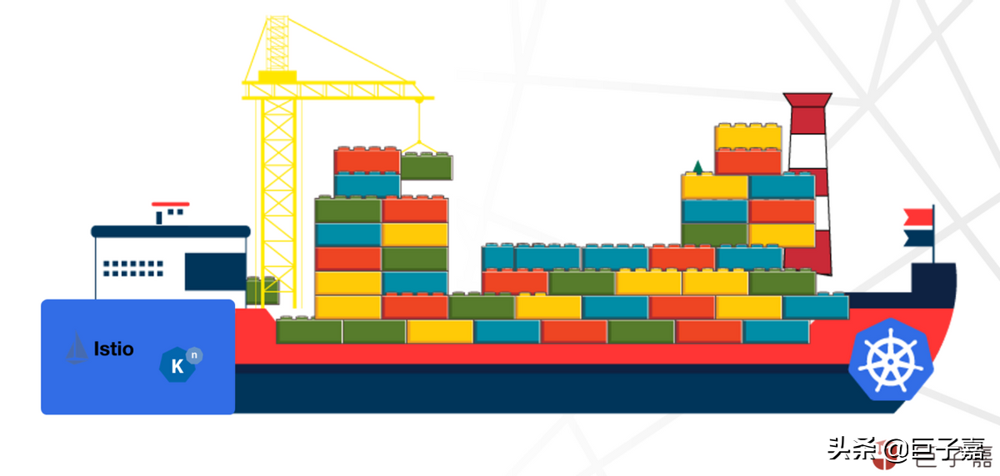
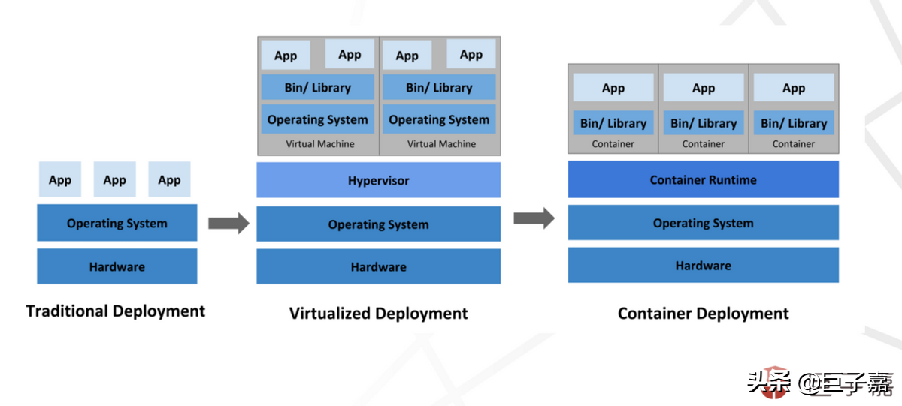
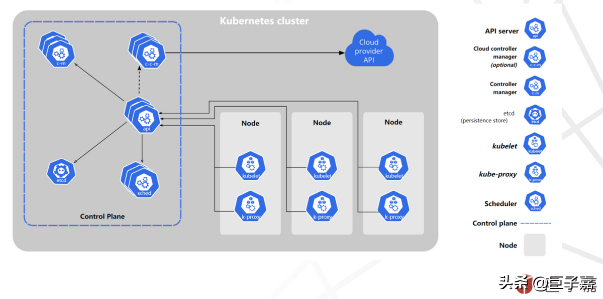
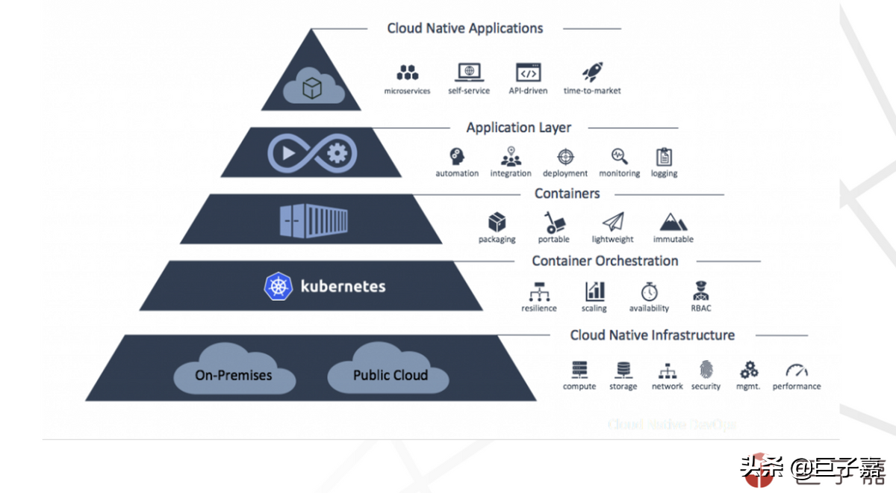

# Kubernetes 容器平臺介詔

作者: 巨子嘉
原文: [Kubernetes容器平臺](https://www.gushiciku.cn/dl/18xaG/zh-tw)](https://www.gushiciku.cn/dl/18xaG/zh-tw)

**容器技術正在顛覆傳統，重構整個軟體世界** ，改變軟體技術架構，團隊交付效率以及交付方式。通過遮蔽底層複雜異構的基礎設施環境，保障軟體一致性執行時環境，讓研發人員更加高效地聚焦在業務邏輯。

雖然 **容器通過顛覆式創新遮蔽底層複雜性** ，==但是對容器部署運維，給容器叢集本身的運維團隊帶來了新的挑戰==。與傳統虛擬機器相比，極短的部署執行週期，更高效的資源使用率。容器管理著海量的快週期輪轉的物件，要求更徹底的自動化，策略啟動的管理能力。

許多團隊都開始轉向 Kubernetes 容器，通過容器編排及管理能力，輕鬆維護生產、開發和測試環境，Kubernetes 已成為容器編排和管理的事實標準，企業要意識到 **容器將成為未來關鍵的基礎設施平臺**。

## Kubernetes 容器平臺

**容器是新型的輕量級虛擬化**

Kubernetes 是一個開源容器編排平臺，管理大規模分散式容器化軟體應用，Kubernetes 提供了統一的 API 介面，呼叫 API 可是輕鬆實現 Web 應用、批處理作業和資料庫的部署。 Kubernetes 中的軟體應用被打包成與環境完全分離的容器映象，Kubernetes會自動配置應用並維護跟蹤資源分配。

Kubernetes 是谷歌的第三代容器管理系統，是 Borg 獨特的控制器和 Omega 靈活的排程器的組合。相較傳統VM虛擬化，容器是輕量級虛擬化技術，對軟體應用而言，容器帶來一下價值：

- 更敏捷的交付效率，釋放研發人員耗費在環境除錯過程，更加聚焦業務本身邏輯
- 更低的伺服器資源成本，容器化執行可以大幅提升底層基礎資源的使用效率。
- 更大範圍的差異化設施抽象統一，容器適配能力更強，容器幾乎可以執行市面上所有常見裝置。

**微服務架構** 是當前最為流行的軟體架構，提倡模組化，松耦合的設計理念，一般中等微服務架構專案，模組數量可達幾十到上百的規模，通過手工部署運維幾乎不肯能；針對這種複雜應用程式，尤其是元件數量比較多的場景，容器Kubernetes極大地簡化了部署更新工作。通過自動化容器配置、簡化擴充套件和管理資源分配等來實現生產級容器編排治理。

## Kubernetes 管理及編排

**容器負載，排程及資源管理**

- **排程器和排程**：Kubernetes 排程程式會實時監測叢集健康狀態及執行負載情況，通過呼叫策略智慧的將新容器安置在合適的位置。
- **服務發現和負載均衡**：微服務架構的應用，模組越多服務跟蹤和管理的難度就越大。Kubernetes 自動管理服務發現。實時記錄服務列表，同時還會檢查服務的健康狀況，動態調整服務列表。Kubernetes還包含了負載均衡。負載均衡器是在應用副本之間分配和協調流量的關鍵元件。Kubernete支援整合自定義負載均衡解決方案，如 HAProxy，Nignx以 及共有 LB 服務。
- **資源管理**：Kubernetes 排程程式通過 CPU 和記憶體等基礎資源使用率，對整個叢集的應用進行合理排程，保證整個叢集應用相對穩定。

## Kubernetes 優勢

- **彈性擴充套件**：Kubernetes 通過 Cluster Autoscaler 和 Horizontal Pod Autoscaler 功能，結合使用者配置策略，實現叢集自動彈性伸縮能力。
- **可移植性**：Kubernetes 可以在任何地方執行，無論是私有資料中心，公共雲還是公共和私有雲的混合雲底層基礎設施。
- **一致性部署**：容器體現了不可變基礎設施的理念，執行應用所需的所有依賴項和執行指令都與容器打包在一起。一致性意味著開發人員花更少的時間進行除錯，而將主要精力用於交付業務價值。
- **研發運維解耦**：產品開發團隊重視創新，快速交付業務需求；而運維團隊重視穩定性，對變化比較保守。容器應用的標準化，徹底解耦研發運維過程；同時 Kubernetes 的智慧自動化，極大的降低運維的門檻，減輕運維壓力。

## Kubernetes 基本架構

**Kubernetes 元件架構圖**

**控制平面** 充當 Kubernetes 叢集的大腦。排程、服務發現、負載均衡和資源管理能力都由控制平面提供，包含核心元件如下：

- **API server**：任何內部或外部請求都會發送到 API server。 再有 API server 確定請求是否有效再轉發到對應的元件。
- **etcd**：etcd 是 Kubernetes 的關鍵元件，儲存叢集狀態和配置。如果控制平面是大腦，那麼 etcd 就是儲存記憶的地方。
- **Worker nodes**：工作節點是 Kubernetes 叢集中真正承接業務應用執行負載的，單個叢集都會有多個工作節點，也可通過 Kubernetes 快速擴充套件工作節點。
- **Kubelet**：kubelet 是執行在每個工作節點上，與控制平面通訊並執行管理操作。 如果控制平面是大腦，那麼 kubelet 就是手臂。
- **Container runtime engine**：容器執行時引擎執行符合 OCI 標準的應用程式。 它是可移植容器和底層 Linux 核心之間的管道。

## 容器生態體系

雖然 Kubernetes 提供了可移植性、可擴充套件性和自動化、策略驅動的管理。從整個軟體全生命週期來看，它還需要在生產中構建、執行和擴充套件容器所需的能力，但更多的是偏底層運維管理平臺。

還有在早期，為了能快速適配各種場景，Kubernetes通過標準來擴充套件平臺的能力；可以使用自定義資源（CRD），容器儲存介面（CSI）和容器網路介面（CNI）輕鬆適配複雜環境。但是同時也像Android一樣，碎片化太嚴重，各個擴充套件元件能力層次不齊，導致Kubernetes需要組裝，已經投產的叢集升級困難。