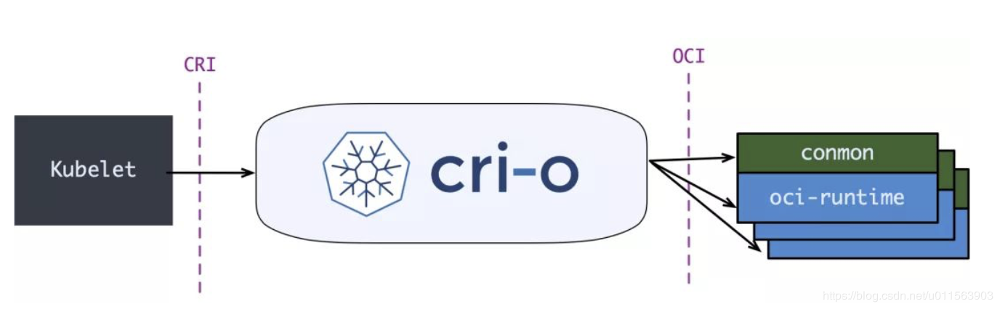

# Container Runtime 接口（CRI）


原文:

- [Container Runtime Interface (CRI)](https://kubernetes.io/docs/concepts/architecture/cri/)
- [K8S Runtime CRI OCI contained dockershim 理解](https://www.cnblogs.com/charlieroro/articles/10998203.html)

CRI 是一個插件接口，它使 kubelet 能夠使用各種 Container Runtime，無需重新編譯集群組件。

你需要在集群中的每個節點上都有一個可以正常工作的 Container Runtime， 這樣 kubelet 能啟動 Pod 及其容器。

Container Runtime 接口（CRI）是 kubelet 和容器之間通信的主要協議。它定義了主要的 gRPC 協議， 用於集群組件 kubelet 和 容器時之間的通信。

## API

當通過 gRPC 連接到 Container Runtime 的時候，kubelet 充當客戶端。Container Runtime 和 容器鏡像服務端點必須在 Container Runtime 可取用，這兩個服務端點可以在 kubelet 中通過 `--image-service-endpoint` 和 `--container-runtime-endpoint` 命令行的 flags 來進行配置。

對 Kubernetes v1.26，kubelet 偏向於使用 `CRI v1` 版本。如果 Container Runtime 不支持 CRI 的 v1 版本，那麼 kubelet 會嘗試協商較老的、仍被支持的所有版本。 v1.26 版本的 kubelet 也可協商 `CRI v1alpha2` 版本，但該版本被視為已棄用。如果 kubelet 無法協商出可支持的 CRI 版本，則 kubelet 放棄並且不會註冊為節點。

## 典型容器 Runtime 架構

從最常見的 Docker 說起，kubelet 和 Docker 的集成方案圖如下：


當 kubelet 要創建一個容器時，需要下列的步驟:

1. `kubelet` 通過 CRI 接口（gRPC）調用 `dockershim`，請求創建一個容器。 CRI 即容器運行時接口（Container Runtime Interface），這一步中，`kubelet` 可以視作一個簡單的 CRI Client，而 `dockershim` 就是接收請求的 Server。目前 `dockershim` 的代碼其實是內嵌在 `kubelet` 中的，所以接收調用的湊巧就是 `kubelet` 進程；
2. `dockershim` 收到請求後，轉化成 Docker Daemon 能聽懂的請求，發到 Docker Daemon 上請求創建一個容器。
3. Docker Daemon 早在 1.12 版本中就已經將針對容器的操作移到另一個守護進程 `containerd` 中了，因此 Docker Daemon 仍然不能幫我們創建容器，而是要請求 `containerd` 創建一個容器；
4. `containerd` 收到請求後，並不會自己直接去操作容器，而是創建一個叫做 `containerd-shim` 的進程，讓 `containerd-shim` 去操作容器。這是因為容器進程需要一個父進程來做諸如收集狀態，維持 stdin 等 fd 打開等工作。而假如這個父進程就是 `containerd`，那每次 `containerd` 掛掉或升級，整個宿主機上所有的容器都得退出了。而引入了 `containerd-shim` 就規避了這個問題（containerd 和 shim 並不是父子進程關係）；
5. 我們知道創建容器需要做一些設置 `namespaces` 和 `cgroups`，掛載 root filesystem 等等操作，而這些事該怎麼做已經有了公開的規範了，那就是 OCI（Open Container Initiative，開放容器標準）。它的一個參考實現叫做 `runC`。於是，`containerd-shim` 在這一步需要調用 `runC` 這個命令行工具，來啟動容器；
6. `runC` 啟動完容器後本身會直接退出，`containerd-shim` 則會成為容器進程的父進程，負責收集容器進程的狀態，上報給 `containerd`，並在容器中 pid 為 1 的進程退出後接管容器中的子進程進行清理，確保不會出現殭屍進程。

!!! info

    **Kubernetes 1.24 棄用 dockershim !!**

    維護 dockershim 已經成為 Kubernetes 維護者肩頭一個沉重的負擔。創建 CRI 標準就是為了減輕這個負擔，同時也可以增加不同容器運行時之間平滑的互操作性。但反觀 Docker 卻至今也沒有實現 CRI，所以麻煩就來了。

    Dockershim 向來都是一個臨時解決方案（因此得名：shim）。

    此外，與 dockershim 不兼容的一些特性，例如：控制組（cgoups）v2 和用戶名字空間（user namespace），已經在新的 CRI 運行時中被實現。移除對 dockershim 的支持將加速這些領域的發展。

    Kubernetes 1.24 版本中 dockershim 已經被移除了 。

## CRI 與 OCI

**CRI (Container Runtime 介面)**，單純是一組 gRPC 接口，掃一眼 `kubelet/apis/cri/services.go` 就能歸納出幾套核心接口：

- 一套針對容器操作的接口，包括創建，啟停容器等等
- 一套針對鏡像操作的接口，包括拉取鏡像刪除鏡像等
- 一套針對 PodSandbox（容器沙箱環境）的操作接口

**OCI（開放容器標準）**，規定了2點：

- 容器鏡像要長啥樣，即 ImageSpec。裡面的大致規定就是你這個東西需要是一個壓縮了的文件夾，文件夾里以 xxx 結構放 xxx 文件；
- 容器要需要能接收哪些指令，這些指令的行為是什麼，即 RuntimeSpec。這裡面的大致內容就是“容器”要能夠執行 “create”，“start”，“stop”，“delete” 這些命令，並且行為要規範。

**runC** 為啥叫參考實現呢，就是它能按照標準將符合標準的容器鏡像運行起來，標準的好處就是方便搞創新，反正只要我符合標準，生態圈裡的其它工具都能和我一起愉快地工作，那我的鏡像就可以用任意的工具去構建，我的“容器”就不一定非要用 namespace 和 cgroups 來做隔離。這就讓各種虛擬化容器可以更好地參與到遊戲當中。

現在我們可以找到很多符合 OCI 標准或兼容了 CRI 接口的 CNCF 專案，而這些專案就大體構成了整個 Kuberentes 的 Runtime 生態：

- CRI Compatible：`Docker`（借助 dockershim），`containerd`（借助 CRI-containerd），`CRI-O`，`Frakti`，etc
- OCI Compatible：`runC`，`Kata`（以及它的前身 `runV` 和 Clear Containers），`gVisor`。其它比較偏門的還有 Rust 寫的 `railcar`

CRI ,OCI 的確不容易被人們所理解，在這篇文章的語意中更準確的說法：cri-runtime 和 oci-runtime。通過這個粗略的分類，我們其實可以總結出整個 Runtime 架構萬變不離其宗的三層抽象：

```
Orchestration API -> Container API（cri-runtime） -> Kernel API(oci-runtime)
```

根據這個思路，我們就很容易理解下面這兩種東西：

- 各種更為精簡的 cri-runtime
- 各種“強隔離”容器方案

## Containerd 和 CRI-O

上一節看到現在的 Runtime 實在是有點複雜了，於是就有了直接拿 `containerd` 做 `oci-runtime` 的方案。當然，除了 Kubernetes 之外，containerd 還要接諸如 Swarm 等調度系統，因此它不會去直接實現 CRI，這個適配工作當然就要交給一個 shim 了。

`containerd 1.0` 中，對 CRI 的適配通過一個單獨的進程 `CRI-containerd` 來完成：


`containerd 1.1` 中做的又更漂亮一點，砍掉了 `CRI-containerd` 這個進程，直接把適配邏輯作為插件放進了 `containerd` 主進程中：


但在 `containerd` 做這些事情都同時，社群也有了一個更為專注的 cri-runtime：`CRI-O`，它非常純粹，就是兼容 `CRI` 和 `OCI`，做一個 Kubernetes 專用的 runtime：




