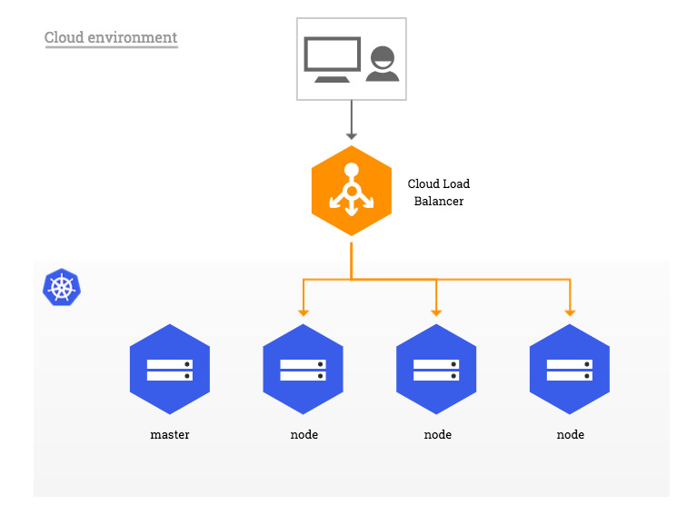
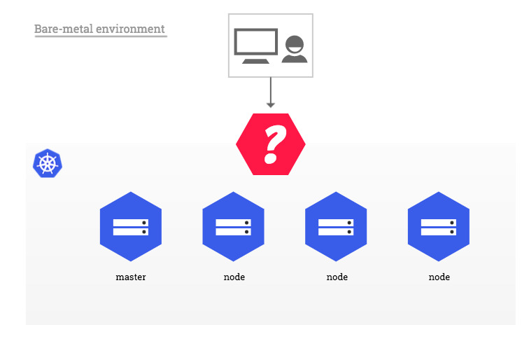
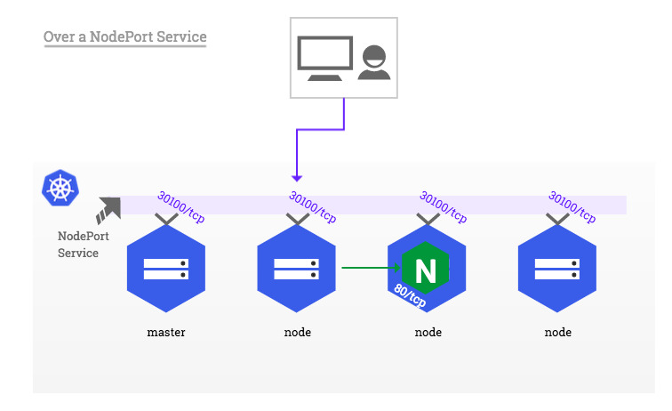
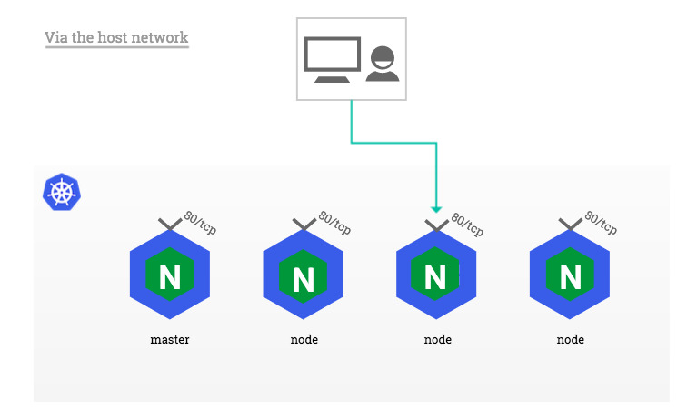

# 佈署在 Kubernetes 裡的應用程序向外部公開服務

原文:[Bare-metal considerations](https://kubernetes.github.io/ingress-nginx/deploy/baremetal/)

在傳統的雲環境中，網絡負載均衡器可按需使用，單個 Kubernetes 就可使用 NGINX Ingress 控制器來與外部客戶端提供聯繫，並間接與集群內運行的任何應用程序連接。



然而在地端的資料中心裡的 Kubernetes 環境則缺乏這種整合，因此需要稍微不同的設置來為外部消費者提供相同類型的訪問。



本文檔的其餘部分描述了佈署在 Kubernetes (在地端的資料中心)裡的應用程序向外部公開服務向外部公開服務的方法。

## 純軟件解決方案：MetalLB

MetalLB 為不在受支持的雲提供商上運行的 Kubernetes 集群提供網絡負載均衡器實現，從而有效地允許在任何集群中使用 `LoadBalancer` 服務。

接著我們來演示如何在具有可公開訪問節點的 Kubernetes 集群中使用 MetalLB (Layer 2 配置模式)。在這種模式下，一個節點會為應用的服務 IP 吸引所有流量。有關詳細信息，請參閱流量策略。


## 通過 NodePort 服務

NodePort 類型的服務通過 kube-proxy 組件在每個 Kubernetes 節點（包括主節點）上公開相同的非特權端口（默認值：`30000-32767`）。有關詳細信息，請參閱[Type NodePort](https://kubernetes.io/docs/concepts/services-networking/service/#type-nodeport)。



## 通過主機網絡

在沒有可用的外部負載均衡器但不能使用 NodePorts 的設置中，可以將應用程序的　Pod 配置為使用它們運行的主機的網絡，而不是專用的網絡命名空間。這種方法的好處是應用程序可以將端口直接綁定到 Kubernetes 節點的網絡接口，而無需 NodePort 服務強加的額外網絡轉換。

作用上可以通過啟用 Pod 規範中的 `hostNetwork` 選項來實現。

```yaml
template:
  spec:
    hostNetwork: true
```



