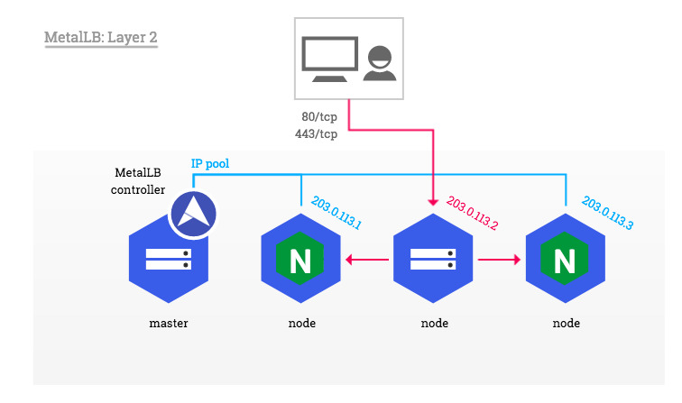
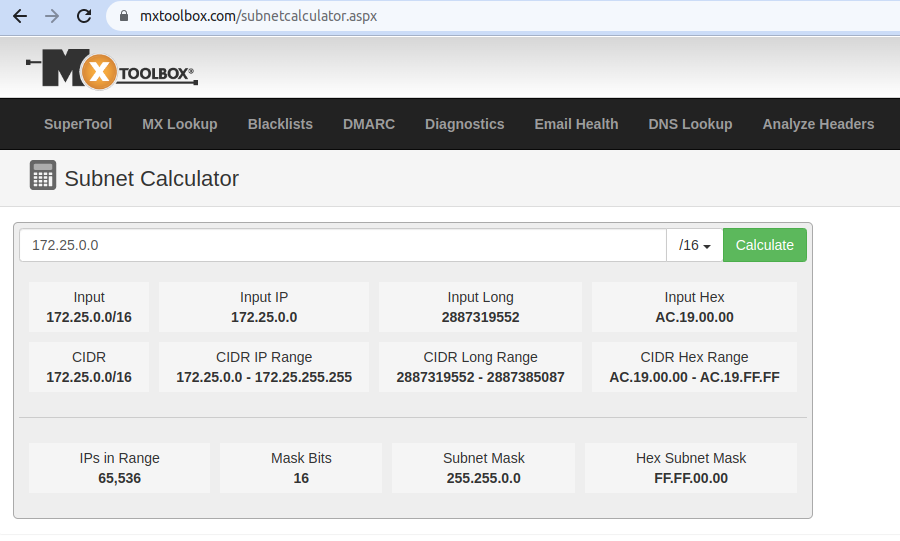
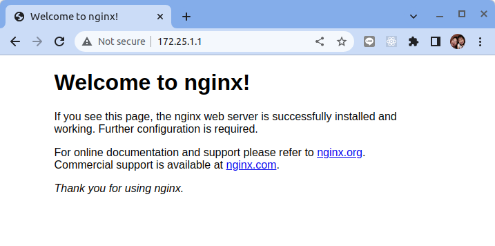
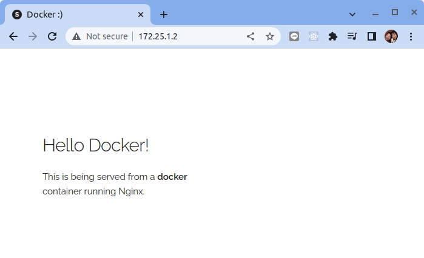

# 在 K3D 設定 Metallb

原文:[k3d-metallb-starter-kit](https://github.com/keunlee/k3d-metallb-starter-kit)



## 概述

本地本地 Kubernetes 集群環境進行安裝 Load Balancer 以便學習與驗證 Service (type: loadbalancer) 的應用部署。

##　先決條件

- docker - https://docs.docker.com/get-docker/
- k3d - (v5.0.0) - https://github.com/rancher/k3d/releases
- jq - https://stedolan.github.io/jq/
- kubectls - https://kubernetes.io/docs/tasks/tools/

## 設定

創建集本地 Kubernetes 集群, 由於 K3D 自帶名為 `Klipper` 的服務負載均衡器。我們需要禁用它才能正常運行 MetalLB, 詳情見[ISSUES WITH K3S](https://metallb.universe.tf/configuration/k3s/)。

```bash
# create the k3d cluster
k3d cluster create --servers 1 --agents 3 \
--k3s-arg "--disable=servicelb@server:0" \
--k3s-arg "--no-deploy=traefik@server:0" \
--k3s-arg "--disable=traefik@server:0" \
--wait
```

結果:

```bash hl_lines="2"
INFO[0000] Prep: Network                                
INFO[0000] Created network 'k3d-k3s-default'            
INFO[0000] Created image volume k3d-k3s-default-images  
INFO[0000] Starting new tools node...                   
INFO[0000] Starting Node 'k3d-k3s-default-tools'        
INFO[0001] Creating node 'k3d-k3s-default-server-0'     
INFO[0001] Creating node 'k3d-k3s-default-agent-0'      
INFO[0001] Creating node 'k3d-k3s-default-agent-1'      
INFO[0001] Creating node 'k3d-k3s-default-agent-2'      
INFO[0001] Creating LoadBalancer 'k3d-k3s-default-serverlb' 
INFO[0001] Using the k3d-tools node to gather environment information 
INFO[0001] HostIP: using network gateway 172.25.0.1 address 
INFO[0001] Starting cluster 'k3s-default'               
INFO[0001] Starting servers...                          
INFO[0001] Starting Node 'k3d-k3s-default-server-0'     
INFO[0006] Starting agents...                           
INFO[0006] Starting Node 'k3d-k3s-default-agent-1'      
INFO[0006] Starting Node 'k3d-k3s-default-agent-2'      
INFO[0006] Starting Node 'k3d-k3s-default-agent-0'      
INFO[0016] Starting helpers...                          
INFO[0016] Starting Node 'k3d-k3s-default-serverlb'     
INFO[0023] Injecting records for hostAliases (incl. host.k3d.internal) and for 5 network members into CoreDNS configmap... 
INFO[0025] Cluster 'k3s-default' created successfully!  
INFO[0025] You can now use it like this:                
kubectl cluster-info
```

在 K3D 集群創建的日誌中可查看到它產生了一個虛擬網絡 `k3d-k3s-default`。

驗證　Kubernetes　集群主節點和工作節點的運行狀態:

```bash
# validate the cluster master and worker nodes
kubectl get nodes　-o wide
```

結果: 

```bash
NAME                       STATUS   ROLES                  AGE   VERSION        INTERNAL-IP   EXTERNAL-IP   OS-IMAGE   KERNEL-VERSION      CONTAINER-RUNTIME
k3d-k3s-default-server-0   Ready    control-plane,master   42s   v1.22.7+k3s1   172.25.0.2    <none>        K3s dev    5.15.0-50-generic   containerd://1.5.9-k3s1
k3d-k3s-default-agent-1    Ready    <none>                 37s   v1.22.7+k3s1   172.25.0.3    <none>        K3s dev    5.15.0-50-generic   containerd://1.5.9-k3s1
k3d-k3s-default-agent-0    Ready    <none>                 36s   v1.22.7+k3s1   172.25.0.5    <none>        K3s dev    5.15.0-50-generic   containerd://1.5.9-k3s1
k3d-k3s-default-agent-2    Ready    <none>                 36s   v1.22.7+k3s1   172.25.0.4    <none>        K3s dev    5.15.0-50-generic   containerd://1.5.9-k3s1
```

!!!info
    在集群中每個節點的 INTERNAL-IP 會因每個人本機環境而有不同的 IP。

##　檢查本機虛擬網絡設定

檢查本地本地 Kubernetes 集群環境在本機 Docker 虛擬網絡 `k3d-k3s-default` 的設定。

```bash
docker network inspect k3d-k3s-default
```

結果:

```json hl_lines="14"
[
    {
        "Name": "k3d-k3s-default",
        "Id": "db353b218f5acf4d66ce6f39048c259142bb9cfcd23edb7947bd31e5a32803be",
        "Created": "2022-10-17T20:36:52.215728235+08:00",
        "Scope": "local",
        "Driver": "bridge",
        "EnableIPv6": false,
        "IPAM": {
            "Driver": "default",
            "Options": null,
            "Config": [
                {
                    "Subnet": "172.25.0.0/16",
                    "Gateway": "172.25.0.1"
                }
            ]
        },
        "Internal": false,
        "Attachable": false,
        "Ingress": false,
        "ConfigFrom": {
            "Network": ""
        },
        "ConfigOnly": false,
        "Containers": {
            "0c98b452b430a09ed08c36f1c51e66f27bf847cc870fd04434dd3c7da296be31": {
                "Name": "k3d-k3s-default-agent-1",
                "EndpointID": "51bc82e4070f293c61e3ced2a7cf3ef8a0b529e3925c50c19048009abfff6706",
                "MacAddress": "02:42:ac:19:00:03",
                "IPv4Address": "172.25.0.3/16",
                "IPv6Address": ""
            },
            "2f1aac8332866deb57770fd011d77058eaea78701244a9d490e678777a16acea": {
                "Name": "k3d-k3s-default-agent-0",
                "EndpointID": "65cf8f509cd303625b25297562d310b9695398c0bfbb3e86646947356787b6b8",
                "MacAddress": "02:42:ac:19:00:05",
                "IPv4Address": "172.25.0.5/16",
                "IPv6Address": ""
            },
            "68df06942cd3b7680955cc1a43aac3d4c4cff1ee5a3c6a5426d46b8ac715060c": {
                "Name": "k3d-k3s-default-serverlb",
                "EndpointID": "861235bee8053497bcf66b09c833628980ebc8185ca694eb8f5e6d6a16bb1727",
                "MacAddress": "02:42:ac:19:00:06",
                "IPv4Address": "172.25.0.6/16",
                "IPv6Address": ""
            },
            "bd8f90610a4873006565703e4c7a5ce7f6630a5ca494e9c75f8cb4f40c2efe44": {
                "Name": "k3d-k3s-default-agent-2",
                "EndpointID": "c9cf9cccdacb368af4e58e138e4d2c17682211a3e80042d80a0bc67f4dcd0d17",
                "MacAddress": "02:42:ac:19:00:04",
                "IPv4Address": "172.25.0.4/16",
                "IPv6Address": ""
            },
            "f8fa30b757cfe7e9ff34dfa5597f499f05ddf3cebfaadee6183c555acc4cc1c8": {
                "Name": "k3d-k3s-default-server-0",
                "EndpointID": "91a7c5d3ab95e89ccefd7ab9a52866c6e31be97f431d65d16cbbc5d85b70950b",
                "MacAddress": "02:42:ac:19:00:02",
                "IPv4Address": "172.25.0.2/16",
                "IPv6Address": ""
            }
        },
        "Options": {
            "com.docker.network.bridge.enable_ip_masquerade": "true"
        },
        "Labels": {
            "app": "k3d"
        }
    }
]
```

從上列的資訊我們可得知 Docker 幫 K3D 的集群保留了下列的虛擬網段:

- Subnet: `172.25.0.0/16`

讓我們利用網路上的 [Subnet Calculator](https://mxtoolbox.com/subnetcalculator.aspx) 來看一下這個虛擬網段的配置:

|   |   |
|--- |---|
|Input|172.25.0.0/16|
|CIDR|172.25.0.0/16|
|CIDR IP Range|172.25.0.0 - 172.25.255.255|
|IPs|65,536|
|Subnet Mask|255.255.00|


讓我們從這個虛擬網段裡的 CIDR IP Range　中保留　100　個IP (`172.25.1.1`-`172.25.1.100`)來做本次的練習。



##　安裝 Metallb

在雲端託管的 K8S 叢集系統，當建立型態 (type) 為 LoadBalancer 的服務 (service) 資源時 (以下統稱 LoadBalancer 服務)，雲端服務供應商會自動建立對應的網路負載均衡器 (NLB) 並設定必要的健康檢查機制，如此，其它系統可以從外部存取叢集服務。

如果選擇自建 K8S 叢集，就沒有這樣的機制存在。MetalLB 就是特別針對自行部署的 K8S 叢集提供 LoadBalancer 服務。當有 LoadBalancer 服務物件需要建立時，MetalLB 就從預先指定的 IP 位址池 (address pool) 中配置一個給該服務使用，位址池中可以是私有 (private) 或者公開 (public) 的 IP。

MetalLB 透過兩種機制來進行節點故障時 IP 位址的錯誤轉移 (failover)，以確保 LoadBalancer 服務的 IP 位址的可用性 (availability)，目前 MetalLB 透過下列方式來將 IP 位址從故障的節點轉而綁定的新的節點：

- ARP(for IPv4)/NDP(for IPv6)：屬於第 2 層網路協定，可以在區網 (LAN) 廣播節點的 IP 位址達到重新綁定 IP 的目的。
- BGP：屬於第 3 層網路協定，MetaLB 的每個節點會跟機房中支援 BGP 的路由器 (router) 建立連線，透過該路由器廣播 LoadBalancer 服務的 IP 位址資訊。

!!! info
    提醒：第1種方式 MetalLB 其實並沒有提供額外的負載均衡功能，服務的負載均衡依然只由 Kubernetes 的 kube-proxy 來提供。
    
    第2種方式除了使用 Kubernetes 內建的負載均衡外，也額外利用了 BGP 特性來分散請求到多個 Kubernetes 節點。

### 部署 MetalLB

Ｍetallb 提供了不同手法的安裝方式:

- [Installation By Manifest](https://metallb.universe.tf/installation/#installation-by-manifest)
- [Installation With Kustomize](https://metallb.universe.tf/installation/#installation-with-kustomize)
- [Installation With Helm](https://metallb.universe.tf/installation/#installation-with-helm)

本教程使用 Helm 的手法來進行安裝:

```bash
#　setup helm repo
helm repo add metallb https://metallb.github.io/metallb

# install metallb to specific namespace
helm upgrade --install --create-namespace --namespace metallb-system \
metallb metallb/metallb
```

結果:

```bash hl_lines="11-12"
Release "metallb" does not exist. Installing it now.
NAME: metallb
LAST DEPLOYED: Mon Oct 17 21:45:34 2022
NAMESPACE: metallb-system
STATUS: deployed
REVISION: 1
TEST SUITE: None
NOTES:
MetalLB is now running in the cluster.

Now you can configure it via its CRs. Please refer to the metallb official docs
on how to use the CRs.
```

!!! tips
    Ｍetallb 在[Version 0.13.2](https://metallb.universe.tf/release-notes/#version-0-13-2) 版本有一個很重大的修改:

    - 新功能:　支持CRD！期待已久的功能 MetalLB 現在可通過 CR 進行配置。
    - 行為變化:　最大的變化是引入了 CRD 並刪除了對通過 ConfigMap 進行配置的支持。


### 配置 IP Adress Pool

Layer 2 模式是最簡單的配置：在大多數的情況下，你不需要任何特定於協議的配置，只需要 IP 地址範圍。

Layer 2 模式模式不需要將 IP 綁定到工作程序節點的網絡接口。它通過直接響應本地網絡上的 ARP 請求來工作，將機器的 MAC 地址提供給客戶端。

讓我們使用 CRD 來設定 Metallb:

```bash hl_lines="9"
cat <<EOF | kubectl apply -n metallb-system -f -
apiVersion: metallb.io/v1beta1
kind: IPAddressPool
metadata:
  name: ip-pool
  namespace: metallb-system
spec:
  addresses:
  - 172.25.1.1-172.25.1.100
---
apiVersion: metallb.io/v1beta1
kind: L2Advertisement
metadata:
  name: l2advertise
  namespace: metallb-system
spec:
  ipAddressPools:
  - ip-pool
EOF
```

結果:

```bash
ipaddresspool.metallb.io/ip-pool created
l2advertisement.metallb.io/l2advertise created
```

## 驗證

創建 Nginx 測試部署並通過負載均衡器公開。如果負載均衡器工作正常，Metallb 應該分配一個外部 IP 地址。

```bash
# create a deployment (i.e. nginx)
kubectl create deployment nginx --image=nginx

# expose the deployments using a LoadBalancer
kubectl expose deployment nginx --port=80 --type=LoadBalancer
```

檢查部署的結果:

```bash hl_lines="7"
$ kubectl get all
NAME                         READY   STATUS              RESTARTS   AGE
pod/nginx-6799fc88d8-2ktjs   0/1     ContainerCreating   0          14s

NAME                 TYPE           CLUSTER-IP     EXTERNAL-IP   PORT(S)        AGE
service/kubernetes   ClusterIP      10.43.0.1      <none>        443/TCP        87m
service/nginx        LoadBalancer   10.43.199.37   172.25.1.1    80:30672/TCP   5s

NAME                    READY   UP-TO-DATE   AVAILABLE   AGE
deployment.apps/nginx   0/1     1            0           14s

NAME                               DESIRED   CURRENT   READY   AGE
replicaset.apps/nginx-6799fc88d8   1         1         0       14s
```

從上列的結果可看到`service/nginx`被指派了一個外部的IP `172.25.1.1`。使用瀏覽器來訪問: 



接著讓我們再來部署另外一個不同的容器來驗證:

```bash
# create a deployment (i.e. nginx)
kubectl create deployment demo --image=prakhar1989/static-site

# expose the deployments using a LoadBalancer
kubectl expose deployment demo --port=80 --type=LoadBalancer
```

檢查部署的結果:

```bash hl_lines="9"
$ kubectl get all
NAME                         READY   STATUS    RESTARTS   AGE
pod/nginx-6799fc88d8-2ktjs   1/1     Running   0          19m
pod/demo-7bd58c7c66-lqxv5    1/1     Running   0          32s

NAME                 TYPE           CLUSTER-IP     EXTERNAL-IP   PORT(S)        AGE
service/kubernetes   ClusterIP      10.43.0.1      <none>        443/TCP        107m
service/nginx        LoadBalancer   10.43.199.37   172.25.1.1    80:30672/TCP   19m
service/demo         LoadBalancer   10.43.94.161   172.25.1.2    80:31161/TCP   4s

NAME                    READY   UP-TO-DATE   AVAILABLE   AGE
deployment.apps/nginx   1/1     1            1           19m
deployment.apps/demo    1/1     1            1           32s

NAME                               DESIRED   CURRENT   READY   AGE
replicaset.apps/nginx-6799fc88d8   1         1         1       19m
replicaset.apps/demo-7bd58c7c66    1         1         1       32s

```

從上列的結果可看到`service/demo`被指派了一個外部的IP `172.25.1.2`。使用瀏覽器來訪問: 




## Ｍetallb CRD

### IPAddressPool

IPAddressPool 表示可以分配給 LoadBalancer 服務的 IP 地址池。

|欄位|型別|說明|
|---|---|---|
|spec.addresses|[ ]string|MetalLB 擁有權限的 IP 地址範圍列表。您可以在單個池中列出多個範圍，它們都將共享相同的設置。每個範圍可以是 CIDR 前綴，也可以是 IP 的顯式起始結束範圍。|
|spec.autoAssign|bool|AutoAssign 標誌用於防止 MetallB 自動分配IP 地址池。(optional)|
|spec.avoidBuggyIPs|bool|AvoidBuggyIPs 防止IP 地址池使用以 .0 和 .255 結尾的地址。(optional)|

```yaml title="IPAddressPool 範例"
apiVersion: metallb.io/v1beta1
kind: IPAddressPool
metadata:
  name: ip-pool
  namespace: metallb-system
spec:
  addresses:
  - 172.25.1.1-172.25.1.100
  autoAssign: false
  avoidBuggyIPs: true
```

### L2Advertisement

[L2Advertisement](https://metallb.universe.tf/apis/#metallb.io/v1beta1.L2Advertisement) 允許通過 L2 Advertisement 設定特定的IP 地址池來提供 LoadBalancer IP。

|欄位|型別|說明|
|---|---|---|
|spec.ipAddressPools|[ ]string|通過此宣告要使用的 IPAddressPool 列表。(optional)|
|spec.ipAddressPoolSelectors|[ ]Kubernetes meta/v1.LabelSelector|IPAddressPools 的選擇器。如果此或列表未選擇 IPAddressPool，則將使用所有 IPAddressPool。(optional)|
|spec.nodeSelectors|[ ]Kubernetes meta/v1.LabelSelector|NodeSelectors 允許限制節點宣佈為 LoadBalancer IP 的下一個躍點。當為空時，所有擁有的節點都被宣佈為下一hop。(optional)|
|spec.interfaces|[ ]string|要宣布的接口列表。 LB IP 將僅從這些接口公佈。如果未設置該字段，我們會從主機上的所有接口進行通告。(optional)|

```yaml title="L2Advertisement 範例"
apiVersion: metallb.io/v1beta1
kind: L2Advertisement
metadata:
  name: l2advertise
  namespace: metallb-system
spec:
  ipAddressPools:
  - ip-pool
```

## 配置服務以使用 MetalLB

作為集群管理員，當使用者設定 `LoadBalancer` 類型的 `Service` 對象的時候，可以使用下列的手法來控制 MetalLB 如何分配 IP 地址。

###　請求特定的 IP 地址

與其他一些負載均衡器實現一樣，MetalLB 接受服務規範中的 `spec.loadBalancerIP` 字段設定。

如果請求的 IP 地址在任何地址池的範圍內，MetalLB　就會分配所請求的 IP 地址。如果請求的 IP 地址不在任何範圍內，MetalLB 會給予警告。

```yaml title="範例"
apiVersion: v1
kind: Service
metadata:
  name: <service_name>
  annotations:
    metallb.universe.tf/address-pool: <address_pool_name>
spec:
  selector:
    <label_key>: <label_value>
  ports:
    - port: 8080
      targetPort: 8080
      protocol: TCP
  type: LoadBalancer
  #　指定在 IP Address Pool 裡頭的 IP
  loadBalancerIP: <ip_address>
```

如果 MetalLB 無法分配請求的 IP 地址，則 Service 的狀態會是 <pending> ，運行 `kubectl describe service <service_name>` 的命令時會觀察到類似以下範例的事件。

```bash
  ...
Events:
  Type     Reason            Age    From                Message
  ----     ------            ----   ----                -------
  Warning  AllocationFailed  3m16s  metallb-controller  Failed to allocate IP for "default/invalid-request": "4.3.2.1" is not allowed in config
```

### 從特定池請求 IP 地址

如果要從特定池請求 IP 地址，但不關心特定 IP 地址，則可以使用 `metallb.universe.tf/address-pool` 註解從指定地址池中請求 IP 地址。

```yaml title="範例"
apiVersion: v1
kind: Service
metadata:
  name: <service_name>
  annotations:
    metallb.universe.tf/address-pool: <address_pool_name>
spec:
  selector:
    <label_key>: <label_value>
  ports:
    - port: 8080
      targetPort: 8080
      protocol: TCP
  type: LoadBalancer
```

如果你為 <address_pool_name> 指定的地址池不存在，MetalLB 會嘗試從允許自動分配的任何池中分配 IP 地址。

###　接受任何 IP 地址

默認情況下，地址池配置為允許自動分配。 MetalLB 從這些地址池中分配一個 IP 地址。

要從配置為自動分配的任何池中接受任何 IP 地址，不需要特殊的註釋或配置。

```yaml title="範例"
apiVersion: v1
kind: Service
metadata:
  name: <service_name>
spec:
  selector:
    <label_key>: <label_value>
  ports:
    - port: 8080
      targetPort: 8080
      protocol: TCP
  type: LoadBalancer
```

## 拆除本機驗證環境

銷毀集群:

```bash
k3d cluster delete
```
