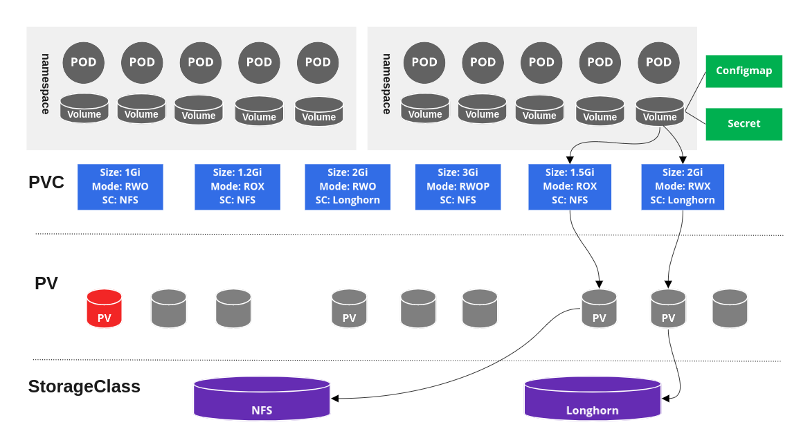
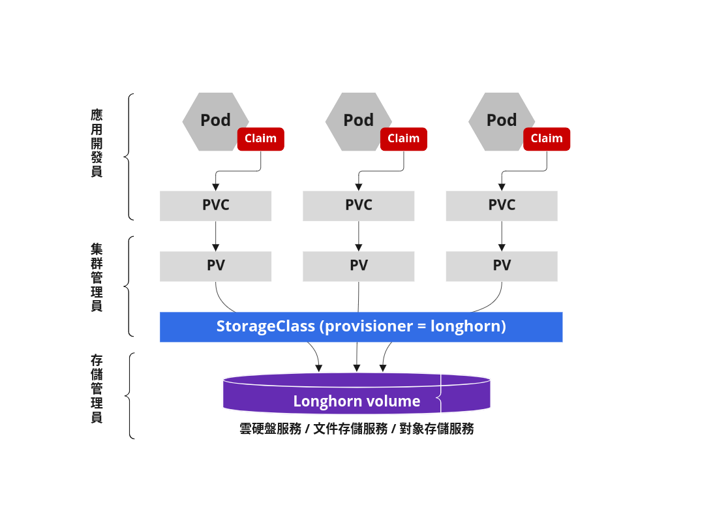
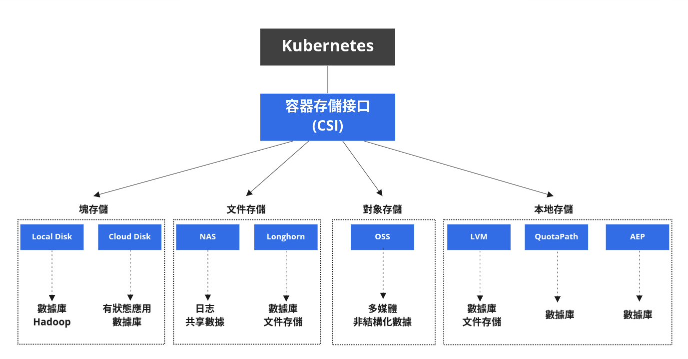

# 存儲

Kubernetes 存儲解決方案種類繁多，主要分為四大類，分別是分佈式文件存儲，分佈式塊存儲，Local-Disk 和傳統 NAS。

1. 分佈式塊存儲：包括開源社區的 Ceph，Sheepdog，商業產品中 EMC 的 Scale IO，Vmware 的 vSAN 等，分佈式塊存儲不適合容器場景，關鍵問題是缺失 RWX 的特性。
2. 分佈式文件存儲：包括開源社區的 Glusterfs，Cephfs，Lustre，Moosefs，Lizardfs, Longhorn，商業產品中 EMC 的 isilon，IBM 的 GPFS 等。分佈式文件存儲適合容器場景，但是性能問題比較需要去衡量與評估。
3. Local-Disk：有明顯的缺點，尤其是針對數據庫，大數據類的應用。節點故障後，數據的恢復時間長，對業務影響範圍廣。
4. 傳統 NAS：也是一種文件存儲，但是底層協議是性能關鍵，傳統 NAS 已經跟不上雲原生時代發展的潮流與走向。

Kubernetes v1.9 引入的容器存儲接口 **CSI**，並於 v1.13 版本正式 GA。 **CSI** 的引入極大的增強了容器存儲生態體系，標準化容器平台與外部存儲系統的集成。有狀態應用不需要了解底層存儲系統的任何信息，只需將數據寫入文件系統或塊設備的容器存儲卷，由容器平台透明地處理存儲相關的編排與調度工作。

Kubernetes 的 Volume 的創建和掛載流程如下：

1. 用戶提交 PVC，Kubernetes 平台自動創建出 PV
2. Kubernetes 平台將 PV 和 PVC 進行綁定
3. 部署 Pod 並使用已創建的 PVC，Kubernetes 將 Pod 調度到某宿主機
4. Kubernetes 將 PVC 對應的 Volume 進行 Attach 到對應宿主機
5. 宿主機上的 kubelet 完成 Volume 的 Mount 操作

總的來說，容器存儲方案的選擇，需要基於實際的業務需求出發，深刻理解容器平台未來承載的業務類型，如果基於雲平台構建雲原生平台，盡量與 IaaS 底層保持一致，同時需要考慮團隊的技術實力，開源產品對技術能力要求比較高，選擇開源產品，最好有相應的技術人員儲備。如果技術儲備不足，最好是選擇商用產品，雖然成本高點但經過了眾多企業的技術驗證。

