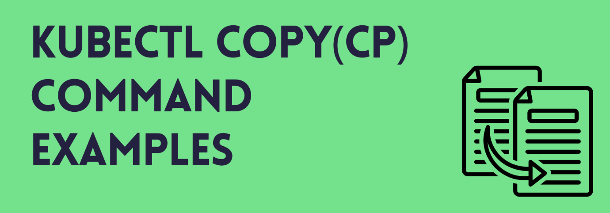
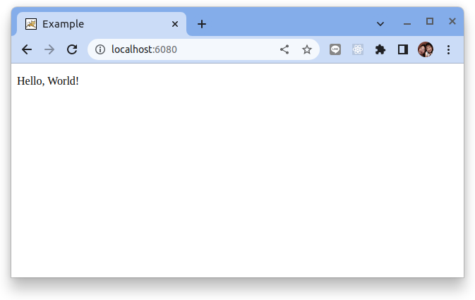

# 在 kubernetes Pod 和本地文件系統複製文件

原文: [kubectl cp example – copy files to and from kubernetes pod & containers](https://www.middlewareinventory.com/blog/kubectl-cp-example/)




`kubectl cp` 命令被廣泛用於在 pod 和本地文件系統之間複製文件。使用 `kubectl cp` 您可以執行以下任務:

- 從本地文件系統上傳文件到 pod 容器中
- 從 pod 容器下載一個文件到本地
- 使用本地副本更新/替換 pod 容器中的文件

在本文中，我們將詳細介紹使用 `kubectl` 將文件從 Kubernetes 中的容器複製到容器中所需的所有詳細信息。

## `kubectl cp` 的語法

`kubectl cp` 與典型的 Linux CP 命令一樣簡單。

```bash
kubectl cp <source-file-path> <destination-file-path>
```

這是將文件從本地複製到 pod 的語法:

```bash
kubectl cp /<path-to-your-file>/<file-name> <pod-name>:<fully-qualified-file-name> -c <container-name>
```

這是將文件從 pod 複製到本地的語法:

```bash
kubectl cp <pod-name>:<fully-qualified-file-name> /<path-to-your-file>/<file-name> -c <container-name>
```

要記住的要點有:

- 要了解 POD 裡頭的文件路徑。它始終與您在鏡像上定義的 `WORKDIR` 是相關的。
- 當 POD 裡頭有多個容器時，您需要使用 `-c` 參數指定要用於複製操作的容器

## `kubectl cp` 的示例

這是將 `index.html` 文件從 POD 的 `/var/www/html` 複製到本地 `/tmp` 目錄的命令:

```bash
kubectl cp apache-pod:index.html /tmp
```

!!! tip
    當 doc root 是 workdir 或容器鏡像的默認目錄時，不需要宣告完整路徑。

為了減少混淆，你總是可以這樣宣告完整的路徑:

```bash
kubectl cp apache-pod:/var/www/html/index.html /tmp
```

## 練習

假設我們已經在我們的 Kubernetes 集群上部署了一個 Apache Tomcat Web 服務器作為微服務（在此處了解如何在您的 Kubernetes 集群上安裝 Tomcat）。

```bash
kubectl apply -f - <<EOF
apiVersion: apps/v1
kind: Deployment
metadata:
  name: tomcatinfra
spec:
  selector:
    matchLabels:
      app: tomcatinfra
  replicas: 1
  template:
    metadata:
      name: tomcatinfra
      labels:
        app: tomcatinfra
    spec:
      containers:
      - name: tomcatapp
        image: saravak/tomcat8        
EOF
```

檢查佈署:

```bash
$ kubectl get pods
NAME                           READY   STATUS    RESTARTS   AGE
tomcatinfra-7fff8547df-qrh9n   1/1     Running   0          77s
```


它更像是 Linux 世界中的 `SCP`，使用 ssh 協議在本地和遠程機器之間複製文件。
我們可以使用以下命令列出 pod 工作目錄中的文件：

```bash
kubectl exec -t <pod-name> -- ls -lrta
```

將 <pod-name> 替換為命令 `kubectl get pods` 的輸出。

```
$ kubectl exec -t tomcatinfra-7fff8547df-qrh9n -- pwd

/opt/tomcat/webapps

$ kubectl exec -t tomcatinfra-7fff8547df-qrh9n -- ls -lrta

total 48
drwxr-x---  5 root root 4096 Apr 14  2019 manager
drwxr-x---  5 root root 4096 Apr 14  2019 host-manager
drwxr-x---  6 root root 4096 Apr 14  2019 examples
drwxr-x--- 14 root root 4096 Apr 14  2019 docs
drwxr-x---  3 root root 4096 Apr 14  2019 ROOT
drwxr-xr-x  1 root root 4096 Apr 14  2019 ..
-rw-r--r--  1 root root 8618 Apr 14  2019 SampleWebApp.war
drwxr-x---  4 root root 4096 Jan  7 02:39 SampleWebApp
drwxr-x---  1 root root 4096 Jan  7 02:39 .
```

在上述的命令中，我們試圖列出 tomcat 的 `ROOT` 部署目錄。這裡我們沒有定義 `ROOT` 目錄的完整路徑，因為它是容器 `WORKDIR` 的相對路徑。

我們在本文中使用的鏡像來自 [Dockerfile Tomcat 示例文章](https://www.middlewareinventory.com/blog/docker-tomcat-example-dockerfile-sample/)。

```docker title="Dockerfile" hl_lines="14"
FROM centos

MAINTAINER hello@gritfy.com

RUN mkdir /opt/tomcat/

WORKDIR /opt/tomcat
RUN curl -O https://www-eu.apache.org/dist/tomcat/tomcat-8/v8.5.40/bin/apache-tomcat-8.5.40.tar.gz
RUN tar xvfz apache*.tar.gz
RUN mv apache-tomcat-8.5.40/* /opt/tomcat/.
RUN yum -y install java
RUN java -version

WORKDIR /opt/tomcat/webapps
RUN curl -O -L https://github.com/AKSarav/SampleWebApp/raw/master/dist/SampleWebApp.war

EXPOSE 8080

CMD ["/opt/tomcat/bin/catalina.sh", "run"]
```

如果查看該鏡象的 `Dockerfile`，您會發現 `WORKDIR` 設置為 tomcat 服務器的 `/opt/tomcat/webapps`。

接下來我們將通過將自定義的 `index.html` 文件添加到 web 應用程序下的 `ROOT` 應用程序目錄中來更改 tomcat 的默認登錄頁面。

默認情況下，Tomcat 將優先考慮此 `index.html`，而不是內置的 `index.jsp` 文件。

我們將使用 `kubectl cp` 命令將此文件上傳/複製到 Pod 的檔案目錄中。

### 將文件從本機複製到容器

要將文件從本機複製到容器，請使用以下命令：

```bash
kubectl cp /<path-to-your-file>/<file-name> <pod-name>:<folder>/<file-name> -c <container-name>
```

由於一個 pod 可以有多個容器，因此當您使用 `kubectl cp` 命令複製文件時，您應該始終指定要從/向其中複製文件的容器。

要列出 pod 中的所有容器，請使用以下命令：

```bash
kubectl get pods <pod-name> -o jsonpath='{.spec.containers[*].name}'
```

例如:

```bash
$ kubectl get pods tomcatinfra-7fff8547df-qrh9n -o jsonpath='{.spec.containers[*].name}'

tomcatapp
```

讓我們創建一個簡單的 `index.html`:

```html title="index.html"
<!DOCTYPE html>
<html>
    <head>
        <title>Example</title>
    </head>
    <body>
        <p>Hello, World!</p>
    </body>
</html>
```

接著進行檔案複製:

```bash
kubectl cp ./index.html tomcatinfra-7fff8547df-qrh9n:ROOT/index.html -c tomcatapp

# or

kubectl cp ./index.html tomcatinfra-7fff8547df-qrh9n:/opt/tomcat/webapps/ROOT/index.html -c tomcatapp
```

驗證:

```bash
kubectl port-forward pod/tomcatinfra-7fff8547df-qrh9n 6080:8080
```



!!! info
    注意：請記住，您必須在來源和目標中指定要複製的文件名。如果您只指定一個目錄，該命令將不會起作用。

### 將文件從容器複製到本機

要將文件從容器複製到本機，請使用以下命令：

```bash
kubectl cp <pod-name>:directory/<file-name> /<path-to-your-file>/<file-name> -c <container-name>
```

現在讓我們看看這個命令的例子。

```bash
kubectl cp tomcatinfra-7fff8547df-qrh9n:ROOT/index.jsp ./index.jsp -c tomcatapp
```

這將在本機上創建一個名為 `index.jsp` 的文件，並將同一文件的內容從 pod 內的 tomcat 容器複製到本機上的文件。

### 如何複製目錄

我們已經了解瞭如何使用 `kubectl cp` 從 Pod 和容器中復制單個文件或將其複製到 Pod 和容器中。

但有時我們的要複製的不僅僅是單一文件，我們可能想要複製一整個目錄或目錄裡的目錄。

作法很簡單，從 POD 複製一個目錄到本地，您所要做的就是像文件名一樣定義目錄名。以下是將目錄從 POD 複製到本地 (下載) 的語法:

```bash
kubectl cp <pod-name>:directory-name  <path-on-local-file-system>/directory-name -c <container-name>
```

下列是 `kubectl` 將目錄從本地複製到 POD (上傳) 的語法:

```bash
kubectl cp  <path-on-local-file-system>/directory-name <pod-name>:directory-name -c <container-name>
```

## 結論

在這篇文章中，我們學到了一些重要的東西。讓我們快速回顧一下。

1. 使用以下命令查看 pod 活動目錄中的文件：

    ```bash
    kubectl exec -t <pod-name> -- ls -lrta
    ```

2. 使用以下命令將文件從本機複製到容器 (pod)：

    ```bash
    kubectl cp /<path-to-your-file>/<file-name> <pod-name>:<folder>/<file-name> -c <container-name>
    ```

3. 使用以下命令將文件從容器 (pod) 複製到本機：

    ```bash
    kubectl cp <pod-name>:folder/<file-name> /<path-to-your-file>/<file-name> -c <container-name>
    ```
