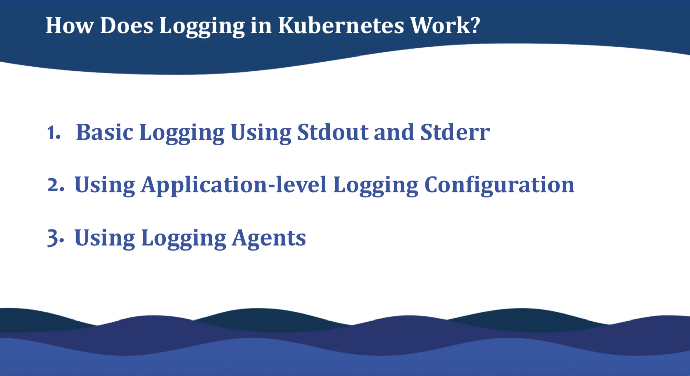
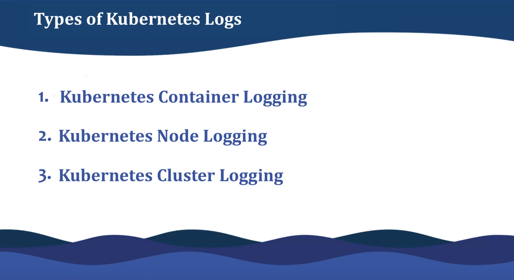
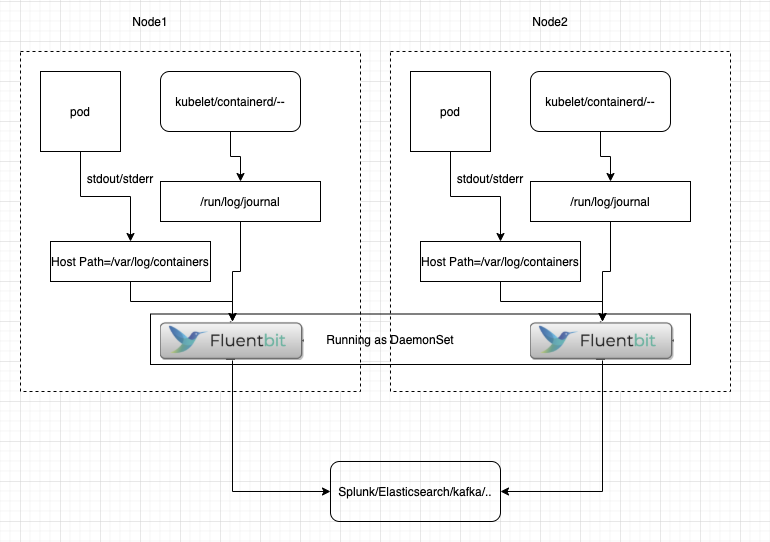
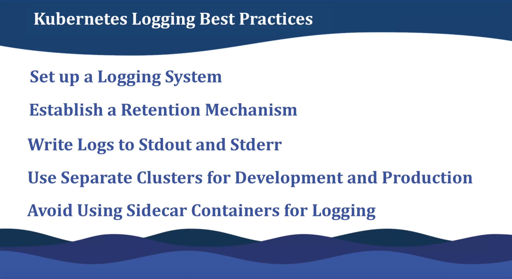

# 日誌完整指南

原文: https://sematext.com/guides/kubernetes-logging/


## Kubernetes 中的日誌記錄有何不同

Kubernetes 中的[日誌聚合](https://sematext.com/blog/log-aggregation/)與傳統服務器或虛擬機上的日誌記錄有很大不同，主要是因為它管理其應用程序（pod）的方式。

當應用程序在虛擬機上死機時，日誌仍然可被查找到，直到您將其刪除。**在 Kubernetes 中，當 pod 被驅逐、崩潰、刪除或安排在不同的節點上時，來自容器的日誌就會消失。系統會自行清理。因此，您會丟失有關異常發生原因的任何信息**。 Kubernetes 中默認日誌的瞬態特性使得實施集中式日誌管理解決方案變得至關重要。

我們不要忘記 Kubernetes 的高度分佈式和動態特性。在生產環境中，您很可能會使用多台機器，每台機器都有多個容器，這些容器隨時可能崩潰。 

## Kubernetes 中的日誌記錄是如何工作的

您可以通過多種方式在 Kubernetes 中收集日誌：



### 1. 使用 Stdout 和 Stderr 的基本日誌記錄

在傳統的服務器環境中，應用程序日誌被寫入一個文件，例如 `/var/log/app.log`。這些日誌可以在每台服務器上查看，也可以由日誌代理收集，將它們推送到中心位置以進行日誌分析和存儲。

但是，在使用 Kubernetes 時，您需要跨集群中的多個節點收集多個臨時 pod（應用程序）的日誌，這使得這種日誌收集方法不是最佳的。跨集群中的多個服務器管理多個容器的多個日誌文件需要一種新的、更可靠的方法。

相反，默認的 Kubernetes 日誌框架建議將節點上每個容器的標準輸出 (stdout) 和標準錯誤輸出 (stderr) 自動地捕獲到特定的日誌文件中。該文件由 Kubernetes 管理，通常單一日誌的容量限制為 10MB。您可以通過運行命令 `kubectl logs <container name>` 查看特定容器的日誌。

這是在容器中生成的 Nginx 日誌的示例。

```bash
kubectl logs <container name>

[Output]
100.116.72.129 - - [12/Feb/2020:13:44:12 +0000] "GET /api/user HTTP/1.1" 200 84
127.0.0.1 - - [12/Feb/2020:13:44:17 +0000] "GET /server-status?auto HTTP/1.1" 200 918
10.4.51.204 - - [12/Feb/2020:13:44:19 +0000] "GET / HTTP/1.1" 200 3124
100.116.72.129 - - [12/Feb/2020:13:44:21 +0000] "GET /api/register HTTP/1.1" 200 84
100.105.140.197 - - [12/Feb/2020:13:44:21 +0000] "POST /api/stats HTTP/1.1" 200 122
```

如果要訪問崩潰實例的日誌，可以使用 `–previous`。此方法適用於具有少量容器和實例的集群。否則，當應用程序數量增加並且集群在多台機器上運行時，很難管理集群日誌。您需要一個可擴展的解決方案。

### 2. 使用應用級日誌配置

如果您不想依賴集群配置，可以使用應用程序級別的日誌記錄配置。這意味著每個容器都有自己的日誌記錄配置，這本身就使得日誌記錄變得困難並且容易出錯。此外，配置中的任何更改都需要您再次部署所有要監控的容器。

### 3. 使用日誌代理

最後，您可以使用 [Fluentbit](https://fluentbit.io/) 等日誌代理。

日誌代理是收集 Kubernetes 日誌並將其發送到中心位置的工具。這些代理是輕量級容器，可以訪問一個目錄，其中包含來自節點上所有應用程序容器的日誌。這是最簡單和最好的解決方案，因為它不會影響已部署的應用程序，並且無論您向集群添加多少節點，它都是完全可擴展的。設置也非常簡單。只運行一個命令，你就完成了。

## Kubernetes 日誌的類型

如前所述，在 Kubernetes 中有不同層級的日誌，所有層級都包含不同但有用的信息，具體的使用取決於您的場景。在 Kubernetes 系統中，主要有三種類型的日誌：容器日誌、節點日誌和集群（或系統組件）日誌。



### 容器日誌

容器日誌是由您的容器化應用程序生成的日誌。捕獲容器日誌的最簡單方法是使用 `stdout` 和 `stderr`。

假設您有一個名為 app 的 Pod，您在其中將某些內容記錄到標準輸出。

```yaml
apiVersion: v1
kind: Pod
metadata:
  name: app
spec:
  containers:
  - name: count
    image: busybox
    args: [/bin/sh, -c,
            'i=0; while true; do echo "$i: $(date)"; i=$((i+1)); sleep 1; done']
```

通過運行應用此配置文件：

```bash
kubectl apply -f app.yaml
```

通過運行以下命令獲取日誌：

```bash
kubectl logs app
```

您將立即在終端窗口中看到輸出。

```
[Output]
0: Mon Jan  1 00:00:00 UTC 2001
1: Mon Jan  1 00:00:01 UTC 2001
2: Mon Jan  1 00:00:02 UTC 2001
...
```

### 節點日誌

容器化應用程序寫入 stdout 或 stderr 的所有內容都由容器引擎流式傳輸到某個地方——在 Kubernetes 的環境，例如，傳輸到日誌驅動程序。這些日誌通常位於主機上的 `/var/log/pods` 目錄中。

如果容器重新啟動，kubelet 會在節點上保留日誌。為了防止日誌填滿節點上的所有可用空間，Kubernetes 設置了日誌輪換策略。因此，當一個 pod 被逐出節點時，所有相應的容器以及它們的日誌也會被逐出。

根據您的操作系統和服務，您可以收集各種節點級別的日誌，例如內核日誌或 systemd 日誌。

在具有 systemd 的節點上，kubelet 和 container runtime 都寫入 journald。如果 systemd 不存在，它們會寫入 `/var/log` 目錄中的 `.log` 文件。



您可以使用 journalctl 命令訪問 systemd 日誌。這將輸出日誌行列表。如果您在節點上沒有 systemd，那麼您可以像在傳統服務器環境中一樣管理日誌。

```bash
$ journalctl

[output]
-- Logs begin at Thu 2020-01-23 09:15:28 CET, end at Thu 2020-01-23 14:43:00 CET. --
Jan 23 09:15:28 raha-pc systemd-journald[267]: Runtime journal (/run/log/journal/) is 8.0M, max 114.2M, 106.2M free.
Jan 23 09:15:28 pc kernel: microcode: microcode updated early to revision 0xd6, date = 2019-10-03
```

### 集群（或系統組件）日誌

Kubernetes 集群日誌是指 Kubernetes 本身及其所有系統組件日誌，我們可以區分運行在容器中的組件和不運行在容器中的組件。每個都有自己的角色，讓您深入了解 Kubernetes 系統的健康狀況。例如，kube-scheduler、kube-apiserver、etcd 和 kube-proxy 在容器內運行，而 kubelet 和容器運行時運行在操作系統級別，通常作為 systemd 服務。

默認情況下，容器外的系統組件將文件寫入 `journald`，而在容器中運行的組件寫入 `/var/log` 目錄。但是，可以選擇將容器引擎配置為將日誌流式傳輸到首選位置。

Kubernetes 沒有為集群級別的日誌記錄提供原生解決方案。但是，您還可以使用其他方法：

- 使用在每個節點上運行的節點級日誌記錄代理
- 在應用程序 pod 中添加用於日誌記錄的 sidecar 容器
- 直接從應用程序公開日誌。

除了系統組件日誌，您還可以記錄 Kubernetes 事件和審計日誌。

#### Kubernetes Events 日誌

Kubernetes 事件包含有關資源狀態更改或錯誤的信息，例如為什麼 pod 被驅逐或調度程序做出了什麼決定，以及其他信息性消息，可提供對集群內部正在發生的事情的洞察力。

事件是存儲在 master 上的 apiserver 中的 API 對象。與節點日誌記錄類似，設置了刪除機制以避免使用所有主節點的磁盤空間。因此，{==Kubernetes 在最後一次發生一小時後刪除事件==}。如果您想在更長的時間內捕獲事件，您需要安裝第三方解決方案，就像我們在上面的節點級日誌記錄部分中解釋的那樣。

您可以通過運行以下命令快速檢查命名空間中的事件：

```bash
kubectl get events -n <namespace>
```

```
[Output]
LAST SEEN   TYPE     REASON      OBJECT     MESSAGE
3m58s       Normal   NoPods      kube-dns   No matching pods found
9m31s       Normal   Killing     pod/app    Stopping container app
9m32s       Normal   DELETE      pod/app    Starting container app
...
```

如果您不想檢查整個命名空間，而只想檢查單個 Pod，您也可以這樣做。

```bash
kubectl describe pod <pod-name>

[Output]
Events:
  Type    Reason     Age   From               Message
  ----    ------     ----  ----               -------
  Normal  Scheduled  41m   default-scheduler  Successfully assigned app to ip-xx-xx-xx-xx
  Normal  Pulled     41m   kubelet, ip-xx     Container image "app-image" already present on machine
  Normal  Created    41m   kubelet, ip-xx     Created container app
  Normal  Started    41m   kubelet, ip-xx     Started container app
```
理想情況下，您永遠不需要在終端中運行這些命令，而是使用集群級別的日誌記錄設置將這些事件發送到一個中心位置，您可以在其中查看它們以及您擁有的任何日誌。

#### Kubernetes 審計日誌

Kubernetes 審計日誌是對 kube-apiserver 的每次調用的詳細描述。它們提供了按時間順序排列的活動，這些活動導致系統在特定時刻的狀態。它們對於安全性和合規性目的非常有用，可以準確地告訴您誰做了什麼、何時以及如何做的。

#### Kubernetes Ingress 日誌

Kubernetes Ingress 正在成為將來自集群外部的 HTTP 和 HTTPS 路由暴露給集群內服務的事實標準。這使得入口日誌對於跟踪服務性能、問題、錯誤甚至集群的安全性非常重要。

## Kubernetes 日誌最佳實踐

您現在可能已經知道，日誌系統的設計在 Kubernetes 的環境下是一個挑戰。但是，有足夠的關於該主題的文獻來編譯您應該遵循的最佳實踐列表，以確保您捕獲所需的日誌。



### 設置日誌系統

訪問 Kubernetes 日誌相當容易。挑戰在於將它們發送和存儲到哪裡，以便將來使用。無論您的用例是什麼，您選擇的日誌管道（無論是內部的還是服務的）都需要將日誌發送到位於單獨和隔離環境中的中心位置。

### 建立保留機制

無論您選擇在內部執行日誌記錄還是使用第三方服務，日誌仍然會佔用大量空間。因此，請確保您有一個明確的保留策略來存儲日誌以供將來使用。更高的保留政策通常成本更高。因此，您可能需要根據您的 Kubernetes 環境估計所需的磁盤空間。當然，託管日誌服務將降低與 Kubernetes 日誌相關的基礎設施成本，並提供基於數量的折扣。

### 將日誌寫入標準輸出和標準錯誤

儘管這是遷移到容器化環境時的標準做法，但一些公司仍然編寫記錄到文件的應用程序。將日誌重定向到 stdout 和 stderr 允許 Kubernetes 的集中式日誌框架發揮作用，並自動將日誌流式傳輸到任何所需的位置。

此外，將錯誤分離到錯誤流中有助於日誌收集，並使您更容易過濾日誌。

### 使用單獨的集群進行開發和生產

通過為 dev 和 prod 創建單獨的集群，您可以避免諸如刪除生產中至關重要的 pod 之類的事故。您可以使用 `kubectl config use-context` 命令在兩者之間輕鬆切換。您應該使用相同的方法將 dev 和 prod 日誌保存在不同的位置。

### 避免使用 Sidecar 容器進行日誌記錄

Kubernetes 最佳實踐指出，您應該始終嘗試每個 pod 擁有一個容器實例。這意味著一個 pod 應該只具有由同一鏡像定義的同一容器的實例。然後可以在 pod 中復制此容器，並且您最終可以在 pod 中擁有多個容器。但是，它們仍然是從同一個實例構建的。

Sidecar 是同一個 pod 中的第二個容器，它捕獲實際應用所在的第一個容器的輸出。因此，它從每個 pod 級別佔用資源。例如，如果您的節點上有 5 個 Pod 運行，並且帶有 sidecar，那麼您實際上使用了 10 個日誌容器。

在某些情況下，sidecar 容器是無法避免的，例如當您無法控制應用程序時，它會將日誌寫入文件，或者您想隱藏 Kubernetes 日誌框架的輸出。

在這種情況下，解決方案是使用單個容器從整個節點一次收集所有日誌，而不是在節點級別收集它們。