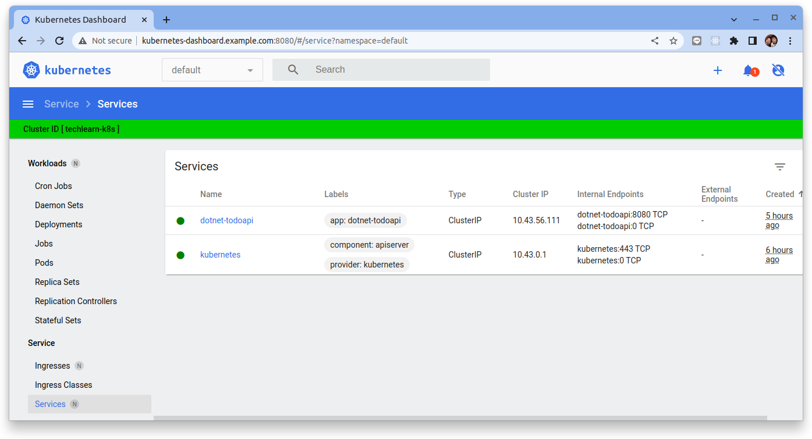

# 部署和訪問 Kubernetes 儀表板

參考:[Deploy and Access the Kubernetes Dashboard](https://kubernetes.io/docs/tasks/access-application-cluster/web-ui-dashboard/)


Dashboard 是一個基於 Web 的 Kubernetes 用戶界面。您可以使用 Dashboard 將容器化應用程序部署到 Kubernetes 集群、對容器化應用程序進行故障排除以及管理集群資源。您可以使用 Dashboard 來概覽集群上運行的應用程序，以及創建或修改單個 Kubernetes 資源（例如 Deployments、Jobs、DaemonSets 等）。例如，您可以擴展 Deployment、啟動滾動更新、重啟 Pod 或使用部署嚮導部署新應用程序。

儀表板還提供有關集群中 Kubernetes 資源狀態以及可能發生的任何錯誤的信息。

雖然 Kubernetes Dashboard 提供了使用者通過 UI 來創建、修改或刪除相關 Kubernetes 資源，然而在本教程中我們特別將 Kubernetes Dashboard 配置成 **ReadOnly** 的模式來搭配 **GitOps** 的管理運作。

## GitOps 在 Day2 營運的挑戰

GitOps 的優點:

- 輕量級和供應商中立
- 使用熟悉的工具和流程
- 拉近開發人員和運維人員的距離
- 清晰的變更歷史
- 不可變和可重現的部署


有關 GitOps 的概念與作法, 請參考: 

- HungWei Chiu (邱宏瑋): [淺談 GitOps 的概念](https://www.hwchiu.com/gitops.html)


然而在實務上在推動 GitOps 的過程會需要面臨許多挑戰。就個人的經驗來說如何提供營運團隊友善的足夠且完薔的工具({==唯讀, 不能增刪修==})來協助 Day2 operations 的工作即是其中之一。


!!! tip
    建議以 {==唯讀模式==} 使用儀表板。儘管儀表板允許修改集群資源狀態，但最好使用具有修訂歷史記錄的託管 CI/CD 管道來執行此操作(GitOps)，以便能夠在需要時比較或恢復更改。


## 步驟 01 - 環境安裝

### Kubernetes

本教程使用 K3D 來構建實驗 K8S 集群, 詳細說明請參考: 

- [使用 K3D 設置 Kubernetes 集群](../../../kubernetes/01-getting-started/learning-env/k3d/k3s-kubernetes-cluster-setup-with-k3d.md)


執行下列命令來創建實驗 Kubernetes 集群:

```bash title="執行下列命令  >_"
k3d cluster create --api-port 6443 \
--port 8080:80@loadbalancer --port 8443:443@loadbalancer
```

確認 Kubernetes 及 Kubectl 是否成功安裝：

```bash title="執行下列命令  >_"
kubectl cluster-info
```
(輸出結果)

```bash title="執行下列命令  >_"
Kubernetes control plane is running at https://0.0.0.0:6443
CoreDNS is running at https://0.0.0.0:6443/api/v1/namespaces/kube-system/services/kube-dns:dns/proxy
Metrics-server is running at https://0.0.0.0:6443/api/v1/namespaces/kube-system/services/https:metrics-server:/proxy
```

### kube-prometheus-stack

本教程使用 `kube-prometheus-stack` 來構建可觀測性的相關元件, 詳細說明請參考:

- [Prometheus 簡介](../../../prometheus/prometheus/overview.md)
- [Prometheus Operator 簡介](../../../prometheus/operator/install.md)

添加 Prometheus-Community helm 存儲庫並更新本地緩存：

```bash title="執行下列命令  >_"
$ helm repo add prometheus-community https://prometheus-community.github.io/helm-charts
$ helm repo update 
```

創建要配置的 vlaues 檔案:

```yaml title="kube-stack-prometheus-values.yaml"
grafana:
  # change timezone setting base on browser
  defaultDashboardsTimezone: browser
  grafana.ini:
    users:
      viewers_can_edit: true
    auth:
      disable_login_form: false
      disable_signout_menu: false
    auth.anonymous:
      enabled: true
      org_role: Viewer
  sidecar:
    datasources:
      logLevel: "DEBUG"
      enabled: true
      searchNamespace: "ALL"
    dashboards:
      logLevel: "DEBUG"
      # enable the cluster wide search for dashbaords and adds/updates/deletes them in grafana
      enabled: true
      searchNamespace: "ALL"
      label: grafana_dashboard
      labelValue: "1"

prometheus:
  prometheusSpec:
    # enable the cluster wide search for ServiceMonitor CRD
    serviceMonitorSelectorNilUsesHelmValues: false
    # enable the cluster wide search for PodMonitor CRD
    podMonitorSelectorNilUsesHelmValues: false
    # enable the cluster wide search for PrometheusRule CRD
    ruleSelectorNilUsesHelmValues: false
    probeSelectorNilUsesHelmValues: false
```

使用 Helm 在命名空間監控中部署 `kube-stack-prometheus` chart：

```bash title="執行下列命令  >_"
helm upgrade --install --wait --create-namespace --namespace monitoring  \
kube-stack-prometheus prometheus-community/kube-prometheus-stack \
--values kube-stack-prometheus-values.yaml
```

該 Helm chart 安裝了 Prometheus 組件和 Operator、Grafana 以及以下 exporters：

- [prometheus-node-exporter](https://github.com/prometheus/node_exporter) 暴露底層硬件和操作系統的相關指標
- [kube-state-metrics](https://github.com/kubernetes/kube-state-metrics) 監聽 Kubernetes API 服務器並生成有關對象狀態的指標

有關 `kube-stack-prometheus` 的詳細說明:

- [Prometheus Operator](../../../prometheus/operator/install.md)

#### 連接到 Prometheus

Prometheus Web UI 可通過以下命令通過端口轉發訪問：

```bash title="執行下列命令  >_"
kubectl port-forward --namespace monitoring svc/kube-stack-prometheus-kube-prometheus 9090:9090 --address="0.0.0.0"
```

在 http://localhost:9090 上打開瀏覽器選項卡會顯示 Prometheus Web UI。我們可以檢索從不同指標 Exporters 所收集回來的指標：


#### 連接到 AlertManager

AlertManager Web UI 可通過以下命令通過端口轉發訪問：

```bash title="執行下列命令  >_"
kubectl port-forward svc/kube-stack-prometheus-kube-alertmanager 9093:9093 --address="0.0.0.0"
```


#### 連接到 Grafana

Grafana Web UI 可通過以下命令通過端口轉發訪問：

```bash title="執行下列命令  >_"
kubectl port-forward --namespace monitoring svc/kube-stack-prometheus-grafana 3000:80 --address="0.0.0.0"
```

打開瀏覽器並轉到 http://localhost:3000 並填寫前一個命令所取得的用戶名/密碼。預設的帳號是:

- `username`: admin
- `password`: prom-operator


### kubernetes-dashboard

添加 `kubernetes-dashboard` helm 存儲庫並更新本地緩存：

```bash title="執行下列命令  >_"
$ helm repo add kubernetes-dashboard https://kubernetes.github.io/dashboard/
$ helm repo update 
```

創建要配置的 vlaues 檔案:

```yaml title="kubernetes-dashboard-values.yaml" linenums="1"
extraArgs:
  - --enable-skip-login
  - --enable-insecure-login
  - --system-banner=Cluster ID [ techlearn-k8s ]

# Start in ReadOnly mode.
  # Specifies whether cluster-wide RBAC resources (ClusterRole, ClusterRolebinding) with read only permissions to all resources listed inside the cluster should be created
  # Only dashboard-related Secrets and ConfigMaps will still be available for writing.
  #
  # The basic idea of the clusterReadOnlyRole
  # is not to hide all the secrets and sensitive data but more
  # to avoid accidental changes in the cluster outside the standard CI/CD.
  #
rbac:
  clusterReadOnlyRole: true

  clusterReadOnlyRoleAdditionalRules:
        - apiGroups:
          - apiextensions.k8s.io
          resources:
          - customresourcedefinitions
          verbs:
          - get
          - list
          - watch
        - apiGroups:
          - monitoring.coreos.com
          resources:
          - prometheuses
          - podmonitors
          - servicemonitors
          - prometheusrules
          - alertmanagerconfigs
          - probes
          verbs:
          - get
          - list
          - watch

## Metrics Scraper
## Container to scrape, store, and retrieve a window of time from the Metrics Server.
metricsScraper:
  enabled: true

## Serve application over HTTP without TLS
protocolHttp: true

service:
  type: ClusterIP
  # Dashboard service port
  externalPort: 9090

serviceMonitor:
  # Whether or not to create a Prometheus Operator service monitor.
  enabled: true
  ## Here labels can be added to the serviceMonitor
  labels: {}
  ## Here annotations can be added to the serviceMonitor
  annotations: {}

ingress:
  ## If true, Kubernetes Dashboard Ingress will be created.
  enabled: true
  hosts:
    - kubernetes-dashboard.example.com

## Pinned CRDs that will be displayed in dashboard's menu
pinnedCRDs:
  - kind: customresourcedefinition
    name: prometheuses.monitoring.coreos.com
    displayName: Prometheus
    namespaced: true
  - kind: customresourcedefinition
    name: podmonitors.monitoring.coreos.com
    displayName: PodMonitors
    namespaced: true
  - kind: customresourcedefinition
    name: servicemonitors.monitoring.coreos.com
    displayName: ServiceMonitors
    namespaced: true
  - kind: customresourcedefinition
    name: prometheusrules.monitoring.coreos.com
    displayName: PrometheusRules
    namespaced: true
```

**{==重要配置說明==}:**

- `extraArgs`: 配置便用者不需要登入
- `rbac.clusterReadOnlyRole`: 設定 **ReadOnly** 模式與相關唯讀的權限
- `rbac.clusterReadOnlyRoleAdditionalRules`: 設定如何讀取 CRDs 與不會 CRD group 的唯讀權限
- `metricsScraper.enabled`: 啟動撈取 Metric Server 的指標來顯示 CPU Memory 的資源使用狀態
- `protocolHttp`: 配置使用 `http` 協議的存取
- `pinnedCRDs`: 將顯示在儀表板 menu 中的固定 CRD


使用 Helm 在命名空間 `kubernetes-dashboard` 中部署 `kubernetes-dashboard` chart。

```bash title="執行下列命令  >_"
helm upgrade --install --create-namespace --namespace kubernetes-dashboard  \
kubernetes-dashboard kubernetes-dashboard/kubernetes-dashboard \
--values kubernetes-dashboard-values.yaml
```

#### 連接到 Kubernetes Dashboard

Kubernetes Dashbaord 可通過以下命令通過端口轉發訪問：

```bash title="執行下列命令  >_"
kubectl port-forward --namespace kubernetes-dashboard \
svc/kubernetes-dashboard 8090:9090 --address="0.0.0.0"
```

打開瀏覽器並轉到 `http://localhost:8090` 就會看到 Kubernetes Dashboard 的 UI:


## 步驟 02 - 範例應用程序


接下來讓我們佈署一個能夠曝露指標的範例應用程序來體驗 Kubernetes Dashboard:

1. 佈署範例應用程序
2. 設定應用程序指標收集(CRD)

### 1. 佈署範例應用程序

參考下面兩個教程來了解範例 Dotnet 應用程序:

1. [使用 ASP.NET Core 創建 Web API](../../../coding/dotnet/backend/base/web-api-base.md)
2. [儀器化 ASP.NET Core 應用程序](../../../coding/dotnet/backend/metric/web-api-metric.md)

佈署應用:

=== "Deployment"

    創建 `Deployment` 物件:

    ```bash title="執行下列命令  >_"
    kubectl apply -f -<<EOF
    apiVersion: apps/v1
    kind: Deployment
    metadata:
      name: dotnet-todoapi
      labels:
        app: dotnet-todoapi
    spec:
      replicas: 1
      selector:
        matchLabels:
          app: dotnet-todoapi
      template:
        metadata:
          labels:
            app: dotnet-todoapi
        spec:
          containers:
          - name: dotnet-todoapi
            image: witlab/dotnet-todoapi:metric
            ports:
            - name: web
              containerPort: 8080
    EOF
    ```
=== "Service"

    創建 `Service` 物件:

    ```bash title="執行下列命令  >_"
    kubectl apply -f -<<EOF
    apiVersion: v1
    kind: Service
    metadata:
      name: dotnet-todoapi
      labels:
        app: dotnet-todoapi
    spec:
      selector:
        app: dotnet-todoapi
      ports:
        - name: web
          port: 8080
          targetPort: 8080
    EOF
    ```

=== "Ingress"

    創建 `Ingress` 物件:

    ```bash title="執行下列命令  >_"
    kubectl apply -f -<<EOF
    kind: Ingress
    apiVersion: networking.k8s.io/v1
    metadata:
      name: dotnet-todoapi
      labels:
        app: dotnet-todoapi
    spec:
      rules:
        - host: dotnet-todoapi.example.com
          http:
            paths:
              - path: /
                pathType: ImplementationSpecific
                backend:
                  service:
                    name: dotnet-todoapi
                    port:
                      number: 8080
    EOF
    ```

接著讓我們使用 Kubernetes Dashboard 來查看相關物件的狀態。

在最上方的命名空間的下拉選單來選擇 `default`, 然後在左側導覽選單 "Workload >> Deployments":


在左側導覽選單 "Workload >> Pods":


點擊其中一個 Pod 來查看細項:


在左側導覽選單點選 "Ｓervice >> Services":



點擊 `dotnet-todoapi`　服務來查看細項:


在左側導覽選單點選 "Ｓervice >> Ingresses":


點擊 `dotnet-todoapi`　Ingress 來查看細項:


### 2. 設定應用程序指標收集

在本教程中 Prometheus 是用來收集應用程式指標數據的元件，而 Prometheus 是使用拉 (pull) 的手法來取得各個應用的指標。在 `kube-prometheus-stack` 的安裝包裡頭也安裝了 `prometheus-operator` 的元件與相關的 CRD 來讓各應用程式的開發團隊可使用這些 CRD　來自服務式地配置讓 Prometheus 可認知到如何 scrape 到應用程序的指標 endpoint。

詳細的說明請參考: 

- [自定義監控報警](../../../prometheus/operator/custom.md)

接下來讓我們應用 `ServiceMonitor` (CRD) 來讓 Prometheus Operator 來幫我們設定應用程序指標數據的收集。

構建一個 ServiceMonitor 對象來配置 Prometheus 來刮取應用程序的指標數據:

```bash title="ServiceMonitor"
kubectl apply -f -<<EOF
apiVersion: monitoring.coreos.com/v1
kind: ServiceMonitor
metadata:
  name: dotnet-todoapi
  labels:
    app: dotnet-todoapi
spec:
  selector:
    matchLabels:
      app: dotnet-todoapi
  namespaceSelector:
    matchNames:
    - default
  endpoints:
  - port: web
    path: /metrics
EOF
```

在 Kubernetes Dashboard 左側導覽選單 "Custom Resource Defintions >> Service Monitors":


在 `Objects` 中點擊 `dotnet-todoapi` 來查看細項:


#### 驗證唯讀

點擊右上角的 `Edit resource` 的圖示:


試著在 UI 上編輯 ServiceMonitor 的內容後，點擊 `Update`:


Kubernetes dashboard 會跳出錯誤:


## 結論

在本教程中我們完成安裝與構建 Kubernetes Dashboard，定時也驗證了 Kubernetes Dashboard 的 **ReadOnly** 模式與 CRD 的查看。