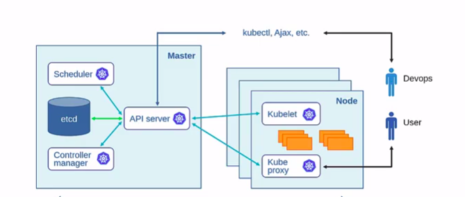

# 集群故障排查

原文: https://kubernetes.io/docs/tasks/debug/debug-cluster/



本篇文檔是介紹集群故障排查的；我們假設對於你碰到的問題，你已經排除了是由應用程序造成的。對於應用的調試，請參閱[應用故障排查](../debug-application/index.md)指南。

## 列舉集群節點

排查的第一步是查看所有的節點是否都已正確註冊。

運行以下命令：

```bash
kubectl get nodes
```

驗證你所希望看見的所有節點都能夠顯示出來，並且都處於 `Ready` 狀態。

為了了解你的集群的總體健康狀況詳情，你可以運行：

```bash
kubectl cluster-info dump
```

### 示例：調試關閉/無法訪問的節點

有時在排查時查看節點的狀態很有用 —— 例如，因為你注意到在節點上運行的 Pod 的奇怪行為， 或者找出為什麼 Pod 不會調度到節點上。與 Pod 一樣，你可以使用 `kubectl describe node` 和 `kubectl get node -o yaml` 來檢索有關節點的詳細信息。例如，如果節點關閉（與網絡斷開連接，或者 kubelet 進程掛起並且不會重新啟動等）， 你將看到以下內容。請注意顯示節點為 `NotReady` 的事件，並註意 Pod 不再運行（它們在 NotReady 狀態五分鐘後被驅逐）。

```bash
kubectl get nodes
```

結果如下:

```
NAME                     STATUS       ROLES     AGE     VERSION
kube-worker-1            NotReady     <none>    1h      v1.23.3
kubernetes-node-bols     Ready        <none>    1h      v1.23.3
kubernetes-node-st6x     Ready        <none>    1h      v1.23.3
kubernetes-node-unaj     Ready        <none>    1h      v1.23.3
```

排查節點的狀態:

```bash
kubectl describe node kube-worker-1
```

結果如下:

```
Name:               kube-worker-1
Roles:              <none>
Labels:             beta.kubernetes.io/arch=amd64
                    beta.kubernetes.io/os=linux
                    kubernetes.io/arch=amd64
                    kubernetes.io/hostname=kube-worker-1
                    kubernetes.io/os=linux
Annotations:        kubeadm.alpha.kubernetes.io/cri-socket: /run/containerd/containerd.sock
                    node.alpha.kubernetes.io/ttl: 0
                    volumes.kubernetes.io/controller-managed-attach-detach: true
CreationTimestamp:  Thu, 17 Feb 2022 16:46:30 -0500
Taints:             node.kubernetes.io/unreachable:NoExecute
                    node.kubernetes.io/unreachable:NoSchedule
Unschedulable:      false
Lease:
  HolderIdentity:  kube-worker-1
  AcquireTime:     <unset>
  RenewTime:       Thu, 17 Feb 2022 17:13:09 -0500
Conditions:
  Type                 Status    LastHeartbeatTime                 LastTransitionTime                Reason              Message
  ----                 ------    -----------------                 ------------------                ------              -------
  NetworkUnavailable   False     Thu, 17 Feb 2022 17:09:13 -0500   Thu, 17 Feb 2022 17:09:13 -0500   WeaveIsUp           Weave pod has set this
  MemoryPressure       Unknown   Thu, 17 Feb 2022 17:12:40 -0500   Thu, 17 Feb 2022 17:13:52 -0500   NodeStatusUnknown   Kubelet stopped posting node status.
  DiskPressure         Unknown   Thu, 17 Feb 2022 17:12:40 -0500   Thu, 17 Feb 2022 17:13:52 -0500   NodeStatusUnknown   Kubelet stopped posting node status.
  PIDPressure          Unknown   Thu, 17 Feb 2022 17:12:40 -0500   Thu, 17 Feb 2022 17:13:52 -0500   NodeStatusUnknown   Kubelet stopped posting node status.
  Ready                Unknown   Thu, 17 Feb 2022 17:12:40 -0500   Thu, 17 Feb 2022 17:13:52 -0500   NodeStatusUnknown   Kubelet stopped posting node status.
Addresses:
  InternalIP:  192.168.0.113
  Hostname:    kube-worker-1
Capacity:
  cpu:                2
  ephemeral-storage:  15372232Ki
  hugepages-2Mi:      0
  memory:             2025188Ki
  pods:               110
Allocatable:
  cpu:                2
  ephemeral-storage:  14167048988
  hugepages-2Mi:      0
  memory:             1922788Ki
  pods:               110
System Info:
  Machine ID:                 9384e2927f544209b5d7b67474bbf92b
  System UUID:                aa829ca9-73d7-064d-9019-df07404ad448
  Boot ID:                    5a295a03-aaca-4340-af20-1327fa5dab5c
  Kernel Version:             5.13.0-28-generic
  OS Image:                   Ubuntu 21.10
  Operating System:           linux
  Architecture:               amd64
  Container Runtime Version:  containerd://1.5.9
  Kubelet Version:            v1.23.3
  Kube-Proxy Version:         v1.23.3
Non-terminated Pods:          (4 in total)
  Namespace                   Name                                 CPU Requests  CPU Limits  Memory Requests  Memory Limits  Age
  ---------                   ----                                 ------------  ----------  ---------------  -------------  ---
  default                     nginx-deployment-67d4bdd6f5-cx2nz    500m (25%)    500m (25%)  128Mi (6%)       128Mi (6%)     23m
  default                     nginx-deployment-67d4bdd6f5-w6kd7    500m (25%)    500m (25%)  128Mi (6%)       128Mi (6%)     23m
  kube-system                 kube-proxy-dnxbz                     0 (0%)        0 (0%)      0 (0%)           0 (0%)         28m
  kube-system                 weave-net-gjxxp                      100m (5%)     0 (0%)      200Mi (10%)      0 (0%)         28m
Allocated resources:
  (Total limits may be over 100 percent, i.e., overcommitted.)
  Resource           Requests     Limits
  --------           --------     ------
  cpu                1100m (55%)  1 (50%)
  memory             456Mi (24%)  256Mi (13%)
  ephemeral-storage  0 (0%)       0 (0%)
  hugepages-2Mi      0 (0%)       0 (0%)
Events:
...
```

將節點資訊轉換成 yaml 格式輸出:

```bash
kubectl get node kube-worker-1 -o yaml
```

結果如下:

```yaml
apiVersion: v1
kind: Node
metadata:
  annotations:
    kubeadm.alpha.kubernetes.io/cri-socket: /run/containerd/containerd.sock
    node.alpha.kubernetes.io/ttl: "0"
    volumes.kubernetes.io/controller-managed-attach-detach: "true"
  creationTimestamp: "2022-02-17T21:46:30Z"
  labels:
    beta.kubernetes.io/arch: amd64
    beta.kubernetes.io/os: linux
    kubernetes.io/arch: amd64
    kubernetes.io/hostname: kube-worker-1
    kubernetes.io/os: linux
  name: kube-worker-1
  resourceVersion: "4026"
  uid: 98efe7cb-2978-4a0b-842a-1a7bf12c05f8
spec: {}
status:
  addresses:
  - address: 192.168.0.113
    type: InternalIP
  - address: kube-worker-1
    type: Hostname
  allocatable:
    cpu: "2"
    ephemeral-storage: "14167048988"
    hugepages-2Mi: "0"
    memory: 1922788Ki
    pods: "110"
  capacity:
    cpu: "2"
    ephemeral-storage: 15372232Ki
    hugepages-2Mi: "0"
    memory: 2025188Ki
    pods: "110"
  conditions:
  - lastHeartbeatTime: "2022-02-17T22:20:32Z"
    lastTransitionTime: "2022-02-17T22:20:32Z"
    message: Weave pod has set this
    reason: WeaveIsUp
    status: "False"
    type: NetworkUnavailable
  - lastHeartbeatTime: "2022-02-17T22:20:15Z"
    lastTransitionTime: "2022-02-17T22:13:25Z"
    message: kubelet has sufficient memory available
    reason: KubeletHasSufficientMemory
    status: "False"
    type: MemoryPressure
  - lastHeartbeatTime: "2022-02-17T22:20:15Z"
    lastTransitionTime: "2022-02-17T22:13:25Z"
    message: kubelet has no disk pressure
    reason: KubeletHasNoDiskPressure
    status: "False"
    type: DiskPressure
  - lastHeartbeatTime: "2022-02-17T22:20:15Z"
    lastTransitionTime: "2022-02-17T22:13:25Z"
    message: kubelet has sufficient PID available
    reason: KubeletHasSufficientPID
    status: "False"
    type: PIDPressure
  - lastHeartbeatTime: "2022-02-17T22:20:15Z"
    lastTransitionTime: "2022-02-17T22:15:15Z"
    message: kubelet is posting ready status. AppArmor enabled
    reason: KubeletReady
    status: "True"
    type: Ready
  daemonEndpoints:
    kubeletEndpoint:
      Port: 10250
  nodeInfo:
    architecture: amd64
    bootID: 22333234-7a6b-44d4-9ce1-67e31dc7e369
    containerRuntimeVersion: containerd://1.5.9
    kernelVersion: 5.13.0-28-generic
    kubeProxyVersion: v1.23.3
    kubeletVersion: v1.23.3
    machineID: 9384e2927f544209b5d7b67474bbf92b
    operatingSystem: linux
    osImage: Ubuntu 21.10
    systemUUID: aa829ca9-73d7-064d-9019-df07404ad448
```

## 查看日誌

深入挖掘集群需要登入到相關機器。以下是相關日誌文件的位置。在基於 systemd 的系統上，你可能需要使用 `journalctl` 而不是檢查日誌文件。

### 控制平面節點

- `/var/log/kube-apiserver.log` — API 服務器，負責提供 API 服務
- `/var/log/kube-scheduler.log` — 調度器，負責制定調度決策
- `/var/log/kube-controller-manager.log` — 運行大多數 Kubernetes 內置控制器的組件，除了調度（kube-scheduler 處理調度）。

### 工作節點

- `/var/log/kubelet.log` — 來自 kubelet 的日誌，負責在節點運行容器
- `/var/log/kube-proxy.log` — 來自 kube-proxy 的日誌，負責將流量轉發到服務端點

## 集群故障模式

這是可能出錯的事情的不完整列表，以及如何調整集群設置以緩解問題。

### 故障原因

- 虛擬機被關閉
- 集群內或集群與用戶之間的網絡分區
- Kubernetes 軟件崩潰
- 持久存儲（例如 GCE PD 或 AWS EBS 卷）的數據丟失或不可用
- 操作員錯誤，例如配置錯誤的 Kubernetes 軟件或應用程序軟件

### 具體情況

- API 服務器所在的 VM 關機或者 API 服務器崩潰
    - 現象
        - 不能停止、更新或者啟動新的 Pod、服務或副本控制器
        - 現有的 Pod 和服務在不依賴 Kubernetes API 的情況下應該能繼續正常工作

- API 服務器的後端存儲丟失 (ETCD)
    - 現象
        - kube-apiserver 組件未能成功啟動並變健康
        - kubelet 將不能訪問 API 服務器，但是能夠繼續運行之前的 Pod 和提供相同的服務代理
        - 在 API 服務器重啟之前，需要手動恢復或者重建 API 服務器的狀態

- Kubernetes 服務組件（節點控制器、副本控制器管理器、調度器等）所在的 VM 關機或者崩潰
    - 當前，這些控制器是和 API 服務器在一起運行的，它們不可用的現象是與 API 服務器類似的
    - 將來，這些控制器也會復制為多份，並且可能不在運行於同一節點上
    - 它們沒有自己的持久狀態

- 單個節點（VM 或者物理機）關機
    - 現象
        - 此節點上的所有 Pod 都停止運行

- 網絡分裂
    - 現象
        - 分區 A 認為分區 B 中所有的節點都已宕機；分區 B 認為 API 服務器宕機 （假定主控節點所在的 VM 位於分區 A 內）。

- kubelet 軟件故障
    - 現象
        - 崩潰的 kubelet 就不能在其所在的節點上啟動新的 Pod
        - kubelet 可能刪掉 Pod 或者不刪
        - 節點被標識為非健康態
        - 副本控制器會在其它的節點上啟動新的 Pod

- 集群操作錯誤
    - 現象
        - 丟失 Pod 或服務等等
        - 丟失 API 服務器的後端存儲
        - 用戶無法讀取 API
        - 等等

### 緩解措施

- 措施：對於 IaaS 上的 VM，使用 IaaS 的自動 VM 重啟功能
    - 緩解：API 服務器 VM 關機或 API 服務器崩潰
    - 緩解：Kubernetes 服務組件所在的 VM 關機或崩潰

- 措施: 對於運行 API 服務器和 etcd 的 VM，使用 IaaS 提供的可靠的存儲
    - 緩解：API 服務器後端存儲的丟失

- 措施：使用[高可用性](https://kubernetes.io/zh-cn/docs/setup/production-environment/tools/kubeadm/high-availability/)的配置
    - 緩解：主控節點 VM 關機或者主控節點組件（調度器、API 服務器、控制器管理器）崩潰
        - 將容許一個或多個節點或組件同時出現故障  
    - 緩解：API 服務器後端存儲（例如 etcd 的數據目錄）丟失  
        - 假定你使用了高可用的 etcd 配置

- 措施：定期對 API 服務器的 PD 或 EBS 卷執行快照操作
    - 緩解：API 服務器後端存儲丟失
    - 緩解：一些操作錯誤的場景
    - 緩解：一些 Kubernetes 軟件本身故障的場景

- 措施：在 Pod 的前面使用副本控制器或服務
    - 緩解：節點關機
    - 緩解：kubelet 軟件故障
  
- 措施：應用（容器）設計成容許異常重啟
    - 緩解：節點關機
    - 緩解：kubelet 軟件故障

