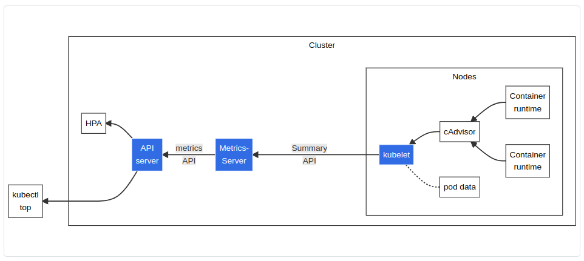

# 資源指標管道

原文: [资源指标管道](https://kubernetes.io/zh-cn/docs/tasks/debug/debug-cluster/resource-metrics-pipeline/)

對於 Kubernetes，Metrics API 提供了一組基本的指標，以支持自動伸縮和類似的用例。該 API 提供有關節點和 Pod 的資源使用情況的信息， 包括 CPU 和內存的指標。如果將 Metrics API 部署到集群中， 那麼 Kubernetes API 的客戶端就可以查詢這些信息，並且可以使用 Kubernetes 的訪問控制機制來管理權限。

[HorizontalPodAutoscaler](https://kubernetes.io/zh-cn/docs/tasks/run-application/horizontal-pod-autoscale/) (HPA) 和 [VerticalPodAutoscaler](https://github.com/kubernetes/autoscaler/tree/master/vertical-pod-autoscaler#readme) (VPA) 使用 metrics API 中的數據調整工作負載副本和資源，以滿足客戶需求。

你也可以通過 `kubectl top` 命令來查看資源指標。

圖 1 說明了資源指標管道的架構。

圖中從右到左的架構組件包括以下內容：

- [cAdvisor](https://github.com/google/cadvisor): 用於收集、聚合和公開 Kubelet 中包含的容器指標的守護程序。

- [kubelet](https://kubernetes.io/zh-cn/docs/concepts/overview/components/#kubelet): 用於管理容器資源的節點代理。可以使用 /metrics/resource 和 /stats kubelet API 端點訪問資源指標。

- [Summary API](https://kubernetes.io/zh-cn/docs/tasks/debug/debug-cluster/resource-metrics-pipeline/#summary-api-source): kubelet 提供的 API，用於發現和檢索可通過 /stats 端點獲得的每個節點的匯總統計信息。

- [metrics-server](https://kubernetes.io/zh-cn/docs/tasks/debug/debug-cluster/resource-metrics-pipeline/#metrics-server): 集群插件組件，用於收集和聚合從每個 kubelet 中提取的資源指標。 API 服務器提供 Metrics API 以供 HPA、VPA 和 kubectl top 命令使用。 Metrics Server 是 Metrics API 的參考實現。

- [Metrics API](https://kubernetes.io/zh-cn/docs/tasks/debug/debug-cluster/resource-metrics-pipeline/#metrics-api): Kubernetes API 支持訪問用於工作負載自動縮放的 CPU 和內存。要在你的集群中進行這項工作，你需要一個提供 Metrics API 的 API 擴展服務器。