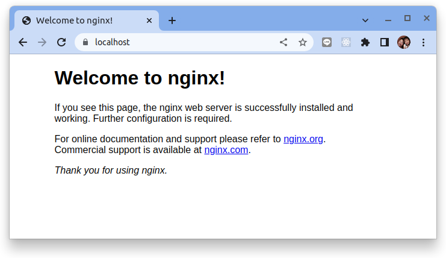
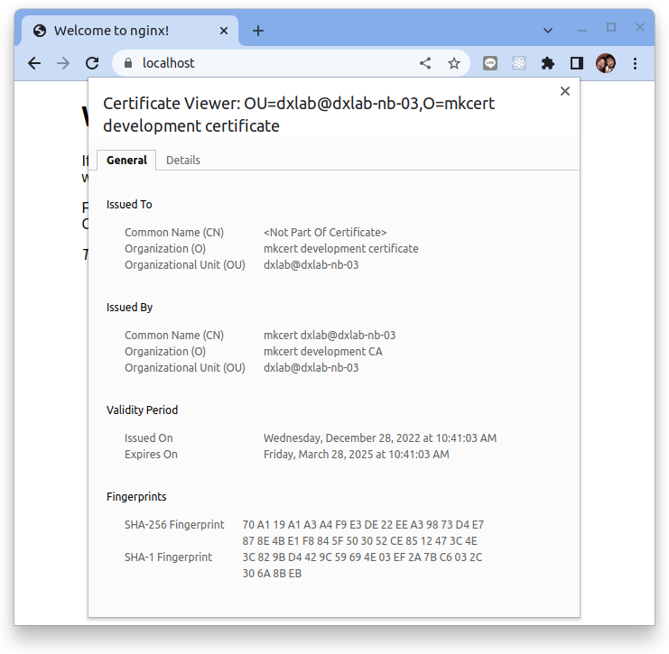

# 使用 mkcert 製作本機憑證


原文: [使用 mkcert 製作本機憑證](https://mileschou.me/blog/mkcert/)

[mkcert](https://github.com/FiloSottile/mkcert) 是一個建立本機 TLS 憑證的懶人包工具。本機測試大多用 HTTP 就夠了，但有些情境還是需要使用 HTTPS（如串接第三方的 OAuth2 服務），這時，就會需要這個工具來協助建立本機憑證。

## 安裝

mkcert 支援 Windows、Linux 與 MacOS。

在 Linux 上，首先安裝 `certutil`:

```bash title="執行下列命令  >_"
sudo apt install libnss3-tools
```

使用預構建的二進製文件。

```bash title="執行下列命令  >_"
wget https://github.com/FiloSottile/mkcert/releases/download/v1.4.4/mkcert-v1.4.4-linux-amd64
chmod +x mkcert-v*-linux-amd64
sudo cp mkcert-v*-linux-amd64 /usr/local/bin/mkcert
```

## 支持的憑證根存儲

mkcert 支持以下憑證根存儲：

- macOS system store
- Windows system store
- Linux variants that provide either
    - `update-ca-trust` (Fedora, RHEL, CentOS) or
    - `update-ca-certificates` (Ubuntu, Debian, OpenSUSE, SLES) or
    - `trust` (Arch)
- Firefox (macOS and Linux only)
- Chrome and Chromium
- Java (when `JAVA_HOME` is set)

要僅將本地根 CA 安裝到其中的一個子集中，您可以將 `TRUST_STORES` 環境變量設置為以逗號分隔的列表。選項有：“system”、“java” 和 “nss”（包括 Firefox）。

## 使用方式

```bash title="執行下列命令  >_"
$ mkcert --help
```

你會看到 `mkcert` 的基本語法:

```
Usage of mkcert:

	$ mkcert -install
	Install the local CA in the system trust store.

	$ mkcert example.org
	Generate "example.org.pem" and "example.org-key.pem".

	$ mkcert example.com myapp.dev localhost 127.0.0.1 ::1
	Generate "example.com+4.pem" and "example.com+4-key.pem".

	$ mkcert "*.example.it"
	Generate "_wildcard.example.it.pem" and "_wildcard.example.it-key.pem".

	$ mkcert -uninstall
	Uninstall the local CA (but do not delete it).

Advanced options:

	-cert-file FILE, -key-file FILE, -p12-file FILE
	    Customize the output paths.

	-client
	    Generate a certificate for client authentication.

	-ecdsa
	    Generate a certificate with an ECDSA key.

	-pkcs12
	    Generate a ".p12" PKCS #12 file, also know as a ".pfx" file,
	    containing certificate and key for legacy applications.

	-csr CSR
	    Generate a certificate based on the supplied CSR. Conflicts with
	    all other flags and arguments except -install and -cert-file.

	-CAROOT
	    Print the CA certificate and key storage location.

	$CAROOT (environment variable)
	    Set the CA certificate and key storage location. (This allows
	    maintaining multiple local CAs in parallel.)

	$TRUST_STORES (environment variable)
	    A comma-separated list of trust stores to install the local
	    root CA into. Options are: "system", "java" and "nss" (includes
	    Firefox). Autodetected by default.
```


### 初始化

```bash title="執行下列命令  >_"
mkcert -install
```

結果:

```
Created a new local CA 💥
The local CA is now installed in the system trust store! ⚡️
The local CA is now installed in the Firefox and/or Chrome/Chromium trust store (requires browser restart)! 🦊
```

查找本機 RootCA 的位置:

```bash title="執行下列命令  >_"
mkcert -CAROOT
```

結果(每一台機器上的位置可能會因OS而有所不同):

```
/home/dxlab/.local/share/mkcert
```

本機產的證書就會放在上述的目錄裡：

```bash title="執行下列命令  >_"
ls $(mkcert -CAROOT)
```

結果:

```
rootCA-key.pem  rootCA.pem
```

### 新增憑證

接著要新增憑證，直接拿 localhost 來試看看：

```bash title="執行下列命令  >_"
mkcert localhost
```

結果:

```
Created a new certificate valid for the following names 📜
 - "localhost"

The certificate is at "./localhost.pem" and the key at "./localhost-key.pem" ✅

It will expire on 28 March 2025 🗓
```

它會產生 `localhost.pem` 與 `localhost-key.pem`，這應該就是 Web server 所需要的證書，接著來使用 Docker Nginx 試著給它看看。

首先先準備 nginx 的設定檔 `nginx.conf`：

```nginx title="nginx.conf"
server {
    server_name localhost;
    listen 80;
    listen 443 ssl;
    ssl_certificate /etc/mkcert/localhost.pem;
    ssl_certificate_key /etc/mkcert/localhost-key.pem;
    location / {
        root   /usr/share/nginx/html;
        index  index.html index.htm;
    }
}
```

接著再啟動 Nginx 的 container：

```bash title="執行下列命令  >_"
docker run -v `pwd`/localhost-key.pem:/etc/mkcert/localhost-key.pem \
           -v `pwd`/localhost.pem:/etc/mkcert/localhost.pem \
           -v `pwd`/nginx.conf:/etc/nginx/conf.d/default.conf \
           --rm -it -p 443:443 nginx:alpine
```


因為是直接綁 localhost，所以不需要再新增 `/etc/hosts` 的內容，直接 `curl` 即可：

```bash title="執行下列命令  >_"
$ curl https://localhost

<!DOCTYPE html>
<html>
<head>
<title>Welcome to nginx!</title>
<style>
html { color-scheme: light dark; }
body { width: 35em; margin: 0 auto;
font-family: Tahoma, Verdana, Arial, sans-serif; }
</style>
</head>
<body>
<h1>Welcome to nginx!</h1>
<p>If you see this page, the nginx web server is successfully installed and
working. Further configuration is required.</p>

<p>For online documentation and support please refer to
<a href="http://nginx.org/">nginx.org</a>.<br/>
Commercial support is available at
<a href="http://nginx.com/">nginx.com</a>.</p>

<p><em>Thank you for using nginx.</em></p>
</body>
</html>
```

或是使用瀏覽器 `https://localhost`:



點擊網址旁的 "鎖頭" 圖示 >> "Connection is secure" > "Certificate is valid":




### 其他用法

參考 `mkcert --help`，新增憑證的時候，可以新增多個網域：

```bash title="執行下列命令  >_"
mkcert example.com myapp.dev localhost 127.0.0.1 ::1
```

結果:

```
Created a new certificate valid for the following names 📜
 - "example.com"
 - "myapp.dev"
 - "localhost"
 - "127.0.0.1"
 - "::1"

The certificate is at "./example.com+4.pem" and the key at "./example.com+4-key.pem" ✅

It will expire on 28 March 2025 🗓
```

讓我們使用 openssl 來了解這個憑證的內容:

```bash title="執行下列命令  >_"
openssl x509 -in example.com+4.pem -noout -text
```

結果:

```hl_lines="42-43"
Certificate:
    Data:
        Version: 3 (0x2)
        Serial Number:
            40:0e:c2:f0:18:da:37:4a:ff:fe:4a:03:28:55:31:93
        Signature Algorithm: sha256WithRSAEncryption
        Issuer: O = mkcert development CA, OU = dxlab@dxlab-nb-03, CN = mkcert dxlab@dxlab-nb-03
        Validity
            Not Before: Dec 28 04:30:37 2022 GMT
            Not After : Mar 28 04:30:37 2025 GMT
        Subject: O = mkcert development certificate, OU = dxlab@dxlab-nb-03
        Subject Public Key Info:
            Public Key Algorithm: rsaEncryption
                Public-Key: (2048 bit)
                Modulus:
                    00:c7:c2:0e:e0:78:85:34:53:ee:f9:1e:8a:2b:00:
                    93:76:d9:d6:81:a9:87:e7:2b:88:0a:c2:3a:5e:ed:
                    5c:44:2b:22:1f:e3:85:f4:bf:c1:50:42:be:00:25:
                    5c:9e:f5:14:86:ba:7d:56:60:2d:3b:49:bb:7e:fc:
                    3f:fc:43:a4:97:91:75:8d:59:d7:aa:e3:1e:99:54:
                    2f:89:24:31:01:59:26:2d:7b:25:17:4a:c3:59:56:
                    3b:0f:2d:8d:ee:52:3e:09:43:e5:81:8f:45:ff:65:
                    c7:f8:91:70:4f:a5:90:0d:17:15:1a:bd:9b:e6:0e:
                    d1:55:f6:7f:dc:43:49:88:a5:94:98:45:ed:c2:65:
                    e3:69:b0:1d:fa:b3:f9:d3:4e:34:95:85:1b:ec:af:
                    41:0f:4f:00:04:b0:1a:f4:5b:92:34:50:ac:54:fb:
                    a3:0c:0d:74:c6:02:41:fa:f3:c9:6c:03:a5:f6:b6:
                    f6:fe:ca:2e:93:61:01:7b:7f:57:cf:d7:26:1f:a2:
                    87:eb:7e:dd:71:eb:bf:8d:c0:bb:1b:43:81:7f:67:
                    72:fd:ed:a4:e9:10:f3:a3:8b:0a:75:95:8e:e6:78:
                    34:48:62:fb:64:ce:09:fa:b0:7e:9b:2d:d8:38:04:
                    ac:9e:62:1e:84:35:de:94:5c:47:ae:11:b6:44:41:
                    08:37
                Exponent: 65537 (0x10001)
        X509v3 extensions:
            X509v3 Key Usage: critical
                Digital Signature, Key Encipherment
            X509v3 Extended Key Usage: 
                TLS Web Server Authentication
            X509v3 Authority Key Identifier: 
                D9:3C:E4:05:4A:69:15:73:C5:85:40:9B:96:A7:3B:56:92:A9:50:E9
            X509v3 Subject Alternative Name: 
                DNS:example.com, DNS:myapp.dev, DNS:localhost, IP Address:127.0.0.1, IP Address:0:0:0:0:0:0:0:1
    Signature Algorithm: sha256WithRSAEncryption
    Signature Value:
        76:f0:ac:dc:b6:42:6d:2a:cf:5f:1a:5a:68:7b:21:fe:35:78:
        61:25:fd:ae:d6:cc:fb:46:6a:2b:24:c5:ca:cf:50:36:c0:7a:
        a1:96:a5:b7:cc:7d:60:0c:bd:cc:e4:bd:a9:3d:3b:30:eb:e1:
        44:55:eb:f3:02:8c:8e:12:f4:91:31:14:d5:77:9b:c9:32:e4:
        48:29:bd:e5:8d:ab:16:fd:d6:4f:94:3a:99:7c:c1:87:51:fb:
        6c:9c:1e:c0:7e:5c:8e:da:88:44:94:0b:41:91:43:c9:16:7e:
        5b:4a:33:28:bb:74:64:1d:f3:0a:e3:cb:1f:3a:b6:b2:22:f7:
        86:2e:e2:b7:38:67:86:84:18:bf:e4:c5:d8:90:08:7c:fb:a3:
        99:0f:63:0e:fe:0a:60:79:e8:ef:90:a4:d6:f0:ed:4a:ef:d3:
        30:a6:4a:ed:b2:b3:58:99:7c:27:4d:b4:d1:24:55:94:45:f9:
        4d:10:37:b4:2a:44:43:06:9b:fa:20:18:f7:c5:f7:9e:96:d8:
        45:7b:ab:24:35:4d:f9:a3:3a:10:cb:07:6d:69:0d:ac:3d:98:
        06:82:00:98:c5:ae:6b:46:db:7d:d4:bc:93:0c:51:32:17:8c:
        23:4b:87:81:cb:65:54:b7:67:e8:e1:6d:6a:55:cb:26:a5:30:
        40:ce:96:0e:a8:82:28:04:d5:e3:d5:15:e7:58:19:44:dd:b1:
        c9:7b:36:f8:43:c5:46:2a:0b:e3:1d:81:1e:28:8c:e7:2c:f9:
        06:c9:06:69:fc:bd:ad:2c:4a:66:d4:d4:c7:ee:27:5f:66:0e:
        9d:81:f0:a5:0f:5a:9d:56:19:6c:53:e6:89:5b:f2:f5:18:e6:
        f0:55:1b:e5:27:e9:e9:29:46:a3:05:ba:bb:4e:06:65:53:ad:
        9b:9e:71:d0:b7:b7:f6:e6:56:d4:e4:22:44:d1:a4:f6:09:ed:
        24:f6:a5:ac:9b:83:0c:ff:74:72:62:b5:42:16:28:b5:3f:64:
        de:ff:6a:11:82:ea
```

也可以新增 wildcard 網域：

```bash title="執行下列命令  >_"
mkcert "*.example.it"
```

結果:

```
Created a new certificate valid for the following names 📜
 - "*.example.it"

Reminder: X.509 wildcards only go one level deep, so this won't match a.b.example.it ℹ️

The certificate is at "./_wildcard.example.it.pem" and the key at "./_wildcard.example.it-key.pem" ✅

It will expire on 28 March 2025 🗓
```

讓我們使用 openssl 來了解這個憑證的內容:

```bash title="執行下列命令  >_"
openssl x509 -in _wildcard.example.it.pem -noout -text
```

結果:

```hl_lines="42-43"
Certificate:
    Data:
        Version: 3 (0x2)
        Serial Number:
            df:c6:44:d3:3b:2a:89:cf:60:52:e4:74:6b:f5:d4:63
        Signature Algorithm: sha256WithRSAEncryption
        Issuer: O = mkcert development CA, OU = dxlab@dxlab-nb-03, CN = mkcert dxlab@dxlab-nb-03
        Validity
            Not Before: Dec 28 04:34:56 2022 GMT
            Not After : Mar 28 04:34:56 2025 GMT
        Subject: O = mkcert development certificate, OU = dxlab@dxlab-nb-03
        Subject Public Key Info:
            Public Key Algorithm: rsaEncryption
                Public-Key: (2048 bit)
                Modulus:
                    00:d9:65:f9:37:33:b1:de:af:1a:7d:80:6b:19:b0:
                    67:db:cb:43:ba:fb:ed:7c:df:d3:6e:f4:05:98:e5:
                    24:72:21:3e:74:1c:3c:7f:16:a0:e4:55:d3:96:c0:
                    9b:48:47:1e:5b:26:a4:66:e9:d7:36:b9:75:76:ab:
                    14:44:5c:9e:78:43:af:91:b6:44:d1:d2:dd:d5:be:
                    bd:41:d3:fa:3b:a5:59:6d:41:09:78:c8:40:27:3b:
                    74:4d:0d:bb:db:50:d3:f7:40:33:16:3f:bc:3a:ca:
                    ad:ff:65:56:c2:31:45:a1:ab:76:35:76:c6:62:83:
                    de:1d:a1:46:f9:d6:2d:8d:1a:fd:2e:2f:6b:f9:b5:
                    3c:4e:2f:9c:ad:73:92:bd:02:90:85:c8:15:1d:cf:
                    82:ed:c5:76:3b:3b:c0:60:3b:4f:38:95:e6:29:bf:
                    01:44:4d:2e:99:5a:1d:67:9f:df:3c:88:90:b6:dd:
                    0f:ab:29:18:ef:06:2c:1f:13:5f:29:9a:79:c3:02:
                    cc:f1:56:6c:d4:af:22:21:fb:2b:5a:65:8e:10:df:
                    61:e0:4a:fa:dc:5e:d0:d8:bc:00:13:0e:ab:35:61:
                    a2:b7:9f:b5:d5:5e:d4:4f:24:02:12:c4:b1:22:36:
                    84:f8:6c:35:77:42:e9:11:38:ce:ee:32:a4:a2:49:
                    e8:b5
                Exponent: 65537 (0x10001)
        X509v3 extensions:
            X509v3 Key Usage: critical
                Digital Signature, Key Encipherment
            X509v3 Extended Key Usage: 
                TLS Web Server Authentication
            X509v3 Authority Key Identifier: 
                D9:3C:E4:05:4A:69:15:73:C5:85:40:9B:96:A7:3B:56:92:A9:50:E9
            X509v3 Subject Alternative Name: 
                DNS:*.example.it
    Signature Algorithm: sha256WithRSAEncryption
    Signature Value:
        79:9a:86:af:98:dc:ca:cc:a2:de:5a:b4:f3:9f:b1:67:d2:e3:
        aa:00:69:56:e4:e6:6d:95:21:e3:ed:57:b8:4d:7a:9d:c4:8a:
        b4:a1:50:30:f8:5f:d3:1f:88:b2:02:d1:ea:1c:73:43:00:4d:
        d4:8c:5f:7b:e7:6d:61:08:a9:98:6f:f3:fb:15:28:b4:e7:af:
        a7:09:bd:77:dd:4f:51:cb:4c:cc:24:ea:bd:c8:75:23:1d:6f:
        07:61:57:32:be:06:ab:73:f9:e6:f0:58:35:e8:b9:0e:59:42:
        02:e6:96:24:34:53:1e:d2:6c:09:1d:f0:97:4a:21:9b:c4:a6:
        fb:10:a8:de:91:9e:d6:eb:af:ae:a3:d7:c2:d9:b0:d5:05:fd:
        c0:c5:3b:d4:7a:fe:33:0f:da:20:c7:15:2c:7b:9c:13:c1:c7:
        bd:67:c1:3f:88:bd:45:a7:09:c8:f3:3e:e2:1b:12:e9:5b:ea:
        12:ed:8c:76:b4:20:51:93:06:aa:0e:73:5a:2a:09:33:6d:02:
        0f:34:fb:a2:2f:71:dd:78:a3:4d:81:ed:8a:7c:35:c9:2c:a1:
        87:84:25:8e:fa:fa:52:19:29:31:36:6b:bf:43:4e:e7:20:7c:
        2e:96:4e:0b:07:da:2b:04:55:39:bd:ff:fa:49:90:80:80:5d:
        f0:7c:ff:78:d7:79:e2:f4:ab:79:b2:46:60:af:3e:16:5c:2e:
        b3:6d:4e:c7:32:ee:44:98:37:e5:69:67:5d:95:ef:98:3c:9d:
        ea:50:bb:71:c3:ab:88:e2:b3:2e:ab:36:8f:10:70:f6:39:6f:
        82:0b:af:c1:a6:28:e7:b1:9b:e0:60:64:3f:1b:5c:70:08:33:
        28:eb:6d:0a:56:2e:24:55:8f:78:e1:59:d7:56:e1:38:1f:d2:
        a0:7e:04:a6:71:35:19:cf:87:76:46:90:7f:54:f2:2c:e1:0e:
        0a:23:df:96:aa:84:15:d0:91:82:37:6b:1b:bb:58:e1:4c:3f:
        a6:11:72:31:88:30
```

