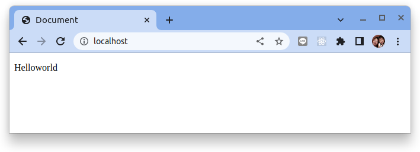
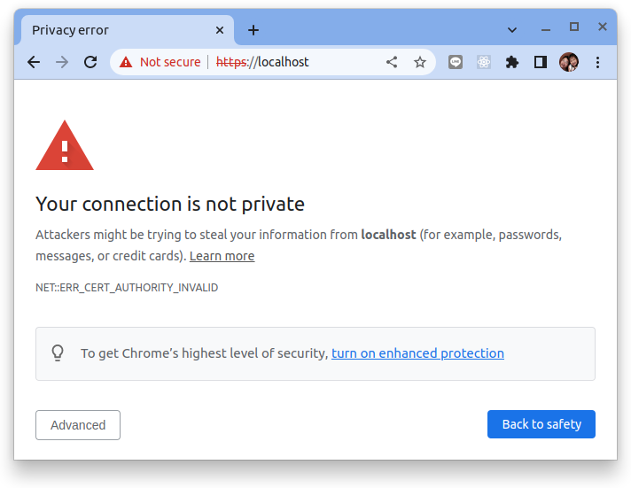
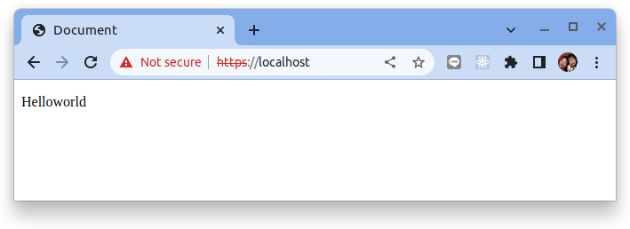
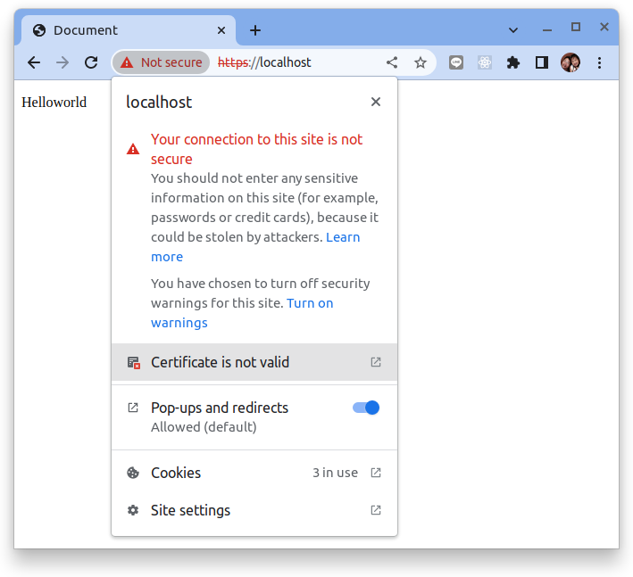
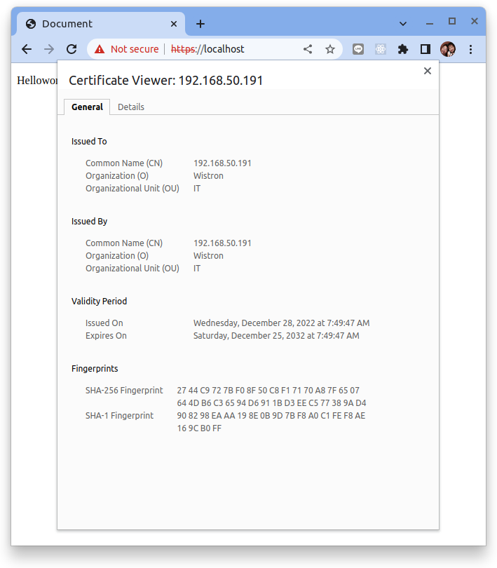
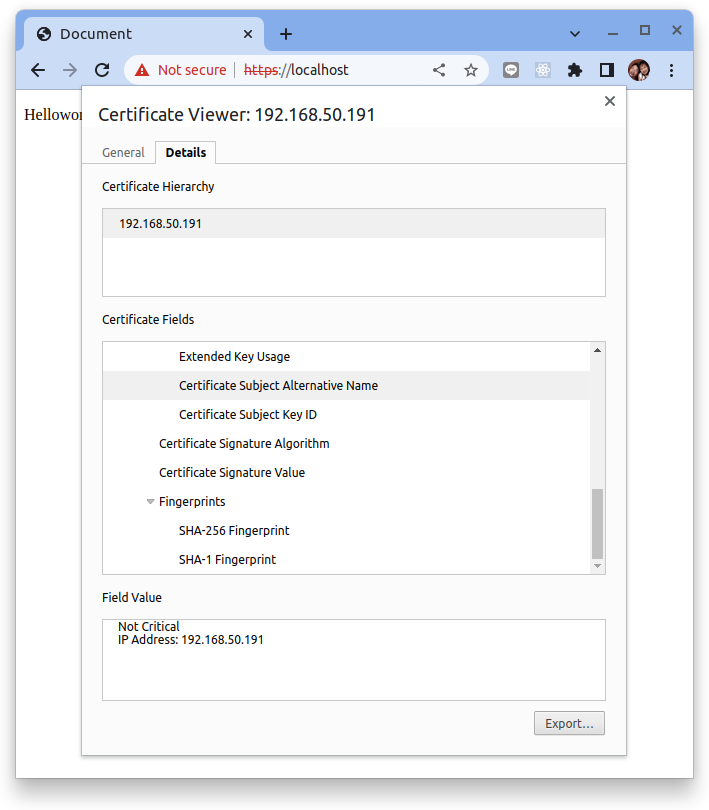

# 帶 IP 地址的自簽 SSL/TLS 證書


原文: 

- [Self Signed SSL/TLS Certificate with IP Address](https://nodeployfriday.com/posts/self-signed-cert/)
- [Dockerfile + nginx + ssl 教學](https://www.maxlist.xyz/2020/01/19/docker-nginx/)
- [Certificates](https://ubuntu.com/server/docs/security-certificates)
- [Installing a root CA certificate in the trust store](https://ubuntu.com/server/docs/security-trust-store)

在本教程中我們將使用 IP 地址而不是主機名或域名來創建自簽名證書。

## 自簽的 SSL 證書

出於許多其他原因想要創建自簽名證書。顯然，我們並不想在生產環境中運行自簽名證書，但您可以使用它們來運行和測試 Apache Web 服務器、Nginx、Express.js 服務器等。

那麼如何為 IP 地址創建自簽名證書呢？

1. 創建使用主題備用名稱的證書請求配置文件。
2. 使用 OpenSSL req 命令生成證書。
3. 驗證證書內容
4. 將證書安裝到您的服務器（Apache、Express、私有 Docker 註冊表等...）

為了讓自簽名證書僅與 IP（而不是域名）一起使用，我們在創建憑證的過程將 IP 設定在主題備用名稱 (SAN)。

### 1. 創建一個請求配置文件

```title="ssl.conf"
[req]
prompt = no
default_bits = 2048
default_md = sha256
distinguished_name = req_distinguished_name
x509_extensions = v3_req

[req_distinguished_name]
C = TW
ST = Taiwan
L = Taipei
O = Wistron
OU = IT
CN = 192.168.50.191

[v3_req]
keyUsage = keyEncipherment, dataEncipherment
extendedKeyUsage = serverAuth
subjectAltName = @alt_names

[alt_names]
DNS.1 = localhost
IP.1 = 127.0.0.1
IP.2 = 192.168.50.191
```

您需要關注的兩個關鍵設定是 **CN 字段** 和底部的 **alt_names** 部分。

`CN 字段` 需要是服務器的 IP 地址。 `alt_names` 則必須有一個帶有 IP 地址的條目。

### 2. 生成私鑰與證書

運行下列指令來使用 `openssl` 來生成私鑰與證書:

```bash
openssl req -x509 -nodes -days 3650 -newkey rsa:2048 -keyout ssl.key -out ssl.crt -config ssl.conf
```

openssl 參數說明：

- `req -x509` : 指定 request 要使用 X.509 憑證驗證
- `nodes` : 產生的憑證不需要密碼，不然每重新啟動 nginx 就要輸入一次
- `days` : 有效日期，3650 表示約 10 年
- `newkey rsa:2048` : 我們需要同時產生 csr ( certificate singing request )與 key ( private key )檔並使用 2048 bits 的 RSA 加密
- `keyout` : key 輸出的位置與檔名，這裡測試填 ssl.key ，請自行更換
- `out` : crt 輸出的位置與檔名，這裡測試填 ssl.crt ，請自行更換

執行命令後應該會在目錄下看到 `ssl.key` 與 `ssl.crt` 兩個檔案。

### 3. 驗證證書

通過運行以下命令驗證證書是否具有 IP SAN：

```bash
openssl x509 -in ssl.crt -noout -text
```

上述指令將輸出證書的內容供您檢查。雖然命令將打印出許多資訊，但我們正在尋找這樣的幾行(SAN)：

```hl_lines="40 41"
Certificate:
    Data:
        Version: 3 (0x2)
        Serial Number:
            7e:7c:c8:30:25:ac:55:f5:de:c7:f1:7a:a0:3e:aa:b6:7a:10:f2:b3
        Signature Algorithm: sha256WithRSAEncryption
        Issuer: C = TW, ST = Taiwan, L = Taipei, O = Wistron, OU = IT, CN = 192.168.50.191
        Validity
            Not Before: Dec 27 23:49:47 2022 GMT
            Not After : Dec 24 23:49:47 2032 GMT
        Subject: C = TW, ST = Taiwan, L = Taipei, O = Wistron, OU = IT, CN = 192.168.50.191
        Subject Public Key Info:
            Public Key Algorithm: rsaEncryption
                Public-Key: (2048 bit)
                Modulus:
                    00:a6:58:c6:8c:89:a5:1b:46:27:a9:2f:ed:d1:15:
                    80:4c:f2:90:71:4a:e8:fe:81:fd:ca:04:81:1e:18:
                    53:ed:7f:d7:15:4b:0e:d6:74:eb:5c:85:e5:0b:db:
                    af:9f:14:0c:e1:0d:ad:6b:70:0a:93:df:fb:1a:ad:
                    ec:c5:d9:f6:60:29:4f:d4:3e:15:97:70:da:8f:7e:
                    92:dc:d3:5c:d4:1a:ba:28:45:da:e8:6d:73:87:49:
                    10:f4:6d:b2:ab:38:b4:a7:aa:cb:83:30:e4:62:0b:
                    b7:0a:cc:fa:f6:7f:aa:16:31:5e:fa:44:65:26:38:
                    ad:28:7a:4a:88:7a:6b:9c:a9:9e:ab:46:38:54:d3:
                    39:1b:7d:0f:d6:91:27:84:bb:6d:99:bf:9a:07:49:
                    46:4d:5c:9d:14:d7:23:3e:1a:f2:78:b5:2e:66:b1:
                    14:c7:cb:e7:07:f3:1b:1e:4b:cf:13:40:89:49:92:
                    49:5b:0e:23:32:7c:d8:2a:af:ac:a0:18:cf:6d:26:
                    f6:ea:22:f6:07:6f:2a:06:9c:55:61:1b:46:5e:33:
                    70:0c:ac:e0:af:2f:68:5e:68:fe:44:75:b0:c7:70:
                    f9:e2:ab:61:4c:30:9e:a0:14:d7:65:1a:3e:fb:07:
                    92:48:42:45:ee:df:28:cd:80:c6:bc:e1:83:5e:c8:
                    d5:87
                Exponent: 65537 (0x10001)
        X509v3 extensions:
            X509v3 Key Usage: 
                Key Encipherment, Data Encipherment
            X509v3 Extended Key Usage: 
                TLS Web Server Authentication
            X509v3 Subject Alternative Name: 
                IP Address:192.168.50.191
            X509v3 Subject Key Identifier: 
                7C:C8:8F:7E:B3:D6:1E:F2:B9:2F:A7:69:D0:F6:60:99:6F:D8:42:25
    Signature Algorithm: sha256WithRSAEncryption
    Signature Value:
        89:45:25:b1:ae:fb:bb:1d:66:e6:8d:c1:12:9d:94:d6:0d:30:
        01:1e:60:b7:84:6b:44:18:d4:17:b0:de:c5:65:8d:c3:fa:eb:
        a2:df:27:62:ca:ab:34:52:4e:d5:1c:65:bf:48:7d:3e:ff:40:
        a0:ab:a1:2b:03:c6:10:88:91:2d:9f:10:7f:40:bb:73:b6:04:
        71:d4:a6:5d:42:3d:5c:ef:6a:da:32:97:68:a3:67:9c:03:5d:
        84:06:d4:74:54:6e:4d:6c:1f:01:9c:22:f6:64:3c:30:12:9c:
        31:b2:35:e5:bb:a6:b3:8e:06:4d:82:55:df:ba:e6:4b:53:ef:
        70:f4:90:ad:2b:27:82:f0:a2:78:a1:da:33:52:28:cf:99:44:
        dd:e1:83:70:fc:26:69:95:85:61:fd:e8:2a:49:20:9c:d3:c6:
        4c:5f:fa:d2:3b:8b:a3:e2:4c:f0:79:0e:47:0d:31:ba:80:07:
        10:f7:41:34:58:e6:63:84:74:bd:f5:4b:60:2a:14:ce:5e:1d:
        19:27:3c:08:9d:2c:58:1e:16:07:1c:55:c9:c8:66:4f:61:d5:
        a8:27:47:69:31:be:0c:b1:ae:f3:8d:df:a3:ee:01:92:8a:6b:
        42:e7:5c:73:9d:0b:8b:80:1c:ae:82:a8:b7:55:db:ec:dd:dc:
        7f:a9:13:b5
```

## 使用 Nginx 來驗證 SSL 憑證

現在讓我們將自簽名證書安裝到 Nginx 服務器中。

整個檔案結構如下:

```bash
├── Dockerfile
├── index.html
├── ca.crt
├── ca.key
└── nginx.conf
```

- `Dockerfile` 建構一個客制化的 Nginx 容器
- `index.html` 展示用的網頁
- `ca.crt` SSL 自簽憑證
- `ca.key` 憑證的私鑰
- `nginx.conf` Nginx 網頁服務器的配置檔

### 創建 nginx.conf

```nginx title="nginx.conf"
server {
    listen 80;
    server_name localhost;
 
    location / {
        root   /usr/share/nginx/html;
        index  index.html index.htm;
    }
}
server {
    listen 443 ssl;
 
    server_name  localhost;
 
    # 憑證與金鑰的路徑
    ssl_certificate /etc/nginx/ssl.crt;
    ssl_certificate_key /etc/nginx/ssl.key;
 
    location / {
        root   /usr/share/nginx/html;
        index  index.html index.htm;
    }
}
```

### 創建 Dockerfile

```docker title="Dockerfile"
# Use the Nginx image
FROM nginx
 
COPY index.html /usr/share/nginx/html/
 
# Remove the default nginx.conf
RUN rm /etc/nginx/conf.d/default.conf
 
# Replace with our own nginx.conf
COPY nginx.conf /etc/nginx/conf.d/
 
COPY ssl.crt /etc/nginx/ssl.crt
COPY ssl.key /etc/nginx/ssl.key
 
EXPOSE 443
```

### 創建 index.html

```html title="Index.html"
<!DOCTYPE html>
<html lang="en">
 
<head>
    <meta charset=“UTF-8”>
    <meta name=“viewport” content=“width=device-width, initial-scale=1.0">
    <meta http-equiv="X-UA-Compatible" content="ie=edge">
    <title>Document</title>
</head>
<body>
    <p>Helloworld</p>
</body>
</html>
```

### 構建容器並運行

運行下列命令來構建客制化的 nginx 容器:

```bash
docker image build -t docker_nginx_ssl .
```

運行客制化的 nginx 容器:

```bash
docker run -p 80:80 -p 443:443 docker_nginx_ssl
```

使用瀏覽器來檢視 `http://localhost/`:




使用瀏覽器來檢視瀏覽 `https://localhost/`:



會看到瀏覽器提示不安全 ( 因為是使用自簽憑證 ) , 點選 "Advanced" 並告知瀏覽器這是我們了解的風險之後會看到最後的結果:



接著點擊在瀏覽器上 "Not secure" 的字樣：




接著點擊在瀏覽器上 "Certificate is not valid" 的字樣來查看這個 SSL 憑證的內容：





## 在本機上導入自簽憑證

企業環境有時有一個本地證書頒發機構 (CA)，它頒發證書供在組織內使用。為了使 Ubuntu 服務器正常運行並信任此環境中的主機，此 CA 必須安裝在 Ubuntu 的信任庫中。

### 如何識別憑證格式

要在Ubuntu的憑證信任庫中安裝證書，它必須採用 PEM 格式。PEM 格式的證書採用 base64 格式，是人類可讀的，並以 `----BEGIN CERTIFICATE----` 行開頭。使用文字編輯器來打開你的憑證如果你看到這些行，你就可以安裝了。如果不是，則很可能是 DER 證書，需要轉換。

### 安裝 PEM 格式的證書

假設 PEM 格式的證書是 `ssl.crt`，請按照以下步驟進行安裝。

!!! tips
    注意：文件的擴展名為 `.crt` 很重要，否則 Ubuntu 將不會處理這張憑證。

```bash
sudo apt-get install -y ca-certificates

sudo cp ssl.crt /usr/local/share/ca-certificates

sudo update-ca-certificates
```

結果:

```
Updating certificates in /etc/ssl/certs...
rehash: warning: skipping ca-certificates.crt,it does not contain exactly one certificate or CRL
1 added, 0 removed; done.
Running hooks in /etc/ca-certificates/update.d...

Adding debian:ssl.pem
done.
done.
```