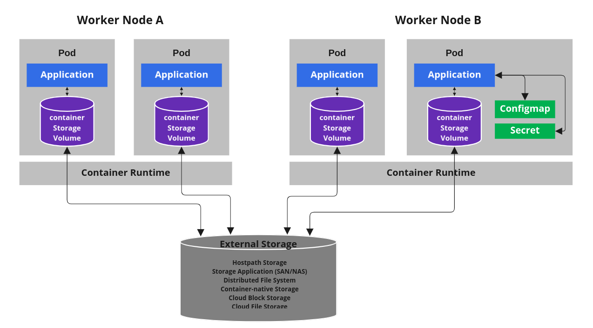
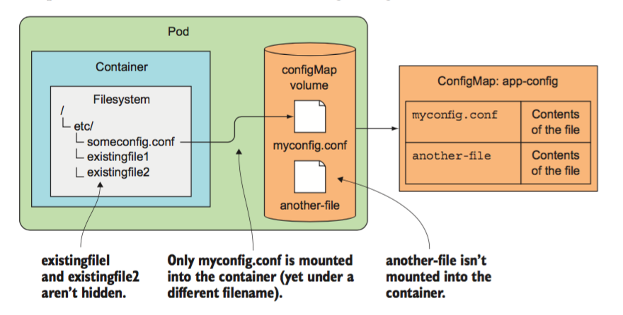

# ConfigMap 與 Secret

原文: [k8s入门教程十一:ConfigMap与secrets](https://www.wumingx.com/k8s/kubernetes-ConfigMap-secrets.html)



## ConfigMap

ConfigMap 允許您將配置文件與容器鏡像分離，以使容器化的應用程序具有可移植性。本教程提供了一系列使用示例，這些示例演示如何使用存儲在 ConfigMap 中的數據創建和配置 Pod。 ConfigMap API給我們提供了向容器中註入配置信息的機制，ConfigMap 可以被用來保存單個屬性，也可以用來保存整個配置文件或者 JSON 二進制對象。

配置數據可以通過很多種方式在 Pods 裡被使用。 ConfigMaps 可以被用來：

- 生成為容器內的環境變量
- 設置容器啟動命令的參數
- 掛載為容器內部的文件或目錄

**向容器傳遞參數**:

如果需要向容器傳遞`參數`，可以在 Yaml 文件中通過 `command` 和 `args` 或者`環境變量`的方式實現。

```yaml hl_lines="5 6 7 8 10 12 14"
kind: Pod
spec:
  containers:
  - image: docker.io/nginx
    command: ["/bin/command"]
    args: ["arg1", "arg2", "arg3"]
    env:
    - name: INTERVAL
      value: "30"
    - name: FIRST_VAR
      value: "foo"
    - name: SECOND_VAR
      value: "$(FIRST_VAR)bar"
```

可以看到，我們可以利用 **env** 標籤向容器中傳遞環境變量，環境變量還可以相互引用。這種方式的問題在於配置文件和部署是綁定的，那麼對於同樣的應用，測試環境的參數和生產環境是不一樣的，這樣就要求寫兩個部署文件，管理起來不是很方便。

上面提到的例子，利用 ConfigMap可 以解耦部署與配置的關係，對於同一個應用部署文件，可以利用valueFrom字段引用一個在測試環境和生產環境都有的ConfigMap（當然配置內容不相同，只是名字相同），就可以降低環境管理和部署的複雜度。


**掛載為容器內部的文件或目錄**:

```yaml
apiVersion: v1
kind: Pod
metadata:
  name: nginx-test
spec:
  containers:
  - image: nginx
    name: web-server
    volumeMounts:
    - name: config
      mountPath: /etc/someconfig.conf
      subPath: myconfig.conf
  volumes:
  - name: config
    configMap:
      name: <map-name>
```



**ConfigMap的注意事項**:

- ConfigMap 必須在 Pod 之前創建
- ConfigMap 屬於某個 NameSpace，只有處於相同 NameSpace 的 Pod 才可以應用它
- ConfigMap 中的 size 不能超過 1 MiB
- 如果是 volume 的形式掛載到容器內部，當設定掛載到某個目錄下時，該目錄下原有的文件會被覆蓋掉(可搭配使用 subPath 來解決)


### 創建

ConfigMap 的創建手法有很多種:

```bash
# 使用 yaml 的聲明方式
$ kubectl apply -f <configmap-file.yaml>

# 使用命令創建
$ kubectl create configmap <map-name> --from-literal=<parameter-name>=<parameter-value>

$ kubectl create configmap <map-name> --from-literal=<parameter1>=<parameter1-value> --from-literal=<parameter2>=<parameter2-value> --from-literal=<parameter3>=<parameter3-value>

# 使用文件創建 configmap
$ kubectl create configmap <map-name> --from-file=<file-path>

# 還可以從一個文件夾創建 configmap
$ kubectl create configmap <map-name> --from-file=/path/to/dir
```

#### 1. 使用 yaml 的聲明方式

可把相關的設定檔案內容直接使用 yaml 來進行宣告:

```yaml title="cfmap-test00.yaml"
apiVersion: v1
data:
  my-nginx-config.conf: |
    server {
      listen              80;
      server_name         www.kubia-example.com;

      gzip on;
      gzip_types text/plain application/xml;

      location / {
        root   /usr/share/nginx/html;
        index  index.html index.htm;
      }
    }
  sleep-interval: |
    25
kind: ConfigMap
metadata:
  name: my-nginx-config
```

使用 kubectl 來創建 configmap:

```bash
kubectl apply -f cfmap-test00.yaml
```

讓我們來檢查一下執行後的結果:

```bash
$ kubectl describe cm/my-nginx-config

Name:         my-nginx-config
Namespace:    default
Labels:       <none>
Annotations:  <none>

Data
====
my-nginx-config.conf:
----
server {
  listen              80;
  server_name         www.kubia-example.com;

  gzip on;
  gzip_types text/plain application/xml;

  location / {
    root   /usr/share/nginx/html;
    index  index.html index.htm;
  }
}

sleep-interval:
----
25


BinaryData
====

Events:  <none>
```


#### 2. 使用目錄或文件創建

你可以使用 `kubectl create configmap name --from-file=` 從同一目錄中的多個文件創建 ConfigMap。

```bash
# 創建本地目錄
mkdir -p configure-pod-container/configmap/
cd configure-pod-container/configmap/
```

將樣本文件下載到 `configure-pod-container/configmap/` 目錄:

```bash
wget https://kubernetes.io/examples/configmap/game.properties 
wget https://kubernetes.io/examples/configmap/ui.properties
```

讓我們看一下這兩個樣本設定檔文件的內容:

```properties title="game.properties"
enemies=aliens
lives=3
enemies.cheat=true
enemies.cheat.level=noGoodRotten
secret.code.passphrase=UUDDLRLRBABAS
secret.code.allowed=true
secret.code.lives=30
```

```properties title="ui.properties"
color.good=purple
color.bad=yellow
allow.textmode=true
how.nice.to.look=fairlyNice
```

使用 `kubectl create configmap <map-name> <data-source>` 命令來創建 configmap: 

```bash
# --from-file可以接單個文件，也可以接單個目錄
kubectl create cm game-config --from-file=./
kubectl create cm game-config-2 --from-file=game.properties --from-file=ui.properties
```

檢查運行結果:

```bash
$ kubectl get cm

NAME               DATA   AGE
game-config        2      8m18s
game-config-2      2      39s
```

檢視 configmap:

```bash
$ kubectl describe cm/game-config

Name:         game-config
Namespace:    default
Labels:       <none>
Annotations:  <none>

Data
====
game.properties:
----
enemies=aliens
lives=3
enemies.cheat=true
enemies.cheat.level=noGoodRotten
secret.code.passphrase=UUDDLRLRBABAS
secret.code.allowed=true
secret.code.lives=30
ui.properties:
----
color.good=purple
color.bad=yellow
allow.textmode=true
how.nice.to.look=fairlyNice


BinaryData
====

Events:  <none>
```

也可把 configmap 用 yaml 的格式來展現:

```bash
$ kubectl get cm/game-config -o yaml

apiVersion: v1
data:
  game.properties: |-
    enemies=aliens
    lives=3
    enemies.cheat=true
    enemies.cheat.level=noGoodRotten
    secret.code.passphrase=UUDDLRLRBABAS
    secret.code.allowed=true
    secret.code.lives=30
  ui.properties: |
    color.good=purple
    color.bad=yellow
    allow.textmode=true
    how.nice.to.look=fairlyNice
kind: ConfigMap
metadata:
  creationTimestamp: "2022-08-11T12:31:16Z"
  name: game-config
  namespace: default
  resourceVersion: "6231"
  uid: 0de5e556-6809-482c-afab-1a696d27873a
```

#### 3. 從 env 文件創建

當使用多個 `--from-env-file` 來從多個數據源創建 ConfigMap 時，僅僅最後一個 env 文件有效:

```bash
# 環境文件包含環境變量列表。
# 語法規則:
#   env 文件中的每一行必須為 VAR = VAL 格式。
#   以＃開頭的行(即註釋)將被忽略。
#   空行將被忽略。
#   引號沒有特殊處理(即它們將成為 ConfigMap 值的一部分)。

# 將樣本文件下載到 `configure-pod-container/configmap/` 目錄
wget https://kubernetes.io/examples/configmap/game-env-file.properties
```

```properties title="game-env-file.properties"
enemies=aliens
lives=3
allowed="true"

# This comment and the empty line above it are ignored
```

使用 `kubectl create configmap name --from-env-file=` 從文件檔來創建 ConfigMap。

```bash
$ kubectl create configmap game-config-env-file --from-env-file=game-env-file.properties
```

檢視 configmap 內容:

```bash
$ kubectl get cm game-config-env-file -o yaml

apiVersion: v1
data:
  allowed: '"true"'
  enemies: aliens
  lives: "3"
kind: ConfigMap
metadata:
  creationTimestamp: "2020-02-09T02:38:37Z"
  name: game-config-env-file
  namespace: default
  resourceVersion: "1690565"
  selfLink: /api/v1/namespaces/default/configmaps/game-config-env-file
  uid: 9594fa13-5b2c-4848-a88a-77e3d0fd0646
```

#### 4. 使用命令創建

可以將 `kubectl create configmap` 與 `--from-literal` 參數一起使用，從命令行定義文字值:

```bash
$ kubectl create configmap special-config --from-literal=special.how=very --from-literal=special.type=charm

configmap/special-config created
```

檢視 configmap 內容:

```bash
$ kubectl get configmaps special-config -o yaml

apiVersion: v1
data:
  special.how: very
  special.type: charm
kind: ConfigMap
metadata:
  creationTimestamp: "2022-08-11T13:01:09Z"
  name: special-config
  namespace: default
  resourceVersion: "6596"
  uid: fdc77599-685f-4caa-8fd8-3a3f8026b5c9
```

#### 5. 使用生成器創建

使用 [kustomize](https://kustomize.io/) 的 `configMapGenerator` 生成器來創建 ConfigMap 對象。

創建 `kustomization.yaml` 設定檔:

```bash
cat <<EOF >./kustomization.yaml
configMapGenerator:
- name: game-config-4
  files:
  - game.properties
EOF
```

使用下列命令來檢視 `kustomize` 生成的 configmap:

```bash
$ kustomize build ./

apiVersion: v1
data:
  game.properties: |-
    enemies=aliens
    lives=3
    enemies.cheat=true
    enemies.cheat.level=noGoodRotten
    secret.code.passphrase=UUDDLRLRBABAS
    secret.code.allowed=true
    secret.code.lives=30
kind: ConfigMap
metadata:
  name: game-config-4-tbg7c4gc77
```

直接生成 configmap:

```bash
$ kubectl create -k ./

configmap/game-config-4-tbg7c4gc77 created
```

或者也可以使用生成器來實現。

```bash
cat <<EOF >./kustomization.yaml
configMapGenerator:
- name: special-config-2
  literals:
  - special.how=very
  - special.type=charm
EOF
```

!!! tip
    參考：[使用 Kustomize 對 Kubernetes 對象進行聲明式管理](../../03-tasks/manage-kubernetes-objects/kustomization.md) 來了解如何使用 kubectl 與 kustomize 來生成相關的 kubernetes object 對象。


### 使用

ConfigMap有三種用法：

- 生成為容器內的環境變量
- 設置容器啟動命令的參數
- 掛載為容器內部的文件或目錄


#### 1. 曝露成環境變量

使用 **configMapKeyRef** 指定要從某一個 configmap 中曝露那一個特定的鍵值成環境變量：

創建 `cfmap-env-test01.yaml` 檔案:

```yaml title="cfmap-env-test01.yaml" hl_lines="3 21 23 25 27"
apiVersion: v1
data:
  special.how: very
  special.type: charm
kind: ConfigMap
metadata:
  name: special-config
  
---
apiVersion: v1
kind: Pod
metadata:
  name: dapi-test-pod
spec:
  containers:
    - name: test-container
      image: busybox
      command: [ "/bin/sh", "-c", "env" ]
      env:
        # Define the environment variable
        - name: SPECIAL_LEVEL_KEY
          valueFrom:
            configMapKeyRef:
              # The ConfigMap containing the value you want to assign to SPECIAL_LEVEL_KEY
              name: special-config
              # Specify the key associated with the value
              key: special.how
  restartPolicy: Never
```

上述 yaml 表示，新建一個名為 `SPECIAL_LEVEL_KEY` 的環境變量，其值源於 configMap 裡面的 `special.how`。

```bash
kubectl apply -f cfmap-env-test01.yaml
```

讓我們來檢查一下 Pod 執行後的結果:

```bash hl_lines="12"
$ kubectl logs pods/dapi-test-pod

KUBERNETES_SERVICE_PORT=443
KUBERNETES_PORT=tcp://10.43.0.1:443
HOSTNAME=dapi-test-pod
SHLVL=1
HOME=/root
KUBERNETES_PORT_443_TCP_ADDR=10.43.0.1
PATH=/usr/local/sbin:/usr/local/bin:/usr/sbin:/usr/bin:/sbin:/bin
KUBERNETES_PORT_443_TCP_PORT=443
KUBERNETES_PORT_443_TCP_PROTO=tcp
SPECIAL_LEVEL_KEY=very
KUBERNETES_PORT_443_TCP=tcp://10.43.0.1:443
KUBERNETES_SERVICE_PORT_HTTPS=443
KUBERNETES_SERVICE_HOST=10.43.0.1
PWD=/
```

上一個例子是有指定一個具體的KEY，如果沒有指定呢？

```yaml title="cfmap-env-test02.yaml"
apiVersion: v1
kind: Pod
metadata:
  name: dapi-test-pod2
spec:
  containers:
    - name: test-container
      image: busybox
      command: [ "/bin/sh", "-c", "env" ]
      envFrom:
      - configMapRef:
          name: special-config
  restartPolicy: Never
```

```bash
kubectl apply -f cfmap-env-test02.yaml
```

讓我們來檢查一下 Pod 執行後的結果:

```bash hl_lines="12 15"
$ kubectl logs pods/dapi-test-pod2

KUBERNETES_SERVICE_PORT=443
KUBERNETES_PORT=tcp://10.43.0.1:443
HOSTNAME=dapi-test-pod2
SHLVL=1
HOME=/root
KUBERNETES_PORT_443_TCP_ADDR=10.43.0.1
PATH=/usr/local/sbin:/usr/local/bin:/usr/sbin:/usr/bin:/sbin:/bin
KUBERNETES_PORT_443_TCP_PORT=443
KUBERNETES_PORT_443_TCP_PROTO=tcp
special.type=charm
KUBERNETES_SERVICE_PORT_HTTPS=443
KUBERNETES_PORT_443_TCP=tcp://10.43.0.1:443
special.how=very
KUBERNETES_SERVICE_HOST=10.43.0.1
PWD=/
```

注意看 KEY 與 VALUE 的關係。

#### 2. 掛載文件目錄法


可以使用 volumeMounts 方法進行掛載。

讓我們先看一下 special-config 這個 configmap 的內容:

```bash hl_lines="5 6"
$ kubectl get configmaps special-config -o yaml

apiVersion: v1
data:
  special.how: very
  special.type: charm
kind: ConfigMap
metadata:
  creationTimestamp: "2022-08-11T13:01:09Z"
  name: special-config
  namespace: default
  resourceVersion: "6596"
  uid: fdc77599-685f-4caa-8fd8-3a3f8026b5c9
```

把 special-config 掛載至 `/etc/config` 目錄下。

```yaml title="pod-configmap-volume.yaml" hl_lines="10-12"
apiVersion: v1
kind: Pod
metadata:
  name: dapi-test-pod
spec:
  containers:
    - name: test-container
      image: busybox
      command: [ "/bin/sh", "-c", "ls /etc/config/;cat /etc/config/special.how;cat /etc/config/special.type" ]
      volumeMounts:
      - name: config-volume
        mountPath: /etc/config
  volumes:
    - name: config-volume
      configMap:
        # Provide the name of the ConfigMap containing the files you want
        # to add to the container
        name: special-config
  restartPolicy: Never
```

執行命令與檢查成果:

```bash hl_lines="2 7 13 35"
# 創建 pod
$ kubectl create -f pod-configmap-volume.yaml

pod/dapi-test-pod created

# 檢查 pod 狀態
$ kubectl get pod/dapi-test-pod

NAME            READY   STATUS      RESTARTS   AGE
dapi-test-pod   0/1     Completed   0          119s

# 檢視 configmap 內容
$ kubectl describe cm special-config

Name:         special-config
Namespace:    default
Labels:       <none>
Annotations:  <none>

Data
====
special.how:
----
very
special.type:
----
charm

BinaryData
====

Events:  <none>

# 檢查 Pod 執行完成後的日誌
$ kubectl logs pod/dapi-test-pod

special.how
special.type
verycharm
```

可以看到，其每一個 KEY 都是會生成一個文件，文件的內容為 value 的值。

也可以掛載 configmap 裡頭單獨的 KEY：

```yaml title="pod-configmap-volume-specific-key.yaml"
apiVersion: v1
kind: Pod
metadata:
  name: dapi-test-pod2
spec:
  containers:
    - name: test-container
      image: busybox
      command: [ "/bin/sh","-c","cat /etc/config/keys;sleep 600" ]
      volumeMounts:
      - name: config-volume
        mountPath: /etc/config
  volumes:
    - name: config-volume
      configMap:
        name: special-config
        items:
        - key: special.how
          path: keys
  restartPolicy: Never
```

將 KEY `special.how` 掛載到 `/etc/config` 目錄下，其文件名使用 `path` 變成了 `keys`:

```bash
$ kubectl apply -f pod-configmap-volume-specific-key.yaml

pod/dapi-test-pod2 created

$ kubectl exec -it pod/dapi-test-pod2 -- /bin/sh

/ # cat /etc/config/keys
very/ # exit

```

#### 熱更新的問題

confgimap 更新後，如果是以 **文件夾** 方式掛載的，會自動將掛載的 Volume 更新。如果是以 **文件形式** 掛載的，則不會自動更新。

但是對多數情況的應用來說，{++配置文件更新後，最簡單的辦法就是重啟Pod（殺掉再重新拉起）++}。

如果是以文件夾形式掛載的，可以通過在容器內重啟應用的方式實現配置文件更新生效。即便是重啟容器內的應用，也要注意 configmap 的更新和容器內掛載文件的更新不是同步的，可能會有延時，因此一定要確保容器內的配置也已經更新為最新版本後再重新加載應用。

使用 volumes 掛載的方式是可以更新 configMap 的，但是使用 env方 式導給 POD 是更新不了的。

## Secret

Secret 解決了更新密碼、令牌、密鑰等敏感數據的配置問題，而不是需要將這些敏感數據洩露到或 Pod Spec 中。Secret 可以以 Volume 或環境變量使用。

Kubernetes 為一些常見的使用場景提供了幾種內置 Secret 類型。這些類型在執行的驗證和 Kubernetes 對它們施加的約束方面有所不同。

Secret 的類型：

|類型	|用例|
|---|---|
|**Opaque**	|預設的的類型。Base64 編碼格式的 Secret，用來存儲密碼、密鑰等；數據可通過 `base64 –decode` 解碼得到原始數據，所以加密性很弱。|
|**kubernetes.io/service-account-token**|用於被 serviceaccount 引用。 serviceaccout 創建時 Kubernetes 會默認創建對應的 secret。 Pod 如果使用了serviceaccount，對應的 secret 會自動掛載到 Pod 目錄 `/run/secrets/kubernetes.io/serviceaccount` 中。|
|**kubernetes.io/dockercfg**|`~/.dockercfg` 文件的序列化形式，用來存儲私有 docker registry 的認證信息|
|**kubernetes.io/dockerconfigjson**|`~/.docker/config.json` 文件的序列化形式，用來存儲私有 docker registry 的認證信息|
|**kubernetes.io/basic-auth**|用於基本身份認證 (Basic Auth)的憑據|
|**kubernetes.io/ssh-auth**|用於 SSH 身份認證的憑據|
|**kubernetes.io/tls**|用於 TLS 客戶端或者服務器端的數據|
|**bootstrap.kubernetes.io/token**|K8s 節點 bootstrap 令牌數據|


### Opaque 類型

Opaque 類型的數據是一個 map 類型，要求 value 是 base64 編碼格式，如果您使用的密碼具有特殊字符，則需要使用 `\\` 字符對其進行轉義。

#### 文件創建

讓我們查找一下使用 `kubectl create secret` 的相關命令:

```bash hl_lines="16 19 22 25 28"
$ kubectl create secret generic --help

Create a secret based on a file, directory, or specified literal value.

 A single secret may package one or more key/value pairs.

 When creating a secret based on a file, the key will default to the basename of the file, and the value will default to
the file content. If the basename is an invalid key or you wish to chose your own, you may specify an alternate key.

 When creating a secret based on a directory, each file whose basename is a valid key in the directory will be packaged
into the secret. Any directory entries except regular files are ignored (e.g. subdirectories, symlinks, devices, pipes,
etc).

Examples:
  # Create a new secret named my-secret with keys for each file in folder bar
  kubectl create secret generic my-secret --from-file=path/to/bar
  
  # Create a new secret named my-secret with specified keys instead of names on disk
  kubectl create secret generic my-secret --from-file=ssh-privatekey=path/to/id_rsa --from-file=ssh-publickey=path/to/id_rsa.pub
  
  # Create a new secret named my-secret with key1=supersecret and key2=topsecret
  kubectl create secret generic my-secret --from-literal=key1=supersecret --from-literal=key2=topsecret
  
  # Create a new secret named my-secret using a combination of a file and a literal
  kubectl create secret generic my-secret --from-file=ssh-privatekey=path/to/id_rsa --from-literal=passphrase=topsecret
  
  # Create a new secret named my-secret from env files
  kubectl create secret generic my-secret --from-env-file=path/to/foo.env --from-env-file=path/to/bar.env
```

創建範例的帳密檔案:

```bash
$ echo -n 'admin' > ./username
$ echo -n '12345' > ./password
```

使用 `kubectl create secret generic--from-file` 命令來創建 secret 對象:

```bash
$ kubectl create secret generic db-user-pass --from-file=username --from-file=password

secret/db-user-pass created
```

檢視 secret 對象:

```bash hl_lines="13 14"
# 檢索 secret
$ kubectl get secret

NAME                  TYPE                                  DATA   AGE
default-token-dz4cv   kubernetes.io/service-account-token   3      5h27m
db-user-pass          Opaque                                2      71s

# 檢視 secret 對象
$ kubectl get secret/db-user-pass -o yaml

apiVersion: v1
data:
  password: MTIzNDU=
  username: YWRtaW4=
kind: Secret
metadata:
  creationTimestamp: "2022-08-12T07:54:19Z"
  name: db-user-pass
  namespace: default
  resourceVersion: "4763"
  uid: edc0ca3d-4462-4419-93c3-1c6951b6b70b
type: Opaque
```

使用 `kubectl create secret generic--from-literal` 命令來創建 secret 對象:

```
$ kubectl create secret generic db-user-pass --from-literal=username=admin --from-literal=password=12345

secret/db-user-pass created
```

檢視 secret 對象:

```bash hl_lines="13 14"
# 檢索 secret
$ kubectl get secret

NAME                  TYPE                                  DATA   AGE
default-token-dz4cv   kubernetes.io/service-account-token   3      5h27m
db-user-pass          Opaque                                2      71s

# 檢視 secret 對象
$ kubectl get secret/db-user-pass -o yaml

apiVersion: v1
data:
  password: MTIzNDU=
  username: YWRtaW4=
kind: Secret
metadata:
  creationTimestamp: "2022-08-12T07:54:19Z"
  name: db-user-pass
  namespace: default
  resourceVersion: "4763"
  uid: edc0ca3d-4462-4419-93c3-1c6951b6b70b
type: Opaque
```

默認情況下，kubectl get 和 kubectl describe 是不會顯示密碼的內容。這是為了防止機密被意外地暴露給旁觀者或存儲在終端日誌中。

#### 手工創建

Secret 對象也可以使用手工來創建，如下：

```bash
$ echo -n 'admin' | base64

YWRtaW4=

$ echo -n '12345' | base64

MTIzNDU=
```

現在可以像這樣寫一個 secret 對象：

```yaml
apiVersion: v1
kind: Secret
metadata:
  name: mysecret
type: Opaque
data:
  username: YWRtaW4=
  password: MTIzNDU=
```

### docker-registry secret

Kubernetes 從私有容器鏡象倉庫拉取鏡象的時候需要相關的配置相關的帳密配置。

可以直接用 kubectl 命令來創建用於 docker registry 認證的 secret：

```bash
$ kubectl create secret docker-registry myregistrykey 
 --docker-server=DOCKER_REGISTRY_SERVER
 --docker-username='*******' 
 --docker-password='*******' 
 --docker-email=DOCKER_EMAIL
````

- docker-server 私有容器鏡象倉庫完全限定域名（FQDN）
- docker-username 賬號用戶名，需要用單引號括起來。
- docker-password 賬號 token 或密碼，需要用單引號括起來。
- docker-email 用戶電郵 (not required)。

例如:

```bash
$ kubectl create secret docker-registry loginharbor \
 --docker-email=tiger@acme.example \ #可以不填写
 --docker-username=admin \
 --docker-password=Harbor12345 \
 --docker-server=harbor.demo.com:5667 #harbor的地址要加端口
```

### service-account-token

用於被 serviceaccount 引用。 serviceaccout 創建時 Kubernetes 會默認創建對應的 secret。 Pod 如果使用了 serviceaccount，對應的 secret 會自動掛載到 Pod 目錄 `/run/secrets/kubernetes.io/serviceaccount` 中。

Secret 是一種包含少量敏感信息例如密碼、token 或 key 的對象。這樣的信息可能會被放在 Pod spec 中或者鏡像中；將其放在一個 secret 對象中可以更好地控制它的用途，並降低意外暴露的風險。

在 Kubernetes 中的每一個 Pod 都會歸屬於某一個 SA，比如：

```bash
$ kubectl get sa -n default -o yaml

apiVersion: v1
items:
- apiVersion: v1
  kind: ServiceAccount
  metadata:
    creationTimestamp: "2022-08-12T02:27:55Z"
    name: default
    namespace: default
    resourceVersion: "435"
    uid: fe177ee4-6af5-44de-a5c2-96baea7c83f6
  secrets:
  - name: default-token-dz4cv
kind: List
metadata:
  resourceVersion: ""
```

查看 Service account 的 secret:

```bash
$ kubectl get secret default-token-dz4cv -o yaml
apiVersion: v1
data:
  ca.crt: LS0tLS1CRUdJTiBDRVJUSUZJQ0FURS0tLS0tCk1JSUJkekNDQVIyZ0F3SUJBZ0lCQURBS0JnZ3Foa2pPUFFRREFqQWpNU0V3SHdZRFZRUUREQmhyTTNNdGMyVnkKZG1WeUxXTmhRREUyTmpBeU56RXlOVGd3SGhjTk1qSXdPREV5TURJeU56TTRXaGNOTXpJd09EQTVNREl5TnpNNApXakFqTVNFd0h3WURWUVFEREJock0zTXRjMlZ5ZG1WeUxXTmhRREUyTmpBeU56RXlOVGd3V1RBVEJnY3Foa2pPClBRSUJCZ2dxaGtqT1BRTUJCd05DQUFTbFd1Q0RHcEt5N09ya0JuUUFHK21ZcUtVTU9TeVJqZGlnUGxoRWZnZGEKYS9CT05BUW1SZjFjczJ1MUtUWDI4Q2JGc1VtSmlmRityS2xWS1pYVERpbVRvMEl3UURBT0JnTlZIUThCQWY4RQpCQU1DQXFRd0R3WURWUjBUQVFIL0JBVXdBd0VCL3pBZEJnTlZIUTRFRmdRVUpUT1Bxd1FTSUh4eWpoUWpJWnpECjJzbTlrMHd3Q2dZSUtvWkl6ajBFQXdJRFNBQXdSUUloQUlWTVlCanpJZ2hGYjVqSjVZUGlVVW5NR2pNelhSSlgKLzdNbjFqUGRDU2xPQWlBWEt0S3VNYXcvSUZ6TFhFYXVlbnJLTWJlZDhPNFluV3ZkbGRRTzN0WE5tQT09Ci0tLS0tRU5EIENFUlRJRklDQVRFLS0tLS0K
  namespace: ZGVmYXVsdA==
  token: ZXlKaGJHY2lPaUpTVXpJMU5pSXNJbXRwWkNJNkltazBhR0owUWtndFZUUlhURmx2V2tOdGNYUXdNbHBoVUhaZlZrVTBMVzlsY0hNd2JGOHhSWEZtU1djaWZRLmV5SnBjM01pT2lKcmRXSmxjbTVsZEdWekwzTmxjblpwWTJWaFkyTnZkVzUwSWl3aWEzVmlaWEp1WlhSbGN5NXBieTl6WlhKMmFXTmxZV05qYjNWdWRDOXVZVzFsYzNCaFkyVWlPaUprWldaaGRXeDBJaXdpYTNWaVpYSnVaWFJsY3k1cGJ5OXpaWEoyYVdObFlXTmpiM1Z1ZEM5elpXTnlaWFF1Ym1GdFpTSTZJbVJsWm1GMWJIUXRkRzlyWlc0dFpIbzBZM1lpTENKcmRXSmxjbTVsZEdWekxtbHZMM05sY25acFkyVmhZMk52ZFc1MEwzTmxjblpwWTJVdFlXTmpiM1Z1ZEM1dVlXMWxJam9pWkdWbVlYVnNkQ0lzSW10MVltVnlibVYwWlhNdWFXOHZjMlZ5ZG1salpXRmpZMjkxYm5RdmMyVnlkbWxqWlMxaFkyTnZkVzUwTG5WcFpDSTZJbVpsTVRjM1pXVTBMVFpoWmpVdE5EUmtaUzFoTldNeUxUazJZbUZsWVRkak9ETm1OaUlzSW5OMVlpSTZJbk41YzNSbGJUcHpaWEoyYVdObFlXTmpiM1Z1ZERwa1pXWmhkV3gwT21SbFptRjFiSFFpZlEudXJOR1ZvX2lzQnJSd3I2WTlnYkoxaGpqM29kTFpBbm9ZRVBtVG41eWRJSnZpWDNIYmxZSU9OazgzYTl3WjFZbjdzb1JlSHdrN3VSbzBrel90YkVua0tudGlzVHNheHZsOU1rMjVsTDk3bVpLTWF1dlFXZTBZWTU2NVhLb3FDSnFtVVRaVmRMTTNMNkxOMkFQRURhMEtZNW96djVfanFVZkdvTWlzdTVFRVloQ0JGMXBJbUtla1RUS3cwN3hhTmpzQ3dER3BlZXJPV1d5cmd1elFZdjU1OFM2WWw4dHozLVdYVHVMcFBIQ1R1S1E1OUtZUHltSkFXLVhZOHpCQmo2cV9kT3NYWEtrQjVLNk5GLUlJMWZRZUl4UXpyeGxhZjdYazk5OW1BSi0yQmE1eFAxaWp6SXJmTTMxb21qWldIcnBkNFIzSlhTQVdCUVJRV3lQSDNfTWJ3
kind: Secret
metadata:
  annotations:
    kubernetes.io/service-account.name: default
    kubernetes.io/service-account.uid: fe177ee4-6af5-44de-a5c2-96baea7c83f6
  creationTimestamp: "2022-08-12T02:27:55Z"
  name: default-token-dz4cv
  namespace: default
  resourceVersion: "433"
  uid: 0900cbfe-e27c-4d19-b6aa-3a368415f16f
type: kubernetes.io/service-account-token
```

### 使用

Secret 可以作為數據卷被掛載，或作為環境變量暴露出來以供 pod 中的容器使用。它們也可以被系統的其他部分使用，而不直接暴露在 pod 內。例如，它們可以保存憑據，系統的其他部分應該用它來代表您與外部系統進行交互。

#### 1. 曝露成環境變量

使用 **secretKeyRef** 指定要從某一個 secret 中曝露那一個特定的鍵值成環境變量：

先檢視 secret 對象:

```bash hl_lines="6 7"
# 檢視 secret 對象
$ kubectl get secret/db-user-pass -o yaml

apiVersion: v1
data:
  password: MTIzNDU=
  username: YWRtaW4=
kind: Secret
metadata:
  creationTimestamp: "2022-08-12T07:54:19Z"
  name: db-user-pass
  namespace: default
  resourceVersion: "4763"
  uid: edc0ca3d-4462-4419-93c3-1c6951b6b70b
type: Opaque
```

創建 `pod-env-secrets.yaml` 檔案:

```yaml title="pod-env-secrets.yaml"
apiVersion: v1
kind: Pod
metadata:
  name: dapi-test-pod3
spec:
  containers:
    - name: test-container
      image: busybox
      command: [ "/bin/sh","-c","env;echo ${SECRET_USERNAME} ${SECRET_PASSWORD}" ]
      env:
      - name: SECRET_USERNAME
        valueFrom:
          secretKeyRef:
            name: db-user-pass
            key: username
      - name: SECRET_PASSWORD
        valueFrom:
          secretKeyRef:
            name: db-user-pass
            key: password
  restartPolicy: Never
```

執行命令:

```bash
$ kubectl apply -f pod-env-secrets.yaml

pod/dapi-test-pod3 created
```

檢查結果:

```bash hl_lines="13 18 23"
$ kubectl get pod dapi-test-pod3

NAME             READY   STATUS      RESTARTS   AGE
dapi-test-pod3   0/1     Completed   0          21s

$ kubectl logs dapi-test-pod3

KUBERNETES_SERVICE_PORT=443
KUBERNETES_PORT=tcp://10.43.0.1:443
HOSTNAME=dapi-test-pod3
SHLVL=1
HOME=/root
SECRET_PASSWORD=12345
KUBERNETES_PORT_443_TCP_ADDR=10.43.0.1
PATH=/usr/local/sbin:/usr/local/bin:/usr/sbin:/usr/bin:/sbin:/bin
KUBERNETES_PORT_443_TCP_PORT=443
KUBERNETES_PORT_443_TCP_PROTO=tcp
SECRET_USERNAME=admin
KUBERNETES_SERVICE_PORT_HTTPS=443
KUBERNETES_PORT_443_TCP=tcp://10.43.0.1:443
KUBERNETES_SERVICE_HOST=10.43.0.1
PWD=/
admin 12345
```

#### 2. 掛載文件目錄法

可以使用 volumeMounts 方法進行掛載。

```yaml title="pod-volume-secrets.yaml"
apiVersion: v1
kind: Pod
metadata:
  name: dapi-test-pod4
spec:
  containers:
    - name: test-container
      image: busybox
      command: [ "/bin/sh","-c","ls /etc/config;sleep 600" ]
      volumeMounts:
      - name: config-volume
        mountPath: /etc/config
  volumes:
    - name: config-volume
      secret:
        secretName: db-user-pass
  restartPolicy: Never
```

執行命令與檢查成果:

```bash
# 創建 pod
$ kubectl create -f pod-volume-secrets.yaml

pod/dapi-test-pod4 created

# 檢查 pod 狀態
$ kubectl get pod/dapi-test-pod4

NAME             READY   STATUS    RESTARTS   AGE
dapi-test-pod4   1/1     Running   0          7s

# 檢查 Pod 的日誌
$ kubectl logs pod/dapi-test-pod4

password
username

# 進到 Pod 中去檢查
$ kubectl exec -it dapi-test-pod4 -- /bin/sh
```

也可以掛載 secret 裡頭單獨的 KEY 到指定的目錄下。

```yaml title="pod-volume-secrets2.yaml"
apiVersion: v1
kind: Pod
metadata:
  name: dapi-test-pod5
spec:
  containers:
    - name: test-container
      image: busybox
      command: [ "/bin/sh","-c","ls /etc/config;sleep 600" ]
      volumeMounts:
      - name: config-volume
        mountPath: /etc/config
  volumes:
    - name: config-volume
      secret:
        secretName: db-user-pass
        items:
        - key: username
          path: my-group/my-username
  restartPolicy: Never
```

執行命令與檢查成果:

```bash
# 創建 pod
$ kubectl apply -f pod-volume-secrets2.yaml

pod/dapi-test-pod5 created

# 檢查 pod 狀態
$ kubectl get pod/dapi-test-pod5

NAME             READY   STATUS    RESTARTS   AGE
dapi-test-pod5   1/1     Running   0          7s

# 檢查 Pod 的日誌
$ kubectl logs pod/dapi-test-pod5

my-group

# 進到 Pod 中去檢查
$ kubectl exec -it dapi-test-pod5 -- /bin/sh
```

!!! tip
    **Secrets** 的用法是跟 **ConfigMap** 基本上是一致，區別不同是 ConfigMap 是明文，而 Secrets 是經過 base64 編碼過的。

