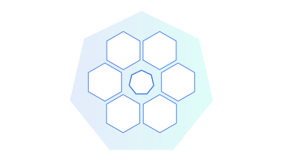
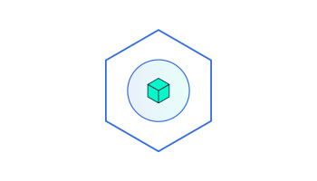
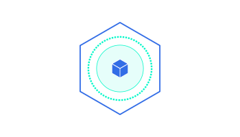
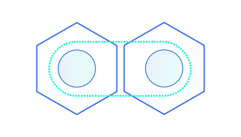
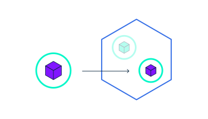
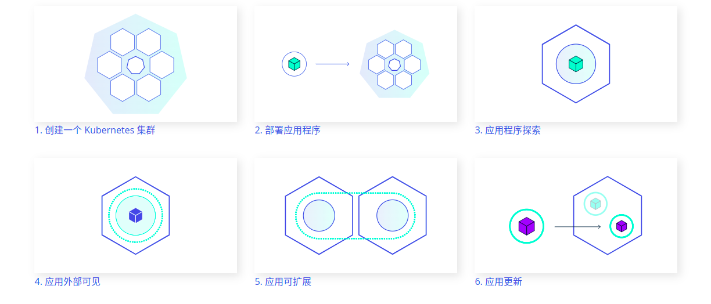

# 學習 Kubernetes 基礎知識

原文: [Learn Kubernetes Basics](https://kubernetes.io/docs/tutorials/kubernetes-basics/)

## Kubernetes 基礎

本教程介紹了 Kubernetes 集群編排系統的基礎知識。每個模塊包含關於 Kubernetes 主要特性和概念的一些背景信息，並使用 K3D 來創建一個 Kubernetes 集群來讓你可以自己管理一個簡單的集群及其容器化應用程序。

本教程中，你可以學習：

- 在集群上部署容器化應用程序
- 彈性部署
- 使用新的軟件版本，更新容器化應用程序
- 調試容器化應用程序

## Kubernetes 可以為你做些什麼?

通過現代的 Web 服務，用戶希望應用程序能夠 24/7 全天候使用，開發人員希望每天可以多次發布部署新版本的應用程序。容器化可以幫助軟件包達成這些目標，使應用程序能夠以簡單快速的方式發布和更新，而無需停機。 Kubernetes 幫助你確保這些容器化的應用程序在你想要的時間和地點運行，並幫助應用程序找到它們需要的資源和工具。 Kubernetes 是一個可用於生產的開源平台，根據 Google 容器集群方面積累的經驗，以及來自社區的最佳實踐而設計。

## Kubernetes 基礎模塊

|||
|--- | --- |
|[1. 創建一個 Kubernetes 集群](create-cluster.md)||
|[2. 部署應用程序](deploy-app.md)||
|[3. 應用程序探索](explore.md)||
|[4. 應用外部可見](expose.md)||
|[5. 應用可擴展](scale.md)||
|[6. 應用更新](update.md)||

