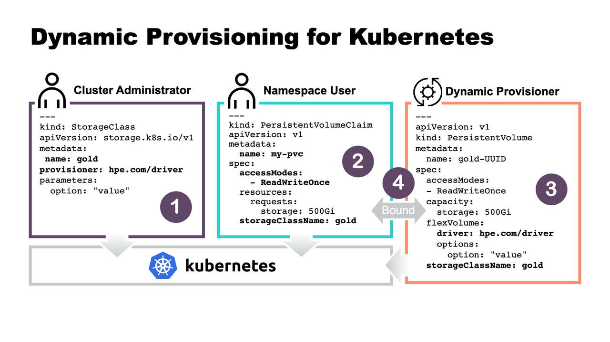

# 存儲管理 volume、PV/PVC

原文: [k8s入门教程十二:存储管理volume、PV/PVC](https://www.wumingx.com/k8s/kubernetes-volume-pvc.html)


Kubernetes 存儲管理按照發展的歷程，涉及到有 **Volume**，**PV** (Persistent Volume) 和 **PVC** (PersistentVolumeClaims),和 **StorageClass**。

**Volume** 是 K8S 最早提出的存儲卷的結構，主要解決容器和數據存儲的依賴關係，抽象底層驅動以支持不同的存儲類型；使用 **Volume** 需要了解底層存儲細節，因此提出了 **PV**，**Persistent Volume** 是由 K8S 管理員定義的存儲單元，應用端使用 **PersistentVolumeClaims** 聲明去調用 **PV** 存儲，進一步抽象了底層存儲；隨著 **PV** 數量的增加，管理員需要不停的定義 **PV** 的數量，衍生了通過 **StorageClass** 動態生成 **PV**，**StorageClass** 通過 **PVC** 中聲明存儲的容量，會調用底層的提供商生成 **PV**。

本教程先介紹 Volume 的使用，接著再介紹 PV，PVC 和 StorageClass。

- Volume 存儲卷，獨立於容器，後端和不同的存儲驅動對接
- PV Persistent Volume 持久化存儲卷，和 node 類似，是一種集群資源，由管理員定義，對接不同的存儲
- PVC PersistentVolumeClaims 持久化存儲聲明，和 pod 類似，作為 PV 的使用者
- StorageClass 動態存儲類型，分為靜態和動態兩種類型，通過在 PVC 中定義存儲類型，自動創建所需 PV

## 存儲概述

kubernetes 容器中的數據是{==臨時的==}，即當重啟重啟或 crash 後容器的數據將會丟失，此外容器之間有共享存儲的需求，所以 kubernetes 提供了 volume 存儲的抽象，volume 後端能夠支持多種不同的 plugin 驅動，通過 `.spec.volumes` 中定義一個存儲，然後在容器中 `.spec.containers.volumeMounts` 調用，最終在容器內部以目錄的形式呈現。

kubernetes 內置能支持多種不同的驅動類型，大體上可以分為四種類型：

1. kubernetes對象 API 驅動接口，實現其他對象調用，如configmap, secret，每種存儲支持不同的驅動
2. 本地臨時存儲，如 hostPath, emptyDir 等
3. 開源存儲驅動接口，如 lonhorn, rook 等
3. 公/私有雲驅動接口，如 awsElasticBlockStore 實現與 aws EBS 集成

### 本地臨時存儲

本地臨時存儲包括 hostPath、emptyDir 等。

#### emptyDir 臨時存儲

**emptyDir** 是一種臨時存儲，pod 創建的時候會在 node 節點上為容器申請一個臨時的目錄，跟隨容器的生命週期，如容器刪除，emptyDir 定義的臨時存儲空間也會隨之刪除，容器發生意外 crash 則不受影響，同時如果容器發生了遷移，其上的數據也會丟失，emptyDir 一般用於測試，或者緩存場景。

!!! info
    注意：一個容器崩潰了不會導致數據的丟失，因為容器的崩潰並不移除 pod.

emptyDir 的一些用途：

- 緩存空間，例如基於磁盤的歸併排序。
- 為耗時較長的計算任務提供檢查點，以便任務能方便地從崩潰前狀態恢復執行。
- 在 Web 服務器容器服務數據時，保存內容管理器容器獲取的文件。

```yaml title="volume-emptydir.yaml" hl_lines="11 12 14 15"
apiVersion: v1
kind: Pod
metadata:
  name: test-pod
spec:
  containers:
  - image: busybox:1.35
    name: test-container
    command: ["/bin/sh","-c","sleep 3600"]
    volumeMounts:
    - mountPath: /cache
      name: cache-volume
  volumes:
  - name: cache-volume
    emptyDir: {}
```

使用 kubectl 命令來創建 Pod:

```bash
$ kubectl apply -f volume-emptydir.yaml

pod/test-pd created
```

讓我們進入到Pod之中來檢查一下執行後的結果:

```bash
$ kubectl get pods

NAME       READY   STATUS    RESTARTS   AGE
test-pod   1/1     Running   0          24m

$ kubectl exec -it pod/test-pod -- /sh

/ # ls -la

total 48
drwxr-xr-x    1 root     root          4096 Aug 12 23:21 .
drwxr-xr-x    1 root     root          4096 Aug 12 23:21 ..
drwxr-xr-x    2 root     root         12288 Jul 29 01:38 bin
drwxrwxrwx    2 root     root          4096 Aug 12 23:21 cache
drwxr-xr-x    5 root     root           360 Aug 12 23:21 dev
drwxr-xr-x    1 root     root          4096 Aug 12 23:21 etc
drwxr-xr-x    2 nobody   nobody        4096 Jul 29 01:38 home
dr-xr-xr-x  483 root     root             0 Aug 12 23:21 proc
drwx------    1 root     root          4096 Aug 12 23:47 root
dr-xr-xr-x   13 root     root             0 Aug 12 23:21 sys
drwxrwxrwt    2 root     root          4096 Jul 29 01:38 tmp
drwxr-xr-x    3 root     root          4096 Jul 29 01:38 usr
drwxr-xr-x    1 root     root          4096 Aug 12 23:21 var

/ # cd cache/
/cache # echo 000 > a.txt
/cache # cat a.txt 

000

/cache # exit
```

當這個 pod 被刪除時，這個所有置放在 emptyDir 裡的文件也是會自動刪除的。

#### hostPath 主機存儲

!!! warning
    警告：
    HostPath 卷存在許多安全風險，最佳做法是盡可能避免使用 HostPath。當必須使用 HostPath 卷時，它的範圍應僅限於所需的文件或目錄，並以只讀方式掛載。

    如果通過 AdmissionPolicy 限制 HostPath 對特定目錄的訪問，則必須要求 volumeMounts 使用 readOnly 掛載以使策略生效。

**hostPath** 卷能將 node 宿主機節點文件系統上的文件或目錄掛載到您的 Pod 中。例如，hostPath 的一些用法有：

- 運行一個需要訪問 Docker 引擎內部機制的容器；請使用 hostPath 掛載 /var/lib/docker 路徑。
- 在容器中運行 cAdvisor 時，以 hostPath 方式掛載 /sys。
- 允許 Pod 指定給定的 hostPath 在運行 Pod 之前是否應該存在，是否應該創建以及應該以什麼方式存在。

除了必需的 `path` 屬性之外，用戶可以選擇性地為 hostPath 卷指定 `type`。支持的 `type` 值如下：

|hostPath Type 值	|行為|
|----------------|---|
|空字符串（默認）|用於向後兼容，這意味著在安裝 hostPath 卷之前不會執行任何檢查。|
|DirectoryOrCreate	|如果在給定路徑上什麼都不存在，那麼將根據需要創建空目錄，權限設置為 0755，具有與 Kubelet 相同的組和所有權。|
|Directory	|在給定路徑上必須存在的目錄。|
|FileOrCreate	|如果在給定路徑上什麼都不存在，那麼將在那裡根據需要創建空文件，權限設置為 0644，具有與 Kubelet 相同的組和所有權。|
|File	|在給定路徑上必須存在的文件。|
|Socket	|在給定路徑上必須存在的 UNIX 套接字。|
|CharDevice	|在給定路徑上必須存在的字符設備。|
|BlockDevice	|在給定路徑上必須存在的塊設備。|

當使用這種類型的卷時要小心，因為：

- 具有相同配置（例如從 podTemplate 創建）的多個 Pod 會由於節點上文件的不同而在不同節點上有不同的行為。
- 當 Kubernetes 按照計劃添加資源感知的調度時，這類調度機制將無法考慮由 hostPath 使用的資源。
- 基礎主機上創建的文件或目錄只能由 root 用戶寫入。您需要在特權容器中以 root 身份運行進程，或者修改主機上的文件權限以便容器能夠寫入 hostPath 卷。

由於本教程使用 K3D 作為 K8S 學習環境，下列的練習步驟需要搭配 K3D 所構建的環境。

1.在我們將保存數據的主機上創建目錄：

```bash
$ mkdir -p /tmp/k3dvol
```

2.創建集群並設定某個 Node path 掛載進 K8S 中：

```bash
$ k3d cluster create --volume /tmp/k3dvol:/tmp/k3dvol@server:0
```
3.創建 test-pod2 的宣告檔 `volume-hostpath.yaml`:

```yaml title="volume-hostpath.yaml" hl_lines="10 11 13 14 15 16"
apiVersion: v1
kind: Pod
metadata:
  name: test-pod2
spec:
  containers:
  - image: nginx:1.7.9
    name: test-container
    volumeMounts:
    - mountPath: /test-hostpath
      name: test-volume
  volumes:
  - name: test-volume
    hostPath:
      path: /tmp/k3dvol
      type: Directory
```

4.執行命令並驗證:

```bash hl_lines="36"
# 創建 Pod
$ kubectl create -f volume-hostpath.yaml

pod/test-pod2 created

# 檢查 Pod 狀態
$ kubectl get pod/test-pod2

NAME        READY   STATUS    RESTARTS   AGE
test-pod2   1/1     Running   0          30s

# 進入到容器裡頭來探查
$ kubectl exec -it pod/test-pod2 -- /bin/sh

# 打印容器的目錄 

$ ls -la

total 80
drwxr-xr-x   1 root root 4096 Aug 13 00:59 .
drwxr-xr-x   1 root root 4096 Aug 13 00:59 ..
drwxr-xr-x   2 root root 4096 Jan 27  2015 bin
drwxr-xr-x   2 root root 4096 Dec 24  2014 boot
drwxr-xr-x   5 root root  360 Aug 13 00:59 dev
drwxr-xr-x   1 root root 4096 Aug 13 00:59 etc
drwxr-xr-x   2 root root 4096 Dec 24  2014 home
drwxr-xr-x   1 root root 4096 Jan 27  2015 lib
drwxr-xr-x   2 root root 4096 Jan 27  2015 lib64
drwxr-xr-x   2 root root 4096 Jan 27  2015 media
drwxr-xr-x   2 root root 4096 Dec 24  2014 mnt
drwxr-xr-x   2 root root 4096 Jan 27  2015 opt
dr-xr-xr-x 506 root root    0 Aug 13 00:59 proc
drwx------   2 root root 4096 Jan 27  2015 root
drwxr-xr-x   1 root root 4096 Aug 13 00:59 run
drwxr-xr-x   2 root root 4096 Jan 27  2015 sbin
drwxr-xr-x   2 root root 4096 Jun 10  2012 selinux
drwxr-xr-x   2 root root 4096 Jan 27  2015 srv
dr-xr-xr-x  13 root root    0 Aug 13 00:59 sys
drwxrwxr-x   2 1000 1000 4096 Aug 13 00:53 test-hostpath
drwxrwxrwt   1 root root 4096 Jan 27  2015 tmp
drwxr-xr-x   1 root root 4096 Jan 27  2015 usr
drwxr-xr-x   1 root root 4096 Jan 27  2015 var

# 創建一個檔案並寫入資料
$ echo $(hostname)
$ echo $(hostname) > /test-hostpath/hostname.txt
$ exit
```

退出 pod 並從宿主機上的目錄讀取內容：

```bash
$ cat /tmp/k3dvol/hostname.txt

test-pod2
```

刪除這個文件不會刪除掉在 hostPath 的檔案夾裡的數據與檔案。

## PV 與 PVC


**PV** 的全稱是：PersistentVolume（持久化卷），是對底層的共享存儲的一種抽象，PV 由管理員進行創建和配置，它和具體的底層的共享存儲技術的實現方式有關，比如 Ceph、GlusterFS、NFS 等，都是通過插件機製完成與共享存儲的對接。

**PVC** 的全稱是：PersistentVolumeClaim（持久化卷聲明），PVC 是用戶存儲的一種聲明，PVC 和 Pod 比較類似，Pod 消耗的是節點上的資源，PVC 消耗的是 PV 資源，Pod 可以請求 CPU 和內存，而 PVC 可以請求特定的存儲空間和訪問模式。對於真正使用存儲的用戶不需要關心底層的存儲實現細節，只需要直接使用 PVC 即可。


### 生命週期

PV 是集群中的資源。 PVC 是對這些資源的請求。 PV 和 PVC 之間的相互作用遵循這個生命週期:

`Provisioning -> Binding -> Using -> Releasing -> Recycling`


#### Provisioning

這裡有兩種PV的提供方式:靜態或者動態。

- Static：集群管理員創建多個 PV。它們攜帶可供集群用戶使用的真實存儲的詳細信息。它們存在於 Kubernetes API 中，可用於消費。
- Dynamic：當管理員創建的靜態 PV 都不匹配用戶的 PersistentVolumeClaim 時，集群可能會嘗試為 PVC 動態配置卷。此配置基於 StorageClasses：PVC 必須請求一個類，並且管理員必須已創建並配置該類才能進行動態配置。



#### Binding 綁定

在動態配置的情況下，用戶創建或已經創建了具有特定數量的存儲請求和特定訪問模式的 PersistentVolumeClaim。主機中的控制迴路監視新的 PVC，找到匹配的 PV（如果可能），並將它們綁定在一起。

如果為新的 PVC 動態配置 PV，則循環將始終將該 PV 綁定到 PVC。否則，用戶總是至少得到他們要求的內容，但是卷可能超出了要求。一旦綁定，PersistentVolumeClaim 綁定是排他的，不論是用於那種綁定模式。

如果匹配的捲不存在，PVC將保持無限期循環檢查。當隨著匹配卷變得可用，PVC將被綁定。例如，提供許多50Gi PV的集群將不匹配要求 100Gi 的 PVC。當集群中添加 100Gi PV 時，可以綁定PVC。

PVC 保護的目的是確保由 pod 正在使用的 PVC 不會從系統中移除，因為如果被移除的話可能會導致數據丟失 當啟用 PVC 保護功能時，如果用戶刪除了一個 pod 正在使用的 PVC，則該 PVC 不會被立即刪除。 PVC 的 刪除將被推遲，直到 PVC 不再被任何 pod 使用。

#### PV 訪問模式

PersistentVolume 卷可以用資源提供者所支持的任何方式掛載到宿主系統上。如下表所示，提供者（驅動）的能力不同，每個 PV 卷的訪問模式都會設置為對應卷所支持的模式值。例如，NFS 可以支持多個讀寫客戶，但是某個特定的 NFS PV 卷可能在服務器上以只讀的方式導出。每個 PV 卷都會獲得自身的訪問模式集合，描述的是特定 PV 卷的能力。

訪問模式有下列四種：

|訪問模式|說明|
|------|----|
|**ReadWriteOnce**|卷可以被一個節點以讀寫方式掛載。 ReadWriteOnce 訪問模式也允許運行在同一節點上的多個 Pod 訪問卷。|
|**ReadOnlyMany**|卷可以被多個節點以只讀方式掛載。|
|**ReadWriteMany**|卷可以被多個節點以讀寫方式掛載。|
|**ReadWriteOncePod**|卷可以被單個 Pod 以讀寫方式掛載。如果你想確保整個集群中只有一個 Pod 可以讀取或寫入該 PVC， 請使用 ReadWriteOncePod 訪問模式。這只支持 CSI 卷以及需要 Kubernetes 1.22 以上版本。|

在命令行接口（CLI）中，訪問模式也使用以下縮寫形式：

- RWO - ReadWriteOnce
- ROX - ReadOnlyMany
- RWX - ReadWriteMany
- RWOP - ReadWriteOncePod

下表是一些常用的 Volume 插件支持的訪問模式：

|Volume 插件	|ReadWriteOnce	|ReadOnlyMany	|ReadWriteMany	|ReadWriteOncePod|
|---------------|---------------|-------------|---------------|----------------|
|AWSElasticBlockStore	|✓	|-	|-	|-|
|AzureFile	|✓	|✓	|✓	|-|
|AzureDisk	|✓	|-	|-	|-|
|CephFS	|✓	|✓	|✓	|-|
|Cinder	|✓	|-	(if multi-attach volumes are available)	|-|
|CSI	|depends on the driver	|depends on the driver	|depends on the driver	|depends on the driver|
|FC	|✓	|✓	|-	|-|
|FlexVolume	|✓	|✓	|depends on the driver	|-|
|Flocker	|✓	|-	|-	|-|
|GCEPersistentDisk	|✓	|✓	|-	|-|
|Glusterfs	|✓	|✓	|✓	|-|
|HostPath	|✓	|-	|-	|-|
|iSCSI	|✓	|✓	|-	|-|
|Quobyte	|✓	|✓	|✓	|-|
|NFS	|✓	|✓	|✓	|-|
|RBD	|✓	|✓	|-	|-|
|VsphereVolume	|✓	|-	|- (works when Pods are collocated)	|-|
|PortworxVolume	|✓	|-	|✓	|-|
|StorageOS	|✓	|-	|-	|-|

#### 回收策略 Reclaiming

目前的回收策略有：

- **Retain** -- 手動回收
- **Recycle** -- 基本擦除 (rm -rf /thevolume/*)
- **Delete** -- 諸如 AWS EBS、GCE PD、Azure Disk 或 OpenStack Cinder 卷這類關聯存儲資產也被刪除
  
目前，僅 NFS 和 HostPath 支持回收（Recycle）。 AWS EBS、GCE PD、Azure Disk 和 Cinder 卷都支持刪除（Delete）。

#### 狀態

卷可以處於以下的某種狀態：

- **Available**（可用）：一塊空閒資源還沒有被任何聲明綁定
- **Bound**（已綁定）：卷已經被聲明綁定
- **Released**（已釋放）：聲明被刪除，但是資源還未被集群重新聲明
- **Failed**（失敗）：該卷的自動回收失敗 命令行會顯示綁定到 PV 的 PVC 的名稱

### 實例演示 


kubernetes 提供的 hostPath 給持久化提供了相當大的便利, 但有一個問題是, 每次都需要手動提前在機器上創建相應的目錄來做為被調度應用的持久化目錄, 不是很方便, 有沒有辦法可以自動創建呢?

對於 K3D，rancher 也提供了相應的工具 [local-path-provisioner](https://github.com/rancher/local-path-provisioner)。在其它不同的 K8S 環境中, 會因應不同的 Volume Driver 的設置而會有不同的 Storage Class 的配置。

檢查集群的Storage Class對象:

```bash
$ kubectl get storageclass

NAME                   PROVISIONER             RECLAIMPOLICY   VOLUMEBINDINGMODE      ALLOWVOLUMEEXPANSION   AGE
local-path (default)   rancher.io/local-path   Delete          WaitForFirstConsumer   false                  3h22m
```

#### 1. 創建 PVC

```yaml title="volume-pvc.yaml"
apiVersion: v1
kind: PersistentVolumeClaim
metadata:
  name: local-path-pvc
spec:
  accessModes:
    - ReadWriteOnce
  storageClassName: local-path
  resources:
    requests:
      storage: 128Mi
```

使用 `kubectl` 命令來執行與檢視結果:

```bash
$ kubectl apply -f volume-pvc.yaml

persistentvolumeclaim/local-path-pvc created

$ kubectl get pvc

NAME             STATUS    VOLUME   CAPACITY   ACCESS MODES   STORAGECLASS   AGE
local-path-pvc   Pending                                      local-path     13s
```

此時 PVC 的狀態是: **Pending**

#### 2. 創建 Pod 來掛載 PVC

```yaml title="volume-pod-pvc.yaml"
apiVersion: v1
kind: Pod
metadata:
  name: test-pod3
spec:
  containers:
  - name: volume-test
    image: nginx:stable-alpine
    imagePullPolicy: IfNotPresent
    volumeMounts:
    - name: volv
      mountPath: /data
    ports:
    - containerPort: 80
  volumes:
  - name: volv
    persistentVolumeClaim:
      claimName: local-path-pvc
```

使用 kubectl 命令來執行與檢視結果:

```bash
$ kubectl apply -f volume-pod-pvc.yaml 

pod/test-pod3 created

$ kubectl get pvc

NAME             STATUS   VOLUME                                     CAPACITY   ACCESS MODES   STORAGECLASS   AGE
local-path-pvc   Bound    pvc-b2b26c21-1818-4d5d-a646-b32f8439652a   128Mi      RWO            local-path     3m57s

$ kubectl get pv

NAME                                       CAPACITY   ACCESS MODES   RECLAIM POLICY   STATUS   CLAIM                    STORAGECLASS   REASON   AGE
pvc-b2b26c21-1818-4d5d-a646-b32f8439652a   128Mi      RWO            Delete           Bound    default/local-path-pvc   local-path              40s

$ kubectl get pod/test-pod3

NAME        READY   STATUS    RESTARTS   AGE
test-pod3   1/1     Running   0          90s
```

#### 3. 在 pod 中寫一些東西到掛載PVC的目錄 `/data/test`

```bash
$ kubectl exec pod/test-pod3 -- sh -c "echo local-path-test > /data/test"
```

#### 4. 刪除 pod

```bash
$ kubectl delete pod/test-pod3

pod "test-pod3" deleted
```

#### 5. 確認 pod 消失後，重新創建 pod

```bash
$ kubectl apply -f volume-pod-pvc.yaml 

pod/test-pod3 created
```

#### 6. 檢查卷內容

```bash
$ kubectl exec pod/test-pod3 -- sh -c "cat /data/test"

local-path-test
```

#### 7. 刪除 pod 和 pvc

```bash
$ kubectl delete -f volume-pod-pvc.yaml
pod "test-pod3" deleted

$ kubectl get pv

NAME                                       CAPACITY   ACCESS MODES   RECLAIM POLICY   STATUS   CLAIM                    STORAGECLASS   REASON   AGE
pvc-b2b26c21-1818-4d5d-a646-b32f8439652a   128Mi      RWO            Delete           Bound    default/local-path-pvc   local-path              10m

$ kubectl get pvc

NAME             STATUS   VOLUME                                     CAPACITY   ACCESS MODES   STORAGECLASS   AGE
local-path-pvc   Bound    pvc-b2b26c21-1818-4d5d-a646-b32f8439652a   128Mi      RWO            local-path     14m


$ kubectl delete -f volume-pvc.yaml

persistentvolumeclaim "local-path-pvc" deleted
```
