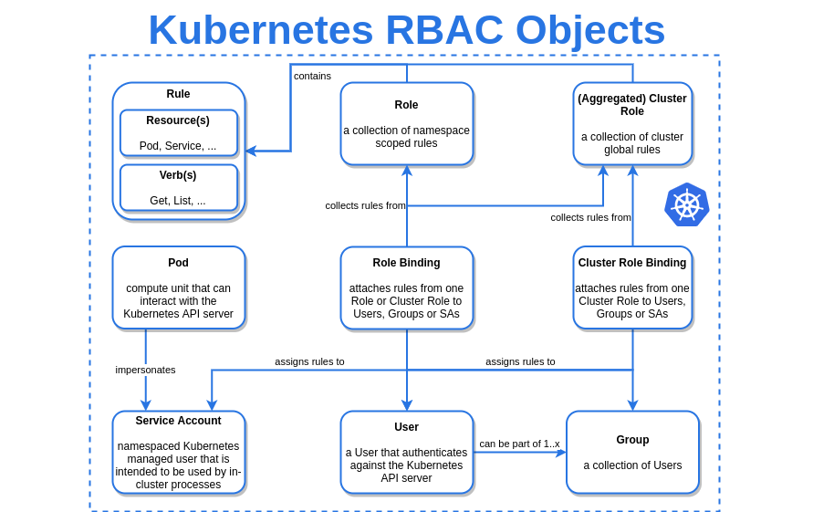

# Kubernetes RBAC (Role Base Access Control)

k8s 在 1.8 版之後，引用了 `Role-Base Access Control` (RBAC，基於角色的訪問控制) 做為授權 (Authorization) 的基礎，也就是一種管制訪問 k8s API 的機制。管理者可以透過 `rbac.authorization.k8s.io` 這個 API 群組來進行動態的管理配置。

透過適當的角色配置與授權分配，管理者可以決定使用者能夠使用哪些功能。例如允許某個角色能新增 Pod 或只能夠察看但是不能新增等等。

另外要特別注意的是，在 RBAC 下的`角色`會被賦予不同的的權限 (permission)，而這些權限是採取添加的方式指定，意思是只會有角色能存取某個動作而不會有角色不能存取某個動作。

因此，作為一個優秀的管理者，你應該適度的配置角色並決定不同角色可以允許操作什麼項目。




## Role vs ClusterRole

`Role` 是用來定義在某個`命名空間`底下的`角色`，而 `ClusterRole` 則是屬於`叢集通用的角色`。另外 `ClusterRole` 除了可以配置 `Role` 的權限內容外，由於是 `Cluster` 範圍的角色，因此還能夠配置:

- 叢集範圍的資源，例如 Nodes
- 非資源類型的 endpoints，例如 /healthz
- 跨命名空間的資源，例如 kubectl get pods --all-namespace

看個例子：

```yaml title="role.yaml"
---
apiVersion: rbac.authorization.k8s.io/v1
kind: Role
metadata:
  namespace: default   <=== 定義在 default 命名空間中
  name: configmap-editor   <=== Role 的名稱
rules:
- apiGroups: [""]   <=== "" 表示 /api/vi 即 apiVersion:v1
  resources: ["configmap"]
  verbs: ["get", "list", "watch", "create", "update", "patch", "delete"]
```

`role.yaml` 指定了一個 `default` 命名空間內的 `Role` 物件，並允許這個 `Role` 能夠對 `ConfigMap` 進行操作。這邊可以知道在定義 `Role` 的時候必須:

- 指定 `apiGroup`：因為 `ConfigMap` 是屬於 `apiVersion:v1` 底下的物件，"" 代表的意思就是 `apiVersion:v1`
- 指定要操作的資源 `resource`：這邊的範例是 `ConfigMap`
- 授權動作 `verbs`：記得是添加的方式指定該角色能在指定資源做什麼操作，上面例子包含 `get`, `list`, `watch`, `create`, `update`, `patch` 和 `delete`。

如果是 `ClusterRole`：

```yaml title="clusterrole.yaml"
---
apiVersion: rbac.authorization.k8s.io/v1
kind: ClusterRole
metadata:
  name: secret-reader
rules:
- apiGroups: [""]   <=== "" 表示 /api/vi 即 apiVersion:v1
  resources: ["secrets"]
  verbs: ["get", "list", "watch"]  <=== 允許讀取 Secret
```

上面的範例，我們建立了一個可以讀取 `Secret` 的 `ClusterRole`。其實跟 `Role` 很類似，差別在於 `ClusterRole` 不需要指定命名空間。

## RoleBinding vs ClusterRoleBinding

有了 `Role` 或 `ClusterRole` 之後，表示某個命名空間內或是叢集內有被賦予權限的角色，接下來我們需要透過 `RoleBinding` 或 `ClusterRoleBinding` 的方式來綁定。

> 如果只有宣告 Role 或 ClusterRole 但未綁定，則毫無用處

綁定的對象可以是 `User`, `Group`, 或者是 `Service Account`，例如:

**User:**

```yaml
subjects:
- kind: User   <=== 指定對象為 User
  name: "james@example.com"   <=== User 名稱
  apiGroup: rbac.authorization.k8s.io
```

**Group:**

```yaml
subjects:
- kind: Group   <=== 指定對象為 Group
  name: "frontend-admins"   <=== Group 名稱
  apiGroup: rbac.authorization.k8s.io
```

**Service Account：**

```yaml
subjects:
- kind: ServiceAccount   <=== 指定對象為 Service Account
  name: default   <=== Service Account 名稱
  namespace: kube-system   <=== 命名空間
```

這邊特別說明一下 `Service Account`。如果在 k8s 部署像 Jenkins 這類的 CI/CD 工具時，一般都會建立自己的`命名空間`。而當產生一個新的`命名空間`時，預設就會有一個 `default` 的 `Service Account`。例如：

```bash
$ kubectl create namespace jenkins
namespace "jenkins" created

$ kubectl get serviceaccount --namespace=jenkins
NAME      SECRETS   AGE
default   1         4m   <=== 會有一個預設的 Service Account
```

而 Jenkins 會參考這個 `default` 來取得操作 `k8s` 的權限，但是在預設的情況下，`default` 不會擁有任何的權限，因此我們必須要設定 `default` 的權限，即搭配上面的 `RoleBinding` 或 `ClusterRoleBinding` 才能夠控制這個 `default` 能夠操作的權限。

底下是一個綁定上面 jenkins 命名空間的 `Service Account` 例子

```yaml title="clusterrolebinding.yaml"
---
apiVersion: rbac.authorization.k8s.io/v1
kind: ClusterRoleBinding
metadata:
  name: secret-reader
subjects:
- kind: ServiceAccount   <=== 指定為 jenkins 底下的 default
  name: default
  namespace: jenkins
roleRef:
  kind: ClusterRole      <=== 綁定 ClusterRole
  name: secret-reader
  apiGroup: rbac.authorization.k8s.io
```

另外，你也可以透過指令來綁定，例如如果想要允許上面的 `default` 這個 `Service Account` 能夠擁有整個叢集的管理權限，我們可以建立一個 `ClusterRoleBinding`：

```bash
$ kubectl create clusterrolebinding jenkins-admin \
--clusterrole=admin \
--serviceaccount=jenkins:default
```

- `clusterrolebinding jenkins-admin`：建立一個 `ClusterRoleBinding`
- `--clusterrole=admin`：指定權限為 `admin`
- `--serviceaccount=jenkins:default`：綁定 jenkins 的下的 `default`