# ArgoCD 入門

原文: https://redhat-scholars.github.io/argocd-tutorial/argocd-tutorial/02-getting_started.html

確認 Argo CD 已啟動並運行後，讓我們探索如何訪問和管理 Argo CD。

## 曝露 ArgoCD 服務

為了簡化學習，我們使用 `kubectl port-forward` 來將 `argocd` 的服務曝露出來。打開一個新的 `terminal` 並輸入下列的命令：

```bash
$ kubectl port-forward svc/argocd-server -n argocd 8443:443 --address='0.0.0.0'
```

!!! tip
    Kubernetes 為我們提供了一個功能，可以通過 Kubernetes 客戶端主機端口轉發在 Kubernetes 內部網絡中運行的應用程序。默認情況下它綁定到 127.0.0.1 並且它不會接受來自外部主機的請求。

    端口轉發命令的語法如下。

    ```bash
    kubectl port-forward svc/[service-name] -n [namespace] [external-port]:[internal-port]
    ```

    我在下面給出一個端口轉發命令的例子。下面的命令會將在端口 443 中運行的服務端口轉發到 kubectl 客戶端主機中的端口 8443。

    ```bash
    $ kubectl port-forward svc/argocd-server -n argocd 8443:443
    ```

    當我嘗試使用客戶端計算機的 IP 地址和端口從另一台計算機打開此 URL 時，它不起作用。原因是因為8080端口綁定了 `127.0.0.1`。

    為了讓它工作，我們必須讓這個端口監聽 0.0.0.0。

    這可以通過在命令中添加附加參數來輕鬆實現。語法如下。

    ```bash
    $ kubectl port-forward svc/[service-name] -n [namespace] [external-port]:[internal-port] --address='0.0.0.0'
    ```

有關 Kubernetes Port Forwarding 的詳細說明參閱: [Use Port Forwarding to Access Applications in a Cluster](https://kubernetes.io/docs/tasks/access-application-cluster/port-forward-access-application-cluster/)


## 連接到 ArgoCD

您可以使用 CLI 或 Web 控制台連接到 ArgoCD。

默認情況下，ArgoCD 會生成一個管理員用戶，以及在部署 ArgoCD 時生成的隨機密碼。

### 使用 CLI 連接

安裝 `argocd` CLI 的工具:

```bash
$ curl -sSL -o /usr/local/bin/argocd https://github.com/argoproj/argo-cd/releases/latest/download/argocd-linux-amd64
$ wget https://github.com/argoproj/argo-cd/releases/download/v2.4.3/argocd-linux-amd64
$ chmod +x /usr/local/bin/argocd
```

### 使用 argocd CLI 登錄 ArgoCD 實例

取得部署 ArgoCD 時生成的隨機密碼:

```bash
$ argoPass=$(kubectl -n argocd get secret argocd-initial-admin-secret -o jsonpath="{.data.password}" | base64 -d)

$ echo $argoPass
```

將 ArgoCD 網絡位址設成環境變數：

``` bash
# base port-forward setting
$ argoURL=0.0.0.0:8443

$ echo $argoURL
```

使用 ArgoCD cli 登錄到 ArgoCD：

```bash
$ argocd login --insecure --grpc-web $argoURL  --username admin --password $argoPass

'admin:login' logged in successfully
Context '0.0.0.0:8443' updated
```

### 與 Web 控制台連接

使用瀏覽器來連接 ArgoCD 控制台。

使用用戶 `admin` 和上一步中提取的密碼訪問 ArgoCD 控制台：


登錄後，您應該會看到以下頁面。


這是 Argo CD Web UI。

## 部署範例應用程序

對於本教程，我們將使用 Redhat 在 Github 公開的 GitOps 範例存儲庫。我們將使用這個 repo 來部署我們的第一個應用程序並包含清單來部署我們的示例應用程序。

  - Redhat Developer Demo: https://github.com/redhat-developer-demos/openshift-gitops-examples


### 應用程序 Manifest 更新與保存在 Git Repo

應用程序要設定在 Kubernetes 裡的 manifet 清單包括：

**Namespace:**

- 源碼路徑: [openshift-gitops-examples/apps/bgd/overlays/bgd/bgd-ns.yaml](https://github.com/redhat-developer-demos/openshift-gitops-examples/blob/minikube/apps/bgd/overlays/bgd/bgd-ns.yaml)

```yaml title="bgd-namespace.yaml"
apiVersion: v1
kind: Namespace
metadata:
  name: bgd
spec: {}
status: {}
```

**Deployment:**

- 源碼路徑: [openshift-gitops-examples/apps/bgd/overlays/bgd/bgd-deployment.yaml](https://github.com/redhat-developer-demos/openshift-gitops-examples/blob/minikube/apps/bgd/overlays/bgd/bgd-deployment.yaml)

```yaml title="bgd-deployment.yaml"
---
apiVersion: apps/v1
kind: Deployment
metadata:
  labels:
    app: bgd
  name: bgd
  namespace: bgd
spec:
  replicas: 1
  selector:
    matchLabels:
      app: bgd
  strategy: {}
  template:
    metadata:
      labels:
        app: bgd
    spec:
      containers:
      - image: quay.io/redhatworkshops/bgd:latest
        name: bgd
        env:
        - name: COLOR
          value: "blue"
        resources: {}
---
```

**Service:**

NodePort 類型的服務：

- 源碼路徑: [openshift-gitops-examples/apps/bgd/overlays/bgd/bgd-svc.yaml](https://github.com/redhat-developer-demos/openshift-gitops-examples/blob/minikube/apps/bgd/overlays/bgd/bgd-svc.yaml)


```yaml title="bgd-svc.yaml"
---
apiVersion: v1
kind: Service
metadata:
  labels:
    app: bgd
  name: bgd
  namespace: bgd
spec:
  type: NodePort
  ports:
  - port: 8080
    protocol: TCP
    targetPort: 8080
  selector:
    app: bgd
---
```

**Ingress:**

- 源碼路徑: [openshift-gitops-examples/apps/bgd/overlays/bgd/bgd-ingress.yaml](https://github.com/redhat-developer-demos/openshift-gitops-examples/blob/minikube/apps/bgd/overlays/bgd/bgd-ingress.yaml)

```yaml title="bgd-ingress.yaml"
apiVersion: networking.k8s.io/v1
kind: Ingress
metadata:
  name: bgd
spec:
  rules:
    - host: bgd.devnation
      http:
        paths:
          - path: /
            pathType: Prefix
            backend:
              service:
                name: bgd
                port:
                  number: 8080
```

### 設定 應用程序 Argo 的 Application 物件

ArgoCD 定義了一個 Kubernetes 客製的API (CRD) 物件 `Application`。你必須這樣定義 `Application` 後 ArgoCD 才知道如何在 Kubernetes 集群中應用這些清單。


為此，您可以在 ArgoCD 中定義和應用應用程序清單。讓我們檢查用於部署我們的應用程序的 [bgd-app.yaml](https://github.com/redhat-scholars/argocd-tutorial/blob/master/assets/bgd-app/bgd-app.yaml)並將其分解一下：

```yaml title="bgd-app.yaml"
apiVersion: argoproj.io/v1alpha1
kind: Application
metadata:
  name: bgd-app
  namespace: argocd
spec:
  destination:
    namespace: bgd
    server: https://kubernetes.default.svc # 1
  project: default # 2
  source: # 3
    path: apps/bgd/overlays/bgd
    repoURL: https://github.com/redhat-developer-demos/openshift-gitops-examples
    targetRevision: minikube
  syncPolicy: # 4
    automated:
      prune: true
      selfHeal: false
    syncOptions:
    - CreateNamespace=true
```

1. 目標服務器是我們安裝 ArgoCD 的服務器。
2. 在 ArgoCD 的默認項目 (.spec.project) 中安裝應用程序。
3. YAML 所在的清單存儲庫和要查找的路徑。
4. syncPolicy 設置為 false。請注意，您可以讓 Argo CD 自動同步 repo。

`Application` CR (CustomResource) 可以通過運行以下命令來應用：

```bash
$ kubectl apply -f documentation/modules/ROOT/examples/minikube/bgd-app/bgd-app.yaml

application.argoproj.io/bgd-app created
```

我們可在 ArgoCD UI 中觀察到 `bgd-app` 的創建。


點擊此“卡片”將帶您進入概覽頁面。您可能會看到它仍在進行中或完全同步。


!!! tip
    您可能需要點擊此頁面上的顯示隱藏資源才能查看全部內容

此時應用程序應該已啟動並正在運行。

您可以看到使用以下命令創建的所有資源：

```bash
$ kubectl get all -n bgd
```

輸出應如下所示：

```bash
NAME                       READY   STATUS    RESTARTS   AGE
pod/bgd-788cb756f7-kz448   1/1     Running   0          10m

NAME          TYPE        CLUSTER-IP       EXTERNAL-IP   PORT(S)    AGE
service/bgd   ClusterIP   172.30.111.118   <none>        8080/TCP   10m

NAME                  READY   UP-TO-DATE   AVAILABLE   AGE
deployment.apps/bgd   1/1     1            1           10m
```

首先等待部署完成：

```bash
$ kubectl rollout status deploy/bgd -n bgd

deployment "bgd" successfully rolled out
```

然後訪問您的應用程序：

將跑 K3D 的主機 IP 和 Ingress 裡定義的主機名 `bgd.devnation` 添加到你的主機文件中，例如 `/etc/hosts`。

``` title="/etc/hosts" hl_lines="3"
127.0.0.1	localhost
127.0.1.1	dxlab-ThinkPad-T580
0.0.0.0 bgd.devnation bgdk.devnation 

# The following lines are desirable for IPv6 capable hosts
::1     ip6-localhost ip6-loopback
fe00::0 ip6-localnet
ff00::0 ip6-mcastprefix
ff02::1 ip6-allnodes
ff02::2 ip6-allrouters
```

!!! info
    由於我們要使用 `Ingress` 來接入佈署在 Kubernetes 集群裡的 application。在 Kubernetes 中主要有兩種模式:

    **模式1. 使用路徑來進行對不同服務的映射**

    

    **模式2. 使用 Domain Name (Hostname) 來進行對不同服務的映射**

    

    本範例使用的是 **模式2**。


我們的 Kubernetes 是使用下列的命令所創建的:

```bash
$ k3d cluster create [Cluster Name] -p "8081:80@loadbalancer"
```

代表著我們把 K3D 裡的 `Ingress Control` 映射到本機的 `8081` 端口。

因此你可使用瀏覽器 `http://bgd.devnation:8081` 來連接到剛剛佈署的應用程序。

您的應用程序應如下所示。


讓我們介紹一個變化！修補實時清單以將框的顏色從藍色更改為綠色：

```bash
$ kubectl -n bgd patch deploy/bgd --type='json' -p='[{"op": "replace", "path": "/spec/template/spec/containers/0/env/0/value", "value":"green"}]'
```

等待 rollout 完成：

```bash
$ kubectl rollout status deploy/bgd -n bgd
```

如果您刷新您的應用程序正在運行的選項卡，您現在應該會看到一個綠色方塊。


查看您的 Argo CD Web UI，您可以看到 Argo 將您的應用程序檢測為 “**Out of Sync**”。


上述的結果說明了在一般CI/CD的流水線的設計中如果允許開發者/運維者可直接操縱 Kubernetes 會導致的結果。


您可以通過 Argo CD 再次同步您的應用程序：

- 首先點擊 `SYNC`
- 然後點擊　`SYNCHRONIZE`

相反，您可以運行：

```bash
$ argocd app sync bgd-app
```

同步過程完成後，Argo CD UI 應該將應用程序標記為同步。


如果您在運行應用程序的選項卡上重新加載頁面。它應該回到藍色方塊。


您可以通過設置 `Application` 的 manifest 來設置 Argo CD 以自動糾正漂移。

例子：

```
spec:
  syncPolicy:
    automated:
      prune: true
      selfHeal: true
```

或者，在我們的例子中，事後通過運行以下命令：

```baSH
$ kubectl patch application/bgd-app -n argocd --type=merge -p='{"spec":{"syncPolicy":{"automated":{"prune":true,"selfHeal":true}}}}'
```

上述的結果說明了在一般CI/CD的流水線的設計中如果允許開發者/運維者可直接操縱 Kubernetes 會導致的結果。

## GitOps 概念回顧

- CI/CD Pipeline 內不進行任何部署動作
- 資源的描述狀態 (Yaml/Helm Chart) 放在 Git 裡面，Git 作為 Single Source of Truth的角色
- Kubernetes 內部有一個 Controller 會定期去偵測 Git 的變化，並且把 Git 內的變動都更新到 Kubernetes 裡面

這意味者任何人如果想要對 Kubernetes Cluster 進行修改，只有一個辦法就是 更新 Git Repo，一旦 Git Repo 內描述的 Yaml/Helm Chart 有任何修改，Kubernetes Cluster 內的 Controller 會負責將這些變動的差異性更新到 Kubernetes Cluster 內。

因此 Git repo 就是唯一的來源，同時透過 Git 版本控制的特性，如果想要針對資源進行版本更動, rollback 等操作，直接針對 Git 管理（譬如 git revert)。

此外，GitOps 的過程中，任何人都不應該直接對 Kubernetes Cluster 直接操作，因此也不需要將 KUBECONFIG 這個檔案給分享出去，因此安全性的隱憂也就迎刃而解。

