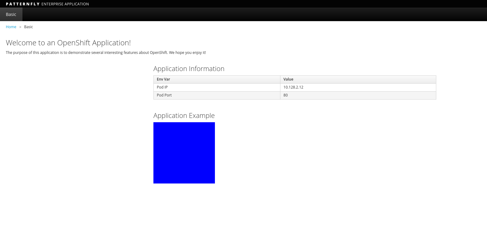

# ArgoCD 入門

確認 Argo CD 已啟動並運行後，讓我們探索如何訪問和管理 Argo CD。

## 連接到 ArgoCD

您可以使用 CLI 或 Web 控制台連接到 ArgoCD。

默認情況下，ArgoCD 會生成一個管理員用戶，以及在部署 ArgoCD 時生成的隨機密碼。

### 使用 CLI 連接

```bash
curl -sSL -o /usr/local/bin/argocd https://github.com/argoproj/argo-cd/releases/latest/download/argocd-linux-amd64
wget https://github.com/argoproj/argo-cd/releases/download/v2.4.3/argocd-linux-amd64
chmod +x /usr/local/bin/argocd
```

使用 argocd CLI 登錄 ArgoCD 實例：

```bash
argoPass=$(kubectl -n argocd get secret argocd-initial-admin-secret -o jsonpath="{.data.password}" | base64 -d)

echo $argoPass
```

獲取 ArgoCD 網址：

``` bash
argoURL=$(minikube service argocd-server -n argocd --url | tail -n 1 | sed -e 's|http://||')

echo $argoURL
```

使用 ArgoCD cli 登錄到 ArgoCD：

```bash
argocd login --insecure --grpc-web $argoURL  --username admin --password $argoPass

'admin:login' logged in successfully
Context '192.168.49.2:31600' updated
```

### 與 Web 控制台連接

使用 minikube 服務公開 ArgoCD 控制台。

```bash
minikube service argocd-server -n argocd --url
```

使用用戶 `admin` 和上一步中提取的密碼訪問 ArgoCD 控制台：


登錄後，您應該會看到以下頁面。


這是 Argo CD Web UI。

## 部署示例應用程序

對於本教程，我們將使用我們的 GitOps 存儲庫。我們將使用這個 repo 來部署我們的第一個應用程序並包含清單來部署我們的示例應用程序。

這些清單包括：

**Namespace:**

```yaml title="bgd-namespace.yaml"
apiVersion: v1
kind: Namespace
metadata:
  name: bgd
spec: {}
status: {}
```

**Deployment:**

```yaml title="bgd-deployment.yaml"
---
apiVersion: apps/v1
kind: Deployment
metadata:
  labels:
    app: bgd
  name: bgd
  namespace: bgd
spec:
  replicas: 1
  selector:
    matchLabels:
      app: bgd
  strategy: {}
  template:
    metadata:
      labels:
        app: bgd
    spec:
      containers:
      - image: quay.io/redhatworkshops/bgd:latest
        name: bgd
        env:
        - name: COLOR
          value: "blue"
        resources: {}
---
```

**Service:**

NodePort 類型的服務：

```yaml title="bgd-svc.yaml"
---
apiVersion: v1
kind: Service
metadata:
  labels:
    app: bgd
  name: bgd
  namespace: bgd
spec:
  type: NodePort
  ports:
  - port: 8080
    protocol: TCP
    targetPort: 8080
  selector:
    app: bgd
---
```

**Ingress:**

```yaml title="bgd-ingress.yaml"
apiVersion: networking.k8s.io/v1
kind: Ingress
metadata:
  name: bgd
spec:
  rules:
    - host: bgd.devnation
      http:
        paths:
          - path: /
            pathType: Prefix
            backend:
              service:
                name: bgd
                port:
                  number: 8080
```

總的來說，這被稱為 ArgoCD 中的 `Application`。因此，您必須這樣定義它才能在集群中應用這些清單。

為此，您可以在 ArgoCD 中定義和應用應用程序清單。讓我們檢查用於部署我們的應用程序的 [ArgoCD 應用程序清單](https://github.com/redhat-scholars/argocd-tutorial/blob/master/assets/bgd-app/bgd-app.yaml)並將其分解一下：

```yaml title="bgd-app.yaml"
apiVersion: argoproj.io/v1alpha1
kind: Application
metadata:
  name: bgd-app
  namespace: argocd
spec:
  destination:
    namespace: bgd
    server: https://kubernetes.default.svc # 1
  project: default # 2
  source: # 3
    path: apps/bgd/overlays/bgd
    repoURL: https://github.com/redhat-developer-demos/openshift-gitops-examples
    targetRevision: minikube
  syncPolicy: # 4
    automated:
      prune: true
      selfHeal: false
    syncOptions:
    - CreateNamespace=true
```

1. 目標服務器是我們安裝 ArgoCD 的服務器。
2. 在 ArgoCD 的默認項目 (.spec.project) 中安裝應用程序。
3. YAML 所在的清單存儲庫和要查找的路徑。
4. syncPolicy 設置為 false。請注意，您可以讓 Argo CD 自動同步 repo。

`Application` CR (CustomResource) 可以通過運行以下命令來應用：

```bash
$ kubectl apply -f documentation/modules/ROOT/examples/minikube/bgd-app/bgd-app.yaml
```

這應該在 ArgoCD UI 中創建 bgd-app。


點擊此“卡片”將帶您進入概覽頁面。您可能會看到它仍在進行中或完全同步。


!!! note
    您可能需要點擊此頁面上的顯示隱藏資源才能查看全部內容

此時應用程序應該已啟動並正在運行。

您可以看到使用以下命令創建的所有資源：

```bash
$ kubectl get all -n bgd
```

輸出應如下所示：

```bash
NAME                       READY   STATUS    RESTARTS   AGE
pod/bgd-788cb756f7-kz448   1/1     Running   0          10m

NAME          TYPE        CLUSTER-IP       EXTERNAL-IP   PORT(S)    AGE
service/bgd   ClusterIP   172.30.111.118   <none>        8080/TCP   10m

NAME                  READY   UP-TO-DATE   AVAILABLE   AGE
deployment.apps/bgd   1/1     1            1           10m
```

首先等待部署完成：

```bash
$ kubectl rollout status deploy/bgd -n bgd

deployment "bgd" successfully rolled out
```

然後訪問您的應用程序：

將 Minikube IP (minikube ip) 和 Ingress 主機名 `bgd.devnation` 添加到您的主機文件中，例如 `/etc/hosts`。

您的應用程序應如下所示。



讓我們介紹一個變化！修補實時清單以將框的顏色從藍色更改為綠色：

```bash
$ kubectl -n bgd patch deploy/bgd --type='json' -p='[{"op": "replace", "path": "/spec/template/spec/containers/0/env/0/value", "value":"green"}]'
```

等待 rollout 完成：

```bash
$ kubectl rollout status deploy/bgd -n bgd
```

如果您刷新您的應用程序正在運行的選項卡，您現在應該會看到一個綠色方塊。


查看您的 Argo CD Web UI，您可以看到 Argo 將您的應用程序檢測為 “Out of Sync”。


您可以通過 Argo CD 同步您的應用程序：

- 首先點擊 `SYNC`
- 然後點擊　`SYNCHRONIZE`

相反，您可以運行：

```bash
$ argocd app sync bgd-app
```

同步過程完成後，Argo CD UI 應該將應用程序標記為同步。


如果您在運行應用程序的選項卡上重新加載頁面。它應該回到藍色方塊。


您可以通過設置應用程序清單來設置 Argo CD 以自動糾正漂移。

例子：

```
spec:
  syncPolicy:
    automated:
      prune: true
      selfHeal: true
```

或者，在我們的例子中，事後通過運行以下命令：

```baSH
$ kubectl patch application/bgd-app -n argocd --type=merge -p='{"spec":{"syncPolicy":{"automated":{"prune":true,"selfHeal":true}}}}'
```
