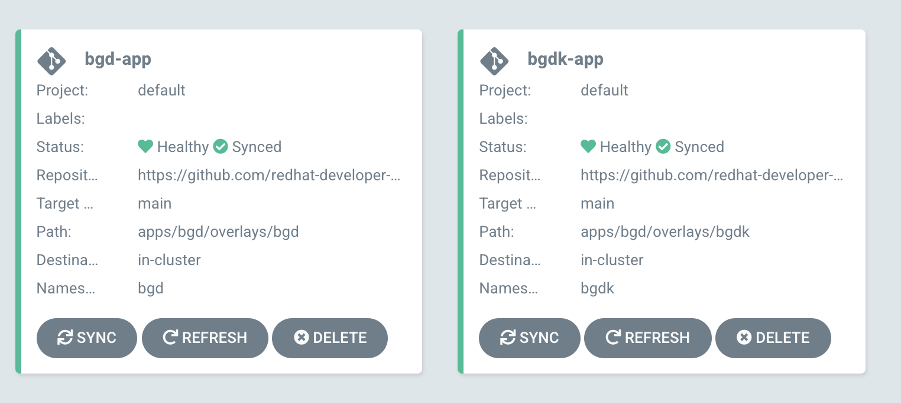
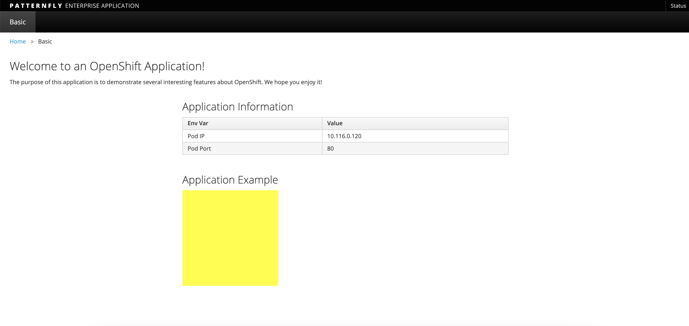

# Kustomize

[Kustomize](https://kustomize.io/) 遍歷 Kubernetes 清單來添加、刪除或更新配置選項，而無需 `fork`。它既可以作為獨立的二進製文件使用，也可以作為 kubectl 的原生擴展使用。

kustomize 的原則是：

- 配置定制的純聲明式方法
- 管理任意數量的明確定制的 Kubernetes 配置
- kustomize 使用的每個工件都是純 YAML，可以這樣進行驗證和處理
- 作為“無模板”的模板系統；它鼓勵使用 YAML 而不 folk 它。


## 探索 Kustomize

### 探索 Kustomize CLI

kustomize CLI 應該已作為lab設置的一部分安裝。驗證它是否已安裝。

```bash
$ kustomize version --short
```

這應該顯示版本，它應該看起來像這樣。

```
{Version:kustomize/v4.5.5 GitCommit:daa3e5e2c2d3a4b8c94021a7384bfb06734bcd26 BuildDate:2022-05-20T20:25:40Z GoOs:linux GoArch:amd64}
```

Kustomize 的核心是基於 YAML 構建本機 Kubernetes 清單，同時保留原始 YAML。它以“無模板”模板格式實現了這一點。這是通過提供一個 `kustomization.yaml` 文件來完成的。

我們將專注於兩個子命令，`build` 命令和 `edit` 命令。

`build` 命令獲取 YAML 源（通過路徑或 URL）並創建一個新的 YAML，該 YAML 可以通過管道傳輸到 `kubectl create`。我們將使用 `documentation/modules/ROOT/examples/kustomize-build` 目錄中的示例。

```bash
$ cd documentation/modules/ROOT/examples/kustomize-build
```

在這裡你應該看到兩個文件，一個 `kustomization.yaml` 文件和一個 `welcome.yaml` 文件，我們來看看它們。

```yaml title="welcome.yaml"
apiVersion: apps/v1
kind: Deployment
metadata:
  creationTimestamp: null
  labels:
    app: welcome-php
  name: welcome-php
spec:
  replicas: 1
  selector:
    matchLabels:
      app: welcome-php
  strategy: {}
  template:
    metadata:
      creationTimestamp: null
      labels:
        app: welcome-php
    spec:
      containers:
      - image: quay.io/redhatworkshops/welcome-php:latest
        name: welcome-php
        resources: {}
```

這個文件沒有什麼特別之處。只是一個標準的 Kubernetes 清單。

例如，如果我們想在此清單中添加標籤而不對其進行編輯怎麼辦？這就是 `kustomization.yaml` 文件的用武之地。

```yaml title="kustomization.yaml"
apiVersion: kustomize.config.k8s.io/v1beta1
kind: Kustomization
resources:
- ./welcome.yaml
patchesJson6902:
- patch: |-
    - op: add
      path: /metadata/labels/testkey
      value: testvalue
  target:
    group: apps
    kind: Deployment
    name: welcome-php
    version: v1
images:
- name: quay.io/redhatworkshops/welcome-php
  newTag: ffcd15
```

正如您在輸出中看到的那樣，沒有太多。此示例的兩個部分是 `resources` 和 `patchesJson6902` 部分。

`resources` 是存儲其他清單的單個文件、目錄和/或 URL 的數組。在這個例子中，我們只是加載一個文件。 `patchesJson6902` 是 `kustomize` 支持的修補 RFC。如您所見，在 `patchJson6902` 文件中，我正在向此清單添加標籤。

!!! info
    注意您可以在官方文檔站點中閱讀有關可用於[修補](https://kubectl.docs.kubernetes.io/references/kustomize/kustomization/)的選項

通過 `build` 構建此清單：

```bash
$ kustomize build
```

您可以看到新標籤已添加到清單中！

```yaml hl_lines="7"
apiVersion: apps/v1
kind: Deployment
metadata:
  creationTimestamp: null
  labels:
    app: welcome-php
    testkey: testvalue
  name: welcome-php
spec:
  replicas: 1
  selector:
    matchLabels:
      app: welcome-php
  strategy: {}
  template:
    metadata:
      creationTimestamp: null
      labels:
        app: welcome-php
    spec:
      containers:
      - image: quay.io/redhatworkshops/welcome-php:ffcd15
        name: welcome-php
        resources: {}
```

您可以使用 `kustomize` 編輯命令而不是編寫 YAML。例如，您可以通過運行以下命令將此 `Deployment` 使用的映像標籤從 `latest` 更改為 `ffcd15`：

```bash
$ kustomize edit set image quay.io/redhatworkshops/welcome-php:ffcd15
```

這將使用圖像部分更新 `kustomization.yaml` 文件。

```bash
$ cat kustomization.yaml
```

```yaml hl_lines="16 17"
apiVersion: kustomize.config.k8s.io/v1beta1
kind: Kustomization
resources:
- ./welcome.yaml
patchesJson6902:
- patch: |-
    - op: add
      path: /metadata/labels/testkey
      value: testvalue
  target:
    group: apps
    kind: Deployment
    name: welcome-php
    version: v1
images:
- name: quay.io/redhatworkshops/welcome-php
  newTag: ffcd15
```

現在當你運行時：

```bash
$  kustomize build .
```

您不僅應該看到新標籤，還應該看到新的 ffcd15 鏡像標籤。

!!! info
    注意您可能必須關閉 kustomization.yaml 選項卡並重新打開它才能查看更改。

您可以了解如何使用現有的 YAML 並針對您的特定環境對其進行修改，而無需複製或編輯原始文件。

`Kustomize` 可用於編寫新的 YAML 文件或被導入 `kubectl` 命令。例子：

```bash
$ kustomize build . | kubectl apply -f -
```

## 使用 Kubectl 探索 Kustomize

從 Kubernetes 1.14 開始，`kubectl` 命令內置了對 `Kustomize` 的支持。

你可以通過運行看到這一點：

```bash
$ kubectl kustomize --help
```

這將運行 kustomize 構建命令。你可以通過運行看到這一點：

```bash
$ kubectl kustomize
```

儘管您可以使用它來將其通過管道傳遞到應用命令中，但您不必這樣做。 `kubectl apply` 命令具有 `-k` 選項，該選項將在應用清單之前運行構建。

要對此進行測試，首先創建一個命名空間：

```bash
$ kubectl create namespace kustomize-test
```

接下來確保您在命名空間中：

```bash
$ kubectl config set-context --current --namespace=kustomize-test
```

最後運行命令來構建和應用清單：

```bash
$ kubectl apply -k ./
```

!!! info
    注意 您不僅可以傳遞目錄，還可以傳遞 URL。唯一的要求是路徑中有一個 `kustomization.yaml` 文件。

這應該會創建部署，並且您應該會看到在命名空間中運行的 pod：

```bash
$ kubectl get pods -n kustomize-test
```

您可以看到部署是使用附加標籤創建的：

```bash
$ kubectl get deployment welcome-php -o jsonpath='{.metadata.labels}' | jq -r
```

此外，鏡像已根據所做的自定義進行了更新：

```bash
$ kubectl get deploy welcome-php  -o jsonpath='{.spec.template.spec.containers[].image}{"\n"}'
```

如您所見，kustomize 是一個強大的工具。

您現在可以安全地刪除此命名空間：

```bash
$ kubectl delete namespace kustomize-test
```

## 部署 Kustomized 應用程序

在上一章中，您在 GitOps 工作流程中了解了這一點；整個應用程序堆棧（包括基礎設施）都反映在 git repo 中。挑戰在於如何在不復制 YAML 的情況下做到這一點。

現在您已經探索了 kustomize，讓我們看看它如何融入 Argo CD 以及如何在 GitOps 工作流程中使用它。

在繼續之前，回到主目錄：

```bash
cd ~
```

### Argo CD Web 控制台

訪問 Argo CD Web 控制台。

一旦您接受了自簽名證書，您應該會看到 Argo CD 登錄屏幕。


您可以通過以下方式登錄

**Username:**

```bash
admin
```

**Password:**

```bash
kubectl -n argocd get secret argocd-initial-admin-secret -o jsonpath="{.data.password}" | base64 -d

VoNuPLkxJdwMOLCI
```

### Kustomized 應用程序

Argo CD 原生支持 Kustomize。您可以使用它來避免為每個部署重複 YAML。如果您有不同的環境或要部署的集群，這特別好用。

看一下 `Application` 定義：

```yaml title="bgdk-app.yaml"
apiVersion: argoproj.io/v1alpha1
kind: Application
metadata:
  name: bgdk-app
  namespace: argocd
spec:
  destination:
    namespace: bgdk
    server: https://kubernetes.default.svc
  project: default
  source:
    path: apps/bgd/overlays/bgdk
    repoURL: https://github.com/redhat-developer-demos/openshift-gitops-examples
    targetRevision: minikube
  syncPolicy:
    automated:
      prune: true
      selfHeal: false
    syncOptions:
    - CreateNamespace=true
```

此應用程序指向相同的[存儲庫](https://github.com/redhat-developer-demos/openshift-gitops-examples)但不同的[目錄](https://github.com/redhat-developer-demos/openshift-gitops-examples/tree/minikube/apps/bgd/overlays/bgdk)。


看一下 `kustomization.yaml` 文件：

```yaml title="kustomization.yaml"
apiVersion: kustomize.config.k8s.io/v1beta1
kind: Kustomization
namespace: bgdk
resources:
- ../../base
- bgdk-ns.yaml
patchesJson6902:
  - target:
      version: v1
      group: apps
      kind: Deployment
      name: bgd
      namespace: bgdk
    patch: |-
      - op: replace
        path: /spec/template/spec/containers/0/env/0/value
        value: yellow
  - target:
      version: v1
      group: networking.k8s.io
      kind: Ingress
      name: bgd
      namespace: bgdk
    patch: |-
      - op: replace
        path: /spec/rules/0/host
        value: bgdk.devnation
```

這個 `kustomization.yaml` 獲取基礎應用程序並修補清單，以便我們得到黃色方塊而不是藍色方塊。它還將應用程序部署到 `bgdk` 命名空間（由文件的命名空間：部分錶示）並將這個新命名空間的 `Ingress` 主機名更新為 `bgdk.devnation`。

將 Minikube IP (minikube ip) 和 Ingress 主機名 `bgdk.devnation` 添加到您的主機文件中，例如 `/etc/hosts`。

例子：

```title="/etc/hosts"
192.168.39.242 bgd.devnation bgdk.devnation
```

這應該會在 Argo CD UI 上向您顯示兩個應用程序。



打開應用程序的 Ingress 或 Route。



如您所見，使用您的自定義部署的應用程序！回顧我們剛剛所做的。

- 部署了一個名為 bgd 的應用程序，帶有一個藍色方塊。
- 部署了另一個基於 bgd 的應用程序，稱為 bgdk
- 應用程序 bgdk 部署在它自己的命名空間中，並具有部署自定義。
- 全部無需複制 YAML！