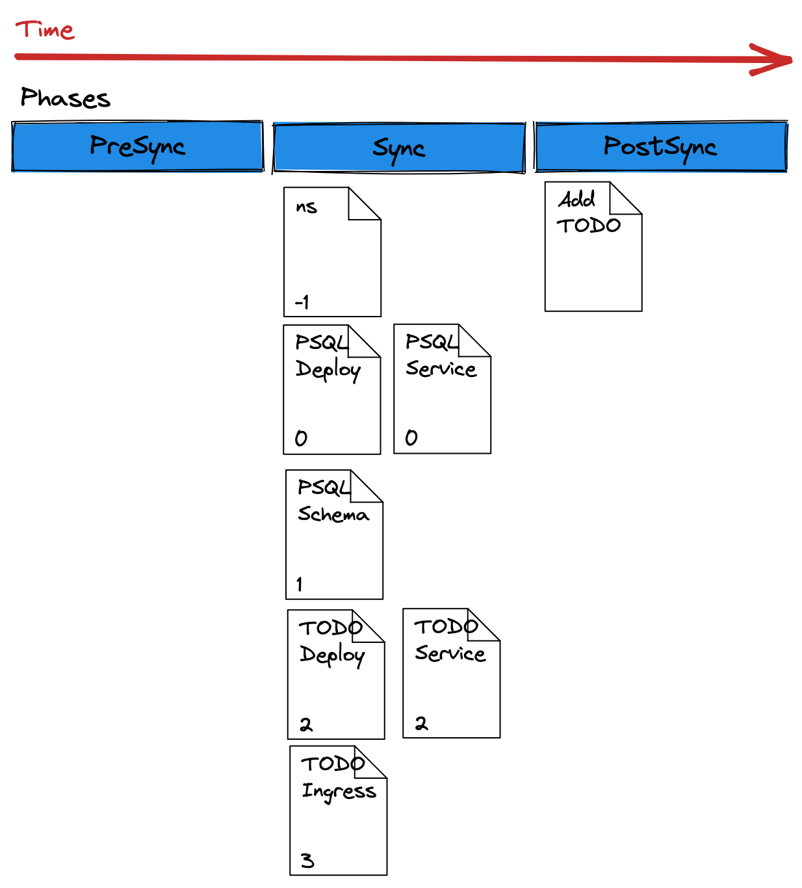

# SyncWaves 與 Hooks

原文: https://redhat-scholars.github.io/argocd-tutorial/argocd-tutorial/04-syncwaves-hooks.html

Argo CD 中使用 [Syncwave](https://argoproj.github.io/argo-cd/user-guide/sync-waves/) 來確定清單如何應用於集群。

另一方面，[resource hooks](https://argoproj.github.io/argo-cd/user-guide/resource_hooks/)在不同階段分解了這些清單的交付。

使用 `syncwaves` 和 `resource hooks` 的組合，您可以控制應用程序的 `roll out` 方式。

本示例將引導您完成以下步驟：

- 使用 `Syncwaves` 控制部署順序
- 探索 `Resource Hooks`
- 組合使用 `Syncwaves` 和 `Resource Hooks`

我們將部署的示例應用程序是一個帶有數據庫的 TODO 應用程序，除了部署文件之外，還使用了`Syncwaves` 和 `Resource Hooks`:


## 使用 `Syncwaves`

Syncwave 是一種命令 Argo CD 如何應用存儲在 git 中的清單的方法。默認情況下，所有清單都具有零波，但您可以使用 `argocd.argoproj.io/sync-wave` 註釋來設置這些。

例子：

```yaml
metadata:
  annotations:
    argocd.argoproj.io/sync-wave: "2"
```

wave 的數值也可以是`負`的。

```yaml
metadata:
  annotations:
    argocd.argoproj.io/sync-wave: "-5"
```

當 Argo CD 開始同步操作時，清單按以下順序放置：

1. 他們所處的階段（我們將在下一節中介紹階段）
2. 資源被註釋的波次（從最低值到最高值）
3. 按種類（首先是命名空間，然後是服務，然後是部署等......）
4. 按名稱（升序）

在官方文檔站點上閱讀有關[Syncwaves](https://argoproj.github.io/argo-cd/user-guide/sync-waves/#how-do-i-configure-waves)的更多信息。

### 探索 Manifests

我們將部署的示例應用程序具有以下清單：

**Namespace** 的 `syncwave` 為 `-1`：

```yaml title="todo-namespace.yaml"
apiVersion: v1
kind: Namespace
metadata:
  name: todo
  annotations:
    argocd.argoproj.io/sync-wave: "-1"
```

**PostgreSQL** 的 `syncwave` 設為 `0`:

```yaml title="postgresql-deployment.yaml"
---
apiVersion: apps/v1
kind: Deployment
metadata:
  name: postgresql
  namespace: todo
  annotations:
    argocd.argoproj.io/sync-wave: "0"
spec:
  selector:
    matchLabels:
      app: postgresql
  template:
    metadata:
      labels:
        app: postgresql
    spec:
      containers:
        - name: postgresql
          image: postgres:12
          imagePullPolicy: Always
          ports:
            - name: tcp
              containerPort: 5432
          env:
            - name: POSTGRES_PASSWORD
              value: admin
            - name: POSTGRES_USER
              value: admin
            - name: POSTGRES_DB
              value: todo
```

**PostgreSQL Service** 的 `syncwave` 設為 `0`:

```yaml title="postgresql-service.yaml"
---
apiVersion: v1
kind: Service
metadata:
  name: postgres
  namespace: todo
  annotations:
    argocd.argoproj.io/sync-wave: "0"
spec:
  selector:
    app: postgresql
  ports:
    - name: pgsql
      port: 5432
      targetPort: 5432
```

**Database table creation** 的 `syncwave` 設為 `1`:

```yaml title="postgres-create-table.yaml"
apiVersion: batch/v1
kind: Job
metadata:
  name: todo-table
  namespace: todo
  annotations:
    argocd.argoproj.io/sync-wave: "1"
spec:
  ttlSecondsAfterFinished: 100
  template:
    spec:
      containers:
        - name: postgresql-client
          image: postgres:12
          imagePullPolicy: Always
          env:
            - name: PGPASSWORD
              value: admin
          command: ["psql"]
          args:
            [
              "--host=postgresql",
              "--username=admin",
              "--no-password",
              "--dbname=todo",
              "--command=create table Todo (id bigint not null,completed boolean not null,ordering integer,title varchar(255),url varchar(255),primary key (id));create sequence hibernate_sequence start with 1 increment by 1;",
            ]
      restartPolicy: Never
  backoffLimit: 1
```

**TODO application deployment** 的 `syncwave` 設為 `2`:

```yaml title="todo-deployment.yaml"
---
apiVersion: "v1"
kind: "ServiceAccount"
metadata:
  labels:
    app.kubernetes.io/name: "todo-gitops"
    app.kubernetes.io/version: "1.0.0"
  name: "todo-gitops"
  namespace: todo同步波
    argocd.argoproj.io/sync-wave: "2"
---
apiVersion: "apps/v1"
kind: "Deployment"
metadata:
  labels:
    app.kubernetes.io/name: "todo-gitops"
    app.kubernetes.io/version: "1.0.0"
  name: "todo-gitops"
  namespace: todo
  annotations:
    argocd.argoproj.io/sync-wave: "2"
spec:
  replicas: 1
  selector:
    matchLabels:
      app.kubernetes.io/name: "todo-gitops"
      app.kubernetes.io/version: "1.0.0"
  template:
    metadata:
      labels:
        app.kubernetes.io/name: "todo-gitops"
        app.kubernetes.io/version: "1.0.0"
    spec:
      containers:
      - env:
        - name: "KUBERNETES_NAMESPACE"
          valueFrom:
            fieldRef:
              fieldPath: "metadata.namespace"
        image: "quay.io/rhdevelopers/todo-gitops:1.0.0"
        imagePullPolicy: "Always"
        name: "todo-gitops"
        ports:
        - containerPort: 8080
          name: "http"
          protocol: "TCP"
      serviceAccount: "todo-gitops"
```

TODO 網路配置：

**TODO Service** 的 `syncwave` 設為 `2`:

```yaml title="todo-service.yaml"
---
apiVersion: "v1"
kind: "Service"
metadata:
  labels:
    app.kubernetes.io/name: "todo-gitops"
    app.kubernetes.io/version: "1.0.0"
  name: "todo-gitops"
  annotations:
    argocd.argoproj.io/sync-wave: "2"
  namespace: todo
spec:
  ports:
  - name: "http"
    port: 8080
    targetPort: 8080
  selector:
    app.kubernetes.io/name: "todo-gitops"
    app.kubernetes.io/version: "1.0.0"
  type: "NodePort"
```

**TODO Ingress** 的 `syncwave` 設為 `3`:

```yaml title="todo-ingress.yaml"
apiVersion: networking.k8s.io/v1
kind: Ingress
metadata:
  name: todo
  namespace: todo
  annotations:
    argocd.argoproj.io/sync-wave: "3"
spec:
  rules:
    - host: todo.devnation
      http:
        paths:
          - path: /
            pathType: Prefix
            backend:探索資源掛鉤
              service:
                name: todo-gitops
                port:探索資源掛鉤

將 Minikube IP (minikube ip) 和 Ingress 主機名 `todo.devnation` 添加到您的主機文件中，例如 `/etc/hosts`。

```title="/etc/hosts"
192.168.39.242 bgd.devnation bgdk.devnation todo.devnation
```

Argo CD 將首先應用命名空間（因為它是最小值），並確保它在繼續之前返回“健康”狀態。

接下來，將應用 PostgreSQL 部署。之後，報告健康將繼續使用其餘資源。

!!! info
    Argo CD 在之前的報告“健康”之前不會應用下一個清單。

## 探索 Resource Hooks

現在您已經熟悉了 `syncwave`，我們可以開始探索使用 `resource hooks` 分階段應用清單。

使用 `hook` 可以進一步重新定義控制同步操作。

- `PreSync` - 在同步操作之前運行。這可能類似於架構更改之前的數據庫備份。
- `Sync` - 在 PreSync 成功運行後運行。這將與您的正常清單一起運行。
- `PostSync` - 在同步成功運行後運行。這可以是諸如 Slack 消息或電子郵件通知之類的東西。
- `SyncFail` - 如果同步操作失敗則運行。這也用於發送通知或執行其他規避操作。

要啟用同步，請使用 `argocd.argoproj.io/hook` 使用您要用於該資源的同步類型來註釋特定對象清單。例如，如果我想使用 `PreSync` 鉤子：

```yaml
metadata:
  annotations:
    argocd.argoproj.io/hook: PreSync
```

您還可以在成功/不成功運行後刪除掛鉤。

- `HookSucceeded` - 資源在成功後將被刪除。
- `HookFailed` - 如果資源失敗，資源將被刪除。
- `BeforeHookCreation` - 在創建新資源之前將刪除資源（觸發新同步時）。

您可以使用 `argocd.argoproj.io/hook-delete-policy` 註釋來應用這些。例如

```yaml
metadata:
  annotations:
    argocd.argoproj.io/hook: PostSync
    argocd.argoproj.io/hook-delete-policy: HookSucceeded
```

!!! tips
    由於同步可能在任何階段失敗，您可能會遇到應用程序永遠不會報告健康的情況！

雖然鉤子可以是任何資源，但它們通常是 Pod 和/或 Job。

要了解更多關於資源掛鉤的信息，請查閱[官方文檔](https://argoproj.github.io/argo-cd/user-guide/resource_hooks)。

### 探索清單

看看這個 PostSync 清單，它發送一個 HTTP 請求來插入一個新的 TODO 項：

```yaml title="todo-insert-data.yaml"
apiVersion: batch/v1
kind: Job
metadata:
  name: todo-insert
  annotations:
    argocd.argoproj.io/hook: PostSync 
    argocd.argoproj.io/hook-delete-policy: HookSucceeded
spec:
  ttlSecondsAfterFinished: 100
  template:
    spec:
      containers:
        - name: httpie
          image: alpine/httpie:2.4.0
          imagePullPolicy: Always
          command: ["http"]
          args:
            [
              "POST",
              "todo-gitops:8080/api",
              "title=Finish ArgoCD tutorial",
              "--ignore-stdin"
            ]
      restartPolicy: Never
  backoffLimit: 1
```

!!! info
    這意味著該作業將在同步階段應用清單之後在 `PostSync` 階段運行。

執行順序如下圖所示：



### 部署應用程序

您可以通過訪問 [repo](https://github.com/redhat-developer-demos/openshift-gitops-examples/tree/main/apps/todo) 查看所有部署文件。

看看這個清單文件：`todo-application.yaml`：

```yaml title="todo-application.yaml"
apiVersion: argoproj.io/v1alpha1
kind: Application
metadata:
  name: todo-app
  namespace: argocd
spec:
  destination:
    namespace: todo
    server: https://kubernetes.default.svc
  project: default
  source:
    path: apps/todo
    repoURL: https://github.com/redhat-developer-demos/openshift-gitops-examples
    targetRevision: minikube
  syncPolicy:
    automated:
      prune: true
      selfHeal: false
    syncOptions:
    - CreateNamespace=true
```

它將顯示這將在 `todo` 命名空間中部署應用程序。

創建此應用程序：

```bash
kubectl apply -f documentation/modules/ROOT/examples/minikube/todo-yaml/todo-application.yaml

application.argoproj.io/todo-app created
```

在 Argo CD WebUI 上，您應該會看到另一個應用程序出現。


點擊此“卡片”應將您帶到樹視圖。


觀察同步過程。您將看到應用資源的順序，首先是命名空間創建，最後是創建 Route 以訪問應用程序。

一旦應用程序完全同步。查看命名空間中的 pod 和作業：

```bash
$ kubectl get pods -n todo
```

您應該看到 Job 已完成，但仍然存在。

```bash
NAME                           READY   STATUS      RESTARTS   AGE
postgresql-599467fd86-cgj9v    1/1     Running     0          32s
todo-gitops-679d88f6f4-v4djp   1/1     Running     0          19s
todo-table-xhddk               0/1     Completed   0          27s
```

您的應用程序應如下所示。


`todo-insert` 作業未顯示，因為它被配置為如果成功則被刪除：

```yaml
argocd.argoproj.io/hook-delete-policy: HookSucceeded
```

