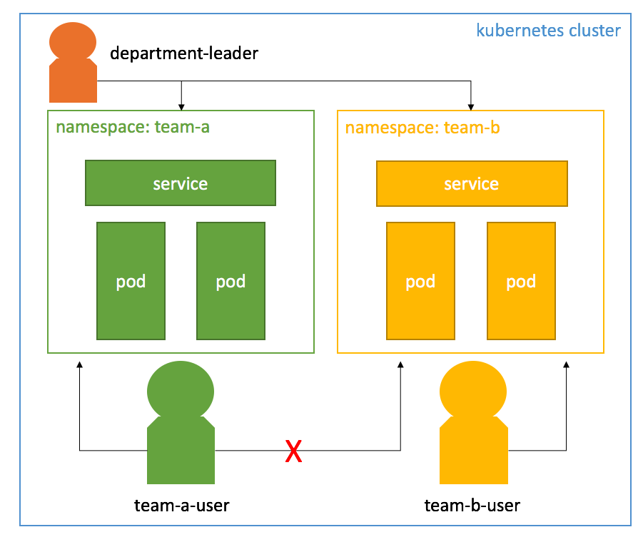
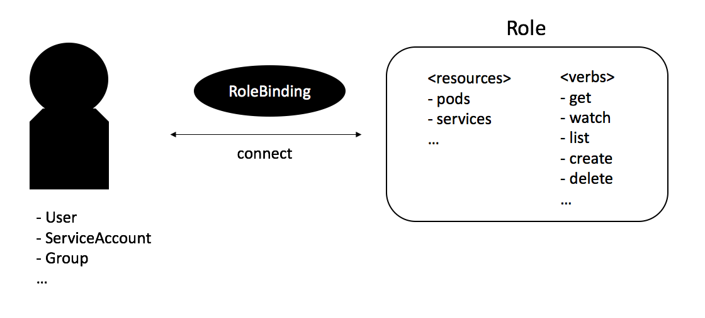
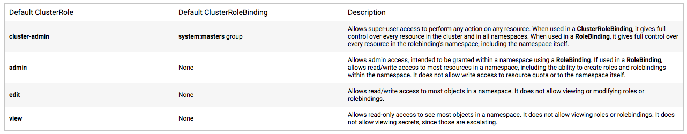

# 在 kubernetes 中使用 rbac 設置服務帳戶權限

原文: https://blog.dudaji.com/kubernetes/2019/05/01/k8s-authorization-of-sa-with-rbac.html

## 場景



- `管理員`：擁有所有權限

- `部門領導`：對命名空間 team-a 和 team-b 擁有權限

- `team-a-user` : 擁有命名空間 team-a 的權限，而不是命名空間 team-b 的權限

- `team-b-user` : 對命名空間 team-b 有權限，對命名空間 team-a 沒有權限

## 如何使用 Kubernetes 進行身份驗證

Kubernetes中有多種認證方式，如token、proxy、webhook、ID/PW、OAuth2等。更多詳細信息可在此處獲得。除了服務帳戶令牌身份驗證之外，Kubernetes 建議使用一種或多種用戶身份驗證方法。在本文中，我們將通過服務帳戶（SA）身份驗證方法來測試 kubernetes api 調用。

### 創建命名空間

```yaml title="ns-team-a-create.yaml"
# ns-team-a-create.yaml
apiVersion: v1
kind: Namespace
metadata:
  name: team-a
```

```yaml title="ns-team-b-create.yaml"
# ns-team-b-create.yaml
apiVersion: v1
kind: Namespace
metadata:
  name: team-b
```

創建 namespace:

```bash
$ kubectl create -f ns-team-a-create.yaml

$ kubectl create -f ns-team-b-create.yaml
```

檢查 namespace:

```bash hl_lines="8 9"
$ kubectl get ns

NAME              STATUS   AGE
default           Active   6m14s
kube-node-lease   Active   6m16s
kube-public       Active   6m16s
kube-system       Active   6m16s
team-a            Active   8s
team-b            Active   4s
```

### 創建服務帳戶

```yaml title="sa-team-a-create.yaml"
# sa-team-a-create.yaml
apiVersion: v1
kind: ServiceAccount
metadata:
  name: sa-team-a
  namespace: team-a
```

```yaml title="sa-team-b-create.yaml"
# sa-team-b-create.yaml
apiVersion: v1
kind: ServiceAccount
metadata:
  name: sa-team-b
  namespace: team-b
```

創建 service account:

```bash
$ kubectl create -f sa-team-a-create.yaml

$ kubectl create -f sa-team-b-create.yaml
```

檢查在不同 namespace 裡的 service account:

```bash
$ kubectl get sa -n team-a

NAME        SECRETS   AGE
default     1         5m47s
sa-team-a   1         22s


$ kubectl get sa -n team-b

NAME        SECRETS   AGE
default     1         5m46s
sa-team-b   1         17s
```

### 角色和角色綁定

角色定義了有關權限的事情。它定義了可以訪問的位置以及可以對哪些資源進行哪些操作。

`RoleBinding` 是連接 `Role` 和 `User` 的橋樑。換句話說，用戶被授予權限，但是關於權限的信息是由**角色**決定的。



我們可以直接定義一個新的角色，也可以使用 Kubernetes 預定義的角色來給予權限。`ClusterRole` 中預定義的權限是 `cluster-admin`、`admin`、`edit` 和 `view`，根據綁定的類型（`Rolebinding`、`ClusterRolebinding`）來確定權限訪問範圍是命名空間還是整個集群。



來源：https ://kubernetes.io/docs/reference/access-authn-authz/rbac/#user-facing-roles

讓我們來創建一個客制的角色:

```yaml title="custom-role-binding.yaml"
kind: Role
apiVersion: rbac.authorization.k8s.io/v1
metadata:
  name: custom-role
  namespace: team-a
rules:
- apiGroups: [""] # "" indicates the core API group
  resources: ["pods"]
  verbs: ["get", "watch", "list"]
---
kind: RoleBinding
apiVersion: rbac.authorization.k8s.io/v1
metadata:
  name: custom-rolebinding
  namespace: team-a
subjects:
- kind: ServiceAccount
  name: sa-team-a
  namespace: team-a
roleRef:
  kind: Role
  name: custom-role
  apiGroup: rbac.authorization.k8s.io
```

構建角色與權限並且進行綁定:

```bash
$ kubectl create -f custom-role-binding.yaml

role.rbac.authorization.k8s.io/custom-role created
rolebinding.rbac.authorization.k8s.io/custom-rolebinding created
```

使用內建的角色：

```yaml title="default-role-binding.yaml"
# default-role-binding.yaml
kind: RoleBinding
apiVersion: rbac.authorization.k8s.io/v1
metadata:
  name: default-rolebinding
  namespace: team-b
subjects:
- kind: ServiceAccount
  name: sa-team-b
  namespace: team-b
roleRef:
  kind: ClusterRole
  name: view
  apiGroup: rbac.authorization.k8s.io
```

將清單應用於 Kubernetes

```bash
$ kubectl create -f default-role-binding.yaml

rolebinding.rbac.authorization.k8s.io/default-rolebinding created
```

### 創建一個 Pod

```yaml title="pod-team-a-create.yaml"
apiVersion: v1
kind: Pod
metadata:
  name: pod-team-a
  namespace: team-a
spec:
  containers:
  - name: nginx
    image: nginx:1.7.9
    ports:
    - containerPort: 8080
```

```yaml title="pod-team-b-create.yaml"
apiVersion: v1
kind: Pod
metadata:
  name: pod-team-b
  namespace: team-b
spec:
  containers:
  - name: nginx
    image: nginx:1.7.9
    ports:
    - containerPort: 8080
```

分別在兩個 namespace 各創建一個 pod:

```bash
$ kubectl create -f pod-team-a-create.yaml

pod/pod-team-a created

$ kubectl create -f pod-team-b-create.yaml

pod/pod-team-b created
```

### API 測試

api服務器ip檢查

```bash
$ kubectl config view | grep server | cut -f 2- -d ":" | tr -d " " # display list of your api server

https://192.168.49.2:8443
```

也可用:

```bash
$ kubectl cluster-info

Kubernetes control plane is running at https://192.168.49.2:8443
...
```

設定環境變數:

```bash
APISERVER=<your-k8s-api-server>

APISERVER=https://192.168.49.2:8443
```

檢查 `sa-team-a` 的令牌:

```bash
NAMESPACE=team-a
SA=sa-team-a
TOKEN=$(kubectl -n $NAMESPACE describe secret $(kubectl get -n $NAMESPACE secrets | grep $SA | cut -f1 -d ' ') | grep -E '^token' | cut -f2 -d':' | tr -d ' ')
```

呼叫 Kubernetes API:

```bash
$ curl -X GET $APISERVER/api/v1/namespaces/$NAMESPACE/pods/ \
  -H "Authorization: Bearer $TOKEN" --insecure
```

檢查 `sa-team-b` 的令牌:

```bash
NAMESPACE=team-b
SA=sa-team-b
TOKEN=$(kubectl -n $NAMESPACE describe secret $(kubectl get -n $NAMESPACE secrets | grep $SA | cut -f1 -d ' ') | grep -E '^token' | cut -f2 -d':' | tr -d ' ')
```

呼叫 Kubernetes API:

```bash
$ curl -X GET $APISERVER/api/v1/namespaces/$NAMESPACE/pods/ \
  -H "Authorization: Bearer $TOKEN" --insecure
```

如果 `system account` 想要去訪問沒有權限的的 `namespace`, 舉例: `sa-team-b` 訪問 `team-a`。

```bash hl_lines="19"
$ SA=sa-team-b
$ NAMESPACE=team-b
$ TOKEN=$(kubectl -n $NAMESPACE describe secret $(kubectl get -n $NAMESPACE secrets | grep $SA | cut -f1 -d ' ') | grep -E '^token' | cut -f2 -d':' | tr -d ' ')

$ NAMESPACE=team-a
$ curl -X GET $APISERVER/api/v1/namespaces/$NAMESPACE/pods/ \
  -H "Authorization: Bearer $TOKEN" --insecure

{
  "kind": "Status",
  "apiVersion": "v1",
  "metadata": {},
  "status": "Failure",
  "message": "pods is forbidden: User \"system:serviceaccount:team-b:sa-team-b\" cannot list resource \"pods\" in API group \"\" in the namespace \"team-a\"",
  "reason": "Forbidden",
  "details": {
    "kind": "pods"
  },
  "code": 403
}
```

## department-leader 和 admin 

### 創建 `department-leader`

`department-leader` 有命名空間 `team-a` 和 `team-b` 的權限，而對於 `admin`，則擁有所有區域的權限。

```yaml title="sa-leader.yaml"
# sa-leader.yaml
apiVersion: v1
kind: ServiceAccount
metadata:
  name: sa-leader
---
kind: RoleBinding
apiVersion: rbac.authorization.k8s.io/v1
metadata:
  name: department-leader-team-a
  namespace: team-b
subjects:
- kind: ServiceAccount
  name: sa-leader
  namespace: default
roleRef:
  kind: ClusterRole
  name: admin
  apiGroup: rbac.authorization.k8s.io
---
kind: RoleBinding
apiVersion: rbac.authorization.k8s.io/v1
metadata:
  name: department-leader-team-b
  namespace: team-a
subjects:
- kind: ServiceAccount
  name: sa-leader
  namespace: default
roleRef:
  kind: ClusterRole
  name: admin
  apiGroup: rbac.authorization.k8s.io
```

```bash
$ kubectl create -f sa-leader.yaml

serviceaccount/sa-leader created
rolebinding.rbac.authorization.k8s.io/department-leader-team-a created
rolebinding.rbac.authorization.k8s.io/department-leader-team-b created
```

```bash
$ SA=sa-leader
$ NAMESPACE=default
$ TOKEN=$(kubectl -n $NAMESPACE describe secret $(kubectl get -n $NAMESPACE secrets | grep $SA | cut -f1 -d ' ') | grep -E '^token' | cut -f2 -d':' | tr -d ' ')

$ NAMESPACE=team-a
$ curl -X GET $APISERVER/api/v1/namespaces/$NAMESPACE/pods/ \
  -H "Authorization: Bearer $TOKEN" --insecure

$ NAMESPACE=team-b
$ curl -X GET $APISERVER/api/v1/namespaces/$NAMESPACE/pods/ \
  -H "Authorization: Bearer $TOKEN" --insecure

```

### 創建 `admin`

```yaml title="sa-admin-create.yaml"
# sa-admin-create.yaml
apiVersion: v1
kind: ServiceAccount
metadata:
  name: sa-admin
---
kind: ClusterRoleBinding
apiVersion: rbac.authorization.k8s.io/v1
metadata:
  name: admin-all-cluster
subjects:
- kind: ServiceAccount
  name: sa-admin
  namespace: default
roleRef:
  kind: ClusterRole
  name: cluster-admin
  apiGroup: rbac.authorization.k8s.io
```

```bash
$ kubectl create -f a-admin-create.yaml

serviceaccount/sa-admin created
clusterrolebinding.rbac.authorization.k8s.io/admin-all-cluster created
```