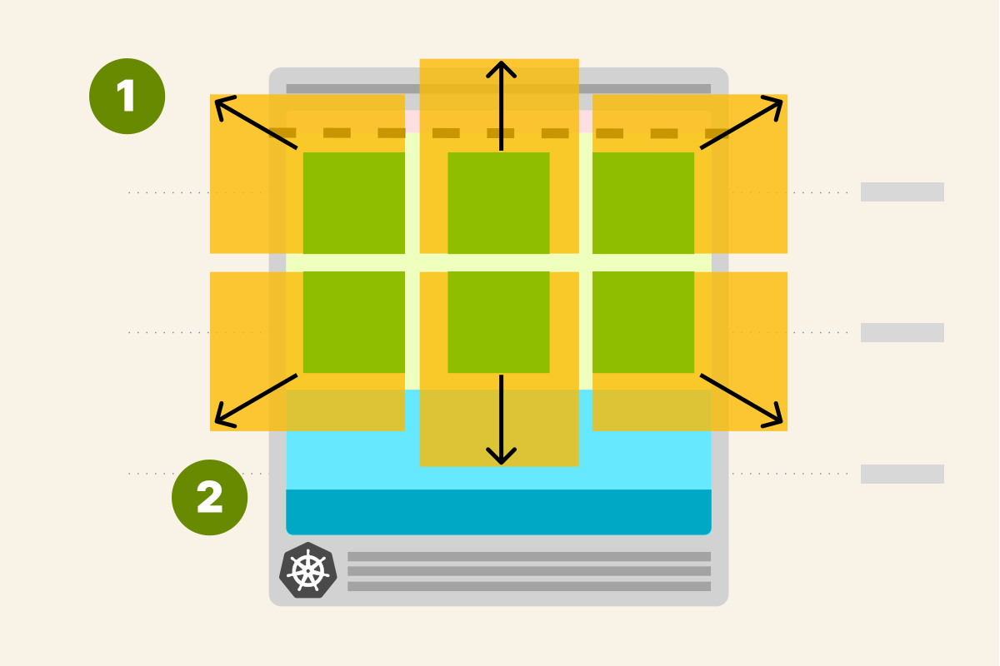
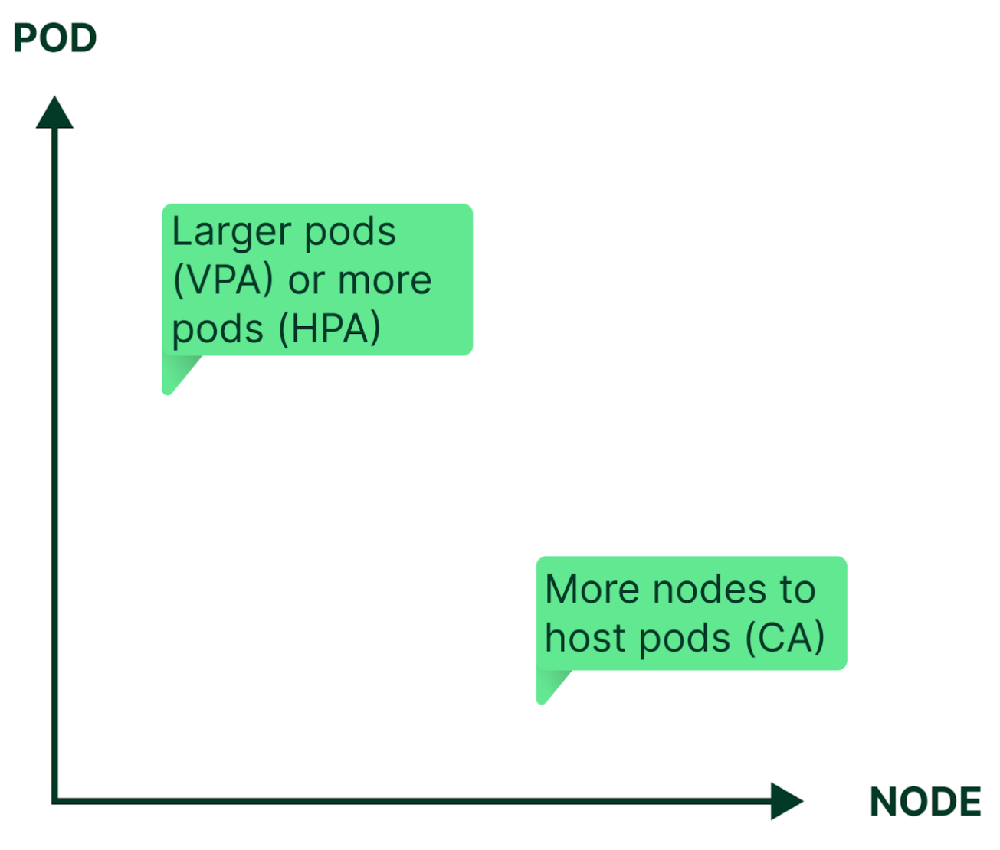
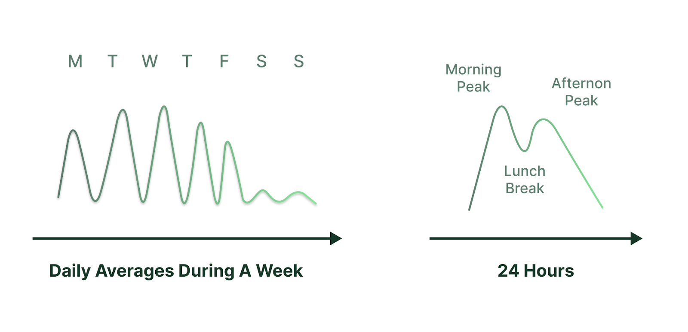

# Kubernetes 自動縮放

原文:[Kubernetes Autoscaling](https://www.kubecost.com/kubernetes-autoscaling)

自動縮放是 Kubernetes 平台最引人注目的功能之一。一旦配置正確，它可以節省管理員的時間，防止性能瓶頸，並有助於避免財務浪費。然而，設置自動縮放需要了解大量配置參數，即使是經驗豐富的 Kubernetes 管理員也會感到困惑——這就是我們創建本指南的原因，詳細解釋了自動縮放。我們為每種類型的自動縮放專門寫了一篇文章，並在整個過程中包含了配置說明和 YAML 文件示例。

## Kubernetes 自動伸縮的三個維度

自動縮放消除了不斷手動重新配置以匹配不斷變化的應用程序工作負載水平的需要。 Kubernetes 可以通過調整 pod 的容量（垂直自動縮放）和數量（水平自動縮放）和/或通過添加或刪除集群中的節點（集群自動縮放）來自動縮放。

Kubernetes 有兩種類型的 Pod 自動縮放器：`Vertical Pod Autoscaler (VPA)` 可以增加或減少分配給每個 Pod 的 CPU 和內存，而 `Horizo​​ntal Pod Autoscaler (HPA)` 可以復製或終止 Pod，從而影響 Pod 總數。作為一個整體影響集群容量，`Cluster Autoscaler (CA)` 添加或刪除專用於集群的節點，以提供託管所需工作負載所需的適當數量的計算資源。結合起來，自動縮放的三個維度有助於近乎實時地在防止性能瓶頸或中斷與避免過度配置之間取得微妙的平衡。

大多數應用程序工作負載都有由用戶活動驅動的每日、每周和季節性節奏。這種可變性可能會由於資源限制導致應用程序性能下降，或者由於過度配置而導致不必要的支出。

例如，假設企業生產力應用程序的高峰時間是給定時區的上午中午和下午中午，此時員工正坐在辦公桌前，而周末和節假日則接近閒置。某些企業財務應用程序在每個日曆季度末（即發布財務報表時）最為活躍。相比之下，一些薪資處理應用程序通常每個月忙兩次來發放薪水，而批處理應用程序在通常計劃運行的夜間時間很忙。還有季節性流量模式，例如黑色星期五或母親節的在線零售購物。其他活動的增加可能是由一次性事件引起的，例如即將來臨的颶風將居民吸引到新聞網站。

應用程序基礎設施的管理員必須準備好他們的系統以在幾秒鐘內配置容量，以響應活動中可預測和意外的變化，並記住在不再需要時刪除容量。這就是自動縮放的用武之地：它會隨著工作負載的變化自動執行添加和刪除容量的過程，否則這將是手動的。

## 測量和分配

通過過度配置(overprovisioning)來管理 Kubernetes 集群很容易：比如說，如果它只託管一個應用程序並且錢不是問題。但這不是現實，尤其是當涉及到由數十個預算有限的租戶共享的大型 Kubernetes 部署時。在這種更常見的場景中，必須在共享 Kubernetes 資源的團隊、項目和應用程序之間公平準確地分配集群成本。

具有靜態配置和兩個具有良好標記資源的租戶的 Kubernetes 集群的成本分配報告很容易計算。但是，一旦將自動縮放引入等式，一個人就不可能將 Kubernetes 集群的成本分配給數十個租戶，因為自動縮放每分鐘都會更改底層集群配置。

如果您將 Kubernetes 命名空間專用於每個租戶，它有助於減輕管理負擔，但衡量專用資源（尤其是共享資源）各自使用情況的挑戰仍然很複雜。公平的成本分配必須考慮每個租戶隨時間對集群資源的按比例使用，包括 CPU、GPU、內存、磁盤和網絡。

## 章節

我們在以下文章中組織了本指南：

1. Kubernetes 垂直 Pod 自動縮放器 (VPA)

2. Kubernetes Horizo​​ntal Pod Autoscaler (HPA)

3. Kubernetes 集群自動縮放器 (CA)

每一章節都包含對該功能的詳細解釋，以及配置示例，因此您可以看到它們在實踐中的實現。

