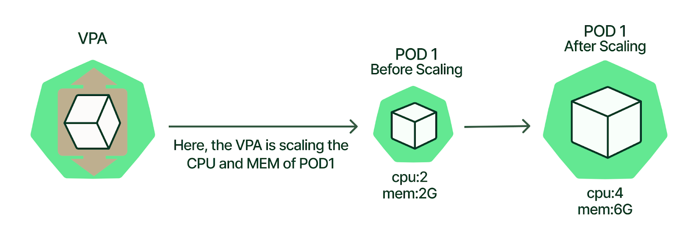

# Kubernetes 垂直自動縮放

原文:[Kubernetes VPA](https://www.kubecost.com/kubernetes-autoscaling/kubernetes-vpa)

Kubernetes Vertical Pod Autoscaler (VPA) 是一種自動縮放器，可根據歷史資源使用測量值啟用自動 CPU 和內存請求和限制調整。如果使用得當，它可以幫助您在容器級別高效且自動地分配 Kubernetes 集群的資源。

當然，與 Kubernetes (K8s) 世界中的任何技術一樣，從技術角度理解 VPA 的工作原理以及它的確切作用可以讓您有效地實施它。

本文將介紹三種類型的自動縮放器，然後詳細探討 VPA 的用法和優勢——這樣您就可以開始使用 Kubernetes Vertical Pod Autoscaler！

## 三種類型的 Kubernetes autoscalers

共有三種類型的 K8s 自動縮放器，每種都有不同的用途。他們是：

- **Horizo​​ntal Pod Autoscaler (HPA)**：調整應用程序的副本數。 HPA 根據 CPU 利用率擴展複製控制器、部署、副本集或有狀態集中的 pod 數量。 HPA 還可以配置為根據自定義或外部指標做出擴展決策。
- **Cluster Autoscaler (CA)**：調整集群中的節點數。當節點沒有足夠的資源來運行 pod（添加節點）或當節點未充分利用時，Cluster Autoscaler 會自動添加或刪除集群中的節點，並且可以將其 pod 分配給另一個節點（刪除節點）。
- **Vertical Pod Autoscaler (VPA)**：調整集群中容器的資源請求和限制（我們將在本文中詳細說明）。

## 什麼是 Kubernetes VPA?

Kubernetes Vertical Pod Autoscaler (VPA) 是您安裝在集群中的一個組件。它增加和減少容器 CPU 和內存資源配置，以使集群資源分配與實際使用情況保持一致。

接下來，我們將回顧一些重要的 VPA 概念。

### Kubernetes VPA 資源配置類型

使用 VPA，我們可以在 pod 的每個容器上管理兩種不同類型的資源配置：

1. Requests
2. Limits

### 什麼是 Requests?

`Request` 定義了容器所需的最少資源量。例如，一個應用程序可以使用超過 256MB 的內存，但是如果它的 Request 是 256MB 的內存，Kubernetes 會保證至少為容器提供 256MB 的內存。

### 什麼是 Limits?

`Limit` 定義給定容器可以消耗的最大資源量。您的應用程序可能需要至少 256MB 的內存，但您可能希望確保它不會消耗超過 512MB 的內存，即將其內存消耗 Limit 為 512MB

## Kubernetes VPA 與 HPA

從根本上說，VPA 和 HPA 之間的區別在於它們的擴展方式。 HPA 通過添加或刪除 pod 進行擴展，從而水平擴展容量。然而，VPA 通過增加或減少現有 Pod 容器內的 CPU 和內存資源來擴展——從而垂直擴展容量。下表更詳細地解釋了 Kubernetes VPA 和 HPA 之間的區別。

|CAPACITY ADJUSTMENT DESIRED	|HORIZONTAL SCALING (HPA)	|VERTICAL SCALING (VPA)|
|-------------------------------|---------------------------|----------------------|
|More resources	|Add more pods	|Increase CPU or memory resources of existing pod containers|
|Less resources	|Remove pods	|Decrease CPU or memory resources of existing pod containers|

請參考下圖了解 VPA 的工作原理：



## VPA 的組成元件

VPA 部署包含三個主要組件：`VPA Recommender`、`VPA Updater` 和 `VPA Admission Controller`。讓我們來看看每個組件的作用。

### VPA Recommender

- 監控資源利用率並計算目標值。
- 查看指標歷史記錄、OOM 事件和 VPA 部署規範並建議公平請求。根據定義的限制請求比例提高/降低限制。

### VPA Updater

- 驅逐那些需要新資源限制的 Pod。
- 如果定義了 `updateMode: Auto`，則實施 `Recommender` 推薦的內容。

### VPA Admission Controller

每當 VPA 更新程序逐出並重新啟動 pod 時，都會在新 pod 啟動之前更改 CPU 和內存設置（使用 webhook）。
當 Vertical Pod Autoscaler 的 `updateMode` 設置為 `Auto` 時，如果 Pod 需要更改 Pod 的資源請求，則驅逐 Pod。由於 Kubernetes 的設計，修改正在運行的 pod 的資源請求的唯一方法是重新創建 pod。

## Kubernetes VPA 是如何工作的？

現在我們已經定義了 VPA 的組件，讓我們探討一下它們在實踐中如何協同工作。

下圖提供了 Kubernetes VPA 工作原理的實際示例，並在後面對每個步驟進行了編號說明。

<figure markdown>
  
  <figcaption>Kubernetes VPA 如何分配資源。</figcaption>
</figure>

讓我們來看看圖中到底發生了什麼：

1. 用戶配置 VPA。
2. VPA Recommender 從指標服務器讀取 VPA 配置和資源利用率指標。
3. VPA Recommender 提供 pod 資源推薦。
4. VPA Updater 讀取 pod 資源建議。
5. VPA Updater 啟動 pod 終止。
6. 部署意識到 pod 已終止，並將重新創建 pod 以匹配其副本配置。
7. 當 pod 處於 recreation 過程中時，VPA Admission Controller 獲取 pod 資源推薦。由於 Kubernetes 不支持動態更改正在運行的 pod 的資源限制，因此 VPA 無法使用新限制更新現有的 pod。它終止使用過時限制的 pod。當 Pod 的控制器向 Kubernetes API 服務請求替換時，VPA Admission Controller 將更新的資源請求和限制值注入到新 Pod 的規範中。
8. 最後，VPA Admission Controller 將推薦覆蓋到 pod。在我們的示例中，VPA 准入控制器向 pod 添加了一個“250m”CPU。

!!! tip
    我們也可以在 **推薦模式** 下運行 VPA。在此模式下，VPA Recommender 將使用其建議值更新工作負載的 Vertical Pod Autoscaler 資源的狀態字段，但不會終止 Pod 或更改 Pod API 請求。

## Kubernetes VPA 的局限性

VPA 在許多應用程序中都很有用，但要記住幾個重要的限制。

- 不要將 Vertical Pod Autoscaler 與 Horizo​​ntal Pod Autoscaler 一起使用，後者根據相同的資源指標（例如 CPU 和 MEMORY 使用率）進行縮放。這是因為當指標 (CPU/MEMORY) 達到其定義的閾值時，縮放事件將同時發生在 VPA 和 HPA 上，這可能會產生未知的副作用並可能導致問題。
- VPA 可能會推薦比集群中可用資源更多的資源，從而導致 pod 無法分配給節點（由於資源不足），因此永遠不會運行。要克服此限制，最好將 `LimitRange` 設置為最大可用資源。這將確保 pod 請求的資源不會超過 `LimitRange` 定義的數量。

## K3D 範例: 如何配置 VPA

現在我們已經回顧了 VPA 概念，讓我們看一個如何安裝和使用 VPA 的真實示例。在本節中，我們將按照以下步驟完成在 Kubernetes (via K3D) 上的 VPA 部署：

1. 創建 Kubernetes 集群
2. 安裝 metrics server
3. 安裝 VPA
4. 演示：VPA 示例

### 創建 Kubernetes 集群

首先，我們在本機上創建一個 Kubernetes 集群。有多種方法可以做到這一點，但在本文中，我們將使用 “k3d”。要了解有關 “k3d” 的更多信息，請參閱 [k3d 官方網站](https://k3d.io/v5.4.6/)。

運行以下命令來創建 Kubernetes 集群：

```bash
k3d cluster create
```

驗證您是否可以連接到集群：

```bash
$ kubectl cluster-info
Kubernetes control plane is running at https://0.0.0.0:35915
CoreDNS is running at https://0.0.0.0:35915/api/v1/namespaces/kube-system/services/kube-dns:dns/proxy
Metrics-server is running at https://0.0.0.0:35915/api/v1/namespaces/kube-system/services/https:metrics-server:/proxy
```

### 安裝 metrics server

現在我們有了 Kubernetes 集群；下一步是在其上安裝 metrics server。我們可以通過運行以下命令來確認它是否已經安裝：

```bash
$ kubectl get apiservice | grep -i metrics

v1beta1.metrics.k8s.io                 kube-system/metrics-server   True        2m11s
```

如果沒有輸出，則說明我們的 Kubernetes 集群中沒有配置 metrics server。我們還可以使用以下命令查看我們是否有可用的指標：

```bash
$ kubectl top pods -A
```

如果 Kubernetes 沒有安裝 metrics server，依照下列的步驟來安裝:

讓我們安裝指標服務器。Clone 以下 repo：

```bash
$ git clone --branch v1.0.0 git@github.com:nonai/k8s-example-files.git
```

將更改應用於整個文件，如下所示：

```bash
$ kubectl apply -f .
serviceaccount/metrics-server created
clusterrole.rbac.authorization.k8s.io/system:aggregated-metrics-reader created
clusterrole.rbac.authorization.k8s.io/system:metrics-server created
rolebinding.rbac.authorization.k8s.io/metrics-server-auth-reader created
clusterrolebinding.rbac.authorization.k8s.io/metrics-server:system:auth-delegator created
clusterrolebinding.rbac.authorization.k8s.io/system:metrics-server created
service/metrics-server created
deployment.apps/metrics-server created
apiservice.apiregistration.k8s.io/v1beta1.metrics.k8s.io created
```

驗證部署：

```bash hl_lines="5"
$ kubectl get pods -n kube-system

NAME                                      READY   STATUS      RESTARTS   AGE
coredns-7448499f4d-v6hk8                  1/1     Running     0          7m43s
metrics-server-86cbb8457f-492fx           1/1     Running     0          7m43s
local-path-provisioner-5ff76fc89d-sgqq6   1/1     Running     0          7m43s
helm-install-traefik-crd-ht5ks            0/1     Completed   0          7m43s
helm-install-traefik-5kr9n                0/1     Completed   1          7m43s
svclb-traefik-4qfqx                       2/2     Running     0          7m12s
traefik-97b44b794-s8wh5                   1/1     Running     0          7m12s
```

列出 API 服務並檢查指標服務器：

```bash
$ kubectl get apiservice |grep -i metrics

v1beta1.metrics.k8s.io                 kube-system/metrics-server   True        9m3s
```

### 安裝 VPA

現在我們已經創建了 Kubernetes 集群並將指標服務器部署到集群上，讓我們創建 VPA。

Clone 以下存儲庫，檢查特定的提交（用於本教程），並將目錄更改為“autoscaler/vertical-pod-autoscaler”。

```bash
$ git clone https://github.com/kubernetes/autoscaler.git

$ cd autoscaler

$ git checkout bb860357f691313fca499e973a5241747c2e38b2

$ cd vertical-pod-autoscaler
```

我們可以使用以下命令預覽安裝：

```bash
./hack/vpa-process-yamls.sh print
```

然後，安裝 VPA：

```bash
$ ./hack/vpa-up.sh
customresourcedefinition.apiextensions.k8s.io/verticalpodautoscalercheckpoints.autoscaling.k8s.io created
customresourcedefinition.apiextensions.k8s.io/verticalpodautoscalers.autoscaling.k8s.io created
clusterrole.rbac.authorization.k8s.io/system:metrics-reader created
clusterrole.rbac.authorization.k8s.io/system:vpa-actor created
clusterrole.rbac.authorization.k8s.io/system:vpa-checkpoint-actor created
clusterrole.rbac.authorization.k8s.io/system:evictioner created
clusterrolebinding.rbac.authorization.k8s.io/system:metrics-reader created
clusterrolebinding.rbac.authorization.k8s.io/system:vpa-actor created
clusterrolebinding.rbac.authorization.k8s.io/system:vpa-checkpoint-actor created
clusterrole.rbac.authorization.k8s.io/system:vpa-target-reader created
clusterrolebinding.rbac.authorization.k8s.io/system:vpa-target-reader-binding created
clusterrolebinding.rbac.authorization.k8s.io/system:vpa-evictionter-binding created
serviceaccount/vpa-admission-controller created
clusterrole.rbac.authorization.k8s.io/system:vpa-admission-controller created
clusterrolebinding.rbac.authorization.k8s.io/system:vpa-admission-controller created
clusterrole.rbac.authorization.k8s.io/system:vpa-status-reader created
clusterrolebinding.rbac.authorization.k8s.io/system:vpa-status-reader-binding created
serviceaccount/vpa-updater created
deployment.apps/vpa-updater created
serviceaccount/vpa-recommender created
deployment.apps/vpa-recommender created
Generating certs for the VPA Admission Controller in /tmp/vpa-certs.
Certificate request self-signature ok
subject=CN = vpa-webhook.kube-system.svc
Uploading certs to the cluster.
secret/vpa-tls-certs created
Deleting /tmp/vpa-certs.
deployment.apps/vpa-admission-controller created
service/vpa-webhook created
```

檢查 pod 的狀態（您應該看到一些 VPA 相關的 pod 正在運行）：

```bash hl_lines="11-13"
$ kubectl get pods -n kube-system

NAME                                       READY   STATUS      RESTARTS   AGE
coredns-7448499f4d-v6hk8                   1/1     Running     0          32m
metrics-server-86cbb8457f-492fx            1/1     Running     0          32m
local-path-provisioner-5ff76fc89d-sgqq6    1/1     Running     0          32m
helm-install-traefik-crd-ht5ks             0/1     Completed   0          32m
helm-install-traefik-5kr9n                 0/1     Completed   1          32m
svclb-traefik-4qfqx                        2/2     Running     0          31m
traefik-97b44b794-s8wh5                    1/1     Running     0          31m
vpa-updater-998bd8df9-ph9lg                1/1     Running     0          57s
vpa-admission-controller-6cd546c4f-4659h   1/1     Running     0          56s
vpa-recommender-6855ff754-xgqh6            1/1     Running     0          56s
```

### 演示：VPA 示例

配置好所有內容後，讓我們獲取一個基本應用程序並將其部署到我們剛剛構建的集群上。我們將只關注此演示的 CPU 使用指標，並根據 VPA 建議擴展集群。

由於我們已經 clone 了存儲庫，只需將目錄更改為 `kubernetes-tutorials/src/master/001/vpa-demo/`：