# Kubernetes 容器平臺架構解析

作者: 巨子嘉
原文: [Kubernetes 容器平台架构之道](https://xie.infoq.cn/article/39667ad58ab5518aea09ea469)

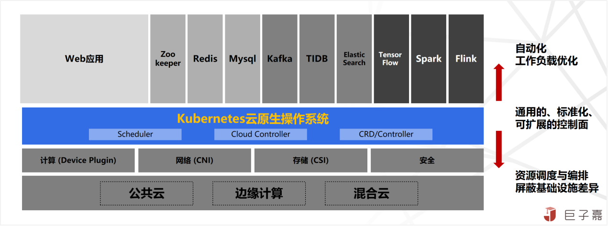

**Kubernetes是 一個開源容器編排平臺，管理大規模分散式容器化軟體應用**，是雲計算發展演進的一次徹底革命性的突破。Kubernetes 是谷歌的第三代容器管理系統，是 Borg 獨特的控制器和 Omega 靈活的排程器的組合。Kubernetes 中的應用被打包成與環境完全分離的容器映象，並且自動配置應用並維護跟蹤資源分配。

Kubernetes 是以 **應用為中心** 的技術架構與思想理念，**向下** 遮蔽基礎設施差異，實現底層基礎資源統一排程及編排；**向上** 通過容器映象標準化應用，實現應用負載自動化部署；中間通過 Kubernetes 通用的編排能力，開放 API 以及自定義 CRD 擴充套件能力，打造雲原生作業系統能力，形成雲端計算新介面；助力研發團隊 **快速構建標準化、彈性高可靠、松耦合、易管理維護的應用系統，提升交付效率，降低運維複雜度**。Kubernetes 在技術架構方面具備三個能力：

- **敏捷的彈性伸縮能力**：不同於虛擬機器分鐘級的彈性伸縮響應，容器應用可實現秒級甚至毫秒級的彈性伸縮響應；

- **智慧的服務故障自愈能力**：容器應用具有極強的自愈能力，可實現應用故障的自動摘除與重構；

- **大規模的複製分發能力**：容器應用標準化的交付製品，可實現跨平臺、跨區域，雲邊一體規模化複製分發部署能力。

## Kubernetes 整體架構

**Kubernetes 主從分散式架構圖**

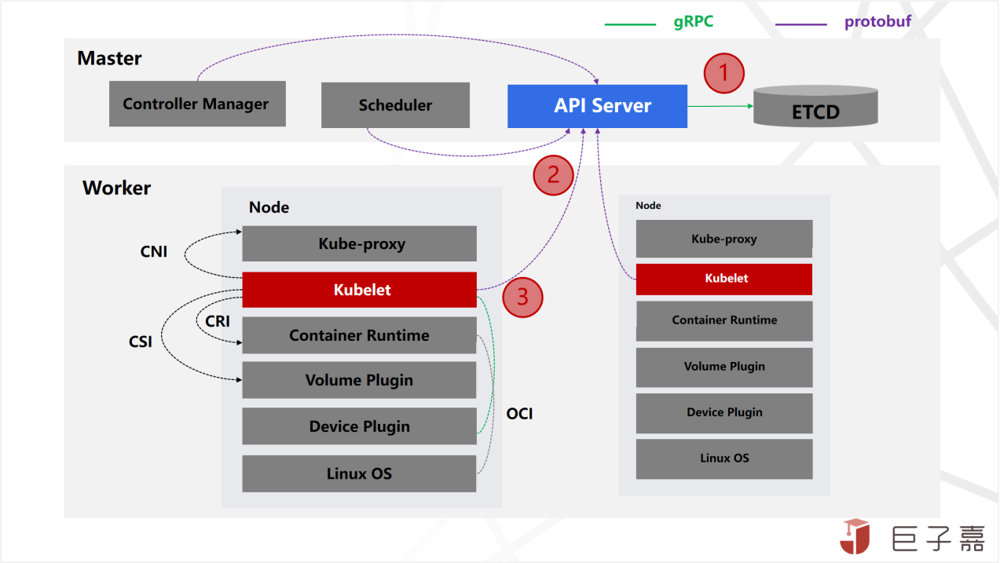

Kubernetes 是典型的主從分散式架構，由 **集中式管理節點**（Master Node）, **分散式的工作節點**（Worker Node）組成以及輔助工具組成。

### 集中式管理節點 Master Node

**集中式管理節點** ，對叢集進行排程管理，有四大核心元件:

- **API Server**：承擔叢集的閘道器，實現統一認證鑑權對外服務，同時也是管理 Node/Pod 資源代理通道；
- **Scheduler**：資源排程器，除了 Kubernetes 預設的排程器，也支援自定義排程器；
- **ETCD**：叢集狀態統一儲存，與 Zookeeper 類似的 key-value 儲存；
- **Controller Manger**：控制管理器實現自愈、擴容、應用生命週期管理、服務發現、路由、服務繫結等能力；Kubernetes 預設提供 Replication Controller、Node Controller、Namespace Controller、Service Controller、Endpoints Controller、Persistent Controller、DaemonSet Controller等控制器。

### 分散式的工作節點 Worker Node

**分散式的工作節點**，工作節點執行業務應用容器；預設會執行三大核心元件：

- **Kubelet**：與管理節點通訊並觸發指令執行，管理驅動網路，儲存及容器執行時；
- **Kube Proxy**：通過 DNS 實現服務發現，藉助 iptables 規則引導訪問至服務 IP，並將重定向至正確的後端應用，實現高可用負載均衡能力；
- **Container Runtime**：容器執行時。為了擴充套件 Kubernetes 平臺適配能力，同時也標準化整個生態，通過 **CNI 與 CSI 標準規範網路及儲存** 的擴充套件；通過 **CRI 與 OCI 標準規範容器映象及容器執行** 時的擴充套件；目前 CRI 支援的容器執行時有 docker、rkt、cri-o、frankti、kata-containers 和 clear-containers等。

### 輔助工具

輔助工具，主要是輔助叢集管理及網路擴充套件:

- **kubectl** 通過 API Server 進行互動，實現叢集管理的命令列工具；
- **Dashboard** 是Kubernetes的web使用者管理監控介面；
- **Core DNS** 是可擴充套件的 DNS 伺服器，實現叢集服務發現能力。

## Kubernetes 核心概念

### POD 容器組，Kubernetes 最小排程單元

Pod 是 Kubernetes 的最小排程及資源分配單元，Pod 之間相互隔離，通常情況一個 Pod 只建議執行一個容器，當某些容器之間關係非常緊密（Tightly coupled），可以執行在同一Pod 執行多個容器方便一起排程管理。一個 Pod 就是一個應用執行實例，通過同時執行多個 Pod 來實現應用橫向擴充套件能力。Pod 本身沒有自恢復能力，當排程或執行失敗時，需要管理節點的 Controller 觸發實現 Pod 重啟、重建或遷移等操作。

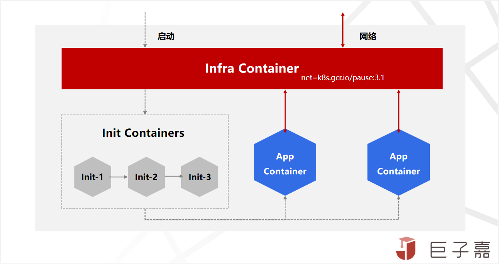

Kubernetes 最小排程 Pod 的 Container 分類及啟動過程

從 **Pod啟動過程** 來看，Pod 容器主要是 **Pause Container**，**Init Container** 以及 **App Container** 三種類型容器組成：

- **Pause Container**：又叫 Infra Container，Pod 通過 Pause Container 實現 Pod 多個容器網路共享，Pause Container 最先啟動並繫結 Pod 唯一 IP 地址與各種網路資源，其他容器通過加入Pause Container 的 Network namespace 來實現網路共享。Pause 是 C語言實現，映象非常小隻有700KB左右，並且永遠處於Pause(暫停)狀態；官方映象是 gcr.io/google_containers/pause-amd64:3.0，同時也支援自定義。
 
- **Init Container**：Pod 中可以自定義一個或者多個 Init Container，按照順序依次啟動，在應用 Container 之前啟動並執行一些輔助任務，比如執行指令碼、拷貝檔案到共享目錄、日誌收集、應用監控等。將輔助功能與主業務容器解耦，實現獨立釋出和能力重用。 除了不支援 Readiness Probe，其他與特性與普通容器保持一致。

- **App Container**：Pod 中真正承接業務的 Container，一般情況會獨立執行，如果是有微服務治理等需求會搭配 Sidecar Container 一起執行。在 Init Container 啟動完成之後，App Container 會並行啟動，但是需要等待所有 App Container 處於就緒狀態，整個 Pod 才算啟動成功。

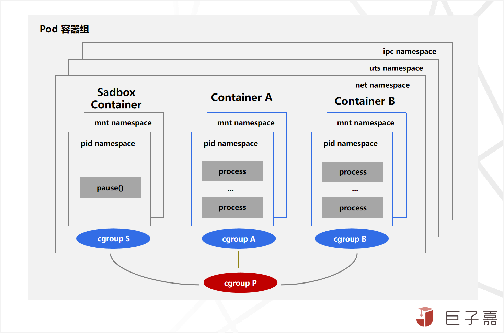

從 **POD 的資源隔離** 來看，Pod 容器主要由 Linux 提供的 Namespace 和 Cgroup 能力實現的，Namespace 實現程序間隔離，Cgroup 實現程序資源控制；其中 Namespace 由 ipc 、uts 、net 、mnt 、pid 各種資源空間聯合組成。

**CRI** 是 Kubernetes v1.5 引入的，將 Kubelet 與容器執行 runtime 解耦；CRI 中定義了 **容器** 和 **映象** 的服務的介面，因為容器執行時與映象的生命週期是彼此隔離的，所以定義了 `RuntimeService` 和 `ImageService` 兩個服務，其中 `RuntimeService` 主要包含 Sandbox 和 Container 兩種容器的管理 gRPC 介面，Sandbox 就是上面 Pod 啟動過程中提到的 **Pause 容器**。目前支援 CRI 的後端有 cri-o，cri-containerd，rkt，frakti，docker 等，cri-o 是由 redhat 發起並開源且由社群驅動的 container-runtime，輕量化專為 kubernetes 而生，主要目的就是替代 docker 作為 kubernetes 叢集的容器執行 runtime。

### Volume 儲存卷，Kubernetes 複雜的儲存架構

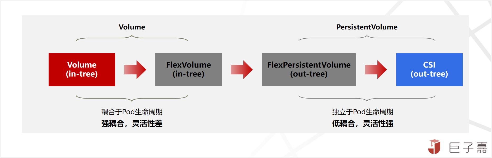

儲存非常重要關鍵，同時也是生態與技術都比較複雜的領域，就 linux、window 兩個生態支援的檔案系統就多達20+。對於 Kubernete 儲存架構設計一直在持續演進完善，為了儘可能多地相容各種儲存平臺，Kubernetes 以 in-tree plugin 的形式預設對接很多不同型別的儲存系統；同時也支援基於 FlexVolume 和 CSI 外掛以 out-of-tree plugin 來實現自定義儲存服務。

對 Kubernetes 儲存，主要有 **應用的基本配置檔案讀取、密碼金鑰管理；應用的儲存狀態、資料存取，不同應用間資料共享** 等三大使用場景。目前 Kubernetes 支援的 Volume Plugins 如下表：

|Temp|Ephermeral(Local)|Persistent(Networked)|Others|
|----|-----------------|---------------------|------|
|• Empty Dir|• Host Path • Git Repo • Local • Secret • ConfigMap • DownwardAPI|• AWS ElasticBlockStore(EBS) • GCE Persistent Disk • Azure Data Disk • Azure File Storage • vSphere • Ceph FS and RBD • GlusterFS • iSCSI • Cinder • Dell EMC ScalelO • Longhorn • ...|• Flex Volume • Container Storage lnterface(CSI,new in vl.9)|

- **Empty Dir**：生命週期與 Pod 保持一致，當 Pod 刪除後 emptyDir 中的資料也會被自動清除。當前 emptyDir 支援的型別有記憶體、大頁記憶體、Node 節點上 Pod 所在的檔案系統。

- **ConfigMap**：主要是承擔配置中心，用於儲存應用的配置資料，比如 Springboot 應用 properties 配置檔案資料，但是空間大小限制在 1MB 內。
 
- **Secret**：功能與 ConfigMap 類似，用於儲存應用的敏感資料，比如資料密碼、token、證書等，可以與 ConfigMap 聯合使用，同樣空間大小限制在 1MB 內。

- **HostPath**：將 Node 節點本地檔案系統路徑對映到 pod 容器中使用。與 emptyDir 不同之處就是 Pod 刪除後，HostPath 中的資料 Kubernetes 根據使用者的配置，可以不被清除。

- **In-tree** 網路儲存：網路儲存跟隨 Pod 的生命週期，通過儲存外掛對接不同型別儲存；其中 FlexVolume 雖然允許自定義開發驅動來掛載捲到叢集 Node 節點上供 Pod 使用，但生命週期與 pod 同步。

- **PersistentVolumeClaim** 網路儲存：具有獨立的生命週期，可以通過儲存的 out-tree 外掛對接不同型別儲存。當前支援的儲存外掛型別有 FlexVolume 與 CSI。

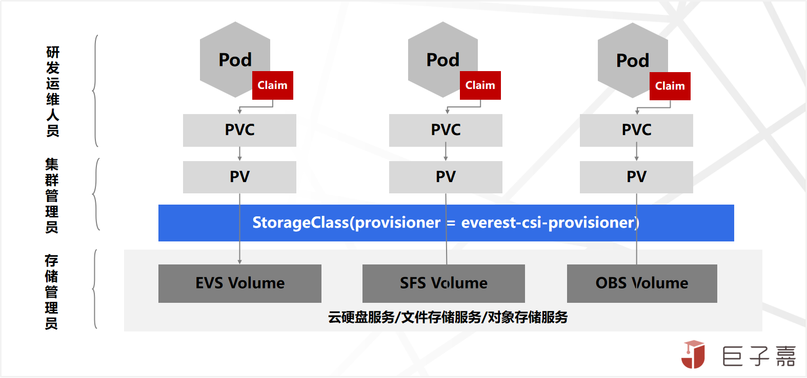

引入 **PV、PVC、StorageClass** 之後，資源管控更加靈活，團隊職責更加明確，研發人員只需考慮儲存需求（IO、容量、訪問模式等），不需要關注底層儲存細節；底層複雜的細節都由專業的叢集管理與儲存管理員來完成。

**CSI** 是 Kubernetes 1.9 版本開始引入，建立一套標準的儲存管理介面，通過該介面為容器提供儲存服務。從而實現 Kubernetes 平臺與儲存服務驅動完全解耦。CSI 主要包含 **CSI Controller Server** 與 **CSI Node Server** 兩個部分, **Controller Server** 主要實現建立、刪除、掛載、解除安裝等控制功能； **Node Server** 主要實現的是 Node 節點上的 mount、unmount的操作。

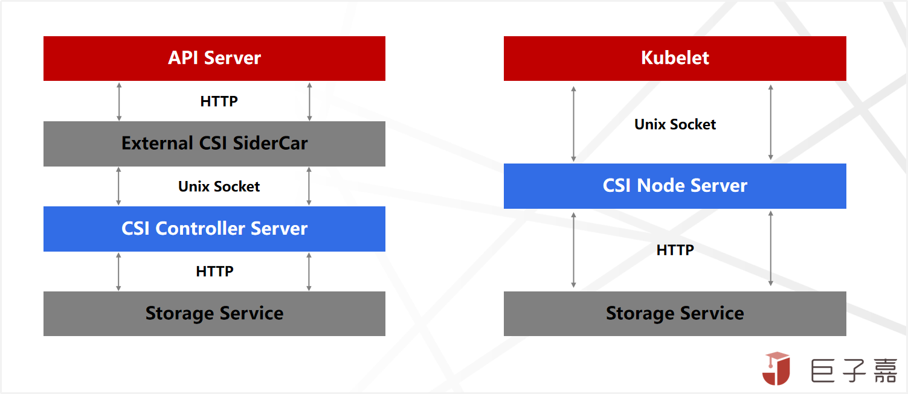

CSI Controller Server 和 External CSI SideCar 是通過 **Unix Socket** 來進行通訊的，CSI Node Server 和 Kubelet 也是通過 **Unix Socket** 來通訊。CSI 實現類也日趨完善，比如 ExpandCSIVolumes 可以實現檔案系統擴容； VolumeSnapshotDataSource 可以實現資料卷的快照； VolumePVCDataSource 實現自定義定 PVC 資料來源；CSIInlineVolume在Volume 中定義一些 CSI 的驅動。阿里雲也開源了阿里雲盤、NAS、CPFS、OSS、LVM 等 CSI儲存外掛。

### Ingress 與 Service，百花齊放的 Kubernetes 網路

Kubernetes 容器網路非常複雜，涉及的概念也比較多，比如 Pod 網路，Service 網路，Cluster IP，NodePort，LoadBalancer 和 Ingress 等，為此將 Kubernetes 的網路參考TCP/IP協議棧抽象為四層：

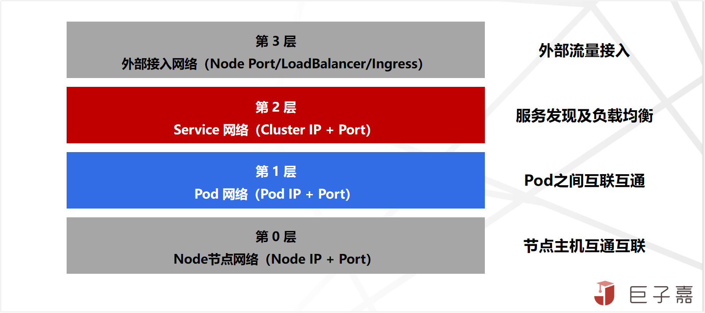

- **第0層**：Node 節點網路比較簡單，就是保證 Kubernetes 節點(物理或虛擬機器)之間能夠正常 IP 定址和互通的網路，一般由底層(公有雲或資料中心) **網路基礎設施支援**。
 
- **第1層**：Pod 是 Kubernetes 的最小排程單元，**Pod 網路** 就是確保 Kubernetes 叢集中所有Pod(包括同一節點及不同節點上的Pod)，邏輯上在同一個平面網路內，能夠相互 IP 定址和通訊的網路。是容器網路最複雜部分，通過各種容器網路外掛滿足不同網路需求，通過 **CNI 標準化** 及開放網路自定義能力。

- **第3層**：雖然單個 Pod 都有 IP，但是與 Pod 生命週期一致，為了解決一組相同 Pod 統一穩定的訪問地址，並且將請求均衡的分發到後端 Pod 應用服務中。Kubernetes 引入了**Service 網路** ，以此實現 **服務發現(Service Discovery)** 和 **負載均衡(Load Balancing)** 能力，底層是通過 **Kube-Proxy + iptables** 轉發實現，對應用無侵入且不穿透代理，沒有額外效能損耗。

- **第4層**：Kubernetes **Service 網路** 是叢集內部網路，叢集外部是無法訪問，需要將內部服務暴露外部才能訪問。Kubernetes 通過 **NodePort**，**LoadBalancer** 和 **Ingress** 多個方式構建外部網路接入能力。

|型別|作用|實現|
|---|---|---|
|節點網路|Master/Worker節點之間網路互通|路由器，交換機，網絡卡|
|Pod網路|Pod虛擬機器之間互通|虛擬網絡卡，虛擬網橋，網絡卡，路由器or覆蓋網路|
|Service網路|服務發現+負載均衡|Kube-proxy, Kubelet, Master, Kube-DNS|
|NodePort|將Service暴露在節點網路上|Kube-proxy|
|LoadBalancer|將Service暴露在公網上+負載均衡|公有云 LB + NodePort|
|Ingress|反向路由，安全，日誌監控 （類似反向代理or閘道器）|Nginx/Envoy/Traefik/Zuul/SpringCloudGateway|

**CNI** 最早是由 CoreOS 發起的容器網路規範，是 Kubernetes 網路外掛的基礎。Container Runtime 在建立容器時，先建立好 network namespace，再呼叫 CNI 外掛為network namespace 配置網路，最後啟動容器內程序。CNI 外掛包括 CNI Plugin 與 IPAM Plugin 兩部分：

- **CNI Plugin**：負責配置管理容器網路，包括兩個基本的介面：
    - 網路配置: AddNetwork(net NetworkConfig, rt RuntimeConf) (types.Result, error)
    - 清理網路: DelNetwork(net NetworkConfig, rt RuntimeConf) error
- **IPAM Plugin**：負責容器 IP 地址分配，實現包括 host-local 和 dhcp。

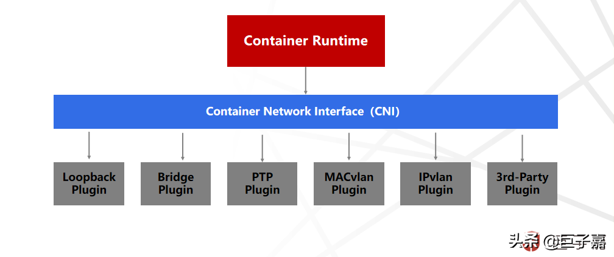

容器網路技術也在持續演進發展，社群開源的網路元件眾多，比如 Flannel、Calico、Cilium、OVN 等，每個元件都有各自的優點及適應的場景，難以形成大一統的元件及解決方案。

### Workload 工作負載，Kubernetes 應用中心理念

**Kubernetes支援多種型別的容器工作負載及呼叫關係**

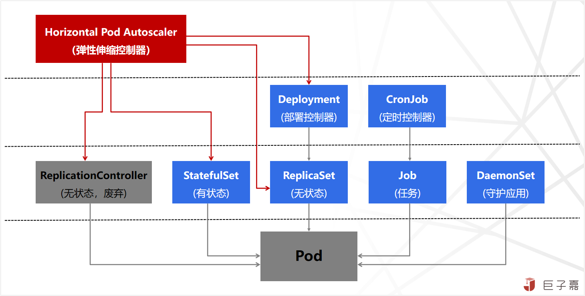

Kubernetes 通過 **工作負載 Workload** 實現應用管理部署與釋出，踐行 Kubernetes 以應用為中心的理念。Kubernetes 支援多種型別的工作負載，包含 Deployment、StatefulSet、ReplicaSet、Job、CronJob、DaemonSet，以滿足不同場景的需求。

- **Deployment 與 ReplicaSet**：替換原來的 ReplicationController 物件，管理部署 **無狀態應用**，Deployment 管理不同版本的 ReplicaSet，ReplicaSet 理相同版本的Pod，通過 Deployment 調整 ReplicaSet 的終態副本數，控制器會維持實際執行的 Pod 數量與期望的數量一致，Pod 出故障時會自動重啟或恢復。
 
- **StatefulSet**：管理部署 **有狀態應用**，建立的 Pod 擁有根據規範建立的持久型識別符號。Pod遷移或銷燬重啟後，識別符號仍會保留。如每個Pod有序號，可以按序號建立更新或刪除；Pod有唯一網路標誌 (hostname)或獨享的儲存 PV,支援灰度佈署等。

- **DaemonSet**：管理部署每個節點執行的 **守護任務**，如監控、日誌收集等。新加入的節點也執行，移出節點是需要刪除。也可以通過標籤的指定執行節點。

- **Job 與 Cronjob**：Job是 **一次性任務**，可建立一個或多個 Pod，監控 Pod 是否成功執行或終止；根據 Pod 狀態設定重複次數、併發度、重啟策略。Cronjob 是定時排程的 Job,可以指定執行時間、等待時間、是否並行執行、執行次數限制。

在 Kubernetes 生態中，還有一些提供額外操作的第三方工作負載。同時也可以通過使用 CRD 自定義工作負載。還有就是 Device Plugin 驅動的硬體工作負載，會在後續章節詳細講解。

### Controller 控制器，Kubernetes 集控管理中心

**Controller Manager** 作為 Kubernetes 集控管理中心，負責叢集的 Node、Pod 副本、服務端點（Endpoint）、名稱空間（Namespace）、服務賬號（ServiceAccount）、資源定額（ResourceQuota）的資源管理，並通過 API Server 介面實時監控叢集的每個資源物件的狀態，一旦發生故障導致系統狀態發生變化，就會立即嘗試修復到“期望狀態”。

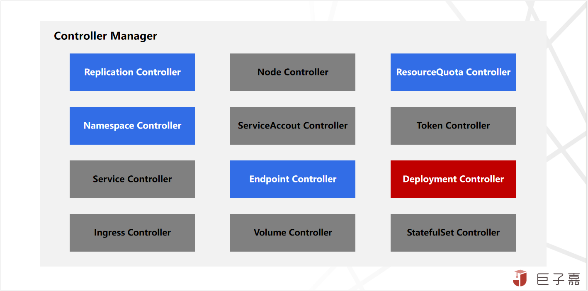

- **Replication Controller**：保證叢集中一個RC所關聯的 Pod 副本數始終保持預設值。

- **ResourceQuota Controller**：確保 Kubernetes 中的資源物件在任何時候都不會超量佔用系統物理資源。有容器，Pod 以及 Namespace 三個級別。

- **Namespace Controller**：通過 API Server 定時讀取 Namespace 資訊。如果 Namespace 被 API 標記為優雅刪除（即設定刪除期限，DeletionTimestamp）,則將該Namespace 狀態設定為 “Terminating”,並儲存到 etcd 中。同時刪除該 Namespace 下的 ServiceAccount、RC、Pod 等資源物件。
 
- **Endpoint Controller**：Endpoints 是 Service 對應所有 Pod 副本的訪問地址，Endpoint Controller 主要負責監聽 Service 和對應的 Pod 副本的變化，從而生成和維護 Endpoints 物件控制器。

- **Deployment Controller**：Deployment 通過控制 ReplicaSet，ReplicaSet 再控制 Pod，最終由 Deployment Controller 驅動達到期望狀態，Deployment Controller 會監聽 DeploymentInformer、ReplicaSetInformer、PodInformer 三種資源。

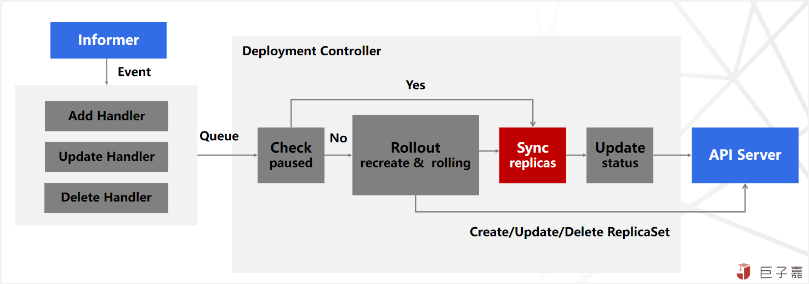

另外，在 Kubernetes v1.6 引入了雲控制管理器 Cloud Controller Manager（CCM），提供與有雲基礎產品對接的支援，後續也會詳細講解。

## 總結

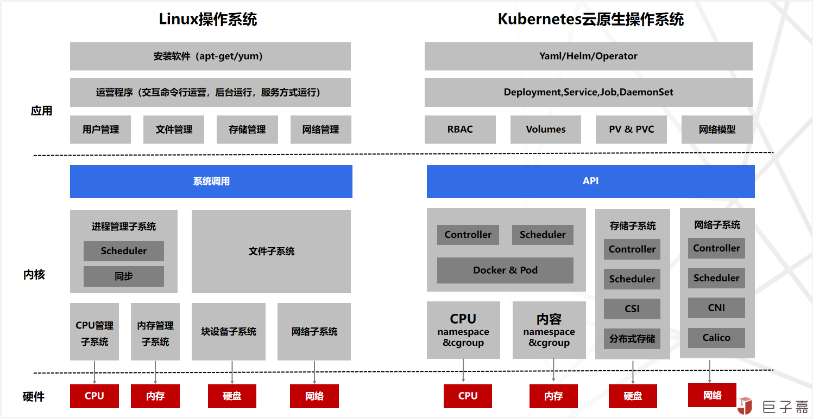

總結一下，Kubernetes 不僅是一個強大的容器編排系統本身，而且促進了一個龐大的工具和服務的生態系統，**雲原生時代的作業系統，形成雲端計算新介面**。 **從設計理念方面**，Kubernetes 是以**應用為中心**的構建理念，**向下** 遮蔽基礎設施差異，實現底層基礎資源統一排程及編排；**向上** 通過容器映象標準化應用，實現應用負載自動化部署；**中間** 通過 Kubernetes 通用的編排能力，開放 API 以及自定義 CRD 擴充套件能力；

- **從技術架構方面**，Kubernetes 是典型的分散式主從架構，由 Master 控制節點與可以水平擴充套件的 Worker 工作節點組成，Master 實現集中式控制管理，Worker 實現分散式執行；與 Openstack 的架構還有基於 SpringCloud 研發的分微服業務應用沒有太大區別。
 
- **從設計模式方面**，Kubernetes 通過定義大量的模型（原語、資源物件、配置、常用的 CRD），通過配置管理模型實現叢集資源的控制；雖然模型多且複雜，但是可以分層（核心層，隔離與服務訪問層，排程層，資源層）逐步理解。

- **從平臺擴充套件方面**，Kubernetes 是一個開放可擴充套件平臺，不僅有開發的 API，開放標準（CNI，CSI，CRI等）以及 CRD，不僅是一個單純執行時平臺，同時面向運維的開發平臺。

