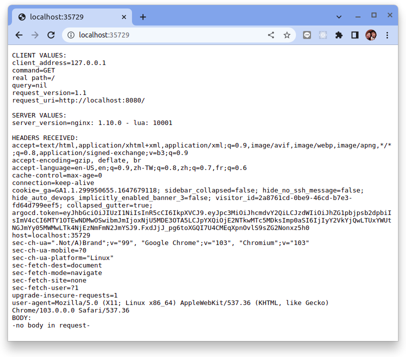

# 你好，K3D

原文: [Hello Minikube](https://kubernetes.io/docs/tutorials/hello-minikube/)

本教程向你展示如何使用 K3D 在 Kubernetes 上運行一個應用示例。

!!! info
    說明： 如果你已在本地安裝 K3D，也可以按照本教程操作。安裝指南參閱 [使用 K3D 設置 Kubernetes 集群](../../k3d/k3s-kubernetes-cluster-setup-with-k3d.md) 。

## 教程目標

* 將一個示例應用部署到 K3D
* 運行應用程序
* 查看應用日誌

## 準備開始

本教程提供了容器鏡像，使用 NGINX 來對所有請求做出回應：

## 創建 K3D 集群

K3D 默認使用 traefik，我們將通過 traefik 暴露佈署在 Kubernetes 裡的應用程序。如果您在遠程服務器上安裝了 K3D，則需要打開外部端口進行訪問。為此，我們使用以下命令打開負載均衡器。

```bash	
$ k3d cluster create -p 8081:80@loadbalancer
```

!!! info
    - 端口映射結構 8081:80@loadbalancer 的意思是：“將主機的 8081 端口映射到與 nodefilter 負載平衡器匹配的容器上的 80 端口”

## 創建 Deployment

Kubernetes [Pod](https://kubernetes.io/zh-cn/docs/concepts/workloads/pods/) 是由一個或多個 **為了管理和聯網而綁定在一起的容器構成的容器組**。本教程中的 Pod 只有一個容器。 Kubernetes [Deployment](https://kubernetes.io/zh-cn/docs/concepts/workloads/controllers/deployment/) 檢查 Pod 的健康狀況，並在 Pod 中的容器終止的情況下重新啟動新的容器。 Deployment 是管理 Pod 創建和擴展的推薦方法。

**1.使用 kubectl create 命令創建管理 Pod 的 Deployment。該 Pod 根據提供的 Docker 鏡像運行 Container。**

```bash
kubectl create deployment hello-node --image=k8s.gcr.io/echoserver:1.4
```

**2.查看 Deployment：**

```bash
kubectl get deployments
```

輸出結果類似於這樣：

```
NAME         READY   UP-TO-DATE   AVAILABLE   AGE
hello-node   1/1     1            1           61s
```

**3.查看 Pod：**

```bash
kubectl get pods
```

輸出結果類似於這樣：

```
NAME                          READY   STATUS    RESTARTS   AGE
hello-node-7567d9fdc9-zstdl   1/1     Running   0          2m22s
```

**4.查看集群事件：**

```bash
kubectl get events
```

輸出結果類似於這樣：

```
LAST SEEN   TYPE      REASON                    OBJECT                             MESSAGE
...
...
3m11s       Normal    ScalingReplicaSet         deployment/hello-node              Scaled up replica set hello-node-7567d9fdc9 to 1
3m11s       Normal    Scheduled                 pod/hello-node-7567d9fdc9-zstdl    Successfully assigned default/hello-node-7567d9fdc9-zstdl to k3d-k3s-default-server-0
3m11s       Normal    SuccessfulCreate          replicaset/hello-node-7567d9fdc9   Created pod: hello-node-7567d9fdc9-zstdl
2m52s       Normal    Pulling                   pod/hello-node-7567d9fdc9-zstdl    Pulling image "k8s.gcr.io/echoserver:1.4"
2m30s       Normal    Pulled                    pod/hello-node-7567d9fdc9-zstdl    Successfully pulled image "k8s.gcr.io/echoserver:1.4" in 22.087240618s
2m26s       Normal    Created                   pod/hello-node-7567d9fdc9-zstdl    Created container echoserver
2m25s       Normal    Started                   pod/hello-node-7567d9fdc9-zstdl    Started container echoserver
...
...
```

**5.查看 kubectl 配置：**

```bash
kubectl config view
```

輸出結果類似於這樣：

```
$ kubectl config view
apiVersion: v1
clusters:
- cluster:
    certificate-authority-data: DATA+OMITTED
    server: https://0.0.0.0:46637
  name: k3d-k3s-default
contexts:
- context:
    cluster: k3d-k3s-default
    user: admin@k3d-k3s-default
  name: k3d-k3s-default
current-context: k3d-k3s-default
kind: Config
preferences: {}
users:
- name: admin@k3d-k3s-default
  user:
    client-certificate-data: REDACTED
    client-key-data: REDACTED
```

!!! info
    說明： 有關 kubectl 命令的更多信息，請參閱 [kubectl 概述](https://kubernetes.io/zh-cn/docs/reference/kubectl/)。

## 創建 Service

默認情況下，Pod 只能通過 Kubernetes 集群中的內部 IP 地址訪問。要使得 `hello-node` 容器可以從 Kubernetes 虛擬網絡的外部訪問，你必須將 Pod 暴露為 Kubernetes [Service](https://kubernetes.io/zh-cn/docs/concepts/services-networking/service/)。

**1. 使用 `kubectl expose` 命令將 Pod 暴露成ClusterIP：**

```bash
kubectl expose deployment hello-node --port=8080
```

這裡的 `--type=LoadBalancer` 參數表明你希望將你的 Service 暴露到集群外部。

鏡像 `k8s.gcr.io/echoserver` 中的應用程序代碼僅監聽 TCP 8080 端口。如果你用 `kubectl expose` 暴露了其它的端口，客戶端將不能訪問到服務。

**2. 查看你創建的 Service：**

```bash
kubectl get services
```

輸出結果類似於這樣：

```
NAME         TYPE        CLUSTER-IP      EXTERNAL-IP   PORT(S)    AGE
kubernetes   ClusterIP   10.43.0.1       <none>        443/TCP    35m
hello-node   ClusterIP   10.43.228.243   <none>        8080/TCP   4s
```

**3. 使用端口轉發來訪問集群中的應用**

使用 kubectl 用 `port-forward` 來選擇和分配本地端口並暴露出集群中的應用：

格式:

```bash
kubectl port-forward svc/[service-name] -n [namespace] [external-port]:[internal-port] --address='0.0.0.0'
```

執行下列命令來暴露出集群中的應用：

```bash
kubectl port-forward service/hello-node :8080 --address='0.0.0.0'
```

kubectl 工具會找到一個未被使用的本地端口號。輸出類似於：

```
Forwarding from 0.0.0.0:35729 -> 8080
```

!!! tip
    請注意在 `port-forward` 輸出中與 8080 對應的長度為 5 位的端口號。此端口號是隨機生成的，可能與你的不同。對應於上面的例子，集群應用被暴露出的本地端口號是 35729。

**4. 訪問暴露出集群中的應用**

執行下列命令來訪問暴露出來的應用：

```bash
curl localhost:35729
```

輸出結果類似於這樣：

```
CLIENT VALUES:
client_address=127.0.0.1
command=GET
real path=/
query=nil
request_version=1.1
request_uri=http://localhost:8080/

SERVER VALUES:
server_version=nginx: 1.10.0 - lua: 10001

HEADERS RECEIVED:
accept=*/*
host=localhost:35729
user-agent=curl/7.74.0
BODY:
-no body in request-
```




## 清理

現在可以清理你在集群中創建的資源：

```bash
kubectl delete service hello-node
kubectl delete deployment hello-node
```

可選地，停止 K3D 所創建的集群（Docker）：

```bash
k3d cluster stop
```

可選地，刪除 K3D 所創建的集群（Docker）：

```bash
k3d cluster delete
```