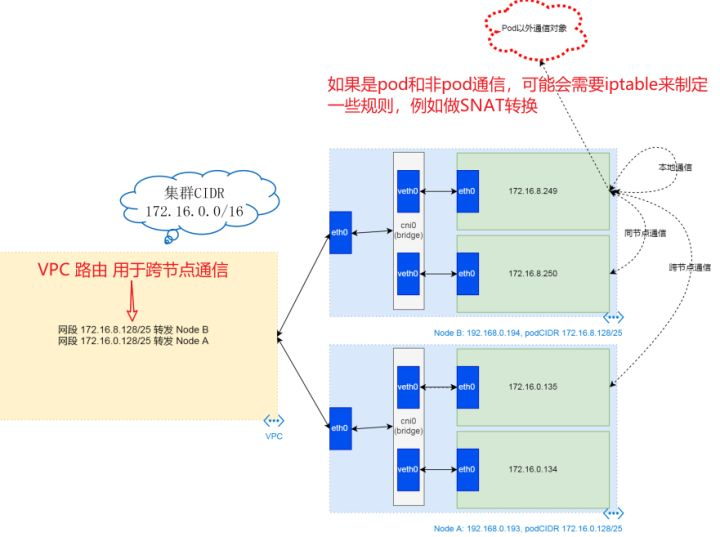
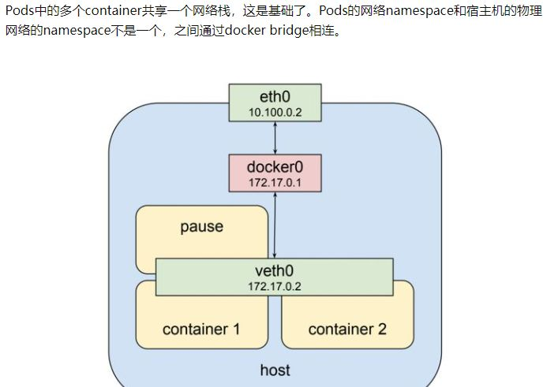

# Kubernetes 網絡通信介紹

原文: https://zhuanlan.zhihu.com/p/432235593

整體看 Kubernetes 網絡拓撲是 Cluster CIDR 組成的，而在實際的節點裡面還有 Pod CIDR，所以網絡通信需要先找到目標節點，再轉給目標 pod；


整體對象的創建流程如下：


## Cluster 搭建

在局域網絡中分配 `192.168.0.0/16` 網段的地址構建局域網絡的通信結構


|||
| ----------- | ------------------------------------ |
| IP 數量 | 65,536 | 
| 可用 IP 地址數量 | 65,534 |
| Netmask 掩碼 | 255.255.0.0 | 
| 網絡位址 | 192.168.0.0 |
| 第一個可用 IP 位址 | 192.168.0.1 | 
| 最後的可用 IP 位址 | 192.168.255.254 | 
| 廣播位址 | 192.168.255.254 | 


註冊節點到集群 master，通過 kubectl 配置節點的 Pod CIDR 地址，例如 **NodeB** 配置 `172.16.8.128/25` , **NodeA** 配置 `172.16.0.128/25`

- **Cluster CIDR** : `172.16.0.0/16`

|||
| ----------- | ------------------------------------ |
| IP 數量 | 65,536 | 
| 可用 IP 地址數量 | 65,534 |
| Netmask 掩碼 | 255.255.0.0 | 
| 網絡位址 | 172.16.0.0 |
| 第一個可用 IP 位址 | 172.16.0.1 | 
| 最後的可用 IP 位址 | 172.16.255.254 | 
| 廣播位址 | 172.16.255.255 | 

- **Pod CIDR (NodeB)**: `172.16.8.128/25`

|||
| ----------- | ------------------------------------ |
| IP 數量 | 126 | 
| 可用 IP 地址數量 | 124 |
| Netmask 掩碼 | 255.255.255.128 | 
| 網絡位址 | 172.16.8.128 |
| 第一個可用 IP 位址 | 172.16.8.129 | 
| 最後的可用 IP 位址 | 172.16.8.254 | 
| 廣播位址 | 172.16.8.255 | 


- **Pod CIDR (NodeA)**: `172.16.0.128/25`

|||
| ----------- | ------------------------------------ |
| IP 數量 | 126 | 
| 可用 IP 地址數量 | 124 |
| Netmask 掩碼 | 255.255.255.128 | 
| 網絡位址 | 172.16.0.128 |
| 第一個可用 IP 位址 | 172.16.0.129 | 
| 最後的可用 IP 位址 | 172.16.0.254 | 
| 廣播位址 | 172.16.0.255 | 


## Node 搭建

經過集群的 CIDR 配置及節點的 CIDR 配置以後，master 服務端 control manage 會給 VPC 配置路由表項，轉發的 IP 地址匹配 Pod CIDR 時，就將包裝給對應的網卡地址。

其次還會創建虛擬網橋 cni0 及 cni0 相關的路由，從外面進來的網絡包，如果地址屬於 podCIDR，即會被轉發到 cni0 局域網裡。


## Pod 搭建

這個階段，kubelet 會通過 flannel cni 給 pod 創建網絡空間和 veth 設備，然後把 veth 加入到 cni0 虛擬網橋裡，並為之分配 pod CIDR 中的 ip 地址。


### Pod 之間的通信

其中本地通信，說的是 Pod 內部不同容器之間的通信。因為 Pod 內容器之間共享一個網絡，它們之間的通信可通過 `loopback` 設備完成。

同節點 Pod 之間的通信是 cni0 虛擬網橋內部間的通信，這相當于一個二層局域網絡內部的通信。

跨節點 Pod 通信略微複雜一點，但也很直觀。發送端數據封包通過 cni0 cni0 虛擬網橋的網關，流轉到節點上，然後經過節點 eth0 發送給 VPN 路由。這裡不會經過任何封包操作。
當 VPC 路由收到數據封包時，它通過查詢路由表來確認數據封包目的地，并把數據封包發送給對應的節點。

而進去節點之後，因 flanneld 在節點上創建了真的 cni0 的路由，數據封包會被發送到目的地的 cni0 區域網，然後再到目的地 Pod。

最後一種情況，Pod 與非 Pod 網絡的實體通信，需要經過節點上的 iptables 規則做 snat，而此規則就是 flanneld 依据命令行 ip-masq 選項所做的配置。




## 理解 Pod，Service，Ingress 的網絡結構

### Pod 概念

Pod 內容器之間共享一個網絡，它們之間的通信通過 `loopback` 設備完成。同節點 Pod 之間的通信是 cni0 虛擬網橋內部間的通信。



在 pods 的 namespace 中，pods 的虛擬網絡接口為 `veth0`；在宿主機上，物理網絡的網絡接口為 `eth0`。 `cni0` 虛擬網橋作為 `veth0` 的默認網關，用於和宿主機網絡的通信。

所有 pods 的 veth0 所能分配的IP是一個獨立的 IP 地址範圍，來自於創建 cluster 時候 kubeadm 的 --pod-network-cidr 參數設定的 CIDR，這裡看起來像是172.17.0.0/24，是一個B類局域網IP地址段；所有宿主機的網絡接口 eth0 所能分配的 IP 是實際物理網絡的設定，一般來自於實際物理網絡中的路由器通過 DHCP 分配的，這裡看起來是 10.100.0.0/24，是一個A類局域網IP地址段。 

`cni0` 虛擬網橋建立起 pod 和其宿主機之間的通信，但是並沒有解決完問題，事實上，直到這裡還屬於 Docker 自身的範疇，K8s 的 pods 還要能夠與其它宿主機節點上的 pods 通信。 


K8s 使用 custom bridge 代替了 docker bridge。由此，如果左側的 pod 想訪問右側的 pod，則 IP 封包會通過 bridge `cbr0` 來到左側宿主機的 `eth0`，然後查詢宿主機上的路由信息，繼而將 IP 封包送往右側的宿主機的 `eth0`，繼而再送往右側的 bridge `cbr0`，最後送往右側的 pod。

訪問是可以訪問了，但是相關的問題就來了，而且還很多:

1. 一個服務經常會起多個 pod，你到底訪問那個 pod 的 ip 呢?
2. pod 經常會因為各種原因被調度，調度後一個 pod 的 ip 會發生變化...
3. pod 的 ip 是虛擬的且局域的，在集群內部訪問沒有問題，但是從 k8s 集群的外部如何訪問 pod 的 ip 呢?

解決1、2問題的答案就是反向代理(Reverse proxy)和負載均衡(Load balancer)，這是由來已久的慣例，由此我們引入了 K8s 的 service。

### Service 概念

Service 是由 kube-proxy 組件，加上 Iptables 來共同實現的。

- Kube-proxy 通過 Infomer 感知到 Service 對象的添加。作為對這個事件的相應， 它就會在宿主機上創建一條 Iptables 規則， 規定凡是 訪問 Service VIP 都跳轉到這條Iptables 規則上進行處理。

- 這條 Iptables 規則是什麼呢? 實際上是一組規則， 一組隨機模式的 IPtables 鏈， 三條鏈指向的最終目的地，其實就是這個 Service 代理的三個Pod 。這一組規則就是 Service實現負載均衡的位置。


定義Service的方式和各種資源對象的方式類型一樣，假定我們有一組Pod服務，它們對外暴露了 80 端口，同時都被打上了app=myapp這樣的標籤，那麼我們就可以像下面這樣來定義一個Service對象：


**pod示例**：

```yaml title="mydeployment.yaml"
apiVersion: apps/v1
kind: Deployment
metadata:
  name: test
spec:
  selector:
    matchLabels:
      app: myapp
  replicas: 3
  template:
    metadata:
      labels:
        app: myapp
    spec:
      containers:
      - name: nginx
        image: nginx:1.7.9
        ports:
        - containerPort: 80
```

service基於pod的示例：

```yaml title="myservice.yaml"
apiVersion: v1
kind: Service
metadata:
  name: myservice
spec:
  selector:
    app: myapp
  ports:
  - protocol: TCP
    port: 80
    targetPort: 80
```

然後通過的使用 `kubectl create -f myservice.yaml` 就可以創建一個名為 myservice 的 Service 對象，它會將請求代理到使用 TCP 端口為 80，具有標籤 app=myapp 的Pod上，這個 Service 會被系統分配一個我們上面說的 Cluster IP，該 Service 還會持續的監聽 selector 下面的 Pod，會把這些 Pod 信息更新到一個名為 myservice 的Endpoints 對象上去，這個對象就類似於我們上面說的 Pod集合了。

在定義 Service 的時候可以指定一個自己需要的類型的 Service，如果不指定的話默認是 ClusterIP 類型。可以使用的服務類型如下：

1. **ClusterIP**：通過集群的內部 IP 暴露服務，選擇該值，服務只能夠在集群內部可以訪問，這也是默認的ServiceType。
2. **NodePort**：通過每個 Node 節點上的 IP 和靜態端口（NodePort）暴露服務。 NodePort 服務會路由到 ClusterIP 服務，這個 ClusterIP 服務會自動創建。通過請求 :，可以從集群的外部訪問一個 NodePort 服務。
3. **LoadBalancer**：使用雲提供商的負載局衡器，可以向外部暴露服務。外部的負載均衡器可以路由到 NodePort 服務和 ClusterIP 服務，這個需要結合具體的雲廠商進行操作。
4. **ExternalName**：通過返回 CNAME 和它的值，可以將服務映射到 externalName 字段的內容（例如， http://foo.bar.example.com）。

## Ingress 概念

Kubernetes 向外部暴露服務的手法主要是通過 NodePort 方式，通過綁定宿主機的某個端口,然後進行 pod 的請求轉發和負載均衡，但這種方式下缺陷是：

Service 可能有很多個，如果每個都綁定一個 node 主機端口的話，主機需要開放外圍一堆的端口進行服務調用，管理混亂無法應用很多公司要求的防火牆規則。

理想的方式是通過一個外部的負載均衡器，綁定固定的端口，比如80,然後根據域名或者服務名向後面的Service ip轉發，Nginx很好的解決了這個需求，但問題是如果有新的服務加入，如何去修改Nginx的配置，並且加載這些配置？ 

Kubernetes 給出的方案就是 Ingress，Ingress 包含了兩大主件 Ingress Controller 和 Ingress。

- Ingress 解決的是新的服務加入後，域名和服務的對應問題，基本上是一個 ingress 的對象，通過 yaml 進行創建和更新進行加載。
- Ingress Controller 是將I ngress 這種變化生成一段 Nginx 的配置，然後將這個配置通過Kubernetes API寫到 Nginx 的 Pod 中，然後 reload.（注意：寫入 nginx.conf 的不是 service 的地址，而是 service backend 的 pod 的地址，避免在 service 在增加一層負載均衡轉發）

