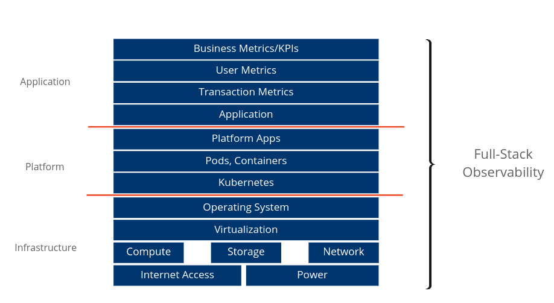
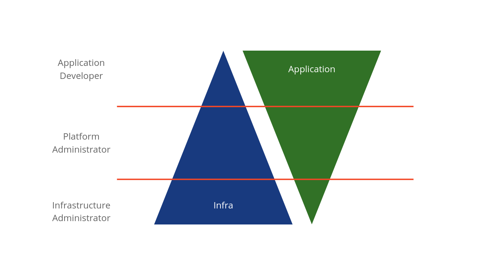

# Kubernetes 可觀察性和監控

原文: https://blogs.vmware.com/management/2020/09/kubernetes-observability-monitoring-in-the-cloud.html

隨著 Kubernetes 的引入，“day 2 operations” 的議題也隨之而來。能夠查看應用程序、Kubernetes 堆棧、底層基礎設施和網絡發生的情況是在基礎設施之上部署 Kubernetes 應用程序時需要考慮的方面之一。

對於今天的雲管理員來說，能夠監控整個堆棧是一項有趣的任務。因為在應用程序和基礎設施方面都有很多組件。即使 Kubernetes 自動化了很多複雜性，它仍然需要被監控，我們需要確保堆棧中的所有組件都按預期工作，但也要按照用戶的期望交付。為此，您需要能夠觀察整個堆棧。從使用應用程序的用戶到底層基礎設施及其所有組件。

下圖給出了從應用程序到基礎架構的完整堆棧的圖形表示。

從上圖中我們可以看到，有很多組件組成了一個完整的（Kubernetes）應用程序棧。一切都需要被監控和觀察。從上到下或從下到上，取決於您來自平台的用戶/運營商類型。

## 不同的用戶 不同的工具

這說明了不同的用戶在監控應用程序堆棧時有不同的目標。 基礎架構管理人員通常專注於基礎設施組件。而開發人員更關注應用程序本身。最後但同樣重要的是，我們有平台管理人員，支持應用程序開發人員，他們需要同時關注應用程序和基礎設施。

從上圖可以清楚地看出，不同的用戶在監控上會有不同的需求與目標。為了滿足這些需求，您通常需要不同的工具來組成監控和觀察技堆棧。