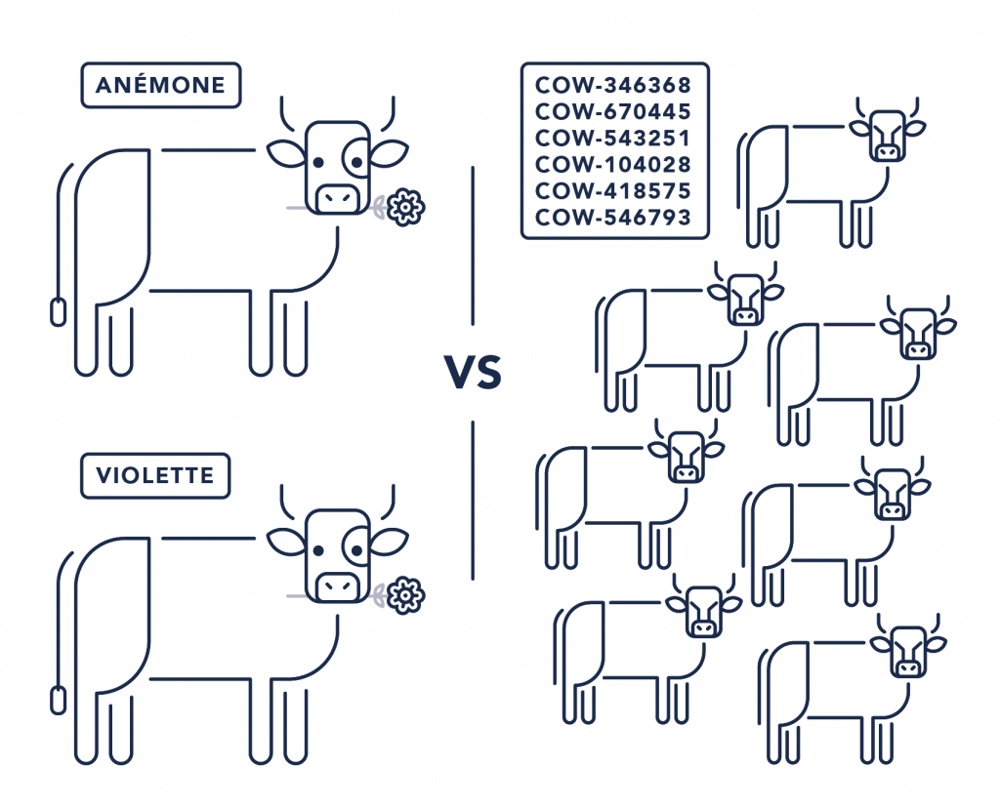
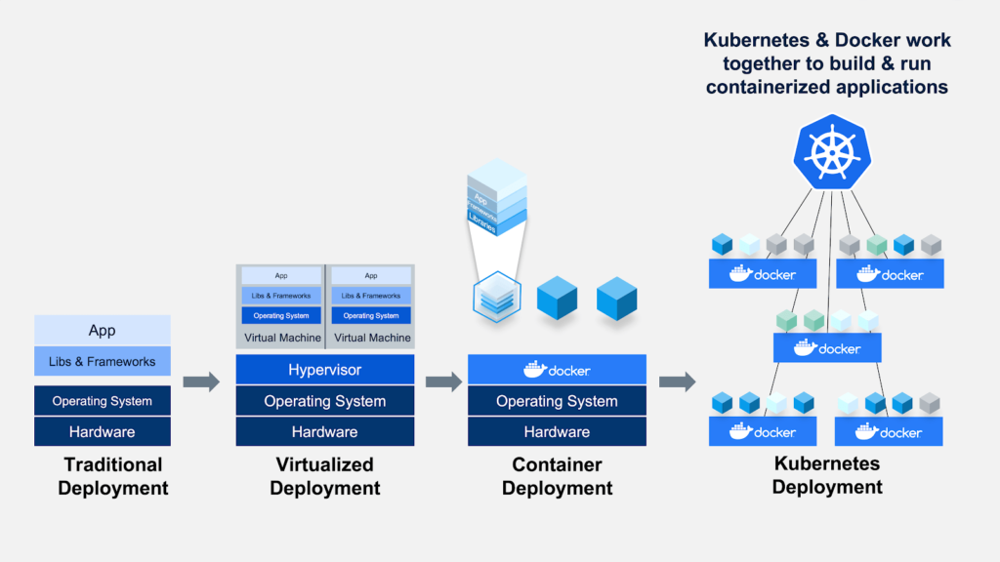
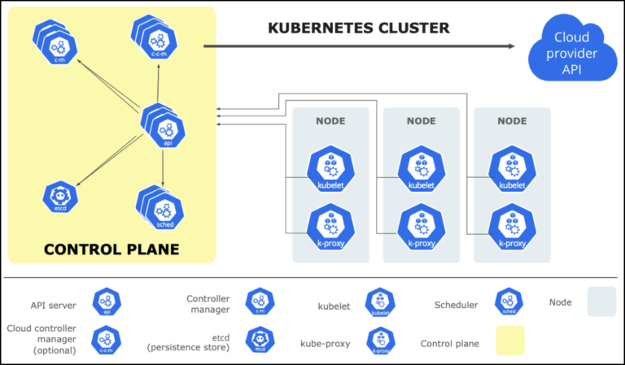
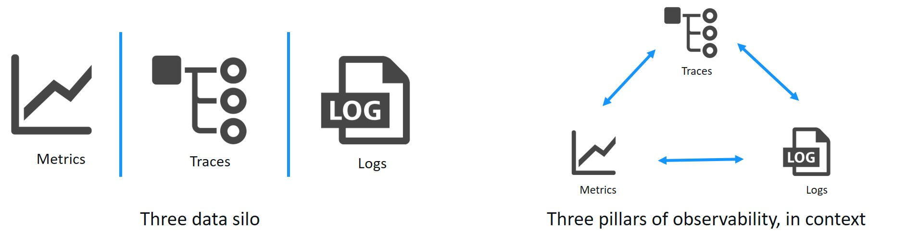
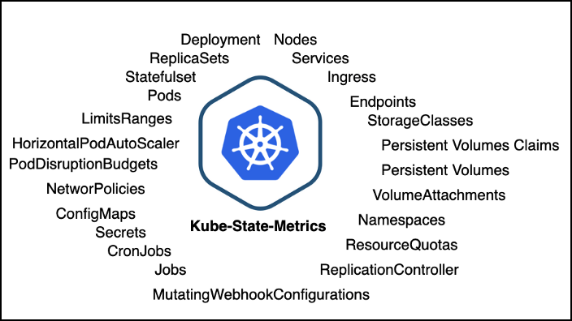

# 監控 Kubernetes 的挑戰

原文: https://blogs.vmware.com/management/2020/09/kubernetes-observability-monitoring-in-the-cloud.html

監控 Kubernetes 挑戰的核心在於其架構，以及它的設計目的—{==編排容器化工作負載==}。它旨在讓我們擺脫管理“**寵物 (pets)**”的負擔，引領我們進入一個簡單管理“**放牧牛 (cattle)**”的新時代。但是任何牧場主都會告訴你，養牛仍然需要相當大的努力，而且並非沒有危險。

Kubernetes 本質上是一個複雜的、多層的、不斷變化的服務和資源陣列。對配置文件的簡單更改可能會讓您和您的團隊淹沒在新數據的海嘯中。更糟糕的是，許多（如果不是大多數的話）現有監控工具都有一個更簡單的架構，它們假設您的基礎設施或多或少是永久性的。試圖用傳統的監控工具來監控 Kubernetes ，基本上是不可能達成目標。

除了動物隱喻 (pets 與 cattle)之外，Kubernetes 獨特的架構一直延伸到它如何發出數據。

關於 **日誌記錄**，正如人們所期望的那樣，Kubernetes 在 **節點** 級別管理和存儲容器日誌。但是，由於節點的磁盤空間有限，它們會很快輪換。一個方便的功能，直到您發現自己在凌晨 3 點解決生產問題。此外，Kubernetes 命令行工具 kubectl 僅按需查詢一小部分目標的日誌。這使得通過日誌“grepping”成為一項不可能完成的任務。僅這一令人頭疼的問題就導致大多數人投資於第三方工具或解決方案，例如 ELK Stack, Loki 等，以滿足他們的 Kubernetes 日誌記錄需求。

在 **指標** 方面，這些數據可以通過 Kubernetes API 輕鬆獲得。但是，數據模型非常豐富，您將花費無數時間設計和實施標記方案來理解數據。最重要的是，您可以自行設計或使用 Prometheus 等工具來存儲、關聯和分析所有這些數據！

日誌和指標甚至不是集群發出的不同類型數據的一半。但是，假設您使用更傳統的“3 個支柱”方法來收集這些數據，以獲取可觀察性的不同數據源和工具。你得到了所有的數據，但你現在為你的數據工作，而不是相反，因為它仍然是孤立的！

如果您的數據源之間沒有上下文，您將不得不努力尋找聯繫和相關性。這將花費您大量的時間和金錢。

## 應該在 Kubernetes 中觀察什麼？

既然我們了解了觀察 Kubernetes 集群的諸多挑戰，那麼我們從哪裡開始觀察 Kubernetes 呢？讓我們首先確定您應該考慮收集的數據類型，稍後我們將介紹如何關聯和分析所有這些數據。

### 日誌 Logs

可以說，第一個也是最重要的起點是 **日誌**。**日誌** 是任何環境下可觀察性的基礎。正如您可能已經猜到的那樣，Kubernetes 有各種各樣的日誌來源。

Kubernetes 中的日誌類型：

- Container Logs
- Node Logs
- Audit Logs
- Event Logs
- Ingress Logs
- API Server Logs

Kubernetes 可觀察性手冊的一個關鍵部分應該從捕獲盡可能多的（如果不是全部的話）這些類型的日誌可供您使用。

### 指標 Metrics

指標監控更直接一些，因為在更傳統的基礎設施中發現的許多相同指標都可以在 Kubernetes 中找到。但是，您應該注意很多特定於 Kubernetes 的指標。此外，在 Kubernetes 中收集指標有點困難，因為目前還沒有針對指標的原生解決方案。

公有雲供應商的 Kubernetes 管理平台（例如 Amazon Elastic Kubernetes Service）可以為您提供豐富且集成的指標，但它們會讓您缺乏所有其他可觀察性遙測。

您的另一個選擇是直接查詢 Kubernetes API——這將需要另一個第三方工具，或者需要大量的內部開發工作來創建工具。

無論您選擇收集指標，您都應該了解各種類型的指標。

  
#### Application Metrics:

最後，任何完全可觀察的環境都必須包含應用程序指標。每個組織都必須決定哪一個可以幫助他們最好地衡量與每個產品和服務的業務範圍和目標相關的性能和可靠性。

以下是組織應跟踪的一些最重要的與績效相關的指標。

- Availability
- Error Rates
- Application Performance Index (Apdex Score)
- Average Response Time
- Request Rate

#### Container Metrics

這些指標是用戶最熟悉的，因為它們提供了有關各種“硬件”組件和使用統計的詳細信息。它們與您在更傳統的環境中發現的相似。

- Container CPU
- Container memory utilization
- Network usage

#### Kubernetes Metrics

從集群級別移動到單個 Pod 級別，Kubernetes 指標讓您可以一目了然地衡量 Pod 的健康狀況。

- Current Deployment (and Daemonset)
- Missing and Failed Pods
- Running vs Desired Pods
- Pod Restarts
- Available and Unavailable Pods
- Pods in the CrashLoopBackOff state

#### Cluster & Node Metrics

您應該關注的第一個指標是與集群整體運行狀況相關的指標。這將有助於確保您有足夠的物理資源來處理您的容器化工作負載，查看哪些應用程序在哪些節點上運行，並確保節點正常工作。

- Memory, CPU, and Network Usage
- Number of Nodes Available
- Number of Running Pods (per Node)

### 跟踪 Traces

在您確定了要收集的各種日誌和指標之後，您還可以考慮收集 **跟踪**。**跟踪** 允許您映射不同服務和資源之間的交互，以識別故障或事件的根本原因。

Kubernetes 系統組件的跟踪相對容易收集，儘管它確實需要一些配置和一兩個第三方工具。可以使用 OpenTelemtry 收集器完成收集，將它們路由到適當的跟踪後端進行存儲、處理和分析。

在從應用程序獲取跟踪方面，這將需要您進行一些檢測。您可以通過直接在應用程序代碼中實現分佈式跟踪庫（例如 OpenTracing）或使用服務網格來實現應用程序級跟踪。兩者都需要大量的開發和實施時間。

