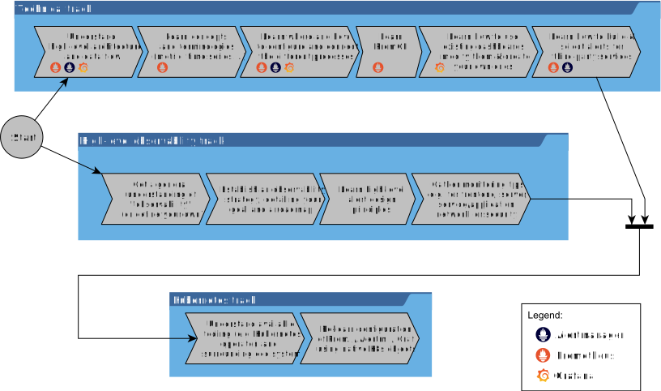

# Observability 學習指南說明

原文: [Kubernetes Observability with Prometheus, Loki & Grafana – Part I: Learning guide](https://www.augmentedmind.de/2021/09/05/observability-prometheus-guide/)

在本文中，定義了術語"**可觀察性(Observability)**"，為什麼需要它以及實現它所需的基本步驟。然後，將介紹如何使用 Prometheus 堆棧為 Kubernetes 實現可觀察性的通用學習指南。

## 可觀察性簡介

快速確定您的系統出現故障並減少診斷和修復問題所需的時間始終很重要。對於在單台機器上運行的較小的非分佈式系統，您可以進行黑盒監控（例如 Nagios 樣式的檢查）以確定是否有問題。一旦檢查失敗，就會觸發警報，您將查看系統日誌以確定問題所在。

但是，具有大量用戶群的應用程序需要根據請求負載進行擴展。像 Kubernetes 這樣的平台實現了水平擴展架構，其中系統的組件分佈在許多計算節點上，這些節點是動態啟動和停止的。不幸的是，這些系統更難監控，因為現在您必須從所有節點收集、匯總和分析不同類型的數據（例如日誌）。

近年來，出現了術語“可觀察性”（用於分佈式系統），討論了這個問題。我強烈推薦 Cindy Sridharan 的優秀入門讀物“分佈式系統可觀察性”，以了解有關可觀察性的更多信息（[此處提供免費電子書](https://unlimited.humio.com/rs/756-LMY-106/images/Distributed-Systems-Observability-eBook.pdf)）。

## 什麼是可觀察性？

根據 Cindy Sridharan 的說法，可觀察性是一種系統屬性，通過觀察其輸出，您可以快速了解系統內部出了什麼問題（並讓您能夠快速修復它）。然而，可觀察性比許多從業者想像的要多：僅僅收集日誌、指標和分佈式跟踪，並對指標進行警報是不夠的。相反，您需要完全改變思維方式，並將額外的工作投入軟件開發生命週期 (SDLC) 的多個階段。您確實需要將可觀察性“嵌入”到您的系統中。更具體地說，讓我們看一下 SDLC 階段的可能修改：

- **開發 (Development)**：在設計和實現你的系統時，你需要修改你自己的應用程序的代碼，並且對第三方系統有一個很好的了解：
    - 關於您自己的應用程序，您可以做很多事情，例如：
        - 添加廣泛的日誌記錄（使用結構化日誌來簡化解析）
        - 添加（分佈式）跟踪代碼（以防您有多個相互調用的微服務）
        - 公開特定於您的應用程序的指標（也稱為“檢測您的應用程序”），並使用公開額外的通用（非應用程序特定）指標（例如垃圾收集器週期）的 APM 工具
        - 實現一個 /health HTTP 端點，供 Kubernetes 等平台的恢復機制使用
        - 設計指示問題的有用且特定於應用程序的警報 - 這些不一定是技術性的，但也可能是業務 KPI。例如，您可以公開登錄/註銷事件指標，以便警報可以執行趨勢分析，在出現問題時通知您，例如如果您的每月登錄次數開始下降
    - 關於您作為系統一部分使用的第三方服務（例如數據庫、負載均衡器等），您需要了解可以從中檢測哪些指標，並且只抓取那些與您的系統相關的指標

- **測試 (Testing)**：除了編寫您通常的“預生產階段”測試（在某些單獨（集成）環境中運行，例如在 CI 管道中）之外，您還可以編寫模擬生產環境中真實（負載）條件的測試，或者它的精確克隆。這包括編寫觸發警報的測試。否則，你怎麼知道你配置的警報真的有效？這包括應用 [chaos monkey](https://en.wikipedia.org/wiki/Chaos_engineering) 模式。

- **維運 (Operations)**：您配置和運行監控軟件（例如 Prometheus 堆棧），該軟件持續監控指標並生成警報，並提供可以按需使用的儀表板來診斷問題（例如分析日誌和跟踪）。您還可以監控部署過程本身，例如通過收集作為 CI/CD 管道的一部分創建的事件數據。

!!! info "Observability vs. monitoring"
    "**可觀察性**"是一個非常重要的術語。對於將"**可觀察性**"與"**監控**"區分開來，並沒有明確且絕對的定義，只是"**可觀察性**"不僅僅是"**監控**"。上面的定義是 Cindy 的，其他人可能有不同的看法，尤其是工具商，他們需要賣給你一些東西。請參閱這篇[出色的文章](https://ubuntu.com/blog/observability-vs-monitoring-debate-an-irreverent-view)進行討論。

## 為什麼選擇 Prometheus、Loki 和 Grafana?

可觀察性領域有許多工具，從 Netdata 或 Zabbix 等開源軟件，到 Datadog、Splunk、LightStep、sumo logic 或 Instana 等商業 (SaaS) 產品。在本系列文章中，我將重點介紹“Prometheus 堆棧”（附帶工具、Alertmanager、Loki 和 Grafana），它是 OSS，並且在 Kubernetes 環境和其他環境中變得非常流行。也就是說，你也可以在裸機上操作 Prometheus 等，或者使用 Docker（compose）。

如果你也對分佈式跟踪感興趣，我建議你看看 Grafana 的 [Tempo](https://grafana.com/oss/tempo/)。

## 學習指南

當我開始學習這個領域時，我不知道從哪裡開始。隨著時間的推移，我弄清楚了哪些知識塊是相互依賴的。我確定了下面描述的三個軌道，這是一種流程圖。您可以（並且應該）同時進行技術跟踪和高級可觀察性跟踪。把它們想像成你在獲得駕照時要經歷的“理論和實踐”軌道。只有當你完成了這兩個軌道之後，才有意義開始在 Kubernetes 中使用 Prometheus。

為簡單起見，本學習指南僅限於 Prometheus、Alertmanager 和 Grafana。使用 Loki 進行日誌管理不是其中的一部分，因為一旦您熟悉了所有其他概念，它就是一個“簡單”的附加功能。我將在以後的文章中詳細介紹 Loki。

讓我們更詳細地看一下每個單獨步驟的目標：

- **Technical track**:
    - 了解高層架構和數據流：了解 Prometheus 堆棧的不同組件/（Linux）進程，它們各自做什麼，以及什麼數據在什麼時間流向另一個組件。
    - 了解概念和術語：Prometheus 引入了很多概念，比如 metric、時間序列、instrumentation、recording/alerting rules、target label 等，大家都需要掌握好。
    - 了解在哪里以及如何配置和連接不同的進程：了解哪些組件配置了（無狀態）配置文件，哪些組件將配置存儲在可變/有狀態數據庫中。 Prometheus 堆棧中的所有工具都以不同的方法配置在不同的地方。
    - 學習 PromQL：熟悉 Prometheus 的查詢語言，您需要使用它來構建警報和 Grafana 儀表板。
    - 了解如何使用現有儀表板、修改它們並創建自己的儀表板：您不僅需要了解如何迭代構建儀表板（從現有儀表板開始）以節省時間，還需要獲得一些經驗以避免構建過載的儀表板.
    - 了解如何為第三方服務構建和選擇警報：雖然您還需要為自己的組件構建警報（請參閱高級可觀察性軌道中的第三個任務），但您還需要確定要使用的 Prometheus 導出器對於第三方服務（例如數據庫），以及您應該為其眾多指標中的哪一個創建警報。

- **High-level track**:
    - 對“可觀察性”有大致的了解（或定義您自己的）：在您的團隊中，確保每個人都對（對您而言）可觀察性意味著什麼有相同的理解。您可以使用現有的定義，也可以建立自己的更狹窄但適用於您的特定係統和團隊的定義。
    - 建立可觀察性策略，詳細說明您的目標和路線圖：這包括定義可觀察性幫助您實現的總體最終目標（使用“硬”數字，例如以 SLO 的形式），您希望如何開始（逐漸添加可觀察性） ，定義分配給構建可觀察性功能的（工時）預算，是否（以及如何）實施“隨叫隨到”，或如何跟踪事件。
    - 學習高級警報設計原則：這本質上是在該領域工作的人們隨著時間的推移收集的原則列表。例如，您應該從用戶的角度（使用業務 KPI）而不是技術警報（針對服務器或服務）開始構建警報。
    - 收集監控提示：對於系統的每種類型的組件（例如前端、服務器節點或服務），已經有很多關於如何進行檢測以及為哪些指標編寫警報的經驗證據和提示。例如，前端最重要的因素通常是響應時間。

- **Kubernetes track**:
    - 了解可用的工具和周邊生態系統：在 Kubernetes 中部署和定制 Prometheus 堆棧的方式有很多種，例如 Prometheus operator，您需要從中選擇一種。還有一個由社區構建的生態系統，包括額外的有用資源和工具來簡化流程，例如 kube-prometheus。
    - 使用原生 K8s 對象重新學習配置 [...]：當使用 Kubernetes 的 Prometheus operator 時，您將不再為 Prometheus 等編寫“傳統” yaml 配置文件，而是使用 Kubernetes 原生工作負載對象（例如 ServiceMonitor）來配置它們，操作員在運行時將其轉換為傳統的配置文件。

## 結論

在 Kubernetes 中啟動並運行 Prometheus 並非易事，因為您需要具備大量背景知識。通過本文中介紹的學習指南，我只繪製了一張粗略的地圖，概述了通往 Kubernetes 的基於 Prometheus 的可觀察性堆棧的旅程。但是，對於學習指南的每個步驟，您仍然需要具體的學習資源。

對於高級課程涵蓋的步驟，我建議您查看 [Practical Monitoring – Effective Strategies for the Real World (2017)](https://www.oreilly.com/library/view/practical-monitoring/9781491957349/) 一書，該書提供了很好的概述。至於導入的步驟，請查看本系列其他文章。

