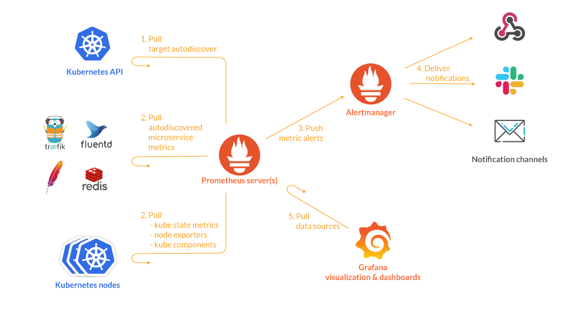
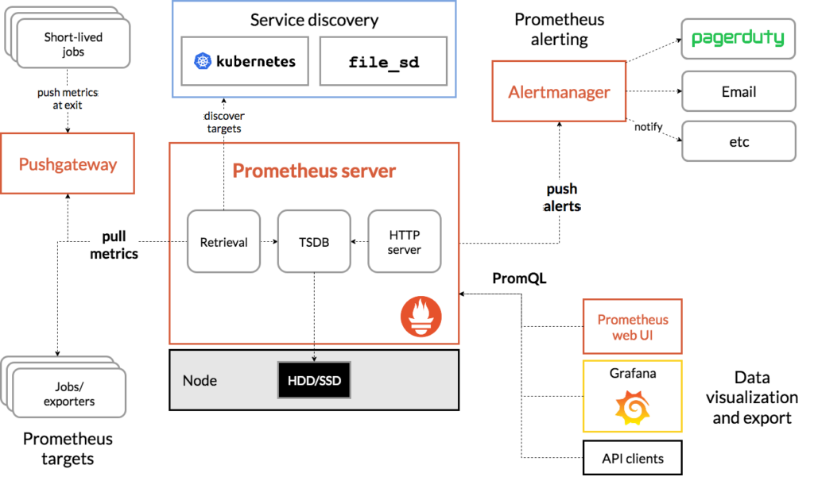
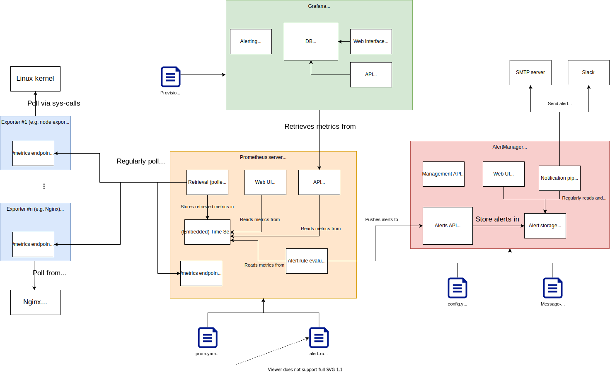

# Prometheus, Alertmanager & Grafana 架構介詔

原文: [Kubernetes Observability – Part II: architecture introduction to Prometheus, Alertmanager & Grafana](https://www.augmentedmind.de/2021/09/19/introduction-to-prometheus/)



本文詳細介紹了 Prometheus 堆棧的架構，由各個應用程序 Prometheus、Alertmanager、Grafana、Pushgateway 和各種 Exporter 組成。本文會討論了每個組件是如何配置的，它存儲了哪種數據，以及如何擴展 Prometheus。

## Prometheus 簡介

Prometheus 堆棧是一組流行的工具，用於實現系統的可觀察性。正如本可觀察性文章系列第一部分概述的學習指南中所述，第一步（在技術軌道上）是了解此堆棧的架構，以及不同工具如何組合在一起。本文詳細介紹了架構，解釋了其背後的基本原理，如何配置各個組件，還解釋了 Prometheus 如何擴展。

## 架構 high-level 概述

Prometheus 堆棧由許多獨立的程序/應用程序組成，它們都有專門的職責。它們都通過 HTTP 相互通信以實現它們的總體目標：（可能是大規模的）分佈式系統的可觀察性。 Prometheus 背後的團隊選擇了這種關注點分離的方法，以便每個程序都可以單獨配置和部署（如果需要，可以在不同的機器上）。它還降低了每個單獨程序的複雜性。先看一下[官方文檔的 Prometheus 架構圖](https://prometheus.io/docs/introduction/overview/)：



我們的核心是 Prometheus 服務器，它有幾個子系統，最值得注意的是 TSDB、檢索組件和 HTTP 服務器。 TSDB 是一個持久的、基於磁盤的時序數據庫。檢索組件定期從公開這些指標（通過 HTTP）的其他應用程序中提取“指標數據”，例如每 15 秒，並將它們存儲在 TSDB 中。這種有規律的拉動也稱為“**刮取(scrape)**”。 Prometheus HTTP 服務器提供了一個 REST 端點，允許其他系統（例如 Grafana）查詢存儲的指標數據。

!!! info "什麼是指標 (Metrics)"
    一般而言，指標是提供有關特定服務（例如進程）或系統（例如服務器節點）的信息的數字數據。一個具體的例子可以是節點的磁盤使用量，或者對 HTTP 服務器（或特定 HTTP 路徑）的請求總數。指標標準存儲在 TSDB 中，可以有效地壓縮、處理和檢索它們。

    在 Prometheus 中，指標的格式很簡單：`<name>{label1=value1,label2=value2,...} <float64 value>`

    一個具體的例子：`prometheus_target_metadata_cache_bytes{scrape_job="alertmanager"} 5672`

    在 Prometheus 中，指標是由 Exporter 等應用程序創建的（有關更多詳細信息，請參見下文）。指標通過 HTTP 以純文本形式公開，通常在 `/metric` 端點上，每行一個指標。如您所見，輸出中沒有時間戳，因為 Prometheus 期望返回的指標反映當前狀態，而 Prometheus 在將抓取的數據存儲到其 TSDB 時會添加時間戳。

指標從何而來？公開暴露指標的應用程序有兩種基本類型：

- **Your own application**，您為此實施了一個提供這些指標的 `/metrics` HTTP 端點。 Prometheus 社區為所有常見的編程語言構建了簡化此任務的 SDK。
- **A third-party exporter**。導出器(exporter)是一個應用程序，它使用該系統的專有 API 從第三方系統（例如數據庫服務器或主機的操作系統內核）中抓取指標，並將獲得的指標轉換為 Prometheus 指標格式，並將它們暴露在 `/metrics` 端點。第三方系統本身並不知道它正在被觀察。有數百個即用型 exporter，請參見[此處](https://prometheus.io/docs/instrumenting/exporters/)和[此處](https://github.com/prometheus/prometheus/wiki/Default-port-allocations)！最著名的是[節點導出器(node exporter)](https://github.com/prometheus/node_exporter)，它從計算節點中提取指標，例如內存、存儲、網絡和 CPU 的使用情況。另一個重要的是 [cAdvisor](https://github.com/google/cadvisor)，它導出了運行 Docker 容器的資源使用情況和性能特徵。

回到“**刮取(scrape)**”的設計。在每個抓取循環結束時，Prometheus 會根據目前存儲的指標評估警報規則。您使用 Prometheus 的查詢語言 PromQL 編寫這些警報規則。警報規則的示例可能是“任何節點上的任何磁盤的磁盤使用率已超過 90%”。如果觸發了任何配置的警報規則，Prometheus 會生成警報並將其推送到 Alertmanager 應用程序。

請注意，警報只是一個 (JSON) 對象，尚未發送任何電子郵件、尋呼機消息等！當 Alertmanager 收到警報時，它會將其存儲在其內部數據庫中。 Alertmanager 使用您提供的配置對警報進行重複數據刪除和分組（以減少垃圾郵件）。然後它會生成警報通知，即將警報路由到正確的接收者，例如電子郵件或 PagerDuty。

架構圖中還有兩個方框需要特別說明：

- **Pushgateway** 和 **short-lived jobs**：如果您希望 Prometheus 收集生命週期非常短（比 Prometheus 的抓取間隔短）的應用程序或作業（例如 cron 作業）的指標，那麼您會遇到問題：當 Prometheus 嘗試抓取應用程序（及其 /metrics HTTP 端點）時，它可能不存在。為了規避這個問題，您可以運行 Pushgateway 之類的工具，這是一個永久運行的指標緩存，短期作業可以將指標推送到該緩存。然後，Prometheus 從 Pushgateway 的 `/metrics` 端點抓取這些緩存的指標。

- **Service discovery**：Prometheus 是為監控大型水平擴展分佈式系統而構建的。它們由許多（計算）節點和服務實例組成，它們一直來來去去，例如由於彈性縮放。對於這樣的系統，手動配置 Prometheus 的檢索組件應該抓取的主機/目標的靜態列表將是一個難以管理的負擔。 Prometheus 的服務發現（SD）機制實現了一種動態發現機制，已經有很多具體的實現，可以動態發現抓取目標。例如，SD 可以檢測 Kubernetes 或 Consul 中的服務和節點（有關實現列表，請參閱[官方文檔中的 ..._sd_config](https://prometheus.io/docs/prometheus/latest/configuration/configuration/)）。



它應該可以幫助您了解不同應用程序的子組件。讓我們再看一下數據流：

1. Prometheus 的檢索組件定期從應用程序、導出器甚至 Prometheus 自己導出的指標提供的 /metric 端點輪詢指標。這些指標存儲在 Prometheus 的（嵌入式）TSDB 中，當前的抓取時間戳被添加到數據中。
2. 每當 Prometheus 的 Alert 規則評估器組件檢測到其配置的某些警報規則被觸發（它通過查詢 TSDB 來確定）時，它就會生成一個警報對象並將其發送給 Alertmanager。
3. Alertmanager 將收到的警報對象存儲在它自己的（嵌入式）數據庫中，同時進行重複數據刪除。
4. Alertmanager 的 Notification 管道定期評估存儲在數據庫中的警報（根據配置的警報路由樹，下面有更多詳細信息），並在適用時向配置的接收器發送警報通知。 “接收者”不是指“人”，而是實際通知人們的系統（電子郵件、Slack 等）

## 配置

每個應用程序（Prometheus、Alertmanager、Grafana、Exporters）都有不同的配置方法，如下表所示：

|Component |Configuration approach	|Persisted stateful data|
|---|-----------------------|-----------------------|
|Prometheus	|Stateless (files)	|Metrics|
|Alertmanager	|Stateless (files)	|Alerts, silences|
|Grafana	|Stateful + Stateless (provisioning mechanism)	|Grafana configuration|
|Exporter	|Usually stateless (files), depends on exporter	|—|

每一個欄列的含義：

- **Configuration approach**：無狀態意味著應用程序不會（有狀態地）在內部存儲任何配置值，例如在數據庫中。相反，配置通常通過文件提供（例如格式化為 YAML 或 JSON）。這些文件應受版本控制，例如在 Git 中。
    - 無狀態方法的優點是：
        - 您始終在這些文件中明確更改配置（單一事實來源）
        - 將應用程序的實例從一個節點移動到另一個節點更容易，因為只需要掛載幾個文件（而不是必須提取和傳輸狀態）
        - 對配置所做的更改是可追溯的（通過 Git）
        - 配置文件是人和機器可讀的
    - 無狀態方法的缺點是:
        - 您不能動態調整配置，例如通過 API 調用
        - 與 GUI 相比，通過文本更改配置不太方便且容易出錯
- **Persisted stateful data**：指示應用程序是否有內部（有狀態）數據存儲，如果有，其中存儲了哪種數據。

讓我們更仔細地來了解每一個元件。

### Prometheus


Prometheus 對於收集的指標（存儲在 TSDB 中）是有狀態的，但對於配置是無狀態的。因此，您無法通過 Prometheus Web 界面或 API 更改配置。但是，有第三方項目，例如 [prometheus-configmanager](https://github.com/facebookincubator/prometheus-configmanager)，通過提供配置 API 使這成為可能。

配置是通過多個文件完成的，最值得注意的是：

```yaml title="prometheus.yml"
global:
  scrape_interval: 15s
  evaluation_interval: 15s

rule_files:
  - "alert-rules.yml"

scrape_configs:
  - job_name: 'nodeexporter'
    scrape_interval: 5s
    static_configs:
      - targets: [ 'nodeexporter:9100' ]
  - job_name: 'cadvisor'
    scrape_interval: 5s
    static_configs:
      - targets: [ 'cadvisor:8080' ]

  - job_name: 'prometheus'
    scrape_interval: 10s
    static_configs:
      - targets: [ 'localhost:9090' ]

alerting:
  alertmanagers:
    - scheme: http
      static_configs:
        - targets:
            - 'alertmanager:9093'
```

- `global` section: 指定全局配置參數，例如抓取間隔。
  
- `rule_files` section: 指定要考慮的警報規則 yaml 文件名。

- `scrape_configs` section: 指定指標抓取作業的列表。每個作業都有一個名稱（這樣 prometheus.yml 中的 job_name: 'nodeexporter' 之類的東西會導致 Prometheus 在將抓取的指標存儲在其 TSDB 中時添加一個標籤，例如 job: 'nodeexporter'）和一個或多個目標IP：端口+路徑的形式）。 `scrape_configs` 數組中的典型條目是 Prometheus 服務器本身、Alertmanager、cAdvisor、nodeexporter、Pushgateway 和其他自定義指標 exporter。對於每個目標，您可以使用 `static_config`（您只需手動提供要查詢的主機、端口和指標 URL），或使用動態服務發現 (service discovery) 選項之一，例如 kubernetes_sd_config 或 openstack_sd_config。

- `alerting` seciont: 指定向哪個 Alertmanager 實例發送警報。

```yaml title="alert-rules.yml"
groups:
  - name: group1
    rules:
      - alert: alert-name-1
        expr: up == 0
        for: 30s
        labels: # labels to attach to alerts
          severity: critical
        annotations:
          summary: "Some monitoring-related service is non-operational"
          description: "Service {{ $labels.instance }} ({{ $labels.job }}) is down."

  - name: group2
    rules:
      - alert: SomeHttpServicesAreDown
        expr: probe_success == 0
        for: 10m
        labels:
          severity: critical
        annotations:
          summary: "Some HTTP service is non-operational"
          description: "Service {{ $labels.instance }} ({{ $labels.job }}) is down."
```

- 您可以在此處定義記錄規則或警報規則。
    - 記錄規則允許您預先計算您經常需要的計算量大的指標數據（來自傳入的原始指標），並將計算結果保存為一組新的指標。這對於每次刷新時重複查詢相同（計算成本高）指標數據的儀表板軟件（例如 Grafana）很有用。
    - 警報規則是告訴 Prometheus 何時應該向 Alertmanager 發送警報的規則。

- `alert-rules.yml` 文件以 `groups:` 部分開頭，您可以在其中指定一個或多個組。對於每個組，您定義一個或多個規則。除了這些規則之外，您還可以給每個組一個名稱和一個可選的自定義間隔（評估發生的時間）。您可以認為每個組都由一個單獨的線程並行執行。組內的規則都按順序進行評估。
- 對於每個警報規則，您定義一個名稱（警報：foo）、一個 PromQL 表達式、持續時間（以過濾嘈雜的警報，例如：30 秒），並可選地添加 Prometheus 將在警報觸發時附加到警報的標籤或註釋：
    - 標籤可以例如包含嚴重性級別
    - 註釋通常包括摘要和描述。
    - 您可以在標籤和註釋中使用變量（模板）

### Alertmanager


與 Prometheus 一樣，Alertmanager 是部分有狀態的（存儲收到的警報和靜默），但也部分是無狀態的，因為它也是使用文件配置的。

```yaml title="config.yml"
global:
  smtp_smarthost: smtp.example.org:587

route:
  receiver: 'default-receiver'
  group_wait: 30s
  group_interval: 5m
  repeat_interval: 4h
  group_by: [ cluster, alertname ]
  # Note: this root "route" node may not have any "matchers"! All incoming alerts must match the root
  routes:
    - receiver: 'database-pager'
      group_wait: 10s
      matchers:
        - service=~"mysql|cassandra"
    - receiver: 'frontend-pager'
      group_by: [ product, environment ]
      matchers:
        - team="frontend"

receivers:
  - name: 'default-receiver'
    email_configs:
      - send_resolved: true
        to: some.receiver@mail.com
        from: no-reply@host.com
  - name: 'database-pager'
    ...
  - name: 'frontend-pager'
    ...

inhibit_rules:
  [ - <inhibit_rule> ... ]
```

- `global` 設置，例如特定於接收器的全局值（用於消除配置值的冗餘，否則必須將其複製到 config.yml 文件中的不同位置）
- `receivers` 配置接收者（例如 SMTP 服務或網絡掛鉤）及其憑據
- `route`：路由是遞歸的數據結構，從而形成路由樹。基本思想是警報沿著警報路由樹遍歷，基於匹配收到警報的標籤的匹配器。如果警報不匹配路由節點的任何子節點（因為沒有子節點的匹配器匹配，或者因為沒有子節點），則警報由當前節點處理。通常，路由節點從其父節點繼承值。每個路由節點都有以下配置參數：
    - 匹配器：只有具有指定標籤/值（或值的正則表達式）的警報才會繼續沿著樹的這個分支
    - group_by：用於對警報進行分組的標籤鍵列表。 Alertmanager 然後為每個標籤值創建一個組。這樣可以避免您的開發人員/操作員收到警報通知的垃圾郵件。
    - 各種等待期或間隔，以減少發送警報通知的數量
    - receiver：應向其發送警報通知的接收者的名稱
    - routes：路線子對象的數組
- inhibit_rules：禁止規則對像數組。允許靜音一組警報，因為另一個警報已經觸發。這減少了警報（通知）垃圾郵件。例如，如果您檢測到整個節點已關閉，則不需要為該節點上運行的 10 個服務（因此也已關閉）再發送 10 個警報通知。

### Grafana


Grafana 不存儲任何指標數據，但總是在運行時從 Prometheus 檢索它。然而，Grafana 的配置（例如數據源、用戶和身份驗證或儀表板）是有狀態地存儲在 Grafana 的內部數據庫中。它們可以通過 Grafana 的 REST API 或其 Web 界面進行操作。但是，Grafana 也有一個配置機制，允許您在 Grafana 啟動時以及定期（每當 Grafana 檢測到文件內容髮生更改時）通過文件覆蓋內部存儲的配置。

### Exporters


因為 Prometheus 期望 Exporter 僅在抓取時公開應用程序的指標數據（換句話說，Prometheus 不期望歷史指標數據），所以 Exporter 通常是完全無狀態的。

配置方法高度依賴於應用程序和 Exporter。一些 Exporter 不需要任何配置，但最典型的是，無狀態 CLI 參數和/或環境變量用於配置 Exporter。

## 拉式監控架構的注意事項

Prometheus 使用基於拉取的方法，其中 Prometheus 服務器從端點收集/拉取指標，Prometheus 必須通過靜態和動態服務發現來確定哪些列表。其他系統，例如 Graphite，則使用基於推送的方法，其中代理需要了解收集器，並將度量數據推送給它。

如果您搜索“推送與拉取監控”，您會發現關於哪個“更好”的看法截然不同。這些文章中的大多數都是由工具製造商撰寫的，然後他們證明了為什麼他們的方法是“略勝一籌”的方法，因為他們應用了一些優化，或者因為他們能夠揭穿一些關於他們的方法不好的神話，等等。最後，基於推和拉的系統都有缺點，但（缺點）的嚴重程度取決於您的具體用例。

對於任何監控系統，您都需要處理以下詳細信息：

- 延遲：“已知度量數據點”和“監控系統已處理它”之間的延遲。一些作者認為基於推送的系統提供更低的延遲，因此優於基於拉取的系統。他們很容易忘記提到節省這幾秒鐘在實踐中是無關緊要的，因為：
    - 您的團隊將花費幾分鐘甚至幾小時來實際診斷和解決問題，
    - 您通常在服務器/收集器上應用積極的滑動窗口平均（以消除異常值和誤報），窗口大小遠大於使用基於推送的系統減少的延遲。
- 發現：讓代理實例了解收集器/服務器實例（反之亦然）總是涉及復雜性。天下沒有免費的午餐…
- 安全性：易於實施機制（及其安全程度），確保沒有未經授權的一方可以訪問（代理或收集器的）指標數據
- 可擴展性：一旦你有許多代理產生大量數據，這兩種方法都不能很好地工作，只使用一個收集器服務器。大多數實現都有用於擴展的解決方案。有關 Prometheus 的擴展方法，請參見下文。
- 維運複雜度：涉及防火牆配置，以及更改整個監控系統配置的難易程度

在實踐中，您可能會使用任何一種方法都做得很好。從架構上講，您可以混合和匹配拉式與基於推式的方法。例如，Pushgateway 正在將推送轉換為拉取，而 Telegraf 等應用程序可以將拉取轉換為推送。

Prometheus 的基於拉的方法確實有兩個缺點（維運複雜度），我想解決這些缺點：

- 監控多進程應用程序：如果您使用多個進程，則從應用程序的 `/metrics` 端點提取指標具有挑戰性。原因是指標數據通常只保存在內存中，分別針對每個進程，並且不清楚您的哪些進程實際上為 /metrics 端點提供服務，以及指標數據是如何累積的。假設您正在構建一個 Python Web 應用程序（例如，使用 Django 或 Flask）並使用 WSGI 應用程序服務器來實現可伸縮性，例如 Gunicorn 或 uWSGI，它們運行多個工作進程：
    - 解決方案#1：讓每個進程收集自己的指標，每當調用 /metrics 時，Prometheus 客戶端庫使用一些進程間通信來收集來自所有進程的聚合指標（例如，使用引擎蓋下的文件）。有關實現示例，請參閱 Prometheus 的 Python 庫的多進程模式。
    - 解決方案#2：將每個工作進程視為一個單獨的應用程序，即每個工作進程都被稱為 Prometheus 的單獨目標，每個工作進程都有自己的 /metrics 端點，例如在不同的端口下。指標的聚合在查詢時在服務器上的 PromQL 中延遲和執行。有關示例，請參見此處。
    - 解決方案#3：讓工作人員將指標推送到聚合器（例如 Pushgateway 或 statsd），Prometheus 從中提取聚合的指標。參見例如這裡。
- 監控短暫的進程：進程（例如備份腳本）的存活時間可能不夠長，無法為指標抓取提供服務。在這裡，只有基於推送的方法才有意義。解決方案是混合基於推和拉的方法，並使用類似推送網關的東西（參見上面的解決方案方法#3）。

## 結論

Prometheus 堆棧是一個複雜的系統。在我看來，將堆棧分成多個應用程序（每個應用程序都有一個單獨的關注點）是一種很好的方法。您將很快習慣這影響組件配置的方式，了解配置的哪個部分屬於哪個文件。您現在擁有許多（較小的）文件（存儲在版本控制中）這一事實有助於更大的團隊根據誰配置什麼來劃分職責。

