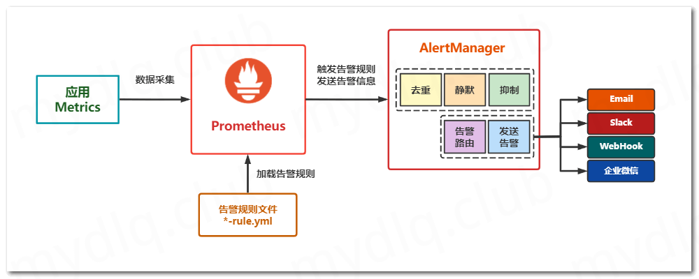
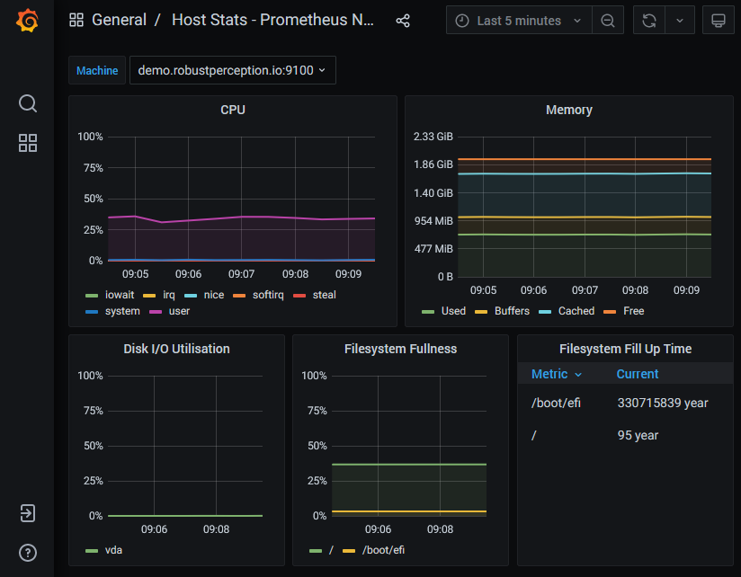

# Prometheus & Alertmanager 基本概念

原文: [Kubernetes Observability – Part III: Prometheus & Alertmanager basic concepts](https://www.augmentedmind.de/2021/10/03/prometheus-concepts/)



本文幫助您了解基本的 Alertmanager 和 Prometheus 概念，例如指標、時間序列、示例、警報和警報通知。同時還解釋了指標數據在概念上是如何存儲的、應該如何檢測應用程序以及儀表板的基本概念。

## 介紹

Prometheus 堆棧是一組流行的工具，用於實現系統的可觀察性。正如本可觀察性文章系列第一部分概述的學習指南中所述，一個重要的步驟（在技術軌道上）是了解基本的 Prometheus 概念和術語。您需要很好地掌握它們，才能真正使用 PromQL 構建警報。本文詳細介紹了基本概念，例如指標（以及不同的指標類型）、時間序列、樣本、數據的存儲方式、檢測、標籤、警報和警報通知以及儀表板。

我建議您從現在開始著手實際使用 Prometheus 堆棧。要啟動並運行它，您有多種選擇：

- 使用第三方演示系統，例如 http://demo.robustperception.io 或 https://demo.promlens.com - 您無需在本地設置任何內容，但您無法影響或更改這些系統上的任何內容。
- 基於本地 Docker (compose) 的堆棧，參見例如這里或這裡的模板。如果您在主機上本地運行 Linux，這是完美的解決方案。但是，如果您在主機上使用 Windows 或 macOS，需要注意的是，此 Docker-compose 設置的節點導出器不會捕獲實際 Windows/macOS 主機的指標，而是 Docker 容器所在的 VM跑步。改用裸機選項可能會更好。
- 本地裸機安裝：下載各個應用程序二進製文件（Prometheus、Alertmanager、Grafana、Pushgateway、節點導出器等）並手動安裝。這將花費最長的時間，但會教您最多有關應用程序配置的信息。
- 在本地的 K8S 中使用 Helm chart 安裝

## 指標、時間序列、樣本和存儲

## 術語解說

在本系列的前幾篇文章中，我解釋了您的應用程序（以及第三方導出器）公開“指標數據”，通過 HTTP 在 `/metrics` 端點上以“Prometheus 格式”提供它們，每行一個指標。使用的術語，如“指標”或“指標數據”，實際上並不精確——這裡有一些區別。讓我們首先查看 Prometheus 本身的 `/metrics` 端點的輸出片段（單擊此處查看完整輸出）：

```bash

# HELP net_conntrack_dialer_conn_attempted_total Total number of connections attempted by the given dialer a given name.
# TYPE net_conntrack_dialer_conn_attempted_total counter
net_conntrack_dialer_conn_attempted_total{dialer_name="alertmanager"} 2
net_conntrack_dialer_conn_attempted_total{dialer_name="node"} 1
net_conntrack_dialer_conn_attempted_total{dialer_name="prometheus"} 1
net_conntrack_dialer_conn_attempted_total{dialer_name="pushgateway"} 1
...
# HELP go_memstats_mspan_sys_bytes Number of bytes used for mspan structures obtained from system.
# TYPE go_memstats_mspan_sys_bytes gauge
go_memstats_mspan_sys_bytes 8.699904e+06
...
# HELP prometheus_http_response_size_bytes Histogram of response size for HTTP requests.
# TYPE prometheus_http_response_size_bytes histogram
prometheus_http_response_size_bytes_bucket{handler="/",le="100"} 1342
prometheus_http_response_size_bytes_bucket{handler="/",le="1000"} 1342
prometheus_http_response_size_bytes_bucket{handler="/",le="10000"} 1342
prometheus_http_response_size_bytes_bucket{handler="/",le="+Inf"} 1342
prometheus_http_response_size_bytes_sum{handler="/"} 38918
prometheus_http_response_size_bytes_count{handler="/"} 1342
...
# HELP prometheus_rule_evaluation_duration_seconds The duration for a rule to execute.
# TYPE prometheus_rule_evaluation_duration_seconds summary
prometheus_rule_evaluation_duration_seconds{quantile="0.5"} 4.4054e-05
prometheus_rule_evaluation_duration_seconds{quantile="0.9"} 7.1597e-05
prometheus_rule_evaluation_duration_seconds{quantile="0.99"} 0.00017088
prometheus_rule_evaluation_duration_seconds_sum 2.8554187595358095e+06
prometheus_rule_evaluation_duration_seconds_count 2.539804519e+09
...
```

到目前為止，我們所說的“指標”或“指標數據”有一些微妙的術語。使用上面的示例輸出：

- **時間序列(time series)** 類似於 `net_conntrack_dialer_conn_attempted_total{dialer_name="alertmanager"}` 或 `prometheus_rule_evaluation_duration_seconds_count`。基本上所有內容都是一個時間序列，如果您在 Prometheus 查詢窗口中將其作為查詢輸入，則會產生單行輸出。

- **指標(metric)** 類似於 `net_conntrack_dialer_conn_attempted_total` 或 `prometheus_http_response_size_bytes`，或遵循 `# TYPE <metric name> <metric type>` 形式的任何其他內容。一個指標結合了一個（或多個）時間序列。

- 時間序列之所以得名，是因為它由一系列"**樣本(sample)**"組成。樣本是存儲在 TSDB 中的實際數據點。樣本具有時間戳（毫秒精度）和 64 位浮點值。
    - 注意：儘管上面示例輸出中的某些值看起來像整數，但它們實際上是浮點數，並且它們是這樣處理和存儲的！

從指標中辨別時間序列並不總是可行的。例如，沒有標籤的類型 gauge 的度量，例如 go_memstats_mspan_sys_bytes，術語時間序列和度量確實指的是同一件事。

### 指標類型 (Metric types)

正如上面的示例輸出所示，Prometheus 有幾種類型的指標（[官方文檔](https://prometheus.io/docs/concepts/metric_types/)）:

=== "Counter"

    Counter 指標是一個簡單的數字，可以計算一些東西。示例包括向應用程序發出的請求數、已完成或失敗的作業數等 - 例如：

    `net_conntrack_dialer_conn_attempted_total{dialer_name="alertmanager"} 2`

    當生成此指標的應用程序運行時，計數器的值需要單調增加（將計數器的值保存在易失性內存中）。但是，如果應用程序重新啟動，則允許重置計數器（因此其值將減小），從而丟失內存中保存的先前計數器的值。 Prometheus 的抓取程序可以智能地處理此類重置。例如，如果 Prometheus 抓取一系列樣本值，例如 1、4、6、2，它實際上會將 1、4、6、8 存儲在 TSDB 中。

=== "Gauge"

    與 Counter 一樣，Gauge 指標是一個簡單的數字，但它可以隨時間任意上下波動。正如文檔所解釋的那樣，Gauge 通常用於測量某種數值當下的值，例如溫度或當前內存使用情況，但也用於可以上下波動的“計數”，例如併發請求的數量。

=== "Histogram"

    正如官方文檔所述：直方圖對觀察結果進行採樣（通常是請求持續時間或響應大小等），並將它們計入可配置的存儲桶中。它還提供所有觀察值的總和。

    基本指標名稱為 <basename> 的直方圖在一次抓取期間公開了多個時間序列：
    
    - 觀察桶的累積計數器，顯示為 `<basename>_bucket{le="<upper inclusive bound>"}` - “le”代表“小於或等於”
    - 所有觀察值的總和，顯示為 `<basename>_sum`
    - 已觀察到的事件計數，顯示為 `<basename>_count`（與 `<basename>_bucket{le="+Inf"}` 相同）

    讓我們使用這些知識來解釋上面示例片段中的 `prometheus_http_response_size_bytes_bucket` 直方圖指標：

    - `prometheus_http_response_size_bytes_bucket{handler="/",le="100"} 1342` 行告訴我們，有 1342 個對 Prometheus 的“/”處理程序的請求，產生大小小於或等於 100 字節的 HTTP 響應。
    - 其他  _bucket  行具有相同的值 (1342)。由於 Prometheus 直方圖是累積的，這告訴我們沒有任何對 Prometheus 的“/”處理程序的請求產生大於 100 字節的響應大小。
    - `prometheus_http_response_size_bytes_count{handler="/"} 1342` 這一行告訴我們，總共有 1342 個對 Prometheus 的“/”處理程序的請求。
    - `prometheus_http_response_size_bytes_sum{handler="/"} 38918` 行告訴我們所有響應大小（所有 1342 個請求）的總和為 38918 字節。因此，如果我們對它感到好奇，我們可以自己計算平均響應大小（因為到目前為止我們只知道它小於或等於 100 字節）：只需計算 38918 / 1342 = 29 個字節。

=== "Summary"

    Summary 指標與 Histogram 指標非常相似，但它產生[分位數](https://en.wikipedia.org/wiki/Quantile)（在滑動時間窗口上）而不是累積箱/桶。有關分位數的詳細說明，以及何時使用摘要與直方圖，請參閱[官方文檔](https://prometheus.io/docs/practices/histograms)。

    分析我們上面的例子（prometheus_rule_evaluation_duration_seconds），我們看到：
    
    - 一半 (50%) 的規則評估最多需要 0.000044054 秒 (0.044054 ms) - 另一半需要更長的時間
    - 最慢的 10% 的規則評估最多需要 0.000071597 秒
    - 最慢的 1% 的規則評估最多需要 0.00017088 秒
    - 總體而言，評估規則花費了 2.8554187595358095e+06 秒（約 33 天）
    - 到目前為止，此出口商已完成 2.539804519e+09 次觀察（規則評估持續時間測量）


基於上述指標類型，您在實踐中經常會發現另外兩種（相當未記錄的）指標類型：

=== "Enum"

    由於 Prometheus 僅支持浮點值，您可能想知道如何表示字符串值。枚舉指標是一種可以讓您做到這一點的方法。例如，您可以為您的應用程序創建一個名為 `my_app_state` 的指標，它可以採用“starting”、“running”或“error”值。

    您應該避免使用單一計量指標，將任意數值分配給狀態（例如 1=starting、2=running、3=error），因為這樣您就不能再使用 PromQL 來聚合值（例如讓 PromQL 確定“運行”實例的數量）。

    相反，創建與狀態一樣多的時間序列類型計量器（此處：3），將字符串值實現為標籤，並分配布爾值（1=true，0=false）。在任何給定時間，只有一個時間序列的值可能為 1。以下是您的應用程序的 /metrics 端點可能返回的示例（您為此創建了 my_app_state 枚舉指標）：

    ```bash
    # HELP my_app_state The state of your application
    # TYPE my_app_state gauge
    my_app_state{state="starting"} 1
    my_app_state{state="running"} 0
    my_app_state{state="error"} 0
    ```

    由於設置新的枚舉指標值不再是原子操作，因此您可能會遇到競爭條件，在這種情況下，scrape 會看到暫時不一致的狀態（零個或多個時間序列具有 1）。一些 Prometheus SDK 提供了經過充分測試的 Enum 指標實現（參見例如 Python）。如果您選擇的 SDK 沒有實現，則該方法是實現一個自定義收集器，該收集器在後台管理計量指標，其 set(value) 方法通過使用某種線程同步原語（例如作為互斥體）同步讀取和寫入請求。

=== "Info"

    與 enum 指標類似，info 指標也允許您表達字符串值，即使 Prometheus 僅提供浮點值。信息度量的想法是公開任何類型的構建信息，例如版本或構建號。與將這些信息冗餘地添加到其他現有指標相比，將這些信息放在單獨的信息指標中更具成本效益。

    以下是 Info 指標的示例：

    ```bash
    # HELP python_info Python platform information
    # TYPE python_info gauge
    python_info{implementation="CPython",major="3",minor="6",patchlevel="7",version="3.6.7"} 1
    ```

    如您所見，信息指標的名稱具有 `_info` 後綴。您想要表達的構建信息位作為標籤包含在內。該值只是一個虛擬值 1。

## 應用系統指標化嵌入 (Instrumentation)

在 Prometheus 世界中，“Instrumentation” 是指在您自己的代碼庫中添加額外代碼以公開指標數據的過程。這些指標特定於您的應用程序。從語義的角度來看，它們可能處於“低級別”，例如 HTTP 請求的數量（如果您的應用程序提供 HTTP），或者“高級”，例如用戶點擊觸發應用程序某些功能的特定按鈕的次數。您通常會使用 Prometheus 社區構建的 Prometheus SDK 來完成此任務（請參閱此處）。這些 SDK 實現了服務於 `/metrics` 端點的 HTTP 服務器，並提供了用於創建不同類型的指標並更新其值的高級方法。然後由 SDK 管理的 HTTP 服務器公開這些指標。

當添加額外代碼以公開指標數據時，您必須為指標本身定義合適的名稱、指標的標籤，並且您必須確定何時開始一個全新的指標與為現有指標創建額外的標籤。您可以遵循一些常見的手法：

- **Metric names** 由下劃線分隔的多個單詞組成。一個常用的方案是：`<libraryname>_<unit>_<suffix>`。
    - `libraryname` 部分標識您的指標。它應該表明指標是關於什麼的。您還應該確保它在 Prometheus 生態系統中的所有其他現有指標名稱中是唯一的。它可能由多個用下劃線分隔的單詞組成。
    - `unit` 類似於“秒”或“字節”。
    - `suffix`：按照慣例，gauge 指標具有後綴“_total”，而 counter 指標不需要後綴。histograms 和 summary 指標有多行（在 `/metrics` 的輸出中），其內容各不相同：一行以 _sum 結尾，一行以 _count 結尾，還有其他幾行（例如，_bucket{…} 用於histograms）。通常，SDK 會為您生成這些。

- **Label** 區分指標量測某種事物的特徵。它們由鍵和值字符串組成，其中鍵可能有多個由下劃線分隔的單詞。我將在下面的部分中詳細介紹標籤。

- 您可能想知道：什麼時候應該創建一個新的指標? 什麼時候應該為現有指標添加新標籤? 正如本文中更詳細解釋的那樣，基本思想是您可以使用 PromQL 來計算指標的聚合（例如，總和，或您指定的時間段內的平均值）。但是，這些 PromQL 聚合機制僅在特定指標內運行良好。換句話說：您總是在匯總特定指標的不同標籤。要回答最初的問題：您應該繼續向現有指標添加標籤，只要這些標籤上的聚合操作（求和等）是有意義的。例如，如果您有一個指標 `http_requests_total`（帶有諸如 path="/foo" 等標籤），並且現在您還想包括哪個服務正在為請求提供服務，請添加另一個標籤，例如 `service="users-directory"`與創建新指標（例如 `http_requests_users_directory_total`）相比，它更有意義。但是，如果標籤聚合不再有意義，請考慮創建一個新指標。

- Prometheus 官方手冊也有一些關於指標和標籤命名的建議。

## 標籤 (Labels)

在 Prometheus（以及 Kubernetes）中，標籤是鍵值對，其中鍵和值都是字符串。如果值或鍵不同，我們說兩個給定的標籤是不同的。例如，標籤 `path="/"` 和 `path="/bar"` 是不同的！

標籤可以附加到指標或警報：

=== "Metric 標籤"

    Metric 指標有兩類標籤：target 標籤和 instrumentation 標籤：

    - **Instrumentation 標籤** - 由檢測代碼添加。這些是您在 `/metrics` 端點的輸出中看到的所有標籤。
    - **Target 標籤** - Prometheus 服務器在抓取指標的過程“之後”再添加 target 標籤（因此，您不會在 `/metrics` 端點的輸出中看到它們），就在將新抓取的該指標的樣本存儲到其 TSDB 之前。默認情況下，Prometheus 添加 target 標籤 `job="somejob"` 和 `instance="somehost:9091"`，其中 somejob 是您在 prometheus.yml 中的 job_name 字段之一中找到的字符串，instance 指的是具體的主機或進程其 /metrics 端點已被抓取。在 prometheus.yml 文件中，您可以定義您喜歡的其他 target 標籤。


    關於標籤的一個有用功能是"**重新標記**"。它解決了以下重要問題：假設某個導出器的 `/metrics` 端點的輸出（不是您編寫的 -> 您無法更改它）不適合您的用例。例如，輸出可能包含太多指標（您不想存儲），或者某些時間序列的某些標籤對您來說不重要，或者您不喜歡它們的特定命名。 Prometheus 的重新標記功能 (docs) 允許您在將指標和/或標籤存儲到 TSDB 之前刪除或修改它們。本文詳細介紹了這個概念。

    關於 Prometheus 性能的一個重要知識是時間序列數量，它指的是 TSDB 中時間序列的數量。過多的時間序列對於 PromQL 查詢的性能是有問題的，這需要時間序列數據在內存中（例如，用於計算總和等聚合）。你的記憶是有限的，因此，記憶中的時間序列也是有限的。
    
    是什麼推動了時間序列的數量增加？主要是"**標籤**"（不是指標名稱），因為標籤可以有許多不同的值。因此，您應該避免在指標中添加諸如 `username="peter"` 這樣的標籤，因為您可能擁有數百萬用戶，從而產生數百萬個時間序列。這同樣適用於電子郵件或 IP 地址等標籤。這也意味著，對於您希望有許多標籤的指標，您應該避免使用指標類型摘要和直方圖（而更喜歡儀表和計數器），因為這些指標類型為您自己的每個標籤添加了大量時間序列，用於不同的分位數或存儲桶。

=== "Alert 標籤"

    每當評估 `for: ...` PromQL 表達式在 `alert-rules.yml` 文件中生成一個或多個時間序列行時，Prometheus 就會生成一個警報對象（將其發送到 Alertmanager）。默認情況下，這些行的標籤（例如 `job="somejob"`、`instance="host:port"` 和其他特定於指標的標籤）附加到此警報對象。在 `alert-rules.yml` 文件中，您可以定義其他標籤，例如`severity="critical"`，您可以在警報路由樹的匹配器中使用它。

## 警報和警報通知

正如我在本文和之前的文章中已經討論過的，警報 (alert) 和警報通知 (alert notification) 是兩個獨立的概念。

警報只是 Prometheus 發送給 Alertmanager 的 JSON 對象。 Prometheus 不會將任何警報的狀態存儲在自己的數據存儲中。因此，Prometheus 不會檢測到警報轉換（例如“警報開始觸發”與“警報停止觸發”）。只要相應警報規則的 PromQL 表達式的評估產生一個或多個時間序列行，它就會簡單地發送警報對象，否則它不會發送任何警報。

Alertmanager 負責存儲這些警報對象、檢測“警報觸發”轉換（通過檢查它隨著時間的推移收到的警報的存在與否），並生成警報通知，這些通知被發送到實際產生警報的系統，用戶可以感知——例如短信、電子郵件等。

首先，正確配置 Alertmanager 確實需要一些時間，因為您首先需要很好地理解警報路由樹的概念（在此處的官方文檔中有很好的解釋）和分組概念。

分組的基本思想（參見 Alertmanager 配置文件中路由塊中的 group_by 鍵）是控制通知的粒度。文檔沒有很好地解釋它。這是我對分組功能的個人心理模型：

- Alertmanager 在警報路由樹中的每個路由節點創建一個或多個（我稱之為）“通知桶”（每組一個桶）。每當警報最終到達樹中的一個節點時，Alertmanager 就會將其放入其中一個存儲桶中。
- 如果您沒有為節點指定任何 `group_by`，則該節點只有一個存儲桶/組。一旦通過了足夠的組閾值（最值得注意的是 `group_wait`），就會生成一個非常大的單個通知（例如電子郵件），因為它包含一個長列表，其中包含路由樹中路由到該節點的所有警報。
- 如果您改為指定類似 `group_by: [region]` 的內容，則 Alertmanager 將創建與警報中標籤區域的值一樣多的通知存儲桶。 Alertmanager 還為根本沒有區域標籤的警報創建一個存儲桶（Alertmanager 將其解釋為好像標籤存在，但有一個空字符串作為值）。組特定的閾值，例如 `group_wait`，現在分別應用於每個通知桶！因此，通知的觸發頻率可能會降低（與未指定任何 `group_by` 的情況相比），因為存儲桶“更小”，並且通知的內容會更小（列表將包含更少的警報）。
- 如果您指定類似 `group_by: [region, env]` 的內容（即數組中的多個元素），則 Alertmanager 將為這些給定標籤的值的每個可能組合創建一個通知桶。因此，如果您的系統有 3 個區域和 2 個環境，您最多可以有 3*2 = 6 個通知桶。

## Dashboards

在監控世界中，儀表板是單個圖形的集合，排列為多行和多列的圖塊。在 Prometheus 堆棧中，Grafana 是構建儀表板的首選，Grafana 的社區維護著一個龐大的即用型儀表板模板存儲庫。



擁有一個（或多個）儀表板可幫助您查明問題。作為人類，我們在解釋圖表方面比查看大量數字更有效。儀表板的目的是幫助您診斷您收到警報通知的問題的根本原因。換句話說：儀表板不是警報的手段！您應該避免使用必須一直盯著的儀表板，以確定是否有問題。讓警報代替這項工作。

儀表板的組成就像一門藝術，需要相當多的思考。由於各種原因，例如性能不佳和缺乏概覽，擁有包含 20 個或更多圖表的大型儀表板是沒有意義的。查看一般的“儀表板設計原則”，或具體的最佳實踐指南，例如本指南。您通常最終會構建多個儀表板，每個儀表板都針對特定受眾關註一個特殊主題。

## 結論

術語和概念的解釋有望幫助您開始更詳細地探索 Prometheus。下一個合乎邏輯的步驟是在 PromQL 中編寫警報（和記錄）規則，將在下一篇文章中介紹。

考慮到更精煉的術語，讓我總結一下有效工作流程的基本思想，以檢測和修復 Prometheus 堆棧的問題：

- 通過選擇和抓取許多第三方 exporter（對於您正在使用的第三方服務，例如數據庫或消息隊列），選擇要存儲在 Prometheus 的 TSDB 中的大量指標。此外，為您自己的應用程序測量指標。您存儲的指標越多越好，因為它們可能是診斷問題的關鍵（在步驟 3 中）。此外，在 Grafana 的預製儀表板目錄的幫助下，為這些指標的子集構建儀表板。
- 只配置一些警報規則，指示要監控的問題（或者很可能很快就會出現問題）。如果您有太多警報規則，您將收到太多警報通知，並且很可能你會將它們作為垃圾郵件丟棄。
- 收到警報通知後，請打開儀表板以更準確地診斷問題。