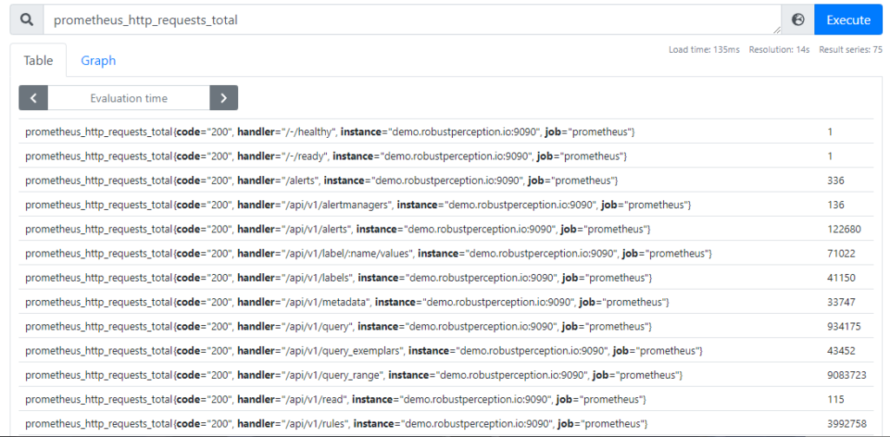
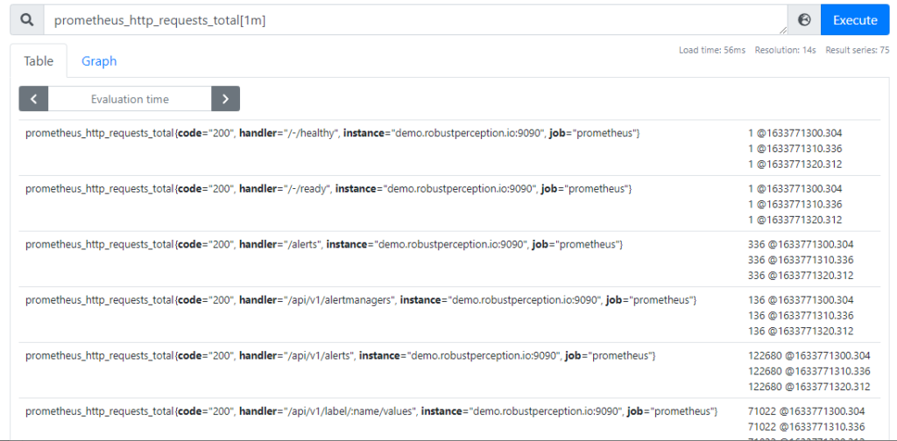

# PromQL 介詔

原文: [Kubernetes Observability – Part IV: PromQL tips](https://www.augmentedmind.de/2021/10/17/promql-tips-and-deep-dive/)


這是對 PromQL（Prometheus 查詢語言）的深入探討。本文討論了基本的數據格式（即時向量和範圍向量），解釋了不同類型的運算符和函數，然後詳細說明了二元運算符如何進行結果向量匹配。同時也總結了各種 PromQL 技巧和提示，並幫助您開始實踐。

## 介紹

Prometheus 堆棧是一組流行的工具，用於實現系統的可觀察性。正如本 Observability 文章系列第一部分概述的學習指南中所述，一個重要的步驟（在技術軌道上）是了解 Prometheus 查詢語言 PromQL。您需要在兩個地方使用 PromQL：在 Prometheus 本身中構建警報和記錄規則，以及在 Grafana 中選擇儀表板中可視化的數據。本文詳細介紹了 PromQL、結果數據格式即時向量和範圍向量、不同的運算符，以及如何匹配標籤或樣本計數不對齊的結果數據行。最後，我總結了各種技巧和提示。

我建議您在閱讀本文時嘗試並編寫自己的 PromQL 查詢。在本系列的前一篇文章中，我已經演示了不同的安裝選項。再一次，我強烈推薦 PromLens，這是一個非常有用的工具，可以以圖形方式可視化和解釋複雜的 PromQL 查詢。您可以使用個人許可證在您自己的（非商業）基礎設施上免費運行它，或使用公共現場演示實例。

!!! tip "複習：時間序列與指標"
    在本文中，我將假設您知道“時間序列”和“指標”之間的區別。如果沒有，請參考[這裡](./observability-prometheus-guide-part3.md/#指標時間序列樣本和存儲)的解釋。

## PromQL查詢結果數據格式

當您在查詢窗口中輸入 PromQL 查詢時（例如，在 Grafana 中，或者 Prometheus 服務器的端口 9090 上的 Prometheus 的 Web 界面中），您將返回 0 個或更多結果行。結果總是有一個類型：即時向量 (instant vector) 或範圍向量 (range vector)。

### 即時向量 (Instant vector)

每當您鍵入 `some_metric_name` 或 `some_metric_name{some_label="value"}` 之類的內容時，結果就是一個"**即時向量**"。考慮以下示例：



在此示例中，結果是一個包含約 100 個時間序列行的即時向量，每行包含該時間序列的最近抓取的樣本值。請注意，結果不包含收集此樣本的時間戳——假設它是最近收集的。 Prometheus 實際上丟棄了超過 5 分鐘之前收集的樣本，並且相應的時間序列行不會是返回結果的一部分。

為了幫助您更好地記住它：“**即時向量**”有它的名字的取名原由，因為查詢結果行只包含那些“此時”（通常是幾秒鐘前）收集的樣本的時間序列。

!!! info "即時向量選擇器"
    如果您編寫類似 some_metric_name **{foo="bar"}** 的內容，粗體部分稱為選擇器，您可以使用它來過濾（如：縮小）查詢中返回的時間序列。此示例中的 `=`（等號）稱為匹配器。其他匹配器是 `!=`（不相等）、`=~`（正則表達式）和 `!~`（否定正則表達式）。

    您可以使用多個選擇器——在這種情況下，只返回滿足所有選擇器的那些行（換句話說：Prometheus 將 AND 邏輯應用於選擇器）。您還可以為相同的標籤鍵（但不同的匹配器類型）提供多個選擇器。例如，您可以編寫一個查詢，例如 node_filesystem_size_bytes{ **mountpoint** =~ "/run/.*", **mountpoint** !~"/run/user/.*"}`
    獲取所有節點上磁盤分區的總大小，其掛載點以 “/run/” 開頭，但不包括所有以 “/run/user/” 開頭的節點。

### 範圍向量 (Range vector)

諸如 some_metric_name[**5m**] 或 some_metric_name{some_label="value"}[**5m**] 之類的查詢會生成"**範圍向量**"類型的結果。



範圍向量類似於即時向量。如上例所示，範圍向量和即時向量之間有兩個關鍵區別：

- 一個範圍向量包含每個時間序列的多個樣本——不僅僅是最近收集的一個
- 範圍向量的樣本帶有時間戳（@ 字符後的值）

尖括號中的部分（例如 [5m]）指定返回樣本的時間窗口。例如，[5m] 告訴 Prometheus 返回在“剛剛”和“過去 5 分鐘”之間抓取的樣本。可用的單位有：`s`（秒）、`m`（分鐘）、`h`（小時）、`d`（天）、`w`（週）、`y`（年）。

!!! info "時間偏移"
    有時您可能想查詢較舊的數據，例如將“一周前”的請求率與當前的請求率進行比較。為此，PromQL 提供了您可以在查詢末尾添加的 `offset <duration>` 關鍵字。它適用於即時和範圍向量！

    例如，諸如 `some_metric_name[5m] offset 1h` 之類的查詢將為您提供在“1 小時前”和“1 小時 5 分鐘前”之間抓取的樣本。

## 運算符 (Operators)

在實踐中，PromQL 查詢相當大且複雜。通常，它們是多個子查詢的組合，您可以使用運算符組合這些子查詢，這也是 SQL 查詢中的常用技術。 PromQL 運算符期待它們的“輸入”是正確的數據類型（範圍向量、即時向量或標量），這就是我在上面詳細解釋可用數據類型的原因。順便說一下，標量只是一個浮點數。

Prometheus 具有以下三種運算符類別：聚合運算符、二元運算符和函數。

=== "聚合運算符(Aggregation operators)"

    聚合運算符，例如 `sum` / `count` / `min` / `max` / `avg` / `stddev` 將單個即時向量作為輸入並產生一個即時向量作為輸出。由於聚合，與輸入即時向量相比，結果通常具有更少的時間序列（和標籤）。

    聚合總是發生在您指定的一個（或多個）標籤鍵上。有兩種指定這些標籤的基本方法。讓我們通過示例來說明它們，對於指標 `node_filesystem_size_bytes`，它具有標籤鍵 `job`、`instance`、`device`、`mountpoint`、`fstype`。

    - 指定允許列表。示例查詢：sum by(job, instance, device)(node_filesystem_size_bytes)
        - 生成的即時向量將僅包含您在 by-clause 中指定其鍵的那些標籤，聚合所有其他標籤。下面的示例清楚地說明了聚合過程的工作原理。
    - 指定拒絕列表。示例查詢： sum without(fstype, mountpoint)(node_filesystem_size_bytes)
        - 生成的即時向量將不再包含您在無子句中指定的那些標籤鍵，但將包含輸入即時向量具有的所有其他標籤。在這種情況下：作業、實例、設備

    運行上述任一查詢時（兩者都實現相同的目的，通過 fstype 和 mountpoint 進行聚合），聚合的工作方式如下：

    假設 node_filesystem_size_bytes 指標具有以下即時向量時間序列：

    ```bash
    node_filesystem_size_bytes{device="/dev/sda1",fstype="vfat",instance="localhost:9100",job="node",mountpoint="/boot/efi"} 100663296
    node_filesystem_size_bytes{device="/dev/sda5",fstype="ext4",instance="localhost:9100",job="node",mountpoint="/"} 90131324928
    node_filesystem_size_bytes{device="tmpfs",fstype="tmpfs",instance="localhost:9100",job="node",mountpoint="/run"} 826961920
    node_filesystem_size_bytes{device="tmpfs",fstype="tmpfs",instance="localhost:9100",job="node",mountpoint="/run/lock"} 5242880
    node_filesystem_size_bytes{device="tmpfs",fstype="tmpfs",instance="localhost:9100",job="node",mountpoint="/run/user/1000"} 826961920
    node_filesystem_size_bytes{device="tmpfs",fstype="tmpfs",instance="localhost:9100",job="node",mountpoint="/run/user/119"} 826961920
    ```

    Prometheus 將在內部創建組，其中每個組包含具有完全相同標籤（具有相同標籤鍵和標籤值）的時間序列，這些標籤鍵應保留在最終結果中。在這個例子中：

    ```bash
    # Group 1 {device="/dev/sda1",instance="localhost:9100",job="node"}
    node_filesystem_size_bytes{device="/dev/sda1",fstype="vfat",instance="localhost:9100",job="node",mountpoint="/boot/efi"} 100663296

    # Group 2{device="/dev/sda5",instance="localhost:9100",job="node"}
    node_filesystem_size_bytes{device="/dev/sda5",fstype="ext4",instance="localhost:9100",job="node",mountpoint="/"} 90131324928

    # Group 3 {device="tmpfs",instance="localhost:9100",job="node"}
    node_filesystem_size_bytes{device="tmpfs",fstype="tmpfs",instance="localhost:9100",job="node",mountpoint="/run"} 826961920
    node_filesystem_size_bytes{device="tmpfs",fstype="tmpfs",instance="localhost:9100",job="node",mountpoint="/run/lock"} 5242880
    node_filesystem_size_bytes{device="tmpfs",fstype="tmpfs",instance="localhost:9100",job="node",mountpoint="/run/user/1000"} 826961920
    node_filesystem_size_bytes{device="tmpfs",fstype="tmpfs",instance="localhost:9100",job="node",mountpoint="/run/user/119"} 826961920
    ```

    sum 運算符對每個組中的樣本值求和，並返回每組一個樣本：

    ```bash
    {device="/dev/sda1",instance="localhost:9100",job="node"} 100663296
    {device="/dev/sda5",instance="localhost:9100",job="node"} 90131324928
    {device="tmpfs",instance="localhost:9100",job="node"} 2486128640
    ```

    注意：結果不再與輸入指標的（名稱）相關！名稱 node_filesystem_size_bytes 已消失，因為結果不再類似於由該度量名稱測量的原始值。

=== "二元運算符(Binary operators)"

    二元運算符之所以這樣稱呼，是因為它們將兩個輸入操作數作為輸入。

    二元運算符分為三種：
    
    - 算術運算符 (Arithmetic): + – * / ^ %
    - 比較運算符 (Comparison): larger / smaller (or equal), equal, unequal
    - 邏輯運算符 (Logical): and, or, unless

    大多數二元運算符將兩個即時向量作為輸入，並產生一個即時向量作為輸出。但是一些運算符也支持標量(scalar)作為輸入之一，例如諸如 `some_metric / 1024` 之類的查詢。

    雖然算術運算符很容易理解和使用，但關於比較運算符和邏輯運算符有幾點需要了解：

    - 比較運算符 (Comparison):
        - 這些運算符不會更改結果中的值（例如更改為真/假）。相反，它們返回運算符左側的輸入向量的樣本，過濾掉比較結果為假的那些樣本。
        - 如果您不想過濾樣本（即從結果中丟失），但在結果中將它們的值為 0，請使用 bool 關鍵字，例如 `some_metric > bool 10`（而不是 `some_metric > 10`）。但是，那些比較評估為真的樣本將只有一個值 1 而不是實際存儲的值。
        - 更多詳細信息，請參閱[官方文檔](https://prometheus.io/docs/prometheus/latest/querying/operators/#comparison-binary-operators)。
    - 邏輯運算符 (Logical):
        - `and` 取左右兩邊數據的交集。只有當右側有匹配的樣本時，它才會從左側返回樣本。這在警報中很有用，可以指定多個條件。
        - `or` 從任一側返回樣本，更喜歡左側的數據。換句話說：來自左側和右側的樣本被分組（並且 Prometheus 嘗試找到匹配項）。對於每個組，以下成立：如果該組左側有樣本，則返回這些樣本，如果沒有，則從右側返回樣本
        - `unless` 從左側返回樣本，除非右側有樣本，在這種情況下不返回任何內容。如果缺少某些指標，這對於在您想要發出警報的情況下發出警報很有用。
        - `and` 與 巷unless巷 運算符支持 `on(...)` 和 `ignoring(...)` （但 `or` 運算符不支持！）
        - 沒有 `not` 運算符。請改用 `absent()` 函數！ 如果一個空的即時向量（即缺失的結果）被 `absent()` 函數運算時，它會返回一個（通常是無標籤的）即時向量，其中包含一個值為 1 的樣本。返回的結果可以有標籤，例如當你調用 `absent(up{job="missing"})` 時，它會返回 `{job="missing"} 1`。

    當您組合由二元運算符組成的嵌套子查詢時，並不總是清楚哪些運算符具有更高的優先級。在 Prometheus 中，運算符優先級（從高到低）是：
    - `^`
    - `*`, `/`, `%`
    - `+`, `-`
    - `==`, `!=`, `<=`, `<`, `>=`, `>`
    - `and`, `unless`
    - `or`

    例如，對於 some_metric * 2 ^ 3 這樣的查詢，Prometheus 將首先計算 2^3 (=8)，然後將 some_metric 的樣本值乘以 8，因為 ^ 具有最高優先級。

=== "函數 (Functions)"

    函數將即時向量或範圍向量作為輸入，通常會生成即時向量作為結果。有一些例外會返回標量，例如 time() 和 scalar()。

    如官方文檔所示，有數十種函數可用於各種用途，例如數學函數或與日期/時間相關的函數。解釋它們都需要很長的文章。

    相反，我只想解釋一個函數，`rate()`，你在 PromQL 查詢中經常需要它，而官方文檔對它的解釋特別差。 `rate()` 需要一個 counter 類型指標的範圍向量。因為 counter 的樣本值是單調遞增的，所以它們對於繪圖或在原始形式的警報查詢中沒有用——您將不知道將它們與什麼值進行比較。 `rate()` 函數在這裡可以為您提供幫助，因為它通過計算定義時間段內的樣本值的增量來“壓平”這種單調遞增的值，並將增量值標準化為“每秒”。

    一個例子對更好地理解這一點很有幫助。假設 `process_cpu_seconds_total[5m]` 的範圍向量返回以下樣本（僅顯示一個特定時間序列的樣本，標籤為 `(instance="demo.robustperception.io:9090", job="prometheus"）`：

    ```bash hl_lines="1 5"
    4858038.33 @1633506420.307
    4858045.41 @1633506430.304
    ... 還有 24 個樣本，為簡潔起見省略 ...
    4858214.65 @1633506680.311
    4858221.63 @1633506690.312
    ```

    `rate()` 在概念上所做的計算是： 

    ```bash
    (latest value - oldest value) / (latest timestamp - oldest timestamp)
    ```

    也就是，我們將樣本值增量（此處為 4858221.63 – 4858038.33 = 183.3 CPU 秒）除以時間戳增量（1633506690.312 – 1633506420.307 = 270 秒），得到每秒約 0.68 的速率。我們指定的時間窗口（此處：`[5m]`）指定了平均/平滑效果的強度——時間窗口越大，平均值越強。

    實際上，該算法要復雜得多。 `rate()` 智能地考慮丟失的樣本值，並且還處理計數器重置（由於導出應用程序崩潰/重新啟動，抓取的樣本值正在減少）。

    當您在將 `rate(some_metric[...])` 繪製為一條線的圖表中使用 `rate()` 時，從概念上講，該線的每個像素都是通過分別調用 `rate()` 創建的，將時間窗口偏移幾秒鐘每一次。當然，實際上，還有更高效的 API，其中一次調用將生成圖形所需的 `rate()` 值數組。

    關於 rate() 的一些提示：
    - 您提供給 rate() 的時間窗口（例如 [5m]）應至少是為提供相應指標的目標配置的抓取間隔的 4 倍。
    - 當您將 `rate()` 與 `sum()` 結合使用時，始終調用 `sum by(...)(rate(<counter-type metric>))`，而不是相反，因為這樣您將匯總原始計數器樣本值，這是沒有意義的。

## 向量匹配 (Vector matching)

當給定二元運算符作為輸入的兩個即時向量時，它必須將運算符左側的時間序列行與右側的行匹配。這稱為"**向量匹配**"。考慮到標籤或（數量）樣本，或兩者都可能存在差異。

如果你很幸運，標籤和样本計數是一對一的，在這種情況下你不需要做任何特別的事情——你的 PromQL 查詢可以簡單地是 `<left expression> <operator> <right expression>`。 Prometheus 可以將樣本與標籤匹配的其他樣本進行匹配。

但是，通常情況並非如此，如果二元運算符查詢的結果是一個空的即時向量，您可以從匹配出現問題的事實中看出這一點。幸運的是，您可以使用一些機制來處理這些問題：

- 要處理標籤不匹配，您可以使用關鍵字 `ignoring` 或 `on`，其工作方式與關鍵字 `without` 或 `by` 對聚合運算符的工作方式非常相似。
    - 具體例子：

      ```bash
      sum without(cpu)(rate(node_cpu_seconds_total{mode="idle"}[5m])) / ignoring(mode)
      ```

      ```bash
      sum without(mode, cpu)(rate(node_cpu_seconds_total[5m]))
      ```
- 強烈建議您打開 [PromLens 演示](https://demo.promlens.com/)並運行上述查詢。通過單擊 PromLens 中的不同節點，您可以輕鬆了解（中間）結果是什麼。很明顯，諸如:
  
  ```
  sum without(cpu)(...) / sum without(mode, cpu)(...)
  ```
  
  （即，省略 ignoring(mode) 部分）不會起作用（不會顯示錯誤，但您會得到一個空的即時向量作為結果），因為第一個 sum 運算符的結果具有標籤 instance、job、node，但第二個求和運算符結果只有標籤 instance, job。

- 如您所見，關鍵字（`ignoring` 或 `on`）必須緊挨二元運算符的右側。
- 如果標籤匹配（或者您使用上述 `ignoring()` 技巧使它們匹配），但樣本/結果行的數量不匹配，您會收到一條錯誤消息，例如 “multiple matches for labels: many-to-one matching must be explicit (group_left/group_right)“，因為你有 many-to-one (rows) 匹配的情況。
  
  如果您採用上面的示例並去除了 `{mode="idle"}` 部分，就會發生這種情況。只需在 PromLens 中嘗試！您會看到第一個求和結果現在有許多時間序列（每個 CPU 模式一個），但第二個求和結果仍然只有一個時間序列行。

    - PromQL 確實支持多對一匹配，但您必須通過在二元運算符右側添加 `group_left` 關鍵字來明確告訴 Prometheus 這是您想要的。如果你已經有 `ignoring(…)` 或 `on(…)` ， `group_left` 必須在它之後）。因此，語法是：

      ```bash
      <left expression> <operator> [ignoring(labels) | on(labels)] group_left <right expression>
      ```
    - 本質上，`group_left` 或 `group_right` 指示 Prometheus 在運算符的相應另一側複製結果行/樣本，以便您再次獲得雙方樣本之間的一對一匹配。在我們的示例中，我們應該使用 `group_left`，因為運算符的右側是具有較少時間序列行（需要復制）的一側。
    - 還有一個 `group_right` 關鍵字，類似於 `group_left`，但作用方向相反。
    - 通過使用語法 `group_left(label1,label2,…)` （而不僅僅是 `group_left`），最終結果將不僅包含運算符左側結果中存在的標籤，而且 Prometheus 還將復制指定的標籤（此處：運算符右側的 label1 和 label2) 進入結果。一個典型的用例是使用來自另一個指標的值來豐富結果，例如:

        ```bash
        up * on(instance) group_left(version) prometheus_build_info
        ```

      它使用 prometheus_build_info 指標的版本標籤豐富了 up 指標（具有 instance 和 job 標籤）。
    - 注意：Prometheus 不支持多對多匹配，只支持一對一或多對一或一對多！


## PromQL 小技巧

### 指標名稱語法糖

在 PromQL 中，像 `metric_name{key="value"}` 這樣的東西只是 `{__name__="metric_name",key="value"}` 的語法糖

### 避免使用空選擇器

編寫查詢時，您要嘛必須省略選擇器（例如 some_metric），要嘛在選擇器中指定至少一個標籤（例如 some_metric{**key="value"**}，其中花括號部分是選擇器）。你不能只使用一個空的選擇器——像 some_metric{} 甚至只是 {} 是不允許的，因為這可能會使 Prometheus 服務器過載，並且有一個安全措施可以避免這種過載。

另一條規則是，選擇器中必須至少有一個匹配器，其值與空字符串不同。例如，諸如 {foo=""}、{foo!=""} 和 {foo=~".*"} 之類的查詢將返回錯誤，因為它們都只是使用（或匹配）一個空字符串作為匹配器中的值！

### 獲取存儲在 Prometheus 中的所有（或特定）時間序列的列表

使用諸如 {__name__=~".+"} 之類的查詢來獲取存儲在服務器上的所有時間序列的列表。

像 {__name__=~"foo.*"} 這樣的東西會檢索以 foo 開頭的那些時間序列的列表。

如果您不熟悉正則表達式：`.` 代表字符類（匹配任何字符），`+` 後綴代表“至少一次”，因此兩個字符 `.+` 一起告訴 Prometheus 匹配名稱至少包含一個字符的任何指標。

### 聚合運算符：by 與 without

使用聚合運算符時，您通常應該更喜歡使用:

```bash
<aggregation operator e.g. sum> without(label1,label2)(...)
```

而不是:

```bash
<aggregation operator e.g. sum> by(somelabel)(...)
```

為什麼? 因為時間序列的標籤並不總是隨著時間的推移而穩定。標籤通常是儀器標籤（通常不會更改）或目標標籤（由 Prometheus 在抓取期間附加）。目標標籤是非常動態的，並且通常不受編寫 PromQL 查詢的人的控制。因此，最好不使用聚合（在絕對已知的標籤上聚合，這會將它們從結果中刪除），將生成的即時/範圍向量與所有其他標籤一起使用。

這種方法讓查詢作者在突然彈出新標籤時注意到（例如在儀表板或警報通知中），然後他們可以在需要時調整 PromQL 查詢。使用 `without` 對於警報規則尤其重要，以保留警報通知中的所有其他標籤。

`by` 聚合在某些情況下仍然有用，例如在對信息指標進行聚合時（預計其儀表標籤會更頻繁地更改），例如一個查詢，例如 `count by(release)(node_uname_info)`

### Alerting rule 小技巧

- 如果您希望警報僅在特定時間觸發，請編寫如下內容： `<alert rule> and on() hour() > 9 < 17`
    - `on()` 確保即時向量匹配仍然發生，即使語句的輸出在左側和右側並且沒有共同的標籤。
    - 除了 `hour()`，您還可以使用其他函數，例如 `minute`，`day_of_week`，`day_of_month`，`month`，`year`
- 在您的 `alert-rules.yml` 文件中，至少使用：**5m**，以避免誤報。無論如何，你不能更快地反應了！
    - 需要注意的警告：Prometheus 不會將 `for` 的狀態持久化到磁盤（而只會將其保存在 RAM 中），因此當您重新啟動 Prometheus 時，它會從頭開始評估！
- 重要提示：`for` 期望對該警報規則的每個評估都包含非陳舊結果。假設您有一個帶有 `expr` 的規則：`process_open_fds > process_max_fds * .8` 和 `for：5m`。

    如果僅對 `process_open_fds` 指標的一次抓取失敗，則對該表達式的評估將產生一個空結果（因為過時標記），並且 for 狀態將被重置。有關過時的更多詳細信息，請參見此處。解決方法是使用 `avg_over_time`、`max_over_time` 等函數，例如將上述示例調整為 `max_over_time(process_open_fds[5m]) > max_over_time(process_max_fds[5m]) * .8`

        - 注意：up 指標是一種特殊情況——這裡這個問題不適用，因為即使抓取失敗，up 也存在！

- 您可以使用 `amtool check-config` 命令來驗證您的 `alertmanager.yml` 配置文件，例如在提交版本控制之前。

## 結論：將 PromQL 查詢付諸實踐

PromQL 查詢主要用於編寫警報規則和構建 Grafana 儀表板。 PromQL 的主要困難是大量可用的指標。例如，Prometheus 本身的 `/metrics` 端點已經擁有超過 150 個指標，node exporter 可以輕鬆擁有超過 250 個指標，而其他 exporter（或您自己的應用程序）將擁有更多。掃描所有這些指標以決定在儀表板或警報規則中使用哪些指標將是一項艱鉅的任務。

幸運的是，Prometheus 和 Grafana 社群已經為你做了很多工作：

- 對於 Grafana 儀表板，有官方的[儀表板存儲庫](https://grafana.com/grafana/dashboards/)，其中搜索一些第三方 exporter（例如“postgres”、“node exporter”等）將為您提供大量可用作基礎的儀表板。

- 對於 Alerting rule，有諸如 [Awesome Prometheus alerts](https://awesome-prometheus-alerts.grep.to/) 之類的網站，其中包含各種 exporter 的許多示例。並非所有規則都是真正明智的：您仍然需要評估每條規則，無論它是否對您的系統有意義。

這些資源將幫助您入門，因為您不再需要從頭開始編寫查詢。相反，您可以使用您對本文中提供的運算符、函數等的理解來調整它們以適應您的需求。