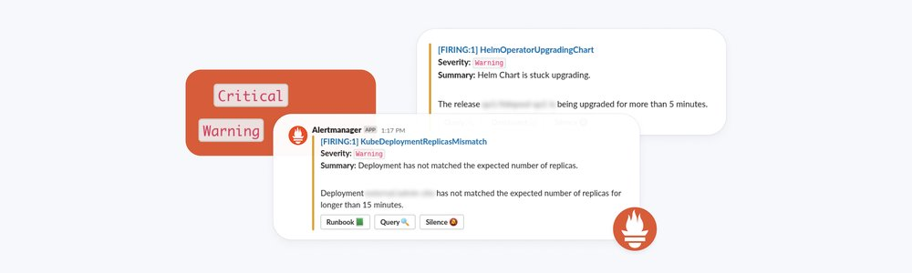
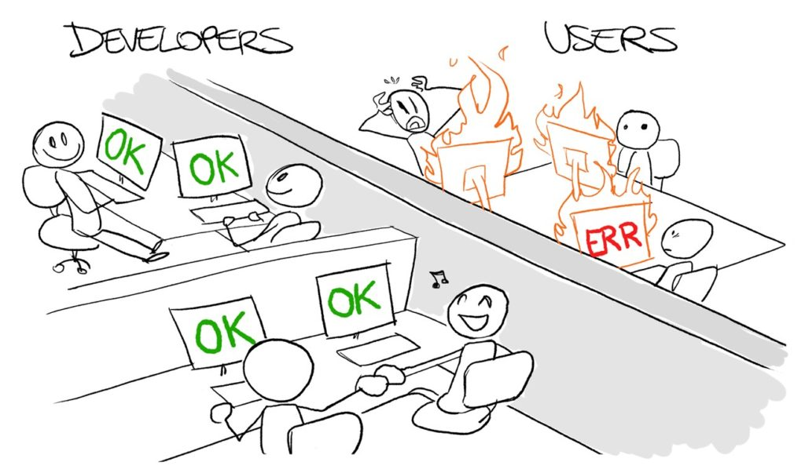

# Alert 最佳實踐

原文: [Kubernetes Observability – Part V: alerting best practices](https://www.augmentedmind.de/2021/10/31/alerting-best-practices/)

本文解釋了在抽象的、獨立於工具的級別上編寫警報的最佳實踐。我進入了技術警報模式（包括 RED 和 USE）以及為什麼從業務角度開始會更好。我詳細介紹了一般警報規則設計，例如警報頻率和適當的目的地，並給出了解決應用程序不同層中可觀察性的具體技巧，例如服務器與服務與應用程序。我還解釋了事件管理的基本概念，以及在生產環境中測試可觀察性如何實現最高級別的可觀察性。

## 介紹

Prometheus 堆棧是一組流行的工具，用於實現系統的可觀察性。正如本可觀察性文章系列第一部分中概述的學習指南中所述，有許多技術知識需要學習，我在技術軌道中進行了介紹。但也有你需要獲得的元級知識，它與工具無關，我將其放入高級可觀察性軌道。具體的元級知識項目之一是學習高級警報設計原則——該領域的工作人員隨著時間的推移收集的原則，我們將在本文中更仔細地研究這些原則。

本文的目的是幫助您開始編寫您的第一個警報規則，為您帶來最大的好處。沒有這樣的指導，只有大量的技術知識是沒有用的。您可以為其創建警報的指標數據源太多。您可能會產生非常嘈雜的警報洪流，這些如潮水般湧來的警報最終都會被忽略。

此處涵蓋的許多要點均來自《[實用監控](https://www.oreilly.com/library/view/practical-monitoring/9781491957349/)》一書（2017 年出版），我絕對建議您仔細閱讀。這本書裡所給的建議可能已有數年多的歷史，但幾乎所有的建議到了今天卻仍然適用。

## 技術與業務驅動的警報

如果你是一名工程師，你很有可能會從技術角度來解決問題，因為那是你擅長的和你所知道的。您可能會開始分析您擁有哪些基礎設施/服務器、它們運行哪些服務（例如數據庫等）、網絡如何發揮作用以及您的應用程序可能存在哪些技術問題（例如內存消耗、垃圾收集等）。

兩種廣泛應用的技術警報模式是 **RED** 和 **USE**，如下所示：

=== "RED"

    RED 代表請求率(**R** equest Rate)、錯誤率(**E** rror Rate)、請求持續時間(**D** uration of request)。 RED 模式主要適用於請求驅動的應用程序，例如您開發的 Web 服務。對於這些類型的應用程序，RED 可以幫助您選擇現有的指標數據來創建警報。例如，您應該使用 HTTP 反向代理（如 Nginx）提供的眾多指標數據中的哪一個。但是 RED 還可以幫助您決定如何檢測您自己的應用程序，即您應該將哪些類型的數據公開為指標，以便您可以為它們編寫警報。

    總之：

    - **Request rate**: 回答這個問題：“我的系統有多忙？”。我們可以通過計算請求的數量（由路徑/URL 分隔）來確定，然後可觀察系統（例如 Prometheus）在運行時將其轉換為速率（例如 200 requests/second）。
    - **Error rate**: 回答這個問題：“請求總數中有多少是錯誤的(百分比)?”。與 Request rate 類似地計算邏輯。您還可以考慮對不同類型的錯誤進行分類（例如 HTTP 響應代碼 4xx 與 5xx）。 
    - **Duration of request**: 回答這個問題：“我的系統的延遲分佈情況如何？”。您希望將此數據作為直方圖，而不是單個值（例如平均延遲），因為它允許您檢測異常值。通常，您將配置您的 HTTP 服務器以在其日誌中包含請求持續時間，然後使用指標導出器從這些日誌文件計算直方圖（請參閱此處的 [Nginx 教程](https://www.martin-helmich.de/en/blog/monitoring-nginx.html)。

=== "USE"

    USE 代表利用率(Utilization)、飽和度(Saturation)、錯誤(Errors)。 USE 主要應用於基礎設施，特別是在後台執行異步工作的系統。換句話說：利用率、飽和度和錯誤適用於系統資源。

    - **Utilization**: 已使用資源的比例 -> 100% 利用率意味著無法接受更多工作。可以應用於 RAM，也可以應用於 CPU 負載。
    - **Saturation**: 資源具有無法服務的額外工作的程度，因此經常排隊。參見例如在這里和這裡可以更好地理解 CPU 的這一點。
    - **Errors**: 錯誤事件的計數，例如設備錯誤。

    因為魔鬼在細節中（關於如何收集這些指標，以及如何解釋它們），我推薦這篇[優秀的文章](https://www.brendangregg.com/usemethod.html)。

但是，更好的方法是從最終用戶的角度解決問題。畢竟，您正在為最終用戶構建軟件，如果他們因為您的應用程序無法正常運行（良好）而離開，那麼您就會倒閉。您的最終用戶不知道為您的應用程序提供動力的服務器或服務。它們僅與某種用戶界面交互，因此您最好開始構建指標（帶有相應的警報），以指示該界面何時出現問題。

僅考慮技術方面時，可能會以兩種不同的方式出錯：

- **不知情的技術團隊**：如上圖所示，對​​所有單個組件的監控表明一切正常，但最終用戶確實遇到了問題。如果缺少整體願景和最終用戶視角，並且每個團隊僅針對他們擁有的系統部分實施指標和警報，則可能會發生這種情況。
- **不知情的最終用戶**：這是相反的情況：最終用戶沒有註意到任何問題，但您的團隊正在恐慌，例如因為CPU飽和度突然很高。這通常是由過於嘈雜的警報引起的，即，具有根本不應該有警報的技術方面的警報，或者因為閾值選擇不當。

自然，許多技術指標也涵蓋了最終用戶的需求，例如在監控 Web 應用程序的錯誤率（RED 中的 E）時。但魔鬼在細節中：

- 示例#1：有多少錯誤是有問題的並且應該觸發警報？所有請求的 1%？ 10%？如果 1% 影響 `/register` 端點怎麼辦？然後你就失去了 1% 的潛在新客戶，他們無法註冊，這比 1% 影響 `/generate-pdf-report` 端點的情況要糟糕得多（從業務角度來看）。
  
- 示例#2：您的用戶可以容忍多少延遲？沒有單一簡單的答案，它在很大程度上取決於應用程序，您的閾值可能從 50 毫秒到幾分鐘不等。當然，對於更長的持續時間，UI 必須將預期的延遲傳達給您的用戶。如果一個操作（從用戶的角度）應該是即時的（例如點擊“保存按鈕”）但實際情形卻不是的話，用戶會認為系統是一個失敗的系統（並且可能很快離開），而你作為一個工程師，只會將其歸類為“有點慢”。

這就是 KPI（關鍵績效指標）發揮作用的地方。例如，您應該建立指標來幫助您確定您的業務作為一個整體是在增長還是在萎縮，例如通過觀察登錄次數/每月活躍用戶、客戶總數、收入、付費客戶百分比（如果您有免費套餐）、用戶回答的調查數據等。

要了解有關您業務的 KPI 的更多信息，請不要像 CTO 那樣思考 - 像您的 CEO、CFO 等那樣思考。與您組織中不是工程師的人交談，例如產品所有者或客戶支持。您不僅可以了解您的用戶關心但您不知道存在的方面，而且您還可以放鬆並降低一些硬性要求或警報閾值（例如，在構建電子郵件服務器時，您剛剛了解到用戶如果處理外發郵件最多需要 10 秒，請不要介意）。寫下您的服務/應用程序所做的描述（包括其功能和 UI 演練）然後分析此描述也很有幫助。

一旦您對技術和業務 KPI 都有警報，請嘗試將它們關聯起來。強相關性有時可能有助於解釋 KPI 指標發生變化的原因。例如，如果每月活躍用戶計數（KPI 指標）突然開始下降，並且您還發現平均服務響應時間（技術指標）也同時開始大幅增加，這可能是導致用戶離開。

## 良好的告警規則設計

一般來說，將告警分為兩個級別是一個好主意：

- **Critical**: 你現在需要做點什麼，否則系統可能很快就會崩潰！例如。因為幾個服務停止工作。
- **FYI**: 僅供參考，出了點問題，但並不嚴重，例如備份失敗，或磁盤慢慢填滿。

在“實際監控”一書中，第二個級別（FYI）被認為只是一個消息，而不是一個警報。將 FYI 類型的消息發送到聊天室或自動生成 ticket 就足夠了。但是，重要的警報通知需要以您高度確信有人肯定會很快閱讀它的方式發送，例如自動撥打電話或發送短信。

[實用監控](https://www.oreilly.com/library/view/practical-monitoring/9781491957349/)提出了幾個良好警報設計的通用技巧：

- 停止使用電子郵件發送警報: 電子郵件通常不會喚醒任何人。短信、徾信或電話都可以！電子郵件更適合消息類型的警報。
- 編寫運行手冊(run book)：為特定服務編寫運行手冊。它描述了這個服務是什麼，它做什麼，誰負責它，它有什麼依賴關係，它的基礎設施是什麼樣的，它發出什麼指標和日誌（以及它們的含義），以及為什麼警報設置它（以及為什麼）。對於每個警報，為該服務的運行手冊創建一個（可點擊的）鏈接
- 避免在警報規則定義中使用任意的靜態閾值。相反，通常像增長率這樣的東西更有趣。
    - 例如：靜態警報規則“僅剩餘 10% 的磁盤空間”不如“磁盤使用率在過去 10 分鐘內增長了 X%”有用。使用靜態規則，如果磁盤很小並且在短時間內生成大量數據，您的系統仍然可能崩潰。你真正想要的是在“正確的時間”發出警告（例如，有兩週的跑道）。靜態的“10%”百分比值不會給你這個。相反，您必須測量磁盤填滿的速率，計算剩余天數（考慮可用磁盤空間），然後在天數低於閾值時警告您。
- 刪除和調整警報，以便您收到盡可能少的警報。這可以減少警報疲勞，這是由於警報太多而開始忽略警報的現象。考慮定期回顧您的警報歷史記錄，例如過去 30 天：發生了哪些警報，必須採取什麼措施來解決它們，您是否可以修改閾值或編寫不同的規則來避免嘈雜的警報？所有這些警報都是必要的嗎？
- 使用可觀察性工具的“靜音”功能，暫時禁用監視您在維護期間關閉的服務的警報。否則，警報將觸發那些關閉的服務，再次增加警報疲勞的風險。
- 首先嘗試自我修復：如果有一組固定的指令可以修復警報，請考慮自動執行它們。配置警報系統，以便如果它第一次檢測到問題，它會執行自動“修復”腳本，而不是觸發警報。只有在第二次檢測到問題時才會觸發實際警報，以防自動腳本無法修復問題的原因。
- 包括季節性分析：不僅為當前系統狀態編寫警報規則，還可以找到規律性，即數據中的模式在一段時間後開始重複。您通常可以通過查看儀表板中的圖表來識別此類模式。接下來，您可以編寫警報規則，將當前數據與模式的基線進行比較，以確定是否有問題。
    - 例如，網絡流量通常是季節性的，因為您可能會發現您的網站或服務在工作日晚上獲得更多流量，甚至在周末獲得更多流量。編寫警報規則，將您的請求率與前一周或前幾個月的率進行比較。您可以從請求率增量的突然下降中判斷出問題所在。

## 特定於上下文的可觀察性提示

讓我們看一下構建警報規則和提高總體可觀察性的技巧，按整個系統堆棧中的不定分層來分類。

=== "Application"

    核心思想是將檢測添加到您自己的應用程序代碼中，這會公開特定於您的應用程序的指標。這也意味著研究（和使用）APM 工具（應用程序性能監控），這些工具可以分析您的代碼並自動將檢測添加到您的應用程序中，捕獲通用的東西，例如請求率或垃圾收集週期。

    如上所述，在檢測您的應用程序時，請考慮您的業務。例如，計算一個功能被使用的次數。但也有大多數應用程序具有的通用功能，例如登錄，因此您可以跟踪成功登錄的數量，從中可以計算每日或每月的活躍用戶。

    您還應該在可觀察性堆棧中包含構建和部署 (CI/CD) 事件。構建指示每個版本的部署何時開始和結束的指標，以及部署目標（環境）。使用您的可觀察性工具，您可以將部署與其他事件相關聯，例如檢測到在某個部署之後，API 故障率開始顯著增長。

    添加指示您的應用程序是否健康的 `/health` API 端點，並使用您的可觀察性系統抓取它們的輸出。關於健康是否應該局限於提供健康端點的組件，或者它是否應該包括其他依賴項，有不同的理念。例如，如果無法訪問底層數據庫服務，Web 應用程序的 `/health` 端點是否也應該返回狀態碼 503？在“經典”的非分佈式應用程序中，這將是預期的行為。但在分佈式環境中，例如基於 Kubernetes 的應用程序，您需要分離關注點。有幾種類型的健康檢查（`liveness`、`readiness`、`startup`），您通常會將健康檢查限制在組件本身，以避免級聯錯誤。還要確保健康端點不可公開訪問，以避免洩露私人信息。

    調試問題的另一個很好的信息來源是日誌記錄。我建議您使用結構化日誌，例如編碼為 JSON。仔細考慮你在哪裡放置 log() 調用——日誌調用應該可以幫助你以後診斷問題！

=== "Frontend"

    前端監控是指監控 GUI 中發生的事情（例如瀏覽器、本機/桌面或智能手機應用程序）。前端監控經常被遺漏（就像一個盲點），尤其是當實施監控的人更多地面向操作或後端時。

    “好的” UI 的基本理念（從純技術的角度來看，忽略 UX 方面）是：元素必須快速加載！反應遲鈍、滯後的 UI 是一個巨大的交易破壞者。這就是為什麼將可觀察性應用於您的 UI 很重要的原因。

    有兩種基本的測試模式：

    - 黑盒測試：從外部觀察性能問題，忽略其代碼。例如，如果您的應用是網站/網絡應用，請使用服務（如 Webpagetest）來查詢您的網站，測量響應時間。
    - 白盒測試：您擴展自己的代碼以包括性能測量，並確保將它們提交到您的可觀察性系統。

    您應該更喜歡白盒測試而不是黑盒測試。使用現成的組件來簡化創建此類指標的任務是有意義的——但您必須研究使用哪一個，因為每種前端技術都有許多專門的解決方案。

=== "Server"

    觀察你的基礎設施/服務器是實現良好可觀察性的必要步驟，即使它不是你應該關注的第一件事。操作系統級別的指標，例如 CPU、內存、磁盤、網絡使用情況，對於診斷問題的原因很有用。但是，請記住，收集指標數據並不意味著您應該創建警報規則。為操作系統級別的指標設置警報通常沒有意義（除非您有充分的理由），因為它們很嘈雜（產生許多誤報警報），並且與您的應用程序無關。

    由於魔鬼在細節中（一如既往），這裡有一些建議：

    - CPU 指標：要獲得正確的 CPU 使用率，總結用戶、系統、niced 進程 (ni)、硬件中斷 (hi) 和軟件中斷 (si) 使用率。
    - 對“系統負載”的警報非常謹慎（請參閱[此處](http://www.brendangregg.com/blog/2017-08-08/linux-load-averages.html)）。有許多系統示例的每核負載遠高於 1，但仍然可以正常工作並且響應迅速。如果用戶沒有註意到問題，則無需修復！
    - 內存 (RAM) 指標：通過匯總 shared+cached+buffered 來計算實際使用的內存
        - 緩衝區存儲最近訪問的磁盤區域
        - 緩存的工作方式類似於緩衝區，但用於最近訪問的文件的內容。
        - 緩衝區/高速緩存使用的內存在技術上可供任何需要內存的進程使用。
        - Linux CLI 工具 free 的輸出在第二行顯示了正確的內存使用情況（以“-/+ buffers/cache”開頭），這說明緩衝區和緩存消耗的內存實際上可以被其他應用程序在任何時候。
        - 您還應該考慮監視內存不足錯誤，這些錯誤是在進程因內存不足而必須終止時創建的。在互聯網上搜索“OOMKiller”以了解更多信息。
    - 磁盤指標：
        - 您通常需要較低的 iowait 值，因為它表示 CPU 由於在磁盤上等待完成操作而處於空閒狀態的時間量。
        - 監控磁盤的 IOPS 也很有意義，但您需要首先了解什麼是好的基線，然後識別突然下降（與該基線相比）。

=== "Service"

    您可能正在使用不同種類的服務，您應該為此收集指標。這裡有一些提示：

    - Web 服務器指標：除了通常的嫌疑人（RED -> 請求/秒、請求持續時間、HTTP 響應代碼）之外，您還可以測量並發連接數。
    - 數據庫服務器指標：並發連接數、每秒查詢數、查詢持續時間（檢測慢查詢）
    - 緩存服務器指標：驅逐項目的數量，以及“命中/未命中率”（也稱為“緩存命中率”）。
        - Evicted items：數字大表示分配給緩存服務器的內存太少
        - 命中/未命中率：這個數字越低，緩存機制越差
    - 心跳監控：也稱為“死人開關”或“cron作業監控”（使用這些術語搜索互聯網，您會發現很多提供商）會檢測到沒有心跳信號然後通知您！這對於監控您的可觀察性系統本身很有用。
    - 考慮監控您使用的任何外部服務，例如CDN 服務器 - 在這裡您可以監控它們的命中/未命中率或延遲，或 CDN 提供的任何指標。

=== "Network"

    網絡是任何軟件應用程序的基本基礎之一。如果您的網絡只有 99.9% 的可用性，那麼您的應用程序不可能有比這更高的可用性。

    許多路由器和其他網絡硬件實現了 SNMP 協議，您可以使用該協議從中查詢信息。要監控的具體 OID / 值在每個設備上有所不同，但您應該監控的一般指標是：吞吐量、延遲（和延遲中的抖動）、rx/tx 錯誤/丟棄、CRC 錯誤、連接錯誤和各種其他錯誤。

    您還可以跟踪設備配置更改，例如使用 Rancid 等工具，它會定期從您的路由器（或其他網絡設備）下載配置，將其與前一個進行比較，並在配置發生更改時通知您。

=== "Security"

    應用程序安全是一個非常深奧的話題，您需要專門的專家來解決。因此，以下提示只是一個起點！

    - 使用諸如 auditd 之類的 Linux 工具
        - 允許您記錄活動，例如：
            - 所有 sudo 執行，執行的命令，以及執行者
            - 文件訪問或對特定文件的更改、何時以及由誰
            - 用戶身份驗證嘗試和失敗
        - 在雲原生生態系統中，您將使用 Falco 之類的東西而不是 auditd
    - 使用主機入侵檢測系統，例如 wazuh
    - 定期掃描您的部署是否存在安全問題，例如使用 OWASP Zed 攻擊代理

## 事件響應管理 (Incident)

在可觀察性世界中，事件（響應）管理是指一組處理可觀察性系統檢測到的問題（例如觸發的警報）的過程。有幾個框架，其中最流行的一個來自 ITIL，它有一個正式定義的 9 步計劃。在實踐中，大多數組織不需要如此正式。像下面這樣的序列已經足夠好了：

- 識別事件：通常由監控系統完成，
- 記錄事件，例如通過讓監控系統在某些工單管理系統中自動打開事件工單，甚至可能是專門針對此類情況的事件管理系統，例如 Opsgenie，
- 診斷：對其進行分類，找到可能的解決方案，解決事件，並更新或關閉相應的工單，
- 預防：一旦解決，尋找補救措施，以避免問題在未來不斷重複。這可以包括寫一個事後分析。

[此處](https://response.pagerduty.com/)提供了有關事件管理的更多信息的良好來源。

## 結論

獲得良好的可觀察性具有挑戰性。您需要從業務/最終用戶和技術角度來處理它，這需要團隊合作和時間。不要期望您在一個月或更短的時間內完成所有設置，但實際上將可觀察性考慮為一個持續的過程 - 就像保持第三方依賴項最新，對抗技術債務等。確保您，您的團隊，以及您組織中的其他利益相關者設置正確的優先級。首先開始為業務 KPI 構建指標和警報，然後繼續構建對最終用戶（服務器等）不可見的事物的其他技術指標。

您還應該避免沉迷於工具，例如代理、度量數據存儲或可視化系統。保證良好可觀察性的不是您使用的工具（或工具的數量）。當然，您應該在開始時花幾天時間研究不同的替代方案（可能最終使用 Prometheus）。但是你應該避免中途不斷地切換工具，僅僅因為它們看起來很閃亮，或者有新的功能。只有在當前工具阻礙您快速實施更改或工具停止使用時，您才應該切換（並接受實施更改的努力）。

