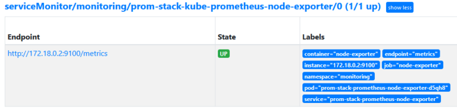

# Kubernetes 中的 Prometheus 指南

本文討論了在 Kubernetes 中安裝 Prometheus 的不同選項，然後使用 kube-prometheus-stack Helm chart詳細解釋了 Prometheus operator 的安裝。最後，我將介紹如何升級您的 Prometheus 堆棧以及您自己的警報規則和 Grafana 儀表板。

## 介紹

Prometheus 堆棧是一組流行的工具，用於實現系統的可觀察性。正如我在本 Observability 文章系列第一部分概述的學習指南中所解釋的那樣，Prometheus 堆棧可以在單個服務器上使用（例如與 Docker 一起使用），但旨在監控大型分佈式系統。 Prometheus 堆棧在 Kubernetes 中使用時會大放異彩，原因如下：

- Prometheus 帶有 Kubernetes 的動態服務發現 (Service Discovery)：在 Prometheus 配置文件的 `scrape_config` 部分中，您可以添加 `kubernetes_sd_config` 類型的目標，它指示 - Prometheus 聯繫 Kubernetes API 服務器以發現可用的節點、pod、服務等。 ，並從它們中提取指標。
- Kubernetes 的許多組件（例如 API 服務器）已經以 Prometheus 指標格式導出指標
- 在社群已經形成了一個大生態系統（kube-prometheus），同時也完善了 Kubernetes 和 Prometheus（以及相關組件，如 Alertmanager、Grafana 等）的集成。

!!! info "所需知識"
    要充分利用本文，您需要熟悉 Prometheus 和 Kubernetes：

    關於 Prometheus：首先需要對 Prometheus 要有很好的了解，包括它的架構、概念、如何配置、PromQL語言。

    關於 Kubernetes：你應該熟悉基本概念，包括 Helm 圖表和 Kubernetes operator。

在本文中，將討論不同的安裝選項，詳細解釋 Prometheus operator 的安裝，並總結如何升級 Prometheus 堆棧、警報規則和 Grafana 儀表板。

## Kubernetes 的 Prometheus 安裝選項

要在 Kubernetes 中啟動並運行 Prometheus，您有三個選擇：

1. 使用 Prometheus Helm chart 來安裝 Prometheus（以及一些相關組件，例如 Alertmanager，但不安裝 Grafana）。使用 Prometheus 原生文件（例如 `prometheus.yml` 或 `alert-rules.yml`）完成配置。

2. 使用 Helm chart 安裝 Prometheus operator，不使用任何 CR：不建議使用這種安裝方法，因為現在不推薦使用這種安裝方式，請改用選項 3。 Prometheus operator（它本身並沒有被棄用）是一個 Kubernetes operator，可讓您使用 CRD 處理供應和操作各種組件（例如 Prometheus 和 Alertmanager）。換句話說：配置是使用 Kubernetes 原生對象完成的，而不是 Prometheus 原生文件。 Prometheus operator 將它們即時轉換為 Alertmanager/Prometheus-native 配置格式。

3. 使用 kube-prometheus 包安裝 Prometheus Operator 以及 Grafana 和許多默認警報規則和儀表板。 [kube-prometheus](https://github.com/prometheus-operator/kube-prometheus) 是一個 GitHub 項目，其中包含一個巨大的最佳實踐庫和有關如何安裝 Prometheus operator 的說明，包括許多的默認配置。

選項 3 是推薦的方法，下一節將介紹更多細節。

下表顯示選項 1 和 3 的對比：

| |Prometheus Helm chart	|kube-prometheus-based Prometheus operator Helm chart|
|---|---------------------|-----------------------------------------|
|Configuration type	|Prometheus-native	|Kubernetes-native|
|Installed default components	|Prometheus<br>Alertmanager<br>Node exporter<br>kube-state-metrics	|Prometheus<br>Alertmanager<br>Node exporter<br>kube-state-metrics<br>Grafana|
|Comes with pre-installed library of alerting rules and dashboards	|❌	|✅|

如果您不清楚 [kube-state-metrics](https://github.com/kubernetes/kube-state-metrics)、[prometheus-adapter](https://github.com/kubernetes-sigs/prometheus-adapter) 和 [metrics-server](https://github.com/kubernetes-sigs/metrics-server) 項目以及它們與 Prometheus 的關係，請展開下面的框。

??? info "Metric-Server"

    Kubernetes 有自己的處理指標的方法，它獨立於 Prometheus，但也遠不如 Prometheus 強大。 Kubernetes SIG（特殊興趣組）之一定義了與指標相關的 API（參見此處），例如 Resource-metrics API（它公開了節點、Pod 和容器的 CPU 和 RAM 使用情況）和 Custom-metrics API（它公開您可以定義的任意指標）。 
    
    API 需要實際為它們服務的實現（參見實現列表）。一個常用的實現是 Kubernetes 集群中經常預裝的 **metrics-server**，但也可以使用 Helm chart 安裝（運行 `kubectl get pods -A | grep metrics-server` 以確定是否安裝）。安裝後，您可以使用 `kubectl top` 之類的命令，或使用水平 pod 自動縮放器 (HPA)，這需要運行的 metrics-server 來完成其工作。

    然而，metrics-server / metrics API 並不是為了做可觀察性。它只收集很少的指標（例如 CPU 和內存），並且只將最近的樣本歷史記錄保存在易失性內存中（它不是持久性的），也不提供警報。這就是為什麼除了 metrics-server 之外，您還應該使用上述推薦的安裝選項之一安裝 Prometheus。 Prometheus 持續存儲許多不同類型的指標，並提供警報。

    還有兩個在實踐中經常用到的項目：

    - **[kube-state-metrics](https://github.com/kubernetes/kube-state-metrics)** 項目是一個單獨的服務，它監視 Kubernetes API 服務器事件，並為安裝在集群中的自定義工作負載的狀態生成各種指標，例如Pod、部署等的狀態，以 Prometheus 格式在 `/metrics` 端點上公開它們，以便 Prometheus 抓取它們。您需要 kube-state-metrics，因為 Kubernetes 組件（例如 API 服務器）默認公開的指標是關於一般服務的狀態（例如服務請求的數量），而不是關於對象/工作負載的狀態他們存放在裡面。

    - **[prometheus-adapter](https://github.com/kubernetes-sigs/prometheus-adapter)**：如果你使用 HPA，並且resource-metrics（CPU/RAM）數據不適合判斷你的服務的 replica count 是否應該增加/減少，你也可以指示 HPA 使用自定義 metrics 來代替（使用上面提到的自定義指標 API）。 prometheus-adapter 是一個橋接組件，可以從正在運行的 Prometheus 實例提供這些自定義指標。它還可以（但不一定必須）替換尚未安裝度量服務器的集群上的度量​​服務器。


## Prometheus operator 詳解

使用 [Prometheus operator](https://github.com/prometheus-operator/prometheus-operator)（來自 [kube-prometheus](https://github.com/prometheus-operator/kube-prometheus) 包）是在 Kubernetes 中安裝和操作 Prometheus 的推薦方法。它將要求您了解特定於 Operator 的新概念，但優點是 Operator 簡化了許多任務。正如官方 GitHub 存儲庫所述：

- 簡化的部署配置：配置 Prometheus 的基礎知識，例如版本、持久性、保留策略和來自本機 Kubernetes 資源的副本。
- Prometheus 目標配置：根據熟悉的 Kubernetes 標籤查詢自動生成監控目標配置；無需學習 Prometheus 特定的配置語言。

最後一句，“無需學習 Prometheus 特定的配置語言”，簡直就是營銷廢話。您確實需要熟悉 Prometheus 和 Alertmanager 的大多數概念，否則您將無法調試問題。此外，配置的某些方面要求您逐字編寫 YAML 部分，這些部分通常是 `prometheus.yaml`、`alertmanager.yaml` 或 `alert-rules.yaml` 文件的一部分。

在以下小節中，我們將了解 Prometheus operator 的核心概念，如何將其安裝到您的集群中，如何配置對其他服務的監控，以及如何將自定義儀表板導入 Grafana。

### Prometheus operator 核心概念

與任何典型的 Kubernetes operator 一樣，Prometheus operator 會掃描您的集群以查找新的或更改的 CR（自定義資源），然後根據這些 CR 部署額外的 pod 或調整配置。最相關的 CRD 是：

- **Prometheus**：定義 Prometheus 部署（部署為 StatefulSet）。它提供了配置複製（HA 模式）、持久存儲和已部署 Prometheus 實例向其發送警報的警報管理器的選項。
- **Alertmanager**：定義一個 Alertmanager 部署（部署為 StatefulSet）。它提供了配置複製（HA 模式）和持久存儲的選項。
- **ServiceMonitor**：指定應該被 Prometheus 抓取的 Kubernetes 服務。 Prometheus operator 會自動為它們生成抓取配置，並配置 Prometheus 實例以使用它們。
- **PodMonitor**：類似於 ServiceMonitor，但用於 Kubernetes pod。
- **PrometheusRule**：定義 Prometheus 警報和/或記錄規則。 Operator 生成一個規則文件，並配置 Prometheus 實例以使用它。
- **AlertmanagerConfig**：指定 Alertmanager 配置的子部分，允許將警報路由到自定義接收器，並設置禁止規則。

只有在某些情況下，您才需要更多的 CRD。您可以在 prometheus-operator 的[設計文檔](https://github.com/prometheus-operator/prometheus-operator/blob/master/Documentation/design.md)中找到對 CRD 的詳盡、詳細的描述（絕對是推薦閱讀）。

### Installation of the operator

要安裝 kube-prometheus-stack，首先按照此處的說明添加 Helm chart 的存儲庫。創建一個 `custom-values.yaml` 文件，您可以在其中自定義許多不同的詳細信息（見下文）。最後，假設您的 kube 配置設置正確（為正確的集群使用正確的上下文），運行下列命令來安裝（或升級）它。

```bash
helm upgrade --install -f custom-values.yaml [RELEASE_NAME] -n monitoring --create-namespace prometheus-community/kube-prometheus-stack
```

與任何 Helm chart 一樣，您需要通過查看 `chart.yaml` 和 `values.yaml` 文件來研究它是如何工作的，以便在您的 `custom-values.yaml` 文件中覆蓋對您有意義的選項。以下是一些我覺得很有幫助的建議：

- 在 `kube-prometheus-stack values.yaml` 文件中，“grafana”、“kubeStateMetrics” 和 “nodeExporter” 鍵下方的配置選項沒有詳細記錄，因為這些是 `Chart.yaml` 文件中定義的子 chart。 `Chart.yaml` 文件指向找到這些 helm chart 的 GitHub 存儲庫，因此請參閱它們以了解這些選項的工作原理。

- 該 helm chart 會創建大量警報規則（請參閱 defaultRules），但不會創建默認的 Alertmanager 配置（指示存在哪些接收器以及如何將警報路由到接收器）。您仍然需要提供自己的 Alertmanager 配置，方法是創建一個包含 AlertmanagerConfig CR 的 yaml 文件（請參閱操作員設計文檔中的相應部分），或者在 `custom-values.yaml` 文件中的 alertmanager 部分提供配置。配置。

- 在 values.yaml 文件中，搜索以“additional...”開頭的配置選項，以了解您可以在 Helm chart 中設置哪些自定義選項。有趣的發現是：
    - additionalPrometheusRulesMap
    - prometheus.prometheusSpec.additionalScrapeConfigs
    - prometheus.prometheusSpec.additionalAlertManagerConfigs
    - 從這些選項的名稱（和內聯文檔）來看，如何使用它們應該很明顯。

- 您應該調整 Prometheus 和 Alertmanager 使用的持久存儲設。雖然幾 GB 的存儲空間對於 Alertmanager（它不會存儲太多數據）來說就足夠了，但對於 Prometheus 來說事情變得更加複雜，因為存儲需求取決於保留期和抓取樣本的數量（每個時間單位），這是不同的對於每個系統。有關指針，請參見此處。關於 Grafana：kube-prometheus-stack Helm chart 故意將 Grafana 視為無狀態組件，即使它通常是有狀態運行的，例如存儲用戶或儀表板。原因是所有配置數據都應該存儲在（純文本）文件中。這已經是 Prometheus 和 Alertmanager 的默認設置，Helm chart也通過不將 grafana.persistence.enabled 設置為 true （默認情況下為 false，請參見此處）將其強制執行到 Grafana。
    - 對於 Alertmanager，調整選項 `alertmanager.alertmanagerSpec.retention` 和 `alertmanager.alertmanagerSpec.storage`
    - 對於 Prometheus，調整選項 `prometheus.prometheusSpec.retention` 和 `prometheus.prometheusSpec.storageSpec`

- 限制資源請求和限制總是一個好主意，尤其是對於具有預定義資源配額的 Kubernetes 集群。設置 `prometheus.prometheusSpec.resources`、`alertmanager.alertmanagerSpec.resources`、`grafana.resources`、`grafana.sidecar.resources`、`nodeExporter.resources` 和 `kubeStateMetrics.resources`。

- Prometheus 的全自動高可用性仍然在 Prometheus 運營團隊的路線圖上。他們擴展 Prometheus 的關鍵概念是分片和聯合。目前，您可以自己進行分片（將每個 Prometheus CR 限制為僅抓取某些目標，例如使用 serviceMonitorSelector 選項），或者（另外）使用 kube-prometheus-stack Helm chart 的分片功能，但請注意這涉及的複雜性。

- 將 `prometheus.prometheusSpec.serviceMonitorSelectorNilUsesHelmValues` 設置為 `false`。否則，Prometheus operator 將僅檢測作為 kube-prometheus-stack Helm chart 的一部分安裝的那些 ServiceMonitor CR（具有“發布：[RELEASE NAME]”標籤），並且不會檢測來自其他來源的其他 ServiceMonitor CR，有不同的標籤。據推測，選擇默認值 (true) 是為了限制 Prometheus 安裝的資源使用。

- 將 `grafana.sidecar.datasources.searchNamespace` 設置為 ALL，這樣 Grafana 將在每個命名空間中獲取包含儀表板的 ConfigMap。否則（作為默認行為）Grafana 僅檢測與 Grafana 本身位於同一命名空間的 ConfigMap。有關 Grafana 儀表板的更多詳細信息，請參見下文。

### 配置 ServiceMonitors

如上所述，ServiceMonitor CR 告訴 Prometheus 根據標籤選擇器抓取特定的 Kubernetes 服務。除了設計文檔之外，API 定義是了解更多關於 ServiceMonitor CRD 的寶貴資源。

默認情況下，==ServiceMonitor CR 必須與它所引用的 Service 的 Endpoints 位於相同的 Kubernetes 命名空間中==，除非您在 CR 中定義 `.spec.namespaceSelector.any = true`。

檢查集群中有哪些預先存在的服務，這些服務與您的應用程序沒有直接關係，並為它們創建 ServiceMonitor CR，通常是有意義的。典型示例包括 Ingress 控制器或 GitOps 控制器，例如 ArgoCD。

這是 Traefik Ingress 控制器的 ServiceMonitor 示例：

```yaml
apiVersion: monitoring.coreos.com/v1
kind: ServiceMonitor
metadata:
  name: traefik-monitor
  labels:
    app: traefik
spec:
  selector:
    matchLabels:
      app: traefik
  endpoints:
  - port: metrics
```

### 設置 Grafana 儀表板

要將自定義儀表板導入 Grafana，kube-prometheus-stack 使用 `ConfigMaps`。這背後的機制是 Grafana 的邊車容器。在 `values.yaml` 中，默認啟用 `grafana.sidecar`。這會導致在 Grafana Pod 中安裝 k8s-sidecar 容器，該容器會不斷查找帶有“grafana_dashboard:'1'”等標籤的 ConfigMap。這些 ConfigMap 需要包含儀表板 json 作為數據值。檢測到後，k8s-sidecar 會將該 json 作為文件掛載到 Grafana 容器中，從而導致 Grafana 的配置機制獲取它。

要將儀表板放入集群，請執行以下步驟：

- 首先，您需要一個 json 格式的儀表板（例如這個）。通常，您可以通過在 Grafana 的 Web UI 中以交互方式構建它，然後將其導出為文件（文檔）來獲得此儀表板。
- 將 JSON 文件轉換為 ConfigMap，例如通過:
    ```bash
    kubectl create cm config-map-name --from-file dashboard.json -o yaml --dry-run > config-map.yaml
    ```
- 使用文本編輯器編輯 `config-map.yaml`：添加標籤 `grafana_dashboard`，值為“1”
- 將配置映射應用到您的集群（`kubectl apply -f config-map.yaml -n <namespace>`）
- 如果 Grafana 沒有自動拾取儀表板，您可能需要重新啟動 Grafana。

### 安裝和抓取額外的指標 Exporter

獲取在 Kubernetes 中監控的服務（例如數據庫、消息代理等）始終涉及以下步驟：

- 選擇並部署合適的 **指標 Exporter**（使用 Kubernetes 機制，例如 Deployment），除非該服務已經帶有內置 `/metrics` 端點
- 編寫一個 **ServiceMonitor** 來指示 Prometheus 抓取該Exporter導出的指標
- 為該指標 Exporter 編寫告警規則

幸運的是，許多常用服務的 Helm chart 已經具有為您完成所有這些步驟的選項。一個示例是 [Bitnami Postgres Helm chart](https://github.com/bitnami/charts/tree/master/bitnami/postgresql)，其中將 `metrics.enabled、metrics.serviceMonitor.enabled` 和 `prometheusRule.enabled` 設置為 `true` 就完成相關的設定了。

對於許多其他常見的指標 Exporter（例如 Blackbox exporter、redis、rabbitmq 或 Pushgateway），您可以在[此處](https://github.com/prometheus-community/helm-charts/tree/main/charts)找到支持的 Helm chart。

### 關於 Prometheus `target` 標籤

Target 標籤由 Prometheus 在抓取指標資料時附加上去的。在 Kubernetes 之外使用 Prometheus 時，Prometheus 會自動添加目標標籤 `job="..."` 和 `instance=".​​.."`。

但是，當在 Kubernetes 中運行 Prometheus 時，會添加其他幾個標籤，如下面的屏幕截圖所示，這是我使用 Prometheus Web UI（狀態 -> 目標）拍攝的：



如果您想為從設置了 ServiceMonitor 的服務中抓取的所有指標添加更多（靜態）目標標籤，您有兩種選擇：

- **更新 Service 和 ServiceMonitor**：在 Service 的 `metadata.labels` 下添加靜態標籤（`somekey: somevalue`）。在您的 ServiceMonitor 中，將標籤鍵添加到 .`spec.targetLabels`，它是一個陣列。有關示例，請參見[此處](https://stackoverflow.com/a/64561821/947047)。

- **僅更新 ServiceMonitor**: 使用 Prometheus 重新標記功能，例如如[此處](https://stackoverflow.com/questions/63852779/how-to-set-a-label-in-service-monitor-so-it-appears-in-prometheus-metrics)所示。

## 升級你的監控堆棧

大多數教程忘記提到只運行一次 `helm install` 命令是一個壞主意。您應該不時以自動方式更新您的監控堆棧。與像 `Helmfile` 或 `Helmsman` 等代碼工具一樣的配置管理相結合，`dependabot` 或 `Renovate bot` 等工具提供了很大幫助。您可以在我之前的文章中找到 `Renovate bot` 的詳細介紹。使用這些機器人定期檢查新的 kube-prometheus-stack Helm chart，並讓它們自動將 Helm chart的次要版本更新應用到您的集群/Git 存儲庫。

但是，每當有新的主要版本的圖表時，您都應該避免全自動更新。相反，讓機器人創建一個合併/拉取請求（通知您），然後首先手動檢查 [Helm chart 升級](https://github.com/prometheus-community/helm-charts/tree/main/charts/kube-prometheus-stack#upgrading-chart)部分以了解潛在的警告。

查看[這篇文章](https://www.augmentedmind.de/2021/12/26/gitops-with-gitlab-argocd-renovate/)，了解如何使用 GitOps 實現監控堆棧的自動升級。

## 更新警報規則和儀表板

每當您調整包含警報規則（或 Grafana 儀表板）的文件時，您都需要一種自動將它們部署到集群的機制：

- 更新 alerting rules:
    - 選項 1 – 推送（使用 Helm）：如果您在 `custom-values.yaml` 文件中（在額外的 PrometheusRulesMap 中）提供了所有警報規則，則將它們提交給 Git 並在您的 CI/CD 管道中構建一個作業，該管道重新運行 helm kube-prometheus-stack Helm chart 的升級命令（這是“CI Ops”方法）。
    - 選項 2 – 拉取（使用 GitOps）：如我之前的文章中所述，您可以運行一個 GitOps 操作員（ArgoCD 等），它會定期從您的 Git 存儲庫中拉取更改。將警報規則放入 yaml 文件中，作為 PrometheusRule CR（文件內容類似於 kube-prometheus-stack Helm 圖表將創建的內容，請參見此處）並將它們存儲在 Git 中。

- 更新儀表板: 這與更新警報規則完全相同。唯一的區別是您不能直接在 `custom-values.yaml` 文件中指定其他儀表板。您必須在 CI/CD 作業中推送儀表板配置 yaml 文件（使用 kubectl apply -f ... 命令），或者使用上面選項 2 中描述的 GitOps 方法。

## 結論

一開始，讓整個 Prometheus 堆棧在 Kubernetes 集群中運行確實需要一些時間。您必須習慣 Prometheus operator 的概念，而不是手動編寫配置文件。從好的方面來說，Prometheus operator 與 kube-prometheus 項目提供的模板相結合，可以減輕您的負擔。

如果您遇到問題，我建議您做兩件事：

- 查看 GitHub 上的 Prometheus operator 文檔文件
- 通過查看它在集群中創建的 CR（Prometheus、Alertmanager 等），了解 kube-prometheus-stack Helm chart 如何配置默認值。