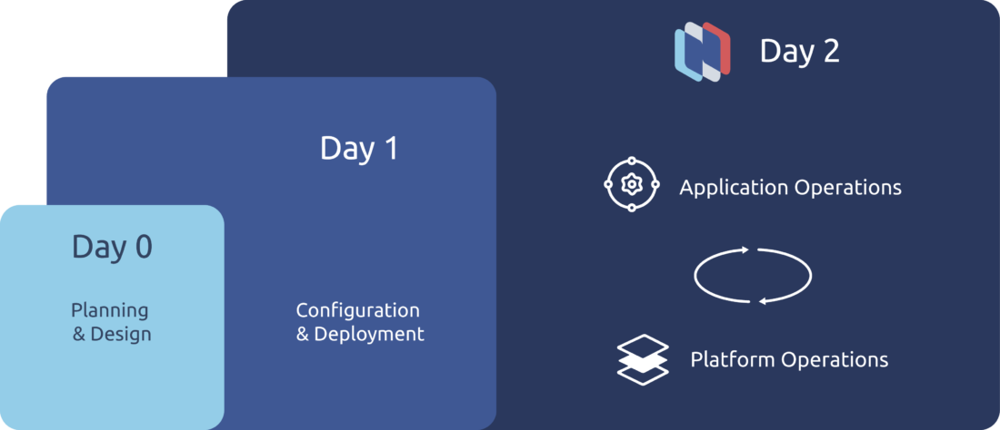

# 什麼是 Kubernetes  Day 2?

原文: [What is Day 2 Kubernetes?](https://nirmata.com/2020/06/15/what-is-day-2-kubernetes/)

當組織遷移到 Kubernetes 時，最明顯、最緊迫的挑戰與 Day 0 和 Day 1 有關——`設計`和`部署`。推動 Kubernetes 的動力通常是希望提高開發人員的敏捷性、提高開發速度，並通過讓開發人員訪問自助服務配置來消​​除開發過程中的摩擦。鑑於這些動機，重點往往放在開發階段也就不足為奇了。

例如，許多組織確實看到了速度和敏捷性的顯著提高，從每月部署轉變為每日部署。但是應用程序的生命週期不會在部署時結束。任何應用程序最長的生命週期階段是需要對其進行監控、升級和保護的生產階段。這些 Day 2 Kubernetes 操作對於 Kubernetes 的持續成功至關重要，但在急於部署時可能會被忽略。

忽略 Day 2 最終會毀掉 Kubernetes 計劃，阻止組織利用敏捷性和加速雲原生產品。特別是對於企業環境中的任務關鍵型應用程序，可靠性、可用性、風險管理和監控不是可選的。事件太多，Kubernetes 實驗很可能被取消。

遷移到 Kubernetes 也不是憑空而來的。它通常伴隨著向混合和多雲環境的轉變；通常每個環境都有略微不同的配置要求和操作需求。 Kubernetes 本身很複雜，並且在規模上可能涉及管理分佈在多個雲中的許多集群。此外，Kubernetes 並不是單獨使用的。大多數公司使用數十種附加工具來管理從 CI/CD 管道到監控的所有內容。這可能導致儀表板的激增，從而使操作故事進一步複雜化，並且難以輕鬆了解系統的健康狀況。

## Day 2 挑戰 - Kubernetes Operations

以下是公司在使用 Kubernetes 時遇到的一些最常見的 Day2 陷阱。

- **Health and Availability** - 特別是對於任務關鍵型應用程序，滿足正常運行時間 SLA 的能力既重要又具有挑戰性，尤其是隨著複雜性的增加和組織努力構建確保高可用性所需的特定於 Kubernetes 的技能。
- **Monitoring and logging** - 組織需要能夠跨集群和工作負載工作的監控和日誌工具，以便從 Kubernetes 部署中獲取他們需要的信息，而傳統的監控工具通常無法做到這一點。
- **CI/CD integration** - 數量驚人的 Kubernetes 新用戶在弄清楚如何為應用程序投入生產鋪平道路時遇到了困難。與 DevOps 工作流和 CI/CD 的集成對於獲得開發人員敏捷性和組織從 Kubernetes 中尋找的速度至關重要。
- **Platform management** - 在企業環境中，將集群 add-ons 作為共享平台服務提供和管理，包括設置負載平衡，是一項挑戰。除非有工具允許開發人員自己管理這個過程，否則它也可能成為開發工作流程中的一個摩擦點。
- **安全和治理** - 組織需要一種方法來確保對生產中的任何工作負載實施安全最佳實踐和組織治理策略。 Kubernetes 的分佈式特性——以及它通常配合使用的快速、DevOps 風格的交付方法——使得這具有挑戰性，除非 guardrails 設計到位並且中央平台團隊同時具有可見性和控制權。

Kubernetes Day 2 管理運營的核心挑戰歸結為管理複雜性。運營團隊需要配置的旋鈕太多，使用的工具太多，無法在沒有集成平台幫助的情況下有效確保正確配置、理解日誌並為開發人員構建自助服務能力。

## 馴服操作複雜性

隨著規模的擴大，雲原生系統變得更加複雜。多個集群、工具、合規框架、業務部門和雲環境的組合很快就會變得過於復雜，無法進行可視化或管理。以下是組織在 Kubernetes Day2 運營中取得成功所需的一些組件。

- **A single pane of glass platform** - 運營團隊需要能夠通過一個統一的儀表板在一個地方可視化整個系統。需要將隱藏在數十種不同工具中的信息集中到一個地方，以便團隊可以輕鬆查看不同信號之間的關係，並在幾分鐘內了解系統的總體健康狀況。
- **Complete separation of concerns** - 應用程序開發人員應該能夠盡可能地自助服務，依靠一小群平台工程師來管理底層操作系統。
- **Centralized policy controls** - 運營團隊需要一種集中控制集群和工作負載策略的方法，以確保根據組織圍繞安全性、合規性和其他最佳實踐的策略配置 Kubernetes 和容器。如果沒有集中管理策略的能力，錯誤幾乎是不可避免的。
- **Kubernetes-native monitoring and logging for security and availability** - 中央管理面板必須包含強大的監控功能，這些功能旨在在雲原生環境中工作。運營商需要能夠監控潛在的安全漏洞以及性能和可用性問題。
- **Resource utilization tools** - 許多組織希望通過遷移到雲原生來減少其 IT 支出——許多人驚訝地發現遷移到雲並不總能降低成本。Kubernetes Day2 管理運營必須包括幫助公司了解其成本、優化資源利用率並最終降低總體成本的工具。

## 更好的 Kubernetes Day2

開始考慮 Day2 的運營永遠不會太早。組織在設計和實施階段做出的選擇在 Day2 會產生巨大的影響。不僅監控工具和集中控制應在部署應用程序之前就位，而且為應用程序開發人員建立正確的護欄都可以減少開發摩擦同時還簡化了未來的運營。

