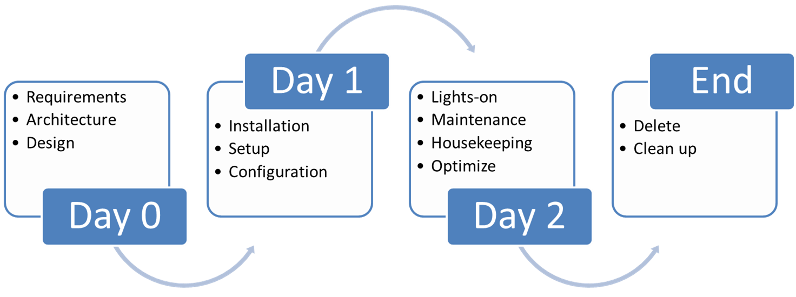

# Day2 Operation 的定義

原文: [Defining Day-2 Operations](https://dzone.com/articles/defining-day-2-operations)

Day2 Operation 是系統為組織生成結果的地方。因此，在 Day2 Operation 中不斷尋求改進，以最大限度地提高收益。

Day2 Operation 不一定是指第 2 天的操作。很抱歉從字義的角度讓人產生誤解，但讓我們澄清一下。一旦“某物”投入運營，“Day2 operation”就是剩餘的時間段，直到該“某物”未被殺死或被“其他東西”取代。

當我們查看業務流程、應用程序或 IT 基礎架構生命週期中的各個階段時，有些人喜歡將它們描述為回收過程。我相信這是因為人們傾向於使用“應用程序的生命週期”這個詞，並且不知何故陷入了相信圖片必須回到開頭的想法。各個階段通常會隨著時間向前推進，不會帶你回到起點。

現在讓我們將組織或實體所需的東西稱為“X”——這可以是業務流程、應用程序或某些 IT 基礎設施。從技術上講，每當有人設想 X 時，總會有一個起點——讓我們稱之為“Day0”（Geek Speak：這是高中物理的遺留物，起點通常是 T-Zero）。 Day0 可能不是一天：它是為 X 提出並記錄一整套需求所需的時間段。這些活動可能包括高級設計、記錄和向某人銷售利益、編寫業務案例，尋求資金等。

該過程的下一步是構建和設置它。Day1 包括從詳細（或底層）設計開始到構建、測試、提出任何所需流程和人員以支持 X 以造福於組織的所有活動。在許多情況下，這裡可能還涉及一些採購活動。一旦安裝、設置、配置和批准（“很好”）X 被認為是“活動的”或“營業的”。

從這一點開始，直到 X 退役、被殺死、退役或被替換，我們有 Day2 操作。這包括一組活動，以保持 X 運行、照顧和餵養 X，使其以最佳方式運行，確保 X 運行並提供符合原始意圖和期望的結果。監控利用率、確保可用性和成本優化添加到通常的內務活動中，以保持 X 以“最佳”方式執行。

隨著我們周圍世界的需求發生變化，由組織決定是否將始終需要的對 X 的調整或升級稱為全面檢修或僅升級。如果這是一次全面檢修，可以假設 X 已退役並被新系統 Y 取代。如果不再需要 X，則 X 的 day2 結束。如果新的 X 只是對之前 X 的增量改進，那麼 day2 將繼續並包含所有活動以增量改進 X。

一個快速的旁注：“不可變系統”的概念傾向於通過不允許更改但始終部署新系統來提高可用性，這與上述不衝突。管理不可變系統的過程成為 day2 的一部分。

對於大多數企業來說，day2 本質上是重複的。但這是系統為組織產生結果的地方。因此，在 day2 中不斷尋求改進應該是很自然的，這樣可以帶來最大的收益。