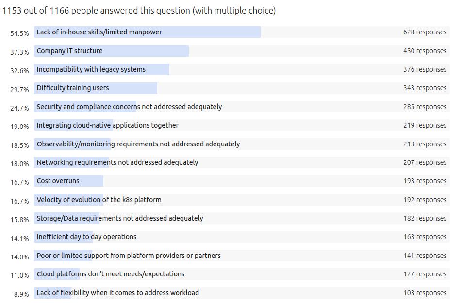

# Kubernes 運營 - Day2 的挑戰

原文: [Why Is Everyone Ignoring the Day 2 Kubernetes Problem?](https://thenewstack.io/why-is-everyone-ignoring-the-day-2-kubernetes-problem/)

一個組織開始採用雲原生技術並實施 Kubernetes。然後事情開始變得……有趣。

集群倍增。變化激增。訪問需求堆積如山。雲成本飆升。

“我如何管理對集群的訪問？我將在所有環境中使用的策略模型是什麼？我的生產集群的標準藍圖中必須始終包含哪些附加組件？我部署屬於多個業務部門的應用程序的策略是什麼？我必須盡快升級所有集群，因為我已經全面落後了三個版本——我該怎麼做？”

這些問題都可以歸類在“Day 2”的標題下。Day2 對於站點可靠性工程師 (SRE) 和 IT 運營工程師來說可能意味著永遠的頭痛。

## 為什麼 Day 2 如此痛苦？

Budhani 說，疼痛有許多根本原因。首先是技能差距問題——Kubernetes 時代已經過去 8 年，但仍然沒有足夠多的工程師對 K8s 生態系統有足夠的了解。

根據 Canonical 去年 6 月發布的一項調查，**缺乏內部技能** 是公司在採用容器和 Kubernetes 時遇到的最大挑戰。

- [Kubernetes and cloud native operations report 2021](https://juju.is/cloud-native-kubernetes-usage-report-2021#what-are-the-top-challenges-kubernetes-brings-to-businesses)

Kubernetes 給企業帶來的最大挑戰是什麼？

在遷移到/使用 Kubernetes 和容器時，您面臨的最大挑戰是什麼？

許多組織正在使用或試驗 Kubernetes，但這些結果有助於說明使用尚未完全滲透。近 55% 的受訪者認為他們缺乏 Kubernetes 技能和內部專業知識。

這導致了調整平台以實現最佳安全性、可觀察性、網絡和存儲配置的挑戰、培訓用戶的挑戰 (29.7%) 以及公司 IT 文化 (37%) 或單體架構造成的阻力 33%。

我發現缺乏技能的答案特別有趣。我相信人們低估了過去五年中技術飛躍的巨大程度：Kubernetes、雲、CICD、DevOps、GitOps、ChatOps。變化太大了。對於很多人來說，在繼續工作的同時學習所有這些新東西真的很困難。缺乏技能和培訓人力是目前的一個大問題。而且我認為真正學習的唯一方法是實踐；選擇一條道路並嘗試新技術。

然後是雲原生生態系統中用於運營 Kubernetes 的工具的大雜燴，每個工具也經常需要升級和關注。

“所有這些工具都遵循自己的生命週期。每隔一段時間，這些工具中的每一個都需要在所有集群中進行更新。 “因此，您必須管理 Kubernetes 集群的生命週期、這些工具的生命週期、應用程序的生命週期、集中策略和訪問管理，因為新的內部團隊部署了更多應用程序、每個應用程序的災難恢復策略、收費- 進版退版策略等等。”

“Day2 是關於需要做些什麼來保持綠燈是亮的，而底層技術都需要以全自動方式為其治理、運營安全性和可見性定制策略。”

一個首要問題是，沒有足夠多的企業使用他所謂的“治理自動化”——雲原生架構所承諾的開發人員的速度和免於不必要的辛勤工作，再加上組織需要控制對關鍵數據的訪問的製衡、應用程序和基礎設施，並控制雲成本。

## Kubernetes Day2 Ops 要作那些事?

在持續的基礎上，管理您的 Kubernetes 操作需要跟踪許多事情。對於需要部署到多雲或混合環境的組織而言，這種複雜性以及密切關注所有移動部件的挑戰變得更加複雜。事實上，對處理這種複雜性的恐懼可能會阻止組織首先轉向多雲解決方案，並可能導致供應商鎖定，從而阻止組織實現其業務目標。

但是，無論您在哪裡部署應用程序，需要注意的關鍵領域都是一樣的。這是 Kubernetes Ops 的五個支柱：

### Cluster Standardization and Lifecycle Management

當你構建它時，你知道你的集群今天是什麼樣子。 “但你怎麼知道一個月後的樣子？”他指出，即使您不再接觸集群，“具有足夠高權限的已安裝附加組件最終可能會在您不知情的情況下更改基礎配置。”

您需要密切關注集群的整個生命週期，包括它如何受到與它交互的其他工具和用戶的影響。為在您的組織中創建和更新集群設置標準，同時確保一組經過批准的附加組件始終在您的集群隊列中運行，有助於簡化在發生異常時識別異常的 Day2 任務。

### Secure Access and Isolation

在 Kubernetes 的幫助下完全或部分在雲上運行的分佈式網絡需要一種全新的方法來實現運營商/開發人員的訪問和安全性。無處不在的網絡很容易受到任何地方的攻擊。

零信任安全方法已在已遷移或正在遷移到雲的組織中取得進展。零信任拒絕舊的“城堡和護城河”安全模型，而是使用精細的自動身份驗證和授權權限來保護重要的基礎設施和數據，無論它們位於何處。

但是，在訪問控制方面，許多（如果不是大多數）組織仍在努力解決基礎問題。在 strongDM 1 月份發布的一項調查中，80% 的參與者表示他們的組織今年將致力於訪問管理；只有 30% 的人表示他們的計劃中有一個零信任項目。 （在同一研究中，三分之一的受訪者稱 Kubernetes 是他們使用的最具挑戰性的技術。）

保護對 Kubernetes API 服務器的訪問有助於防止未經授權的探測。當某個特定的 Kubernetes 集群出現問題時——例如注入惡意軟件——需要隔離該集群或微服務以避免問題蔓延。

### Observability and Visibility

Kubernetes 集群的管理員需要對所有環境有足夠的可見性，以及必要的警報和監控級別，以便在問題出現時對其進行分類。 Rafay 的 Kubernetes Operations Platform 等解決方案提供了開箱即用的這些功能。訪問長期指標和警報數據可以真正幫助 SRE 和 IT Ops 了解其集群艦隊的趨勢，以幫助進行規劃和預測。

### Governance and Compliance

當然，Kubernetes 是開源的——完全開放，就像狂野的西部一樣。使用它的公司通常難以添加關鍵的治理和合規性功能，例如日誌記錄、漂移檢測和可審計性。

集中的可執行集群配置模型有助於實現企業範圍的集群標準化。有一種方法來確保部署所有強制的安全和操作附加組件有助於確保符合企業策略。此外，有一種方法可以檢測集群何時偏離企業策略，並在出現問題時對其進行補救，這也是一項關鍵要求。

Rafay 的 Kubernetes 運營平台提供集群藍圖、附加版本控制、策略實施和違規報告等功能，以及可以阻止對集群範圍資源（如入口控制器、運行時安全工具等）的更改的漂移檢測邏輯，以及集群活動的端到端審計跟踪。

### Third-Party Integrations and Maintenance

使支持現代（基於 Kubernetes）基礎設施的所有服務和工具無縫運行並協同工作可能會很棘手。主要的雲提供商通常有一套工具來幫助管理 Kubernetes——但如果你走出該雲提供商的領域，這些工具並不總是能很好地轉化，也許是為了部署到多個雲、在本地環境中，或者在某些情況下，在邊緣。

這就像一個拼圖，需要不斷地組合在一起，即使每個拼圖都有自己的生命週期需要管理。開源工具和組件可能會帶來自己的問題：例如 2021 年末在 Log4j 中發現的漏洞。或者只是每季度更新您的 Kubernetes 本身版本所涉及的辛勞。

過時的工具可能會導致計劃外停機，從而直接影響最終客戶，最終影響業務。

## 構建 K8s 平台的持續成本

Kubernetes Day2 的負擔不僅僅是雲支出。運營和維護 Kubernetes 還可以讓團隊成員遠離直接為公司帶來收入的產品和應用程序。

一些可能增加 Day2 頭痛的事情源於 **缺乏標準化**。當具有獨特配置的集群失敗時，它們可能包括複雜的分類和支持成本，或者由控制器和集群之間的自定義訪問和聯網導致的安全風險。缺乏 kubectl 訪問控制也會使業務面臨合規和治理風險。

“管理者有時不願意在 Kubernetes 之旅的早期提出 Day2 的問題，因為“他們不想打亂開發人員的心態。”

這種沉默是錯誤的：開發人員已經知道他們的工作量因為 Kubernetes Day 2 的問題而失去平衡。

當我與實際的開發人員交談時，他們會說，"我不知道為什麼我要編寫 Helm chart 而不是我的應用程序"。 “是的，我想試驗一下 Kubernetes。我有點喜歡這項新技術。當我最初接觸它時，我喜歡學習它。但是，我的上帝，我還有工作要做。”

他說，C 級主管、DevOps 經理和開發人員都想要同樣的東西：一種交付更多更好代碼並為業務創造更多收入的有效方式。但是，他指出，“他們說的不是同一種語言。在此過程中，這些大型企業的交付成果遠遠落後於計劃。”

## 解決 Kubernetes Day2 問題

為了讓您的團隊和您的組織為監督基於 Kubernetes 構建的雲架構的長期承諾做好準備，準確了解您的組織正在從事的工作非常重要。

在你開始一個包含運行 Kubernetes 的雲原生項目之前，請考慮一下你的組織正在努力完成什麼。

首席信息官和其他高級管理人員“過去常常挑戰他們的團隊做更多的事情，進行更多的實驗。現在問題應該是，“你為什麼要試驗 Kubernetes 附加組件？向我證明，在進行實驗之前，您需要構建一些超出可以購買現成的東西的東西。”

K8s 標準化的真正成本包括定價模型、實施和維護。在要問的問題中：

- 您將如何確定哪些工具最適合您的用例？
- 你將如何跟上開源的變化？
- 是否會繼續投資於工具集成？
- 當出現互操作性問題和操作問題時，誰來解決它們？
- 您能否以足夠快的速度僱傭足夠多具有云原生技能的人員——或者培訓現有的團隊成員？

最重要的是，考慮與其他也跨越鴻溝並實施 Kubernetes 的組織交談。

首先，了解其他人是如何做事的——因為這會讓你了解這個問題有多難或多簡單。 “從失敗中學習很棒，但它是以時間為代價的。當您可以向同行學習時，為什麼要走這條路？ Kubernetes 社區的美妙之處在於人們非常願意分享他們的經驗和意見。”

到 2022 年，你並不是唯一一家致力於 Kubernetes 的公司。許多其他公司已經經歷或正在經歷這一旅程。有資源可以做到這一點。尋找他們。”