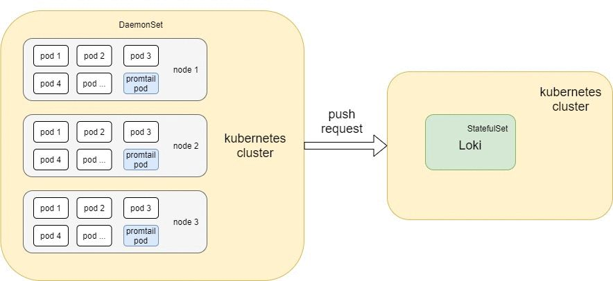
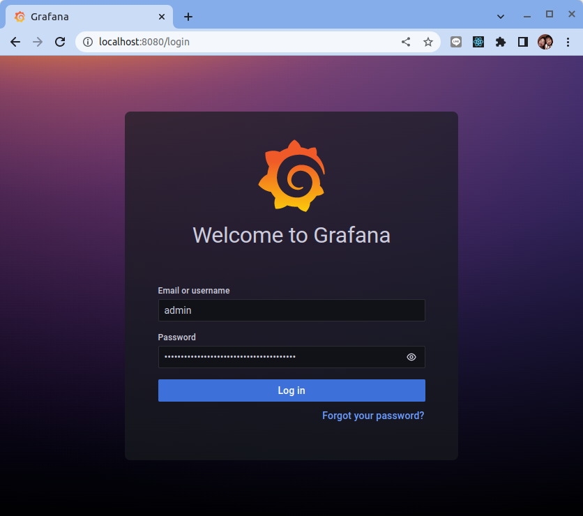
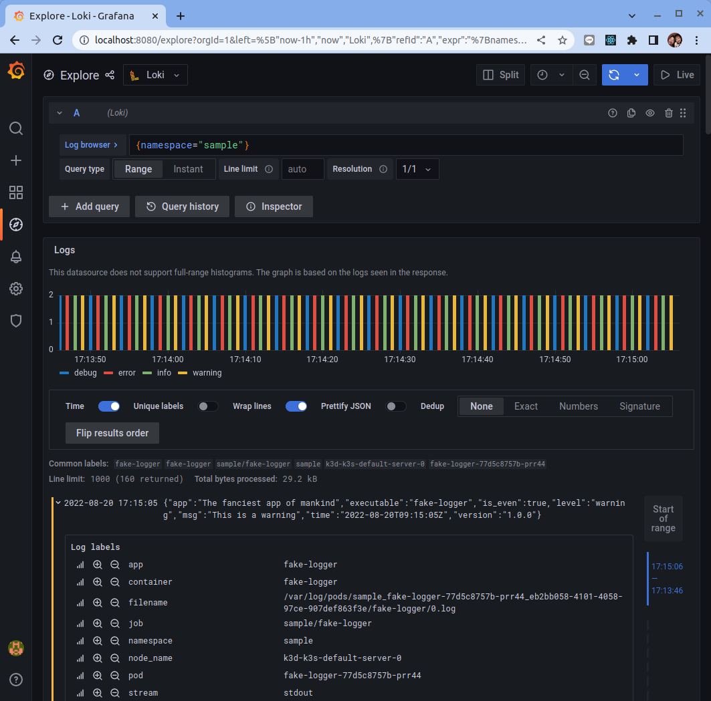
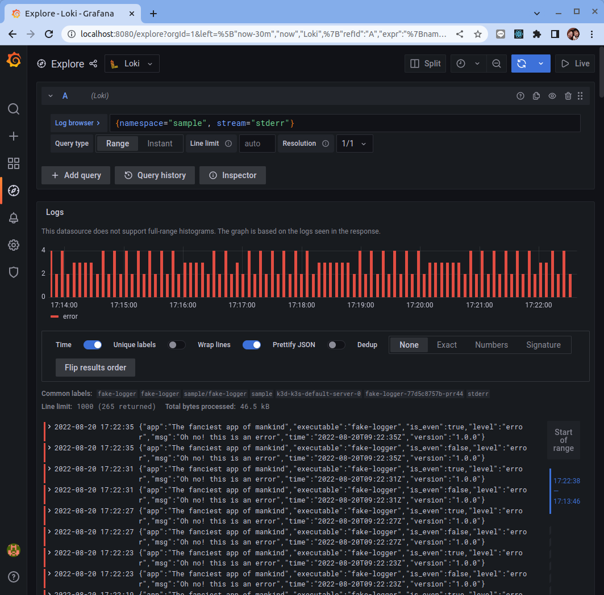
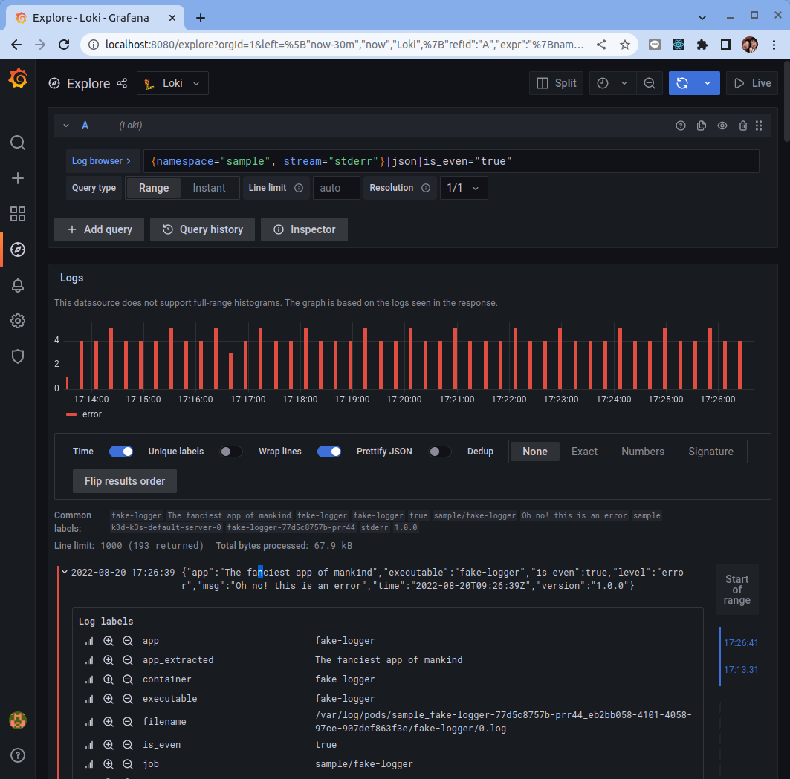
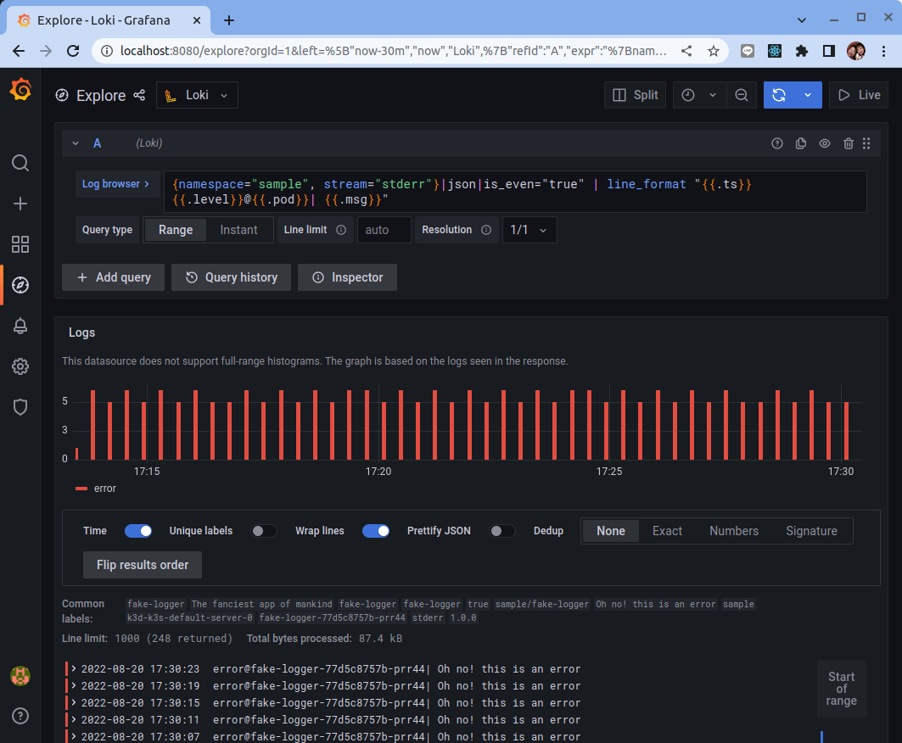
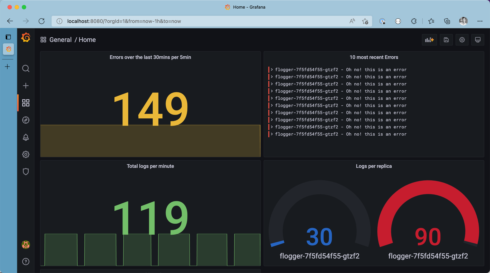

# 使用 Loki 做為 Kubernetes 的日誌聚合亓件

原文: https://www.thorsten-hans.com/logging-in-kubernetes-with-loki-and-plg-stack/


在雲原生環境中，可觀察性是一個巨大的話題。必須收集、理解和調查來自不同來源的數百萬條日誌，以了解不同應用程序運行在 Kubernetes 平台時發生的情況。

日誌堆棧（如 PLG）的目標就是想要解決這些問題，並且通常由具有專門職責的多個應用程序組成。在每個日誌堆棧的核心，日誌聚合系統負責索引、存儲和公開日誌消息的查詢接口。

[Loki 由 Grafana 團隊構建](https://grafana.com/oss/loki/)，是一個受 Prometheus 高度啟發的 **可擴展日誌聚合系統**。 Loki 越來越受歡迎，因為它易於操作和檢查資源分配 - 特別是如果您將它其它日誌聚合系統(ELK)進行比較。本文將介紹 PLG 堆棧，它由 Promtail、Loki 和 Grafana 組成。


## 探索 PLG 堆棧

在我們開始在 Kubernetes 集群上安裝 PLG 堆棧之前，讓我們快速回顧一下 PLG 的三個主要組件。一旦我們對每個組件的主要職責有了基本的了解，我們就可以開始在一個閃亮的新 Kubernetes 集群上安裝 PLG。

### 什麼是 Promtail

[Promtail](https://grafana.com/docs/loki/latest/clients/promtail/) 負責將數據引入 Loki。它以 `DaemonSet` 的形式實現，這意味著 Promtail 實例運行在 Kubernetes 集群的每個節點上。 `DaemonSet` 定期從在該特定 Kubernetes 節點上運行的所有容器（`stdout` 和 `stderr`）讀取日誌。除了本地化和讀取日誌流之外，Promtail 還可以在將日誌推送到 Loki 之前將標籤附加到日誌。

### 什麼是 Loki

[Loki](https://grafana.com/oss/loki/) 是 PLG 堆棧的核心。它是針對日誌優化的數據存儲。與其他日誌聚合系統相比，Loki 本身並不索引日誌消息。相反，它索引分配給每個日誌的標籤。我們可以使用 LogQL 查詢存儲在 Loki 中的日誌，[LogQL](https://grafana.com/docs/loki/latest/logql/) 是一種受 PromQL 啟發的查詢語言。使用 LogQL，我們不僅可以在幾秒鐘內瀏覽數百萬條日誌。我們還可以輕鬆地從日誌中提取指標。

### 什麼是 Grafana

[Grafana](https://grafana.com/oss/grafana/) 用於可視化存儲在 Loki 中的日誌。 Loki 與 Grafana 無縫集成。我們可以根據應用程序日誌和從該日誌計算的指標在 Grafana 中構建單獨的儀表板。

## 範例環境

### 設置 Kubernetes 集群

使用以下命令來創建 Kubernetes 集群。 (詳細說明見: [使用 K3D 設置 Kubernetes 集群](../../../01-getting-started/learning-env/k3d/k3s-kubernetes-cluster-setup-with-k3d.md))

```bash
$ k3d cluster create [NAME]
```

由於它在第一次安裝時會下載大約 150–200MB 的 docker 映像，因此安裝時間可能需要一些時間，具體取決於您的互聯網速度，但除非您刪除這些映像，否則您的下一次集群安裝將花費更少的時間。


```bash
INFO[0000] Prep: Network                                
INFO[0000] Created network 'k3d-k3s-default'            
INFO[0000] Created image volume k3d-k3s-default-images  
INFO[0000] Starting new tools node...                   
INFO[0000] Starting Node 'k3d-k3s-default-tools'        
INFO[0001] Creating node 'k3d-k3s-default-server-0'     
INFO[0001] Creating LoadBalancer 'k3d-k3s-default-serverlb' 
INFO[0001] Using the k3d-tools node to gather environment information 
INFO[0001] HostIP: using network gateway 172.27.0.1 address 
INFO[0001] Starting cluster 'k3s-default'               
INFO[0001] Starting servers...                          
INFO[0001] Starting Node 'k3d-k3s-default-server-0'     
INFO[0005] All agents already running.                  
INFO[0005] Starting helpers...                          
INFO[0006] Starting Node 'k3d-k3s-default-serverlb'     
INFO[0012] Injecting records for hostAliases (incl. host.k3d.internal) and for 2 network members into CoreDNS configmap... 
INFO[0014] Cluster 'k3s-default' created successfully!  
INFO[0014] You can now use it like this:                
kubectl cluster-info
```

使用 `k3d cluster list` 命令，您可以查看已創建的集群及其狀態。

```bash
$ k3d cluster list

NAME          SERVERS   AGENTS   LOADBALANCER
k3s-default   1/1       0/0      true
```

### 部署示例工作負載

雖然 **Promtail** 默認會從所有命名空間中的容器讀取日誌，但我們現在將部署一個示例應用程序來獲取一些我們可以瀏覽的數據。

示例應用程序是一個調試用的日誌記錄產生器 (fake logger)，它將具有調試、信息和警告的日誌級別的消息記錄到標準輸出(stdout)。錯誤級別的日誌將被寫入標準錯誤(stderr)。實際的日誌消息以 **JSON 格式**生成。每 500 毫秒將創建一條新的日誌消息。日誌消息如下所示：

```json
{
    "app":"The fanciest app of mankind",
    "executable":"fake-logger",
    "is_even": true,
    "level":"debug",
    "msg":"This is a debug message. Hope you'll catch the bug",
    "time":"2022-04-04T13:41:50+02:00",
    "version":"1.0.0"
}
```

我們可以使用 kubectl 創建部署，如以下代碼片段所示：

```bash
# Create a new Namespace in Kubernetes
kubectl create ns sample

# Create a new Deployment
cat <<EOF | kubectl apply -n sample -f -
apiVersion: apps/v1
kind: Deployment
metadata:
 labels:
  app: fake-logger
  environment: development
 name: fake-logger
spec:
 selector:
  matchLabels:
   app: fake-logger
   environment: development
 template:
  metadata:
   labels:
    app: fake-logger
    environment: development
  spec:
   containers:
   - image: thorstenhans/fake-logger:0.0.2
     name: fake-logger
EOF
```

pod 準備就緒後，您可以使用 `kubectl logs -n sample -l app=fake-logger` 來檢查日誌。

```bash
kubectl logs -n sample -l app=fake-logger
```

結果如下:

```json
{"app":"The fanciest app of mankind","executable":"fake-logger","is_even":false,"level":"info","msg":"This is an informational log","time":"2022-08-20T03:00:32Z","version":"1.0.0"}
{"app":"The fanciest app of mankind","executable":"fake-logger","is_even":true,"level":"info","msg":"This is an informational log","time":"2022-08-20T03:00:32Z","version":"1.0.0"}
{"app":"The fanciest app of mankind","executable":"fake-logger","is_even":false,"level":"warning","msg":"This is a warning","time":"2022-08-20T03:00:33Z","version":"1.0.0"}
{"app":"The fanciest app of mankind","executable":"fake-logger","is_even":true,"level":"warning","msg":"This is a warning","time":"2022-08-20T03:00:33Z","version":"1.0.0"}
{"app":"The fanciest app of mankind","executable":"fake-logger","is_even":false,"level":"debug","msg":"This is a debug message. Hope you'll catch the bug","time":"2022-08-20T03:00:34Z","version":"1.0.0"}
{"app":"The fanciest app of mankind","executable":"fake-logger","is_even":true,"level":"debug","msg":"This is a debug message. Hope you'll catch the bug","time":"2022-08-20T03:00:34Z","version":"1.0.0"}
{"app":"The fanciest app of mankind","executable":"fake-logger","is_even":false,"level":"error","msg":"Oh no! this is an error","time":"2022-08-20T03:00:35Z","version":"1.0.0"}
{"app":"The fanciest app of mankind","executable":"fake-logger","is_even":true,"level":"error","msg":"Oh no! this is an error","time":"2022-08-20T03:00:35Z","version":"1.0.0"}
{"app":"The fanciest app of mankind","executable":"fake-logger","is_even":false,"level":"info","msg":"This is an informational log","time":"2022-08-20T03:00:36Z","version":"1.0.0"}
{"app":"The fanciest app of mankind","executable":"fake-logger","is_even":true,"level":"info","msg":"This is an informational log","time":"2022-08-20T03:00:36Z","version":"1.0.0"}
...
...
```





## 使用 Helm 安裝 PLG 堆棧

在 Kubernetes 集群上安裝 PLG 堆棧的最簡單方法是使用 **Helm** - Kubernetes 的包管理器。如果您以前沒有使用過 helm，請考慮閱讀 “[​​Helm 3 入門](../../pacage/../../package/helm-intro.md)” 文章。


### 將 Grafana 存儲庫添加到 Helm

在我們使用 Helm 3 在我們的 Kubernetes 集群上安裝 PLG 堆棧之前，我們必須將官方 Grafana 存儲庫添加到我們的本地 Helm 3 客戶端並更新圖表信息：

```bash
# add Grafana repository to Helm
helm repo add grafana https://grafana.github.io/helm-charts

# update chart information
helm repo update
```

將官方 Grafana 存儲庫添加到 Helm 並更新所有 charts 信息後，我們可以使用 helm search 檢查 Grafana 存儲庫中可用的 chart：

```
# list all available charts in the Grafana repository
$ helm search repo grafana

NAME                                	CHART VERSION	APP VERSION      	DESCRIPTION                                       
grafana/grafana                     	6.32.14      	9.0.5            	The leading tool for querying and visualizing t...
grafana/grafana-agent-operator      	0.2.3        	0.25.1           	A Helm chart for Grafana Agent Operator           
grafana/enterprise-logs             	2.4.1        	v1.5.1           	Grafana Enterprise Logs                           
grafana/enterprise-logs-simple      	1.2.1        	v1.4.0           	DEPRECATED Grafana Enterprise Logs (Simple Scal...
grafana/enterprise-metrics          	1.9.0        	v1.7.0           	DEPRECATED Grafana Enterprise Metrics             
grafana/fluent-bit                  	2.3.1        	v2.1.0           	Uses fluent-bit Loki go plugin for gathering lo...
grafana/loki                        	2.14.1       	v2.6.1           	Loki: like Prometheus, but for logs.              
grafana/loki-canary                 	0.9.2        	2.6.1            	Helm chart for Grafana Loki Canary                
grafana/loki-distributed            	0.55.5       	2.6.1            	Helm chart for Grafana Loki in microservices mode 
grafana/loki-simple-scalable        	1.8.9        	2.6.1            	Helm chart for Grafana Loki in simple, scalable...
grafana/loki-stack                  	2.7.1        	v2.6.1           	Loki: like Prometheus, but for logs.              
grafana/mimir-distributed           	3.0.0        	2.2.0            	Grafana Mimir                                     
grafana/mimir-openshift-experimental	2.1.0        	2.0.0            	Grafana Mimir on OpenShift Experiment             
grafana/oncall                      	1.0.3        	v1.0.13          	Developer-friendly incident response with brill...
grafana/promtail                    	6.3.0        	2.6.1            	Promtail is an agent which ships the contents o...
grafana/rollout-operator            	0.1.2        	v0.1.1           	Grafana rollout-operator                          
grafana/synthetic-monitoring-agent  	0.1.0        	v0.9.3-0-gcd7aadd	Grafana's Synthetic Monitoring application. The...
grafana/tempo                       	0.16.1       	1.5.0            	Grafana Tempo Single Binary Mode                  
grafana/tempo-distributed           	0.24.0       	1.5.0            	Grafana Tempo in MicroService mode                
grafana/tempo-vulture               	0.2.0        	1.3.0            	Grafana Tempo Vulture - A tool to monitor Tempo...
```

輸出顯示個別 chart 可用於 Promtail、Loki 和 Grafana。但是，我們可以使用 `grafana/loki-stack` 一次安裝所有必要的組件。在我們安裝 chart 之前，讓我們下載 value 文件並查看 grafana/loki-stack 支持哪些自定義：

### 為 PLG 堆棧量身定制的配置

```bash
# download value file from grafana/loki-stack
helm show values grafana/loki-stack > ~/loki-stack-values.yml
```

如果我們查看 `loki-stack-values.yml` 文件，我們會立即認識到這個 Helm chart 可以部署的不僅僅是 Promtail、Loki 和 Grafana。但是，我們現在會客製一個定義　value 文件以僅部署 Promtail、Loki 和 Grafana　組件：

```yaml title="loki-helm-values.yml"
loki:
 enabled: true
 persistence:
  enabled: true
  # storageClassName: default
  size: 10Gi

promtail:
 enabled: true
 pipelineStages:
  - cri: {}
  - json:
    expressions:
     is_even: is_even
     level: level
     version: version

grafana:
 enabled: true
 sidecar:
  datasources:
   enabled: true
 image:
  tag: 8.3.5
```

對於 Loki，我們配置持久性以將日誌存儲在大小為 10 GB 的託管磁盤上。

Promtail 配置更有趣一些。首先，我們可以使用 `pipelineStages` 告訴 Promtail 如何處理來自特定來源的日誌。在這種情況下，我們配置 promtail 以正確處理 [CRI 日誌](https://grafana.com/docs/loki/latest/clients/promtail/stages/cri/)，然後從 JSON 日誌中提取三個基本屬性。

### 使用 Helm 部署 PLG 堆棧

有了自定義的值文件，我們終於可以使用 Helm 安裝 grafana/loki-stack：

```bash
# Install PLG stack
$ helm install loki grafana/loki-stack -n loki --create-namespace -f ~/loki-helm-values.yml

W0820 12:54:30.365795  228082 warnings.go:70] policy/v1beta1 PodSecurityPolicy is deprecated in v1.21+, unavailable in v1.25+
W0820 12:54:30.367307  228082 warnings.go:70] policy/v1beta1 PodSecurityPolicy is deprecated in v1.21+, unavailable in v1.25+
W0820 12:54:30.368669  228082 warnings.go:70] policy/v1beta1 PodSecurityPolicy is deprecated in v1.21+, unavailable in v1.25+
W0820 12:54:30.440305  228082 warnings.go:70] policy/v1beta1 PodSecurityPolicy is deprecated in v1.21+, unavailable in v1.25+
W0820 12:54:30.440326  228082 warnings.go:70] policy/v1beta1 PodSecurityPolicy is deprecated in v1.21+, unavailable in v1.25+
W0820 12:54:30.441110  228082 warnings.go:70] policy/v1beta1 PodSecurityPolicy is deprecated in v1.21+, unavailable in v1.25+
NAME: loki
LAST DEPLOYED: Sat Aug 20 12:54:29 2022
NAMESPACE: loki
STATUS: deployed
REVISION: 1
NOTES:
The Loki stack has been deployed to your cluster. Loki can now be added as a datasource in Grafana.

See http://docs.grafana.org/features/datasources/loki/ for more detail.
```

使用 `kubectl all -n loki` 獲取部署到集群的所有組件的列表。您應該會在幾秒鐘內看到必要的 pod 進入就緒狀態（kubectl get po -n loki）：

```bash
$ kubectl get pod -n loki

NAME                            READY   STATUS    RESTARTS   AGE
loki-promtail-knt2g             1/1     Running   0          16m
loki-grafana-64646b7ffd-b4tp4   2/2     Running   0          16m
loki-0                          1/1     Running   0          16m
```

## 從本地機器訪問 Grafana

顯然，我們可以通過向 Kubernetes 集群部署額外的 Ingress 規則來公開 Grafana。但是，為了本文的目的，我們將使用簡單的端口轉發。在我們真正開始端口轉發之前，我們必須獲得必要的身份驗證信息。

### 查找 Grafana 密碼

Grafana 默認通過基本身份驗證進行保護。我們可以使用 kubectl 從 loki 命名空間中的 loki-grafana secret 獲取密碼（用戶名是 admin）：

```bash
# Grab the password from loki-grafana secret
kubectl get secret loki-grafana -n loki \
 -o template \
 --template '{{ index .data "admin-password" }}' | base64 -d; echo
```

結果類似如下:

```
znK67sfNIrpmZtcsCVbJCFAHhpIIzgJUtGKet75s
```

!!! tip
    從Kubernetes中取回來Secret的內容會變動！

### 從 localhost 到 Grafana 的端口轉發

知道用戶名和密碼後，我們可以使用 `kubectl port-forward` 進行端口轉發，並通過端口 8080 從本地機器輕鬆訪問 Grafana：

```bash
# find your Grafana Pod
$ kubectl get pod -n loki -l app.kubernetes.io/name=grafana

NAME                            READY   STATUS    RESTARTS   AGE
loki-grafana-64646b7ffd-b4tp4   2/2     Running   0          27m

# Start port forwarding
kubectl port-forward -n loki loki-grafana-64646b7ffd-b4tp4 8080:3000 --address="0.0.0.0"

Forwarding from 127.0.0.1:8080 -> 3000
Forwarding from [::1]:8080 -> 3000
```

在瀏覽器上使用　`admin` 與前一步驟所取得的密碼來登入　Grafana:



## 使用 LogQL 查詢日誌

本文并不是 **LogQL** 的端到端教程，而是參考 [LogQL 官方文檔](https://grafana.com/docs/loki/latest/logql/)以更深入地了解 LogQL。如果您之前沒有使用過 LogQL 或 PromQL，請考慮閱讀 Loki 文檔的相應部分。使用 LogQL，我們可以通過基於標籤或底層日誌消息本身的過濾來立即瀏覽數百萬條日誌消息。

### 一些基本的 LogQL 查詢

出於演示目的，讓我們使用 Grafana 的 Explore (🧭) 來瀏覽我們的日誌。我們可以使用 **標籤過濾器** `{namespace="sample"}` 限制響應以接收僅在示例命名空間中生成的日誌消息。

```json
{namespace="sample"}
```

<figure markdown>
  
  <figcaption>All logs from the sample namespace
</figcaption>
</figure>

您只想查看來自 `stderr` 的日誌嗎？我們可以連接多個標籤過濾器以進一步縮小結果列表 `{namespace="sample", stream="stderr"}`。花點時間瀏覽日誌瀏覽器，在將日誌攝取到 Loki 之前，找出所有附加到來自 Promtail 的日誌消息的標籤。

<figure markdown>
  
  <figcaption>All logs from the stderr stream in the sample namespace</figcaption>
</figure>


從這一點來看，我們可以通過過濾來自 JSON 日誌消息本身的檢測到的字段來使查詢更加精確。使用 json 格式化程序並過濾列表以僅查看 `is_even` 設置為 `true` 的消息。最後但同樣重要的是，我們可以通過查找特定字符串的出現來過濾結果。這導致最終查詢為:

```json
{namespace="sample", stream="stderr"}|json|is_even="true"
```

<figure markdown>
  
  <figcaption>All even logs from the stderr stream in the sample namespace</figcaption>
</figure>


儘管擁有結構化數據（例如 JSON）很棒，但更容易在普通的舊字符串中發現某些模式。讓我們使用 `line_format` 表達式來修改我們的日誌消息的最終表示，將查詢修改為 

```json
{namespace="sample", stream="stderr"}|json|is_even="true" | line_format "{{.ts}} {{.level}}@{{.pod}}| {{.msg}}"
```

<figure markdown>
  
  <figcaption>Logs with custom line format</figcaption>
</figure>

## 使用 LogQL 基於日誌的指標

在瀏覽數千甚至數百萬條日誌消息時，LogQL 非常強大。最重要的是，LogQL 具有從日誌消息生成基本指標的內置支持。例如，我們可以獲取示例命名空間中產生的錯誤數量（在五分鐘的時間窗口內），並使用查詢 sum(count_over_time({namespace="sample",stream="stderr"} [5m]))


<figure markdown>
  
  <figcaption>Metrics based on logs on the Grafana Dashboard</figcaption>
</figure>

!!! tip
    請記住：在基於未索引的日誌消息進行過濾之前，通過應用至少一個標籤過濾器來縮小日誌範圍始終是一種好習慣。

## 結論

在分佈式應用程序中發現日誌可能很麻煩。不同格式的日誌必須統一整合。 PLG 堆棧是一種輕量級解決方案，用於在 Kubernetes 集群中對日誌進行觀察、存儲和可視化。本文使用的 `grafana/loki-stack` helm chart 使部署變得容易。定制的 Promtail 配置是控制不同日誌格式並在攝取時統一的必備條件。

