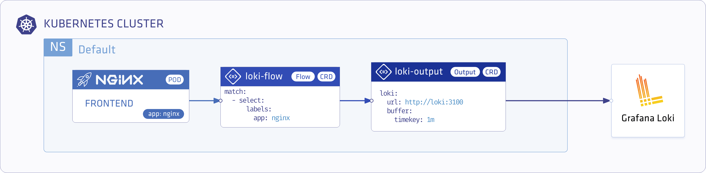
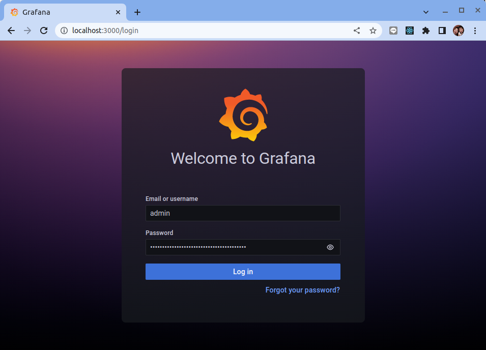
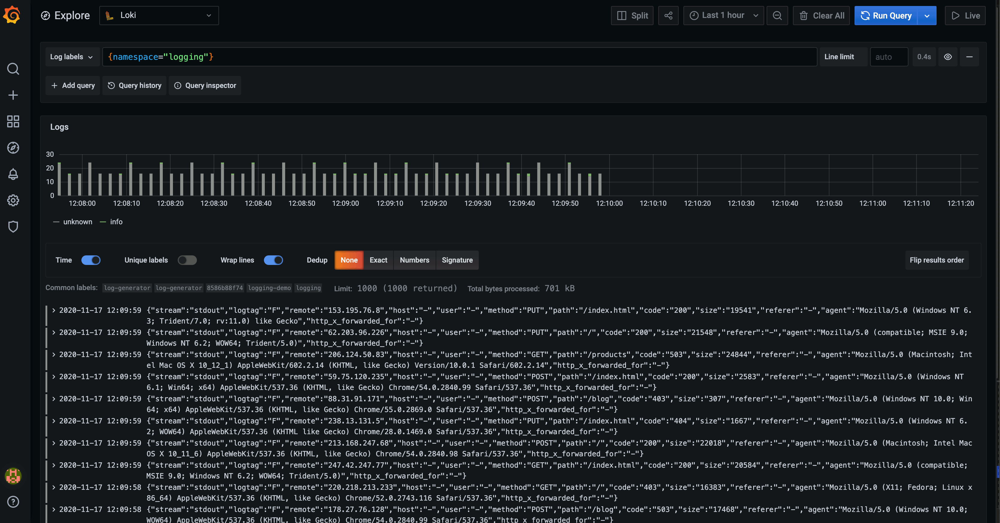

# 使用 Logging Operator 將 Nginx 訪問日誌存儲在 Grafana Loki

原文: https://banzaicloud.com/docs/one-eye/logging-operator/quickstarts/loki-nginx/


本指南介紹如何使用 Logging operator 在 Kubernetes 中收集應用程序和容器日誌，以及如何將它們發送到 Grafana Loki。

下圖概述了系統的工作原理。 Logging operator 從應用程序收集日誌，選擇要轉發到輸出的日誌，並將選定的日誌消息發送到輸出。有關 Logging operator 的更多詳細信息，請參閱 Logging operator 概述。



## 部署 Loki 和 Grafana

使用以下命令添加 Loki 和 Grafana 的 chart 存儲庫：

```bash
helm repo add grafana https://grafana.github.io/helm-charts
helm repo add loki https://grafana.github.io/loki/charts
helm repo update
```

將 Loki 安裝到 `logging` 命名空間中：

```bash
helm upgrade --install --create-namespace --namespace logging loki loki/loki
```

將 Grafana 安裝到 `logging` 命名空間中：

```bahs
 helm upgrade --install --create-namespace --namespace logging grafana grafana/grafana \
 --set "datasources.datasources\\.yaml.apiVersion=1" \
 --set "datasources.datasources\\.yaml.datasources[0].name=Loki" \
 --set "datasources.datasources\\.yaml.datasources[0].type=loki" \
 --set "datasources.datasources\\.yaml.datasources[0].url=http://loki:3100" \
 --set "datasources.datasources\\.yaml.datasources[0].access=proxy"
```

## 部署 Logging operator 和演示應用程序

安裝 Logging operator 和演示應用程序以提供示例日誌消息。

### 使用 Helm 部署 Logging operator

要使用 Helm 安裝 Logging operator，請完成這些步驟。

使用以下命令添加 Logging operator 的 helm 存儲庫：

```bash
helm repo add banzaicloud-stable https://kubernetes-charts.banzaicloud.com
helm repo update
```

將 Logging operator 安裝到 logging 命名空間中：

```bash
helm upgrade --install --wait --create-namespace --namespace logging logging-operator banzaicloud-stable/logging-operator
```

在 `logging` 的命名空間裡安裝範例應用程序及其日誌記錄定義。

```bash
helm upgrade --install --wait --create-namespace --namespace logging logging-demo banzaicloud-stable/logging-demo \
  --set "loki.enabled=True"
```

## 部署 Logging operator 和演示應用程序

### 驗證部署

**Grafana Dashboard**

使用以下命令檢索 Grafana 管理員用戶的密碼：

```bash
kubectl get secret --namespace logging grafana -o jsonpath="{.data.admin-password}" | base64 --decode ; echo
```

啟用到 Grafana 服務的端口轉發。

```bash
kubectl -n logging port-forward svc/grafana 3000:80
```

打開 Grafana 儀表板：http://localhost:3000

使用在步驟 1 中檢索到的 `admin` 用戶名和密碼登錄。



選擇 Menu > Explore, 選擇 Data source > Loki, 然後選擇 Log labels 並輸入 `{namespace="logging"}`。最後點擊 `Run Query`。



創建日誌記錄資源。

```bash
kubectl -n logging apply -f - <<"EOF"
apiVersion: logging.banzaicloud.io/v1beta1
kind: Logging
metadata:
  name: default-logging-simple
spec:
  fluentd: {}
  fluentbit: {}
  controlNamespace: logging
EOF
```

!!! info
    注意：您只能在 `controlNamespace` 中使用 `ClusterOutput` 和 `ClusterFlow` 資源。

創建 Loki 輸出定義。

```bash
kubectl -n logging apply -f - <<"EOF"
apiVersion: logging.banzaicloud.io/v1beta1
kind: Output
metadata:
 name: loki-output
spec:
 loki:
   url: http://loki:3100
   configure_kubernetes_labels: true
   buffer:
     timekey: 1m
     timekey_wait: 30s
     timekey_use_utc: true
EOF
```

!!! info
    注意：在生產環境中，使用較長的 timekey 間隔以避免生成過多的對象。

創建 `flow` 資源。

```bash
kubectl -n logging apply -f - <<"EOF"
apiVersion: logging.banzaicloud.io/v1beta1
kind: Flow
metadata:
  name: loki-flow
spec:
  filters:
    - tag_normaliser: {}
    - parser:
        remove_key_name_field: true
        reserve_data: true
        parse:
          type: nginx
  match:
    - select:
        labels:
          app.kubernetes.io/name: log-generator
  localOutputRefs:
    - loki-output
EOF
```

安裝演示應用程序。

```bash
kubectl -n logging apply -f - <<"EOF"
apiVersion: apps/v1
kind: Deployment
metadata:
 name: log-generator
spec:
 selector:
   matchLabels:
     app.kubernetes.io/name: log-generator
 replicas: 1
 template:
   metadata:
     labels:
       app.kubernetes.io/name: log-generator
   spec:
     containers:
     - name: nginx
       image: banzaicloud/log-generator:0.3.2
EOF
```


