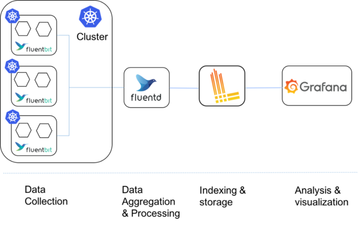
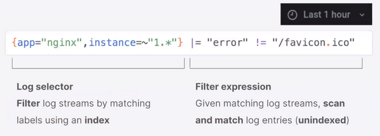
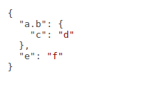
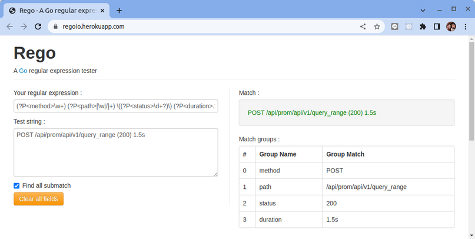
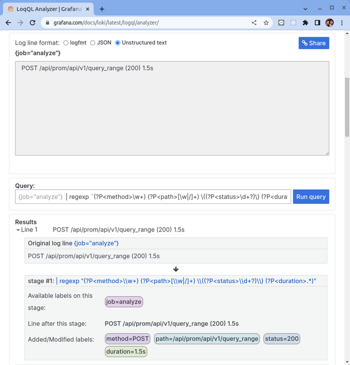
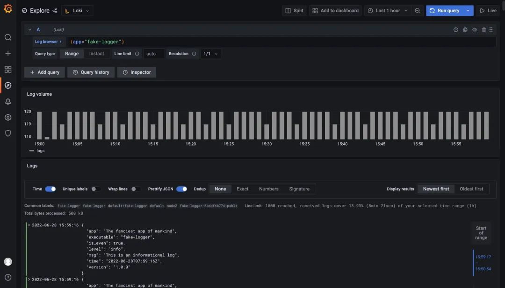
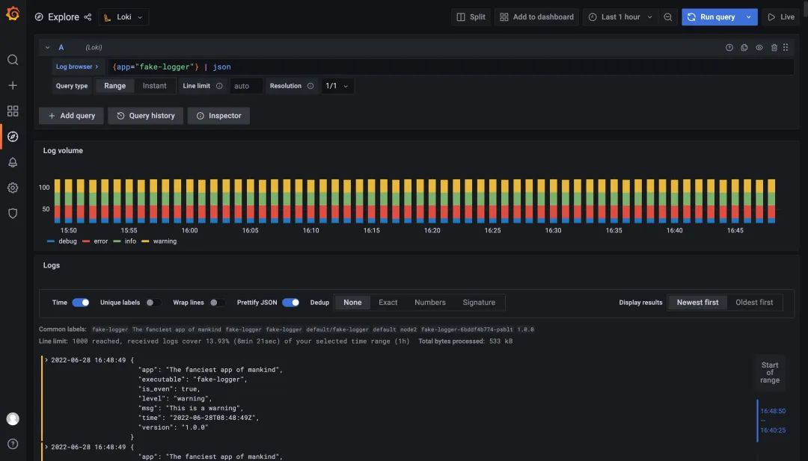
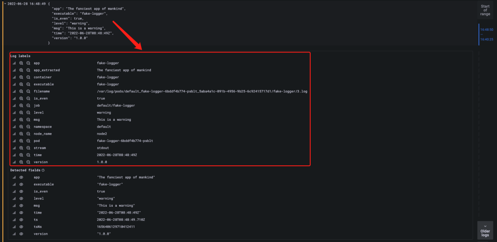
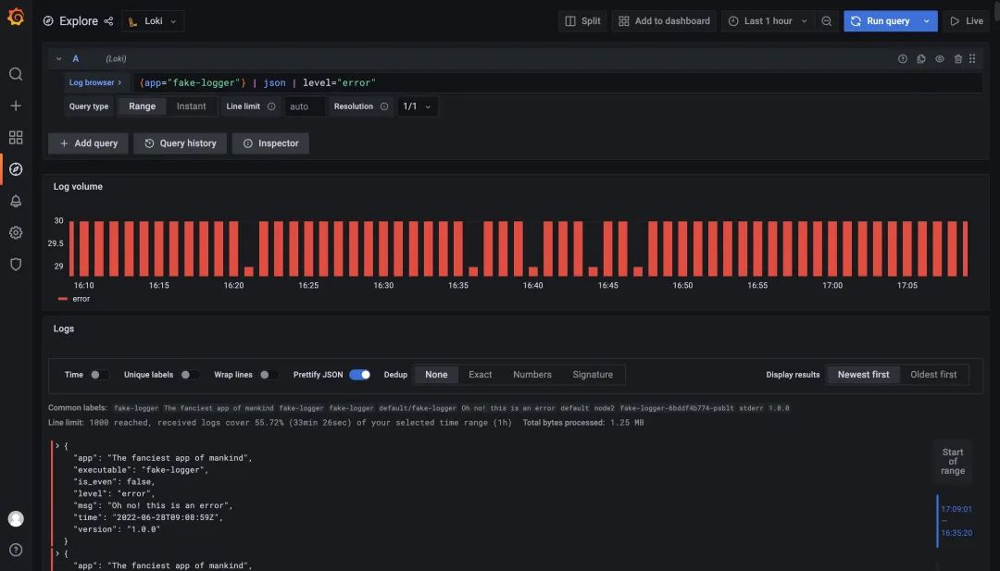
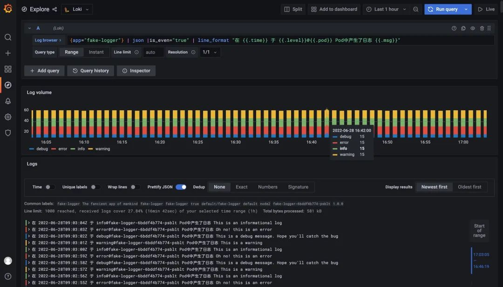

# Grafana Loki 查詢語言 LogQL 使用

原文: https://grafana.com/docs/loki/latest/logql/log_queries/



受 PromQL 的啓發，Loki 也有自己的查詢語言，稱爲 LogQL，它就像一個分佈式的 grep，可以聚合查看日誌。和 PromQL 一樣，LogQL 也是使用標籤和運算符進行過濾的，主要有兩種類型的查詢功能：

- **Log query** 查詢返回日誌行內容
- **Metrics query** 通過過濾規則在日誌流中計算相關的度量指標

## Log query

一個基本的日誌查詢由兩部分組成。

- log stream selector（日誌流選擇器）
- log pipeline（日誌管道）


由於 Loki 的設計，所有 LogQL 查詢必須包含一個日誌流選擇器 (log stream selector)。一個 Log Stream 代表了具有相同元數據 (Label 集) 的日誌條目。



**日誌流選擇器 (log stream selector)** 決定了有多少日誌將被搜索到，一個更細粒度的日誌流選擇器將搜索到流的數量減少到一個可管理的數量，通過精細的匹配日誌流，可以大幅減少查詢期間帶來資源消耗。

而日誌流選擇器後面的 **日誌管道 (log pipeline)** 是可選的，用於進一步處理和過濾日誌流信息，它由一組表達式組成，每個表達式都以從左到右的順序爲每個日誌行執行相關過濾，每個表達式都可以過濾、解析和改變日誌行內容以及各自的標籤。

下面的例子顯示了一個完整的日誌查詢的操作：

```bash title="log ql"
{container="query-frontend",namespace="loki-dev"} |= "metrics.go" | logfmt | duration > 10s and throughput_mb < 500
```

該查詢語句由以下幾個部分組成：

- 一個日誌流選擇器 `{container="query-frontend",namespace="loki-dev"}`，用於過濾 loki-dev 命名空間下面的 query-frontend 容器的日誌

- 然後後面跟着一個日誌管道 `|= "metrics.go" | logfmt | duration > 10s and throughput_mb < 500`，該管道表示將篩選出包含 metrics.go 這個詞的日誌，然後解析每一行日誌提取更多的表達式並進行過濾

!!! tip
    為避免 escape 特殊字符，您可以在引用字符串時使用 \' (backtick) 而不是 "。例如，\`\w+\` 與 "\\w+" 相同。這在編寫包含多個反斜杠的正則表達式時特別有用需要 escape。


### Log Stream Selector

日誌流選擇器 (Log Stream Selector) 決定了哪些日誌流應該被包含在你的查詢結果中，選擇器由一個或多個鍵值對組成，其中每個鍵是一個日誌標籤，每個值是該標籤的值。

日誌流選擇器是通過將鍵值對包裹在一對 **大括號** 中編寫的，比如：

```bash
{app="mysql", }
```

上面這個示例表示，所有標籤爲 app 且其值爲 mysql 和標籤爲 name 且其值爲 mysql-backup 的日誌流將被包括在查詢結果中。

其中標籤名後面的 = 運算符是一個標籤匹配運算符，LogQL 中一共支持以下幾種標籤匹配運算符：

- `=` 完全匹配
- `!=` 不相等
- `=~` 正則表達式匹配
- `!~` 正則表達式不匹配

例如：

```bash
{name=~"mysql.+"}

{name!~"mysql.+"}

{name!~"mysql-\\d+"}
```

適用於 Prometheus 標籤選擇器的規則同樣適用於 Loki 日誌流選擇器。


### Log Pipeline

日誌管道可以附加到日誌流選擇器上，以進一步處理和過濾日誌流。它通常由一個或多個 **表達式** 組成，每個表達式針對每個日誌行依次執行。如果一個表達式過濾掉了日誌行，則管道將在此處停止並開始處理下一行。一些表達式可以改變日誌內容和各自的標籤，然後可用於進一步過濾和處理後續表達式或指標查詢。

一個日誌管道可以由以下部分組成。

- 過濾表達式 (Filtering expressions)
    - 日誌行過濾表達式 (Line filter expressions)
    - 標籤過濾表達式 (Label filter expressions)
- 解析器表達式 (Parsing expressions)
- 格式化表達式 (Formatting expressions)
    - 日誌行格式化表達式 (Line format expression)
    - 標籤格式化表達式 (Labels format expression)

#### Line filter expressions

日誌行過濾表達式用於對匹配日誌流中的聚合日誌進行分佈式 grep。

編寫入日誌流選擇器後，可以使用一個 **搜索表達式** 進一步過濾得到的日誌數據集，搜索表達式可以是文本或正則表達式，比如：

```bash
{job="mysql"} |= "error"

{instance=~"kafka-[23]",name="kafka"} != "kafka.server:type=ReplicaManager"

{name="kafka"} |~ "tsdb-ops.*io:2003"

{name="cassandra"} |~  `error=\w+`
```

上面示例中的 `|=`、`|~` 和 `!=` 是過濾運算符，支持下面幾種類型：

- `|=` 日誌行包含的字符串

- `!=` 日誌行不包含的字符串

- `|~` 日誌行匹配正則表達式

- `!~` 日誌行與正則表達式不匹配

過濾運算符可以是串連在一起使用的，並將按順序執行過濾表達式，產生的日誌行必須滿足每個過濾器。當使用 `|~` 和 `!~` 時，可以使用 Golang 的 [RE2 語法](https://github.com/google/re2/wiki/Syntax)的正則表達式，默認情況下，匹配是區分大小寫的，可以用 `(?i)` 作爲正則表達式的前綴，切換爲不區分大小寫。

雖然日誌行過濾表達式可以放在管道的任何地方，但最好把它們放在開頭，這樣可以提高查詢的性能，當某一行匹配時才做進一步的後續處理。例如，雖然結果是一樣的，但下面的查詢 `{job="mysql"} |= "error" |json | line_format "{{.err}}"` 會比 `{job="mysql"} | json | line_format "{{.message}}" |= "error"` 更快，**日誌行過濾表達式是繼日誌流選擇器之後過濾日誌的最快方式**。

#### Label filter expressions

**標籤過濾表達式** 允許使用其原始和提取的標籤來過濾日誌行，它可以包含多個 **謂詞**。

一個謂詞包含一個標籤標識符、操作符和用於比較標籤的值。

例如 `cluster="namespace"` 其中的 `cluster` 是標籤標識符，操作符是 `=`，值是`"namespace"`。

LogQL 支持從查詢輸入中自動推斷出的多種值類型：

- **String**（字符串）用雙引號或反引號引起來，例如"200"或 us-central1。
- **Duration**（時間）是一串十進制數字，每個數字都有可選的數和單位後綴，如 "300ms"、"1.5h" 或 "2h45m"，有效的時間單位是 "ns"、"us"（或 "µs"）、"ms"、"s"、"m"、"h"。
- **Number**（數字）是浮點數（64 位），如 250、89.923。
- **Bytes**（字節）是一串十進制數字，每個數字都有可選的數和單位後綴，如 "42MB"、"1.5Kib" 或 "20b"，有效的字節單位是 "b"、"kib"、"kb"、"mib"、"mb"、"gib"、"gb"、"tib"、"tb"、"pib"、"bb"、"eb"。

字符串類型的工作方式與 Prometheus 標籤匹配器在日誌流選擇器中使用的方式完全一樣，這意味着你可以使用同樣的操作符（`=`、`!=`、`=~`、`!~`u）。

使用 Duration、Number 和 Bytes 將在比較前轉換標籤值，並支持以下比較器。

- `==` 或 `=` 相等比較

- `!=` 不等於比較

- `>` 和 `>=` 用於大於或大於等於比較

- `<` 和 `<=` 用於小於或小於等於比較

例如 `logfmt | duration > 1m and bytes_consumed > 20MB` 過濾表達式。

如果標籤值的轉換或提取失敗，日誌行就不會被過濾，而會添加一個 __error__ 標籤。你可以使用 `and`　和 `or` 來連接多個謂詞，它們分別表示 **且** 和 **或** 的二進制操作，`and` 可以用逗號、空格或其他管道來表示，標籤過濾器可以放在日誌管道的任何地方。

以下所有的表達式都是等價的:

```bash
| duration >= 20ms or size == 20kb and method!~"2.."
| duration >= 20ms or size == 20kb | method!~"2.."
| duration >= 20ms or size == 20kb,method!~"2.."
| duration >= 20ms or size == 20kb method!~"2.."
```

默認情況下，多個謂詞的優先級是從右到左，你可以用圓括號包裝謂詞，強制使用從左到右的不同優先級。

例如，以下內容是等價的：

```bash
| duration >= 20ms or method="GET" and size <= 20KB
| ((duration >= 20ms or method="GET") and size <= 20KB)
```

它將首先評估 duration>=20ms or method="GET"，要首先評估 method="GET" and size<=20KB，請確保使用適當的括號，如下所示。

```bash
| duration >= 20ms or (method="GET" and size <= 20KB)
```

標籤過濾器表達式支持匹配 IP 地址。有關詳細信息，請參閱[匹配 IP 地址](https://grafana.com/docs/loki/latest/logql/ip/)。

#### Parser expression

**解析器表達式** 可以解析和提取日誌內容中的標籤，這些提取的標籤可以用於標籤過濾表達式進行過濾，或者用於指標聚合。

提取的標籤鍵將由解析器進行自動格式化，以遵循 Prometheus 指標名稱的約定（它們只能包含 ASCII 字母和數字，以及下劃線和冒號，不能以數字開頭）。

例如下面的日誌經過管道 `| json` 將產生以下 Map 數據：

日誌原始數據:

```json  title="log line"
{ "a.b": { "c": "d" }, "e": "f" }
```



解析器表達式處理後結果:

```bash
{a_b_c="d", e="f"}
```

在出現錯誤的情況下，例如，如果該行不是預期的格式，該日誌行不會被過濾，而是會被添加一個新的 `__error__` 標籤。

需要注意的是如果一個提取的標籤鍵名已經存在於原始日誌流中，那麼提取的標籤鍵將以 `_extracted` 作爲後綴，以區分兩個標籤，你可以使用一個標籤格式化表達式來強行覆蓋原始標籤，但是如果一個提取的鍵出現了兩次，那麼只有最新的標籤值會被保留。

目前支持 json、logfmt、pattern、regexp 和 unpack 這幾種解析器。

我們應該儘可能使用 json 和 logfmt 等預定義的解析器，這會更加容易，而當日志行結構異常時，可以使用 regexp，可以在同一日誌管道中使用多個解析器，這在你解析複雜日誌時很有用。

##### json 解析器

json 解析器有兩種模式運行。

**沒有參數**:
   
如果日誌行是一個有效的 json 文檔，在你的管道中添加 `| json` 將提取所有 json 屬性作爲標籤，嵌套的屬性會使用 `_` 分隔符被平鋪到標籤鍵中。

!!! info
    注意：數組會被忽略。

例如，使用 json 解析器從以下文件內容中提取標籤。

```json
{
  "protocol": "HTTP/2.0",
  "servers": ["129.0.1.1", "10.2.1.3"],
  "request": {
    "time": "6.032",
    "method": "GET",
    "host": "foo.grafana.net",
    "size": "55",
    "headers": {
      "Accept": "*/*",
      "User-Agent": "curl/7.68.0"
    }
  },
  "response": {
    "status": 401,
    "size": "228",
    "latency_seconds": "6.031"
  }
}
```

可以得到如下所示的標籤列表：

```bash
"protocol" => "HTTP/2.0"
"request_time" => "6.032"
"request_method" => "GET"
"request_host" => "foo.grafana.net"
"request_size" => "55"
"response_status" => "401"
"response_size" => "228"
"response_latency_seconds" => "6.031"
```

**帶參數的**:

在你的管道中使用 `|json label="expression", another="expression"` 將只提取指定的 json 字段爲標籤，你可以用這種方式指定一個或多個表達式，與 label_format 相同，所有表達式必須加引號。

當前僅支持字段訪問（`my.field`, `my["field"]`）和數組訪問（`list[0]`），以及任何級別嵌套中的這些組合（`my.list[0]["field"]`）。

例如，`|json first_server="servers[0]", ua="request.headers[\"User-Agent\"]` 將從以下日誌文件中提取標籤：

```json
{
  "protocol": "HTTP/2.0",
  "servers": ["129.0.1.1", "10.2.1.3"],
  "request": {
    "time": "6.032",
    "method": "GET",
    "host": "foo.grafana.net",
    "size": "55",
    "headers": {
      "Accept": "*/*",
      "User-Agent": "curl/7.68.0"
    }
  },
  "response": {
    "status": 401,
    "size": "228",
    "latency_seconds": "6.031"
  }
}
```

提取的標籤列表爲：

```bash
"first_server" => "129.0.1.1"
"ua" => "curl/7.68.0"
```

##### logfmt 解析器

logfmt 解析器可以通過使用 `| logfmt` 來添加，它將從 logfmt 格式的日誌行中提前所有的鍵和值。

例如，下面的日誌行數據：

```bash title="log line"
at=info method=GET path=/ host=grafana.net fwd="124.133.124.161" service=8ms status=200
```

將提取得到如下所示的標籤：

```bash
"at" => "info"
"method" => "GET"
"path" => "/"
"host" => "grafana.net"
"fwd" => "124.133.124.161"
"service" => "8ms"
"status" => "200"
```

##### regexp 解析器

與 logfmt 和 json（它們隱式提取所有值且不需要參數）不同，regexp 解析器採用單個參數 `| regexp "<re>"` 的格式，其參數是使用 Golang RE2 語法的正則表達式。

正則表達式必須包含至少一個命名的子匹配（例如`(?P<name>re)`），每個子匹配項都會提取一個不同的標籤。

例如，解析器 `| regexp "(?P<method>\\w+) (?P<path>[\\w|/]+) \\((?P<status>\\d+?)\\) (?P<duration>.*)" `將從以下行中提取標籤：

```bash
POST /api/prom/api/v1/query_range (200) 1.5s
```

提取的標籤爲：

```bash
"method" => "POST"
"path" => "/api/prom/api/v1/query_range"
"status" => "200"
"duration" => "1.5s"
```

下列工具可幫助驗證語法的執行：

- 工具：　https://regoio.herokuapp.com/

正則表達式: `(?P<method>\w+) (?P<path>[\w|/]+) \((?P<status>\d+?)\) (?P<duration>.*)`



- 工具：　https://grafana.com/docs/loki/latest/logql/analyzer/

Query表達式: `| regexp "(?P<method>\\w+) (?P<path>[\\w|/]+) \\((?P<status>\\d+?)\\) (?P<duration>.*)" `



##### pattern 解析器

模式解析器允許通過定義模式表達式 `| pattern "<pattern-expression>" ` 從日誌行中顯式提取字段，該表達式與日誌行的結構相匹配。

比如我們來考慮下面的 NGINX 日誌行數據：

```bash  title="log line"
0.191.12.2 - - [10/Jun/2021:09:14:29 +0000] "GET /api/plugins/versioncheck HTTP/1.1" 200 2 "-" "Go-http-client/2.0" "13.76.247.102, 34.120.177.193" "TLSv1.2" "US" ""
```

該日誌行可以用下面的表達式來解析：

```bash
<ip> - - <_> "<method> <uri> <_>" <status> <size> <_> "<agent>" <_>
```

解析後可以提取出下面的這些屬性：

```bash
"ip" => "0.191.12.2"
"method" => "GET"
"uri" => "/api/plugins/versioncheck"
"status" => "200"
"size" => "2"
"agent" => "Go-http-client/2.0"
```

模式表達式的捕獲是由 `<` 和 `>` 字符分隔的字段名稱，比如 <example> 定義了字段名稱爲 example，未命名的 capture 顯示爲 `<_>`，未命名的 capture 會跳過匹配的內容。默認情況下，模式表達式錨定在日誌行的開頭，可以在表達式的開頭使用 `<_>` 將表達式錨定在開頭。

比如我們查看下面的日誌行數據：

```bash title="log line"
level=debug ts=2021-06-10T09:24:13.472094048Z caller=logging.go:66 traceID=0568b66ad2d9294c msg="POST /loki/api/v1/push (204) 16.652862ms"
```

我們如果只希望去匹配 `msg="` 的內容，我們可以使用下面的表達式來進行匹配：

```bash
<_> msg="<method> <path> (<status>) <latency>"
```

#### Line format expression

日誌行格式化表達式可以通過使用 Golang 的 text/template 模板格式重寫日誌行的內容，它需要一個字符串參數 `| line_format "{{.label_name}}"` 作爲模板格式，所有的標籤都是注入模板的變量，可以用 `{{.label_name}}` 的符號來使用。

例如，下面的表達式：

```bash title="log ql"
{container="frontend"} | logfmt | line_format "{{.query}} {{.duration}}"
```

將提取並重寫日誌行，只包含 query 和請求的 duration。你可以爲模板使用雙引號字符串或反引號 `"{{.label_name}}"` 來避免轉義特殊字符。

此外 line_format 也支持數學函數，例如：

如果我們有以下標籤 ip=1.1.1.1, status=200 和 duration=3000(ms), 我們可以用 duration 除以 1000 得到以秒爲單位的值：

```bash title="log ql"
{container="frontend"} | logfmt | line_format "{{.ip}} {{.status}} {{div .duration 1000}}"
```

上面的查詢將得到的日誌行內容爲:

```bash
1.1.1.1 200 3
```

請參閱[模板函數](https://grafana.com/docs/loki/latest/logql/template_functions/)以了解模板格式中的可用函數。

#### Labels format expression

`| label_format` 表達式可以重命名、修改或添加標籤，它以逗號分隔的操作列表作爲參數，可以同時進行多個操作。

當兩邊都是標籤標識符時，例如 `dst=src`，該操作將把 `src` 標籤重命名爲 `dst`。

左邊也可以是一個模板字符串，例如 `dst="{{.status}} {{.query}}"`，在這種情況下，`dst` 標籤值會被 Golang 模板執行結果所取代，這與 `| line_format` 表達式是同一個模板引擎，這意味着標籤可以作爲變量使用，也可以使用同樣的函數列表。

在上面兩種情況下，如果目標標籤不存在，那麼就會創建一個新的標籤。

重命名形式 dst=src 會在將 src 標籤重新映射到 dst 標籤後將其刪除，然而，模板形式將保留引用的標籤，例如 dst="{{.src}}" 的結果是 dst 和 src 都有相同的值。

!!! tip
    一個標籤名稱在每個表達式中只能出現一次，這意味着 `| label_format foo=bar,foo="new"` 是不允許的，但你可以使用兩個表達式來達到預期效果，比如 `| label_format foo=bar | label_format foo="new"`。

### Log query 示例


#### Multiple filtering

過濾應該首先在日誌流選擇器使用標籤匹配器來限縮loki要查找的日誌，然後是日誌行過濾器（如果可能），最後再使用標籤過濾器。以下查詢示範了這一點。

```bash title="log ql"
{cluster="ops-tools1", namespace="loki-dev", job="loki-dev/query-frontend"} |= "metrics.go" !="out of order" | logfmt | duration > 30s or status_code!="200"
```

1. 日誌流選擇器: `{cluster="ops-tools1", namespace="loki-dev", job="loki-dev/query-frontend"}`
2. 日誌行過濾表達式: `|= "metrics.go" !="out of order"`
3. 解析器表達式: `| logfmt`
4. 標籤過濾表達式: `| duration > 30s or status_code!="200"`

#### Multiple parsers

提取以下 logfmt 日誌行的方法和路徑：

```bash title="log line"
level=debug ts=2020-10-02T10:10:42.092268913Z caller=logging.go:66 traceID=a9d4d8a928d8db1 msg="POST /api/prom/api/v1/query_range (200) 1.5s"
```

您可以像這樣使用多個解析器（logfmt 和 regexp）。_

```bash title="log ql"
{job="loki-ops/query-frontend"} | logfmt | line_format "{{.msg}}" | regexp "(?P<method>\\w+) (?P<path>[\\w|/]+) \\((?P<status>\\d+?)\\) (?P<duration>.*)"
```

這是可能的，因為 `| line_format` 將日誌行重新格式化為 `POST /api/prom/api/v1/query_range (200) 1.5s` 然後可以使用 `| regexp ...` 解析器。

另外一個常用解析 Niginx 日誌行的範例：

```bash title="log line"
54.203.113.59 - - [09/Sep/2022:03:34:45 +0000] "PUT /index.html HTTP/1.1" 200 3622 "-" "Mozilla/5.0 (X11; Linux i686) AppleWebKit/537.36 (KHTML, like Gecko) Chrome/53.0.2785.101 Safari/537.36 OPR/40.0.2308.62" "-"
```

```bash title="log ql"
{namespace="default"} | json | line_format "{{.message}}" | pattern "<_> - <_> <_> \"<method> <url> <protocol>\" <status> <_> <_> \"<_>\" <_>" 
```

#### Formatting

以下查詢顯示瞭如何重新格式化日誌行以使其更易於在屏幕上閱讀。

```bash title="log ql"
{cluster="ops-tools1", name="querier", namespace="loki-dev"}
  |= "metrics.go" != "loki-canary"
  | logfmt
  | query != ""
  | label_format query="{{ Replace .query \"\\n\" \"\" -1 }}"
  | line_format "{{ .ts}}\t{{.duration}}\ttraceID = {{.traceID}}\t{{ printf \"%-100.100s\" .query }} "
```

標籤格式用於清理查詢，而行格式減少信息量並創建表格輸出。

對於這些給定的日誌行：

```bash title="log line"
level=info ts=2020-10-23T20:32:18.094668233Z caller=metrics.go:81 org_id=29 traceID=1980d41501b57b68 latency=fast query="{cluster=\"ops-tools1\", job=\"loki-ops/query-frontend\"} |= \"query_range\"" query_type=filter range_type=range length=15m0s step=7s duration=650.22401ms status=200 throughput_mb=1.529717 total_bytes_mb=0.994659
level=info ts=2020-10-23T20:32:18.068866235Z caller=metrics.go:81 org_id=29 traceID=1980d41501b57b68 latency=fast query="{cluster=\"ops-tools1\", job=\"loki-ops/query-frontend\"} |= \"query_range\"" query_type=filter range_type=range length=15m0s step=7s duration=624.008132ms status=200 throughput_mb=0.693449 total_bytes_mb=0.432718
```

結果將是：

```bash
2020-10-23T20:32:18.094668233Z	650.22401ms	    traceID = 1980d41501b57b68	{cluster="ops-tools1", job="loki-ops/query-frontend"} |= "query_range"
2020-10-23T20:32:18.068866235Z	624.008132ms	traceID = 1980d41501b57b68	{cluster="ops-tools1", job="loki-ops/query-frontend"} |= "query_range"
```

## Metric query

度量查詢通過應用函數來記錄查詢結果來擴展日誌查詢。這個強大的功能從日誌中創建指標。

指標查詢可用於計算錯誤消息率或最近 3 小時內日誌數量最多的前 N ​​個日誌源。

與解析器相結合，度量查詢還可用於從日誌行中的樣本值計算度量，例如延遲或請求大小。所有標籤，包括提取的標籤，都可用於聚合和生成新系列。

### Range Vector aggregation

LogQL 學習了 Prometheus 的範圍向量概念。在 Grafana Loki 中，所選樣本範圍是所選對數或標籤值的範圍。

在一段時間內應用聚合。 Loki 使用與 Prometheus 相同的語法定義 Time Duration。

Loki 支持兩種類型的範圍向量聚合：日誌範圍聚合和展開範圍聚合。

#### Log range aggregations

日誌範圍聚合是一個查詢，後綴定義了一個持續時間。應用一個函數在持續時間內聚合查詢。持續時間可以放在日誌流選擇器之後或日誌管道的末尾。

聚合函數：

- `rate(log-range)`: 計算每秒的日誌條目
- `count_over_time(log-range)`: 對指定範圍內的每個日誌流的條目進行計數
- `bytes_rate(log-range)`: 計算日誌流每秒的字節數
- `bytes_over_time(log-range)`: 對指定範圍內的每個日誌流的使用的字節數
- `absent_over_time(log-range)`: 如果傳遞給它的範圍向量有任何元素，則返回一個空向量；如果傳遞給它的範圍向量沒有元素，則返回一個值為 1 的 1 元素向量。 （absent_over_time 對於在一段時間內不存在標籤組合的時間序列和日誌流時發出警報很有用。）


例子：

- 計算 MySQL job最後五分鐘內的所有日誌行計數。

```bash
count_over_time({job="mysql"}[5m])
```

- 此聚合包括過濾器和解析器。它返回 MySQL job在每台主機的最後幾分鐘內所有非超時錯誤的每秒速率，並且僅包括持續時間超過 10 秒的錯誤。

```bash
sum by (host) (rate({job="mysql"} |= "error" != "timeout" | json | duration > 10s [1m]))
```

#### Unwrapped range aggregations

Unwrapped的範圍使用提取的`標籤(label)`來作為樣本值而不是`日誌行(log line)`。但是，要選擇在聚合中使用哪個標籤，日誌查詢必須以展開表達式和可選的標籤過濾器表達式結尾以丟棄錯誤。

註釋解包表達式 `| unwrap label_identifier` 其中標籤標識符是用於提取樣本值的標籤名稱。

由於標籤值是字符串，默認情況下將嘗試轉換為浮點數（64 位），如果失敗，則將 __error__ 標籤添加到樣本中。可選地，標籤標識符可以由轉換函數包裹 `| unwrap <function>(label_identifier)`，它將嘗試將標籤值從特定格式轉換。

Loki 目前支持的下列轉換函數：

- `duration_seconds(label_identifier)` (或是 `duration（label_identifier)`) 它將以秒為單位從 go duration 格式轉換標籤值。
- `bytes(label_identifier)` 這會將標籤值轉換為應用字節單位的原始字節（例如 5 MiB、3k、1G）。


支持 Unwrapped 範圍內操作的函數有：

- `rate(unwrapped-range)`: 計算指定時間間隔內所有值之和的每秒速率。
- `rate_counter(unwrapped-range)`: 計算指定間隔內的值的每秒速率，並將它們視為“計數器度量”
- `sum_over_time(unwrapped-range)`: 指定區間內所有值的總和。
- `avg_over_time(unwrapped-range)`: 指定區間內所有點的平均值。
- `max_over_time(unwrapped-range)`: 指定區間內所有點的最大值。
- `min_over_time(unwrapped-range)`: 指定區間內所有點的最小值
- `first_over_time(unwrapped-range)`: 指定區間內所有點的第一個值
- `last_over_time(unwrapped-range)`: 指定區間內所有點的最後一個值
- `stdvar_over_time(unwrapped-range)`: 指定區間內值的總體標準方差。
- `stddev_over_time(unwrapped-range)`: 指定區間內值的總體標準差。
- `quantile_over_time(scalar,unwrapped-range)`: 指定區間內的值的 φ 分位數 (0 ≤ φ ≤ 1)。
- `absent_over_time(unwrapped-range)`: 如果傳遞給它的範圍向量有任何元素，則返回一個空向量；如果傳遞給它的範圍向量沒有元素，則返回一個值為 1 的 1 元素向量。 （absent_over_time 對於在一段時間內不存在標籤組合的時間序列和日誌流時發出警報很有用。）

除了 `sum_over_time`、`absent_over_time` 和 `rate`，展開的範圍聚合支持分組。

```bash
<aggr-op>([parameter,] <unwrapped-range>) [without|by (<label list>)]
```

通過包含 without 或 by 子句，可用於聚合不同的標籤維度。

without 從結果向量中刪除列出的標籤，而所有其他標籤都保留輸出。 by 執行相反的操作並刪除未在 by 子句中列出的標籤，即使它們的標籤值在向量的所有元素之間是相同的。

**Unwrapped 範例**:

```bash
quantile_over_time(0.99,                            # 定義要計算的分位數
  {cluster="ops-tools1",container="ingress-nginx"}　# 選擇特定的 lost stream
    | json                                          # 使用 JSON 來解析並擷取 label
    | __error__ = ""                                # 去除解析有問題的日誌行
    | unwrap request_time [1m]) by (path)　         # 使用 "requet_time" 的標籤值來計算並且使用 path 標籤值來分組
```

此示例按路徑計算 nginx-ingress 延遲的 p99 回應時間。

```bash
sum by (org_id) (
  sum_over_time(
  {cluster="ops-tools1",container="loki-dev"}
      |= "metrics.go"
      | logfmt
      | unwrap bytes_processed [1m])
  )
```

這將計算每個組織 ID 處理的字節數。

### Built-in aggregation operators

與 PromQL 一樣，LogQL 支持內置聚合運算符的子集，可用於聚合單個向量的元素，從而生成包含更少元素但具有聚合值的新向量：

- `sum`: 計算標籤值的總和
- `avg`: 計算標籤值的平均值
- `min`: 選擇標籤值的最小值
- `max`: 選擇標籤值的最大值
- `stddev`: 計算標籤值的總體標準差
- `stdvar`: 計算標籤值的總體標準方差
- `count`: 計算向量中的元素個數
- `topk`: 按樣本標籤值選擇最大的 k 個元素
- `bottomk`: 按樣本標籤值選擇最小的 k 個元素

聚合運算符可用於聚合所有標籤值或一組不同的標籤值，方法是包含 without 或 by 子句：

```bash
<aggr-op>([parameter,] <vector expression>) [without|by (<label list>)]
```

使用 topk 和 bottomk 時需要定義參數(parameter)。 topk 和 bottomk 與其他聚合器的不同之處在於，輸入樣本的子集（包括原始標籤）在結果向量中返回。

by 和 without 僅用於對輸入向量進行分組。 without 子句從結果向量中刪除列出的標籤，保留所有其他標籤。 by 子句相反，刪除子句中未列出的標籤，即使它們的標籤值在向量的所有元素之間是相同的。

**Vector aggregation 範例**:

- 獲取日誌吞吐量最高的前 10 個應用程序：

```bash
topk(10,sum(rate({region="us-east1"}[5m])) by (name))
```

- 獲取指定作業的最後五分鐘的日誌行數，按級別分組：

```bash
sum(count_over_time({job="mysql"}[5m])) by (level)
```

- 按區域獲取 NGINX 日誌的 /home 端點的 HTTP GET 請求速率：

```bash
avg(rate(({job="nginx"} |= "GET" | json | path="/home")[10s])) by (region)
```


## Binary operators

### Arithmetic operators

Loki 中存在以下二元算術運算符：

- `+` 加法
- `-` 減法
- `*` 乘法
- `/` 除法
- `%` 求模
- `^` 求冪

二進制算術運算符定義在兩個文字（標量）、一個文字和一個向量以及兩個向量之間。

在兩個文字之間，行為是顯而易見的：它們評估另一個文字，這是應用於兩個標量操作數 (1 + 1 = 2) 的運算符的結果。

在向量和文字之間，運算符應用於向量中每個數據樣本的值，例如如果時間序列向量乘以 2，則結果是另一個向量，其中原始向量的每個樣本值都乘以 2。

在兩個向量之間，二進制算術運算符應用於左側向量中的每個條目及其右側向量中的匹配元素。結果傳播到結果向量中，分組標籤成為輸出標籤集。在右側向量中找不到匹配條目的條目不屬於結果。

鏈接算術運算符時要特別注意[運算符順序](https://grafana.com/docs/loki/latest/logql/#order-of-operations)。

#### Arithmetic 範例

將日誌流條目的速率加倍：

```bash
sum(rate({app="foo"}[1m])) * 2
```

獲取 foo 應用程序的警告日誌與錯誤日誌的比例

```bash
sum(rate({app="foo", level="warn"}[1m])) / sum(rate({app="foo", level="error"}[1m]))
```

### Logical and set operators

集合運算僅在區間向量範圍內有效，當前支持：

- `and` 交集 - vector1 和 vector2 產生一個由 vector1 的元素組成的向量，其中 vector2 中的元素具有完全匹配的標籤集。其他元素被丟棄。
- `or` 聯集 - vector1 或 vector2 生成一個向量，該向量包含 vector1 的所有原始元素（標籤集 + 值），以及 vector2 中在 vector1 中沒有匹配標籤集的所有元素。
- `unless` 補充 - vector1 除非 vector2 產生一個由 vector1 的元素組成的向量，對於這些元素，vector2 中沒有與標籤集完全匹配的元素。兩個向量中的所有匹配元素都被刪除。


#### Binary operators 範例

下列的查詢將返回這些查詢的交集, 等同　`rate({app="bar"})`：

```bash
rate({app=~"foo|bar"}[1m]) and rate({app="bar"}[1m])
```

### Comparison operators

- `==` 等於
- `!=` 不等於
- `>` 大於
- `>=` 大於或等於
- `<` 小於
- `<=` 小於或等於

比較運算符在標量/標量、向量/標量和向量/向量值對之間定義。默認情況下，它們會過濾。它們的行為可以通過在運算符後提供 bool 來修改，它將返回 0 或 1 作為值而不是過濾。

在兩個標量之間，這些運算符會產生另一個標量，即 0（假）或 1（真），具體取決於比較結果。不得提供 bool 修飾符。

在向量和標量之間，這些運算符應用於向量中每個數據樣本的值，並且比較結果為假的向量元素從結果向量中刪除。如果提供了 bool 修飾符，則將被刪除的向量元素的值為 0，而將保留的向量元素的值為 1。

### 註釋

LogQL 查詢可以使用 `#` 字符進行註釋：

```bash
{app="foo"} # anything that comes after will not be interpreted in your query
```

使用多行 LogQL 查詢，查詢解析器可以使用 `#` 排除整行或部份行：

```bash
{app="foo"}
    | json
    # this line will be ignored
    | bar="baz" # this checks if bar = "baz"
```

### Pipeline 錯誤

導致管道處理錯誤的原因有多種，例如：

- 數字標籤過濾器可能無法將標籤值轉換為數字
- 標籤的度量轉換可能會失敗。
- 日誌行不是有效的 json 文檔。
- ETC…

當這些故障發生時，Loki 不會過濾掉那些日誌行。相反，它們被傳遞到管道的下一個階段，並帶有一個名為 `__error__` 的新系統標籤。過濾錯誤的唯一方法是使用標籤過濾器表達式。 `__error__` 標籤不能通過語言重命名。

例如要刪除 json 錯誤：

```bash title="log ql"
{cluster="ops-tools1",container="ingress-nginx"}
    | json
    | __error__ != "JSONParserErr"
```

或者，您可以使用捕獲所有匹配器（例如 `__error__ = ""` ）刪除所有錯誤，甚至使用 `__error__ != ""` 僅顯示錯誤。

過濾器應放置在產生此錯誤的階段之後。這意味著如果您需要從展開表達式中刪除錯誤，則需要將其放在展開之後。

```bash title="log ql"
quantile_over_time(
	0.99,
	{container="ingress-nginx",service="hosted-grafana"}
	| json
	| unwrap response_latency_seconds
	| __error__=""[1m]
	) by (cluster)
```

!!! info
    指標查詢不能包含錯誤，如果在執行過程中發現錯誤，Loki 將返回錯誤和相應的狀態碼。

## 查詢示例

這裡部署我們的應用程序是一個消息應用的示例，該應用程序是一個應用程序的消息，它的日誌包含調試、信息和警告輸出到標準輸出。錯誤等級的將被寫入標準輸出，實際的日誌以 JSON 格式生成，每個500 條日誌將創建一條新消息的消息。 日誌格式如下：

```json
{
    "app":"The fanciest app of mankind",
    "executable":"fake-logger",
    "is_even": true,
    "level":"debug",
    "msg":"This is a debug message. Hope you'll catch the bug",
    "time":"2022-04-04T13:41:50+02:00",
    "version":"1.0.0"
}
```

使用下面的命令來創建示例應用：

```bash
cat <<EOF | kubectl apply -f -
apiVersion: apps/v1
kind: Deployment
metadata:
 labels:
  app: fake-logger
  environment: development
 name: fake-logger
spec:
 selector:
  matchLabels:
   app: fake-logger
   environment: development
 template:
  metadata:
   labels:
    app: fake-logger
    environment: development
  spec:
   containers:
   - image: thorstenhans/fake-logger:0.0.2
     name: fake-logger
     resources:
      requests:
       cpu: 10m
       memory: 32Mi
      limits:
       cpu: 10m
       memory: 32Mi
EOF
```

我們可以使用 {app="fake-logger"} 在 Grafana 中查詢到該應用的日誌流數據。




由於我們該示例應用的日誌是 JSON 形式的，我們可以採用 JSON 解析器來解析日誌，表達式爲 `{app="fake-logger"} | json`，如下所示。



使用 JSON 解析器解析日誌後可以看到 Grafana 提供的面板會根據 level 的值使用不同的顏色進行區分，而且現在我們日誌的屬性也被添加到了 Log 的標籤中去了。



現在 JSON 中的數據變成了日誌標籤我們自然就可以使用這些標籤來過濾日誌數據了，比如我們要過濾`level=error` 的日誌，只使用表達式 `{app="fake-logger"} | json | level="error"` 即可實現。



此外我們還可以根據我們的需求去格式化輸出日誌，使用 `line_format` 即可實現，比如我們這裏使用查詢語句 `{app="fake-logger"} | json |is_even="true" | line_format "在 {{.time}} 於 {{.level}}@{{.pod}} Pod中產生了日誌 {{.msg}}" 來格式化日誌輸出。



