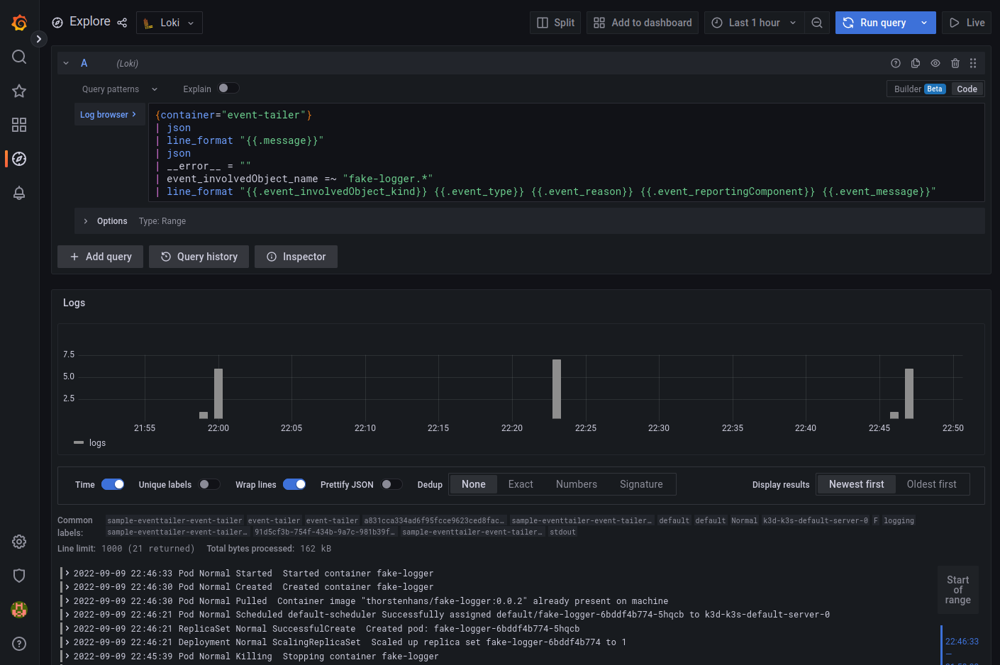

# Logging Operator 的擴展

原文: https://banzaicloud.com/docs/one-eye/logging-operator/configuration/extensions/

日誌擴展是專門為解決用戶的問題而開發的：

- 收集 Kubernetes 事件以深入了解集群內部正在發生的事情，例如調度程序做出的決策，或者為什麼某些 pod 從節點中被驅逐。
- 從節點收集日誌，如 kubelet 日誌。
- 從節點上的文件中收集日誌，例如審計日誌或 systemd 日誌。

## Kubernetes Event Tailer

Kubernetes 事件是提供洞察集群內部發生的事情的對象，例如調度程序做出了哪些決定或為什麼某些 pod 從節點中被逐出。

### 配置選項

|VARIABLE NAME	|TYPE	|REQUIRED	|DEFAULT	|DESCRIPTION|
|---------------|-----|---------|---------|-----------|
|controlNamespace	|string	|Yes	|-	|Eventtailer 的資源會被放到這個命名空間中|
|positionVolume	volume.|KubernetesVolume	|No	|-	|用於跟踪 fluentbit 文件位置的捲定義（可選）|
|workloadMetaOverrides	|*types.MetaBase	|No	|-	|覆蓋已創建資源的元數據|
|workloadOverrides	|*types.PodSpecBase	|No	|-	|覆蓋給定 statefulset 的 podSpec 字段|

### Event Tailer 範例

#### 範例: Configure Kubernetes event tailer

```yaml
kubectl apply -f - <<EOF
apiVersion: logging-extensions.banzaicloud.io/v1alpha1
kind: EventTailer
metadata:
  name: sample-eventtailer
spec:
  controlNamespace: logging # 修改與　LoggerOperator　同一個命名空間
EOF
```

檢查被創建的 resources 物件:

```bash
# 新的 EventTaile CRD 被創建
$ kubectl get EventTailer
NAME                 AGE
sample-eventtailer   95s

# 使用標籤尋找被創建的資源
$ kubectl get all -l app.kubernetes.io/name=event-tailer
NAME                           
         READY   STATUS    RESTARTS   AGE
pod/sample-eventtailer-event-ta
iler-0   1/1     Running   0          8m7s

NAME                                               READY   AGE
statefulset.apps/sample-eventtailer-event-tailer   1/1     8m7s
```

在 Grafana 中查找 Loki 收集的日誌:


```bash title="log ql"
{container="event-tailer"} 
| json 
| line_format "{{.message}}" 
| json 
| __error__ = "" 
| event_involvedObject_name =~ "fake-logger.*"
| line_format "{{.event_involvedObject_kind}} {{.event_type}} {{.event_reason}} {{.event_reportingComponent}} {{.event_message}}"
```



