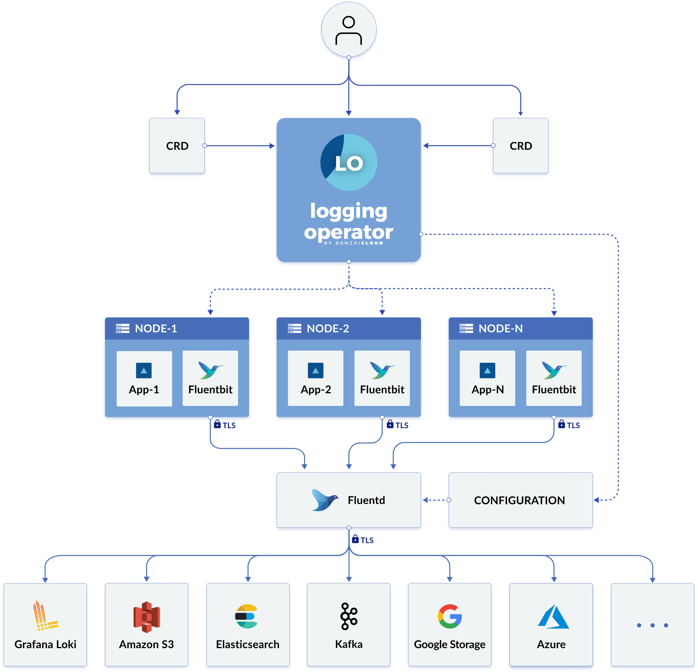

# Logging Operator - 優雅的雲原生日誌管理方案

原文: 

- [Logging Operator - 优雅的云原生日志管理方案 (一)](https://mp.weixin.qq.com/s?__biz=MzIxOTQ0ODI0Mg==&mid=2247487668&idx=3&sn=38ad9c7edfb8c4355df3e042baf450b2&chksm=97da4669a0adcf7fb2f38926a9f7ef714fe11f8e2eff38b8e41c1f71be910f9e1fabd500fc38&scene=178&cur_album_id=1512115063745216512#rd)
- [Logging Operator - 优雅的云原生日志管理方案 (二)](https://mp.weixin.qq.com/s?__biz=MzIxOTQ0ODI0Mg==&mid=2247487668&idx=2&sn=40743b8dc4bc391628e3788e834bd4a1&chksm=97da4669a0adcf7f88351afb29164133b65f2b673e0dac2caa43292e4270b4022e756f23e7fe&scene=178&cur_album_id=1512115063745216512#rd)
- [Logging Operator - 优雅的云原生日志管理方案 (三)](https://mp.weixin.qq.com/s?__biz=MzIxOTQ0ODI0Mg==&mid=2247487668&idx=1&sn=f272b4f68b3c9f1b0b90bb5bfb61fac8&chksm=97da4669a0adcf7ffea48a0faef59ada2325fdbcbd09853a5373f19ebb80d7d29a08e88040d3&scene=178&cur_album_id=1512115063745216512#rd)

Logging Operator 是 BanzaiCloud 開源的一個雲原生場景下的日誌採集方案。它在 2020 年 3 月的時候經過重構後的 v3 版本，底層憑藉高效的 fluentbit 和插件豐富的 flunetd，Logging Operator幾乎已經完美的適配了 kubernetes 模式下的日誌採集場景。

Rancher 在 2.5 版本之後也採用了 Logging Operator 作為統一的日誌解決方案，足以說明它正在被一些以 Kubernetes 為核心的管理平台接受，並集成至內部核心組件。

我們先來看看它的架構。



可以看到 Logging Operator 利用 CRD 的方式介入了日誌從採集、路由、輸出這三個階段的配置。它本質上來說還是利用 DaemonSet 和 StatefulSet 在集群內分別部署了 FluentBit 和 Fluentd 兩個組件，FluentBit 將容器日誌採集並初步處理後轉發給 Fluentd 做進一步的解析和路由，最終由 Fluentd 將日誌結果轉發給不同的服務。

除了管理日誌工作流外，Logging Operator 還可以讓管理者開啟 TLS 來加密日誌在集群內部的網絡傳輸，以及默認集成了 ServiceMonitor 來暴露日誌採集端的狀態。

## Logging Operator CRD

整個 Logging Operator 的核心 CRD 就只有5個，它們分別是

- **logging**：用於定義一個日誌採集端(FleuntBit)和傳輸端(Fleuntd)服務的基礎配置；
- **flow**：用於定義一個 namespaces 級別的日誌過濾、解析和路由等規則。
- **clusterflow**：用於定義一個集群級別的日誌過濾、解析和路由等規則。
- **output**： 用於定義namespace級別的日誌的輸出和參數；
- **clusteroutput**： 用於定義集群級別的日誌輸出和參數，它能把被其他命名空間內的 flow 關聯；

通過這5個 CRD，我們就可以自定義出一個 Kubernetes 集群內每個命名空間中的容器日誌流向


## Logging Operator 安裝

Logging Operator 依賴 Kuberentes1.14 之後的版本，可以分別用 helm 和 mainfest 兩種方式安裝。

- Helm(v3.21.0+)安裝
  
  ```bash
  $ helm repo add banzaicloud-stable https://kubernetes-charts.banzaicloud.com

  $ helm repo update

  $ helm upgrade --install --wait --create-namespace --namespace logging logging-operator banzaicloud-stable/logging-operator \
    --set "createCustomResource=false"
  ```

- Manifest 安裝

  ```
  $ kubectl create ns logging

  # RBAC
  $ kubectl -n logging create -f https://raw.githubusercontent.com/banzaicloud/logging-operator-docs/master/docs/install/manifests/rbac.yaml

  # CRD
  $ kubectl -n logging create -f https://raw.githubusercontent.com/banzaicloud/logging-operator/master/config/crd/bases/logging.banzaicloud.io_clusterflows.yaml
  $ kubectl -n logging create -f https://raw.githubusercontent.com/banzaicloud/logging-operator/master/config/crd/bases/logging.banzaicloud.io_clusteroutputs.yaml
  $ kubectl -n logging create -f https://raw.githubusercontent.com/banzaicloud/logging-operator/master/config/crd/bases/logging.banzaicloud.io_flows.yaml
  $ kubectl -n logging create -f https://raw.githubusercontent.com/banzaicloud/logging-operator/master/config/crd/bases/logging.banzaicloud.io_loggings.yaml
  $ kubectl -n logging create -f https://raw.githubusercontent.com/banzaicloud/logging-operator/master/config/crd/bases/logging.banzaicloud.io_outputs.yaml

  # Operator
  $ kubectl -n logging create -f https://raw.githubusercontent.com/banzaicloud/logging-operator-docs/master/docs/install/manifests/deployment.yaml
  ```

當安裝完成後，我們需要驗證下服務的狀態

```bash
# Operator 狀態
$ kubectl -n logging get pods

NAME                                        READY   STATUS    RESTARTS   AGE
logging-logging-operator-599c9cf846-5nw2n   1/1     Running   0          52s

# CRD 狀態
$ kubectl get crd |grep banzaicloud.io

NAME                                                  CREATED AT
clusterflows.logging.banzaicloud.io                   2021-03-25T08:49:30Z
clusteroutputs.logging.banzaicloud.io                 2021-03-25T08:49:30Z
flows.logging.banzaicloud.io                          2021-03-25T08:49:30Z
loggings.logging.banzaicloud.io                       2021-03-25T08:49:30Z
outputs.logging.banzaicloud.io                        2021-03-25T08:49:30Z
```

## Logging Operator 配置

### `Logging` CRD

#### LoggingSpec

LoggingSpec 定義了收集和傳輸日誌消息的日誌基礎架構服務，其中包含 Fluentd 和 Fluent-bit 的配置。它們都部署在 controlNamespace 指定的命名空間內。一個簡單的樣例如下：

```yaml
apiVersion: logging.banzaicloud.io/v1beta1
kind: Logging
metadata:
  name: default-logging-simple
  namespace: logging
spec:
  fluentd: {}
  fluentbit: {}
  controlNamespace: logging
```

這份樣例告訴了 Operator 在 logging 命名空間內創建一個默認配置的日誌服務，其中包含 FluentBit 和 Fluentd 兩個服務。

當然實際上我們在生產環境上部署 FluentBit 和 Fluentd 不會只用默認的配置，通常我們要考慮很多方面，比如：

- 自定義鏡像
- 日誌採集位點文件的數據持久化
- Buffer 數據持久化
- CPU/內存資源限制
- 狀態監控
- Fluentd 副本數以及負載均衡
- 網絡參數優化
- 容器運行安全

好在 Loggingspec 裡對上述支持得都比較全面，我們可以參考文檔來個性化定制自己的服務。

讓我們挑幾個重要的字段說明用途：

- `watchNamespaces`

    制定讓 Operator 監聽 Flow 和 OutPut 資源的命名空間，如果你是多租戶場景，且每個租戶都用 logging 定義了日誌架構化，可以用 watchNamespaces 來關聯租戶的命名空間來縮小資源過濾範圍

- `allowClusterResourcesFromAllNamespaces`

    ClusterOutput和ClusterFlow 這樣的全局資源默認只在 controlNamespace 關聯的命名空間中生效，如果在其他命名空間中定義都會被忽略，除非將allowClusterResourcesFromAllNamespaces 設置為 true

    !!! info
        LoggingSpec描述文檔：https://banzaicloud.com/docs/one-eye/logging-operator/configuration/crds/v1beta1/logging_types/

#### FluentbitSpec

- `filterKubernetes`

    用來獲取日誌的 Kubernetes 元數據的插件，使用樣例如下：

    ```yaml
    apiVersion: logging.banzaicloud.io/v1beta1
    kind: Logging
    metadata:
      name: default-logging-simple
    spec:
      fluentd: {}
      fluentbit:
        filterKubernetes:
          Kube_URL: "https://kubernetes.default.svc:443"
          Match: "kube.*"
      controlNamespace: logging
    ```

    也可以用 `disableKubernetesFilter` 將該功能禁止，樣例如下：

    ```yaml
    apiVersion: logging.banzaicloud.io/v1beta1
    kind: Logging
    metadata:
      name: default-logging-simple
    spec:
      fluentd: {}
      fluentbit:
        disableKubernetesFilter: true
      controlNamespace: logging
    ```

    !!! info
        filterKubernetes 描述文檔: https://banzaicloud.com/docs/one-eye/logging-operator/configuration/crds/v1beta1/fluentbit_types/#filterkubernetes

- `inputTail`

    定義 FluentBit 的日誌 tail 採集配置，這裡面有很多細節的參數來控制，配置樣例：

    ```yaml
    apiVersion: logging.banzaicloud.io/v1beta1
    kind: Logging
    metadata:
      name: default-logging-simple
    spec:
      fluentbit:
        inputTail:
          Skip_Long_Lines: "true"
          #Parser: docker
          Parser: cri
          Refresh_Interval: "60"
          Rotate_Wait: "5"
          Mem_Buf_Limit: "128M"
          #Docker_Mode: "true"
          Docker_Mode: "false
    ```

    如果 Kubernetes 集群的容器運行時是 Containerd 或這其他 CRI，就需要把 Parser 改成 cri，同時禁用 Docker_Mode。

    !!! info
        inputTail 描述文檔: https://banzaicloud.com/docs/one-eye/logging-operator/configuration/crds/v1beta1/fluentbit_types/#inputtail

- `buffers`

    定義了 FluentBit 的緩衝區設置，這個比較重要。由於 FluentBit 是以 DaemonSet 的方式部署在 Kubernetes 集群中，所以我們可以直接採用 hostPath 的捲掛載方式來給它提供數據持久化的配置，樣例如下：

    ```yaml
    apiVersion: logging.banzaicloud.io/v1beta1
    kind: Logging
    metadata:
      name: default-logging-simple
    spec:
      fluentbit:
        bufferStorage:
          storage.backlog.mem_limit: 10M
          storage.path: /var/log/log-buffer
        bufferStorageVolume:
          hostPath:
            path: "/var/log/log-buffer"
    ```

    !!! info
        bufferStorage 描述文檔: https://banzaicloud.com/docs/one-eye/logging-operator/configuration/crds/v1beta1/fluentbit_types/#bufferstorage


- `positiondb`

      定義了 FluentBit 採集日誌的文件位點信息，同理我們可以用 hostPath 方式支持，樣例如下：

      ```yaml
      apiVersion: logging.banzaicloud.io/v1beta1
      kind: Logging
      metadata:
        name: default-logging-simple
      spec:
        fluentbit:
          positiondb:
            hostPath:
              path: "/var/log/positiondb"
      ```

  - `image`

      提供自定義的 FluentBit 的鏡像信息，這裡我強烈推薦使用 FluentBit-1.7.3 之後的鏡像，它修復了採集端眾多網絡連接超時的問題,它的樣例如下：

      ```yaml
      apiVersion: logging.banzaicloud.io/v1beta1
      kind: Logging
      metadata:
        name: default-logging-simple
      spec:
        fluentbit:
          image:
            repository: fluent/fluent-bit
            tag: 1.7.3
            pullPolicy: IfNotPresent
      ```

- `metrics`

    定義了 FluentBit 的監控暴露端口，以及集成的 ServiceMonitor 採集定義，它的樣例如下：

    ```yaml
    apiVersion: logging.banzaicloud.io/v1beta1
    kind: Logging
    metadata:
      name: default-logging-simple
    spec:
      fluentbit:
        metrics:
          interval: 60s
          path: /api/v1/metrics/prometheus
          port: 2020
          serviceMonitor: true
    ```

- `resources`

    定義了FluentBit的資源分配和限制信息，樣例如下：

    ```yaml
    apiVersion: logging.banzaicloud.io/v1beta1
    kind: Logging
    metadata:
      name: default-logging-simple
    spec:
      fluentbit:
        resources:
          limits:
            cpu: "1"
            memory: 512Mi
          requests:
            cpu: 200m
            memory: 128Mi
    ```

- `security`

    定義了 FluentBit 運行期間的安全設置，其中包含了 PSP、RBAC、securityContext和podSecurityContext。他們共同組成控制了 FluentBit 容器內的權限，它們的樣例如下：

    ```yaml
    apiVersion: logging.banzaicloud.io/v1beta1
    kind: Logging
    metadata:
      name: default-logging-simple
    spec:
      fluentbit:
        security:
          podSecurityPolicyCreate: true
          roleBasedAccessControlCreate: true
          securityContext:
            allowPrivilegeEscalation: false
            readOnlyRootFilesystem: true
          podSecurityContext:
            fsGroup: 101
    ```

**性能參數**

這裡面定義了 FluentBit 的一些運行性能方面的參數，其中包含：

1. 開啟 forward 轉發上游應答相應

    ```yaml
    apiVersion: logging.banzaicloud.io/v1beta1
    kind: Logging
    metadata:
      name: default-logging-simple
    spec:
      fluentbit:
        forwardOptions:
          Require_ack_response: true
    ```

2. TCP 連接參數

    ```yaml
    apiVersion: logging.banzaicloud.io/v1beta1
    kind: Logging
    metadata:
      name: default-logging-simple
    spec:
      fluentbit:
        network:
          connectTimeout: 30
          keepaliveIdleTimeout: 60
    ```

3. 開啟負載均衡模式
   
    ```yaml
    apiVersion: logging.banzaicloud.io/v1beta1
    kind: Logging
    metadata:
      name: default-logging-simple
    spec:
      fluentbit:
        enableUpstream: true
    ```


4. 調度污點容忍
  
    ```yaml
    apiVersion: logging.banzaicloud.io/v1beta1
    kind: Logging
    metadata:
      name: default-logging-simple
    spec:
      fluentbit:
        tolerations:
        - effect: NoSchedule
          key: node-role.kubernetes.io/master
    ```

#### FluentdSpec

- `buffers`

    這裡主要定義 Fluentd 的 buffer 數據持久化配置，由於 Fluentd 是以 StatefulSet 的方式部署的，所以我們用 hostPath 就不太合適，這裡我們應該用PersistentVolumeCliamTemplate 的方式為每一個 fluentd 實例創建一塊專門的 buffer 數據卷，樣例如下:

    ```yaml
    apiVersion: logging.banzaicloud.io/v1beta1
    kind: Logging
    metadata:
      name: default-logging-simple
    spec:
      fluentd:
        bufferStorageVolume:
          pvc:
            spec:
              accessModes:
                - ReadWriteOnce
              resources:
                requests:
                  storage: 50Gi
              storageClassName: csi-rbd
              volumeMode: Filesystem
    ```

    這裡如果不指定 storageClassName 的話，Operator 將通過 StorageClass 為 default 的存儲插件創建 pvc。

- `FluentOutLogrotate`

    定義了 Fluentd 的標準輸出重定向到文件配置，這主要是為了避免在出現錯誤時 Fluentd 產生連鎖反應，並且錯誤消息作為日誌消息返回系統生成另一個錯誤，樣例如下：

    ```yaml
    apiVersion: logging.banzaicloud.io/v1beta1
    kind: Logging
    metadata:
      name: default-logging-simple
    spec:
      fluentd:
        fluentOutLogrotate:
          enabled: true
          path: /fluentd/log/out
          age: 10
          size: 10485760
    ```

    這裡表達的意思就是將 fluentd 日誌重定向到 /fluentd/log/out 目錄，同時保留10天，文件最大不超過10M

    !!! info
        FluentOutLogrotate 描述文檔：https://banzaicloud.com/docs/one-eye/logging-operator/configuration/crds/v1beta1/fluentd_types/#fluentoutlogrotate

- `Scaling`

    這裡主要定義 fluentd 的副本數，如果 FluentBit 開啟 UpStraem 的支持，調整 Fluentd 的副本數會導致 FluentBit 滾動更新，它的樣例如下：

    ```yaml
    apiVersion: logging.banzaicloud.io/v1beta1
    kind: Logging
    metadata:
      name: default-logging-simple
    spec:
      fluentd:
        scaling:
          replicas: 4
    ```

    !!! info
        scaling 描述文檔： https://banzaicloud.com/docs/one-eye/logging-operator/configuration/crds/v1beta1/fluentd_types/#fluentdscaling

- `Worker` 

    這裡定義了 Fluentd 內部的 Worker 數量，由於 Fluentd 受限於 ruby，它還是以單進程的方式處理日誌工作流，增加 worker 數可以顯著提高 Fluentd 的並發，樣例如下：

    ```yaml
    apiVersion: logging.banzaicloud.io/v1beta1
    kind: Logging
    metadata:
      name: default-logging-simple
    spec:
      fluentd:
        workers: 2
    ```

- `image`

    定義了 Fluentd 的鏡像信息，這裡必須要用 Logging Operator 定制的鏡像，可以自定義鏡像版本，結構和 FluetnBit 類似。

- `security`

    定義了 Fluentd 運行期間的安全設置，其中包含了 PSP、RBAC、securityContext和podSecurityContext，結構和 FluentBit 類似。

- `metrics`
  
    定義了 Fluentd 的監控暴露端口，以及集成的 ServiceMonitor 採集定義，結構和 FluentBit 類似。

- `resources`

    定義了 Fluentd 的資源分配和限制信息，結構和 FluentBit 類似。


接下來我們要講解 Logging Operator 中除 logging 外的 CRD 應用。在開始之前，我們還是先看下 Logging Operator 對 K8S 中處理容器日誌流向的邏輯圖。


其實我們可以看出來，Logging Operator 核心的邏輯主要就在 Flow 和 Output 這兩個 CRD。簡單來說，Flow 的作用是用來處理日誌流的，Output 用來定義日誌的輸出方式。至於 ClusterFlow 和 ClusterOutput 無外乎就是一個全局的聲明罷了。

### Flow 與 ClusterFlow CRD

Flow 定義了日誌的 filters 和 outputs，它是一個 namespaces 級別的 CRD 資源。因此，我們可以在應用所在的命名空間內根據 Kubernetes 標籤來決定日誌是否被採集，同時也能定義多個 filter 來對日誌進行處理。舉個簡單的例子：

```yaml
apiVersion: logging.banzaicloud.io/v1beta1
kind: Flow
metadata:
  name: flow-sample
  namespace: default
spec:
  filters:
    - parser:
        remove_key_name_field: true
        parse:
          type: nginx
    - tag_normaliser:
        format: ${namespace_name}.${pod_name}.${container_name}
  localOutputRefs:
    - loki-output
  match:
    - select:
        labels:
          app: nginx
```

這條 Flow 的意思是，讓日誌採集端只處理來自 default 命名空間下，標籤 `app=nginx` 的容器日誌。同時並對採集的日誌按照 nginx 的格式進行解析，並把這條日誌流的 tag 在fluentd 內部重定向為 `${namespace_name}.${pod_name}.${container_name}`。


這個例子裡面，我們著重註意三個地方 `match`,`filters` 和 `localOutputRefs`。

#### match

`match` 是處理日誌的第一步，我們需要利用 Kubernetes 標籤來定義哪些日誌需要被採集。當前可用的字段如下：

- **namespaces**， 匹配命名空間
- **labels**，匹配 labels
- **hosts**，匹配 host 機器
- **container_names**，匹配容器名字

我們通過 `select` 和 `exclude` 來選擇或排除我們要匹配的資源類型。比如下面例子：

```yaml
apiVersion: logging.banzaicloud.io/v1beta1
kind: Flow
  metadata:
    name: flow-sample
    namespace: default
  spec:
    match:
      - exclude:
          labels:
            component: reloader
      - select:
          labels:
            app: nginx
            componnet: nginx
```

這條 Flow 就聲明讓客戶端只處理 default 命名空間下標籤為 `app=nginx, componnet=nginx`，排除 `component: reloader` 的容器日誌。

對於 ClusterFlow，我們可以通過 select 來控制多個 namespaces 下的日誌採集。比如:

```yaml
apiVersion: logging.banzaicloud.io/v1beta1
kind: ClusterFlow
metadata:
  name: clusterflow-sample
spec:
  match:
    - exclude:
        namespaces:
          - dev
          - test
    - select:
        labels:
          app: nginx
```

這條聲明就告訴了客戶端只處理命名空間不是 `dev` 和 `test` 而且標籤為 `app=nginx` 的容器日誌。

!!! tip
    ClusterFlow 的聲明默認只在 controlNamespace 定義的 namespace 下生效，如果要定義到其他命名空間，你需要在定義 `logging` CRD時打開`allowClusterResourcesFromAllNamespaces`

如果我們需要簡單粗暴的採集指定 namespaces 下所有容器的日誌，那麼只需要定義一個如下內容的 ClusterFlow 即可:

```yaml
apiVersion: logging.banzaicloud.io/v1beta1
kind: ClusterFlow
metadata:
  name: clusterflow-sample
spec:
  match:
  - select:
      namespaces:
      - prod
      - dev
      - test
```

#### filter

Logging Operator 的 filter 支持一些常見的日誌處理插件。可以參考下面這個表格:

|名稱	|類型	|描述	|狀態	|版本|
|----|-----|----|----|----|
|Concat	|filters	|用於fluentd處理日誌多行的插件	|GA	|2.4.0|
|Dedot	|filters	|處理帶.的字段替換插件，通常用於輸出到elaticsearch前的字段轉化	|GA	|1.0.0|
|Exception Detector	|filters	|Exception日誌捕獲器，支持java, js, csharp, python, go, ruby, php	|GA	|0.0.13|
|Enhance K8s Metadata	|filters	|banzaicloud開發的k8s擴展元數據	|GA	|0.0.0|
|Geo IP	|filters	|fluentd的GeoIP地址庫	|GA	|1.3.2|
|Grep	|filters	|fluentd的grep過濾器	|GA	|more info|
|Parser	|filters	|fluentd的Parser解析器	|GA	|more info|
|Prometheus	|filters	|Prometheus插件，可用於對日誌做計數	|GA	|1.8.5|
|Record Modifier	|filters	|fluentd 字段修改插件	|GA	|2.1.0|
|Record Transformer	|filters	|Mutates/transforms incoming event streams.	|GA	|more info|
|Stdout	|filters	|標準輸出插件	|GA	|more info|
|SumoLogic	|filters	|Sumo Logic公司的日誌處理插件	|GA	|2.3.1|
|Tag Normaliser	|filters	|fluentd中的tag修改器	|GA	|0.1.1|

!!! info
    filter 插件文檔：https://banzaicloud.com/docs/one-eye/logging-operator/configuration/plugins/filters/

##### Parser 插件

Parser 插件比較常見，通常我們用它來解析採集的日誌內容，比如我們要解析的日誌是 json 格式就可以按照如下方式配置：

```yaml
apiVersion: logging.banzaicloud.io/v1beta1
kind: Flow
metadata:
  name: flow-sample
  filters:
    - parser:
        remove_key_name_field: true
        reserve_data: true
        key_name: "log"
        parse:
          type: json
          time_key: time
          time_format: "%Y-%m-%dT%H:%M:%S.%NZ"
```

甚至，我們也可以在日誌裡定義多種類型的格式，如下：

```yaml
apiVersion: logging.banzaicloud.io/v1beta1
kind: Flow
metadata:
 name: flow-sample
spec:
 filters:
   - parser:
       remove_key_name_field: true
       reserve_data: true
       parse:
         type: multi_format
         patterns:
         - format: nginx
         - format: regexp
           expression: /foo/
         - format: none
```

這會生成 fluentd 的如下的 fluentd 配置

```xml
<filter **>
 @type parser
 @id test_parser
 key_name message
 remove_key_name_field true
 reserve_data true
 <parse>
   @type multi_format
   <pattern>
     format nginx
   </pattern>
   <pattern>
     expression /foo/
     format regexp
   </pattern>
   <pattern>
     format none
   </pattern>
 </parse>
</filter>
```

!!! info
    parser 插件文檔：https://banzaicloud.com/docs/one-eye/logging-operator/configuration/plugins/filters/parser/

##### record_modifier 插件

record_modifier 允許我們從已解析的日誌字段裡面提取和修改字段。比如我們在採集 kubernetes 的容器日誌時，希望修改部分元數據時，就可以使用這個插件。

```yaml
apiVersion: logging.banzaicloud.io/v1beta1
kind: Flow
metadata:
 name: flow-sample
spec:
 filters:
  - record_modifier:
      records:
      - host: ${record.dig('kubernetes', 'host')}
```

這條 filter 規則就定義了讓 fluentd 在處理日誌元數據時，新加一個字段 host，它的值來自於 `.kubernetes.host`。它最終在 fluentd 中操作的配置是這樣的。

```xml
<filter **>
 @type record_modifier
 @id test_record_modifier
  <record>
    host ${record.dig('kubernetes', 'host')}
  </record>
</filter>
```

##### prometheus 插件

prometheus 是用來統計進入 fluentd 日誌流並處理的日誌基數，比如我們想統計標籤 `app=nginx` 這個打印了多少日誌時，就可以用該插件處理，

```yaml
apiVersion: logging.banzaicloud.io/v1beta1
kind: Flow
metadata:
 name: flow-sample
spec:
 filters:
   - parser:
       remove_key_name_field: true
       reserve_data: true
       parse:
         type: nginx
   - prometheus:
       metrics:
       - name: total_counter
         desc: The total number of nginx in message.
         type: counter
         labels:
           app: nginx
       labels:
         host: ${hostname}
         tag: ${tag}
         namespace: $.kubernetes.namespace
```

這個就表示了 nginx 日誌在 fluentd 共計處理了多少行消息，這對我們統計業務日誌資源使用來說比較方便的。

!!! info
    prometheus 插件文檔：https://banzaicloud.com/docs/one-eye/logging-operator/configuration/plugins/filters/prometheus/

#### outputRefs

OutputRefs 定義了日誌的輸出路徑。它分為 `localOutputRefs` 和 `globalOutputRefs`。故名思義，`localOutputRefs` 是跟 flow 一樣作用在 namespace 級別，其他命名空間下的 Flow 看不到當前命名空間下的 output 定義。 `globalOutputRefs` 為集群級別的日誌輸出聲明，它能被所有命名空間下的 Flow 和 ClusterFlow 引用。

### Output 與 ClusterOutput CRD

Output 定義了日誌的輸出方式，目前 Logging Operator 支持的日誌輸出插件非常多，包含如下內容：

- Alibaba Cloud 
- Amazon CloudWatch 
- Amazon Elasticsearch
- Amazon Kinesis 
- Amazon S3 
- Azure Storage 
- Buffer 
- Datadog 
- Elasticsearch 
- File 
- Format 
- Format rfc5424 
- Forward 
- GELF 
- Google Cloud Storage
- Grafana Loki
- Http
- Kafka
- LogDNA
- LogZ
- NewRelic
- Splunk
- SumoLogic
- Syslog

這裡面我們日常工作中用到的日誌存儲或架構大概就包含 `Loki`,`ElasticSearch` ,`Kafka` 或 `S3`。

##### Grafana Loki

Grafana Loki 插件用來定義 fluentd 將日誌輸出到 Loki 當中，我們可以定義一些特定的參數來控制和優化日誌輸出，比如下面這個樣例：

```yaml
apiVersion: logging.banzaicloud.io/v1beta1
kind: Output
metadata:
 name: loki-output
spec:
  loki:
    buffer:
      chunk_limit_size: 8M
      flush_at_shutdown: true
      flush_interval: 10s
      flush_mode: interval
      flush_thread_count: 4
      overflow_action: throw_exception
      queued_chunks_limit_size: 64
      retry_max_interval: 60s
      retry_timeout: 1h
      retry_type: exponential_backoff
      retry_wait: 10s
      total_limit_size: 10G
      type: file
    configure_kubernetes_labels: false
    drop_single_key: true
    extra_labels:
      cluster: cluster-xxx
    extract_kubernetes_labels: false
    labels:
      namespace: ""
      pod: ""
      images: ""
      host: ""
      container: ""
      tream: ""
    remove_keys:
    - time
    - kubernetes
    - logtag
    - docker
    - metadata
    url: http://loki:3100
```

在多租戶的場景下，我們甚至也可以將 Loki 的多租戶功能打開，這樣我們可以在定義 output 的時候指定租戶信息，比如:

```yaml
apiVersion: logging.banzaicloud.io/v1beta1
kind: Output
metadata:
 name: loki-output
spec:
  loki:
    url: http://loki:3100
    username: test
    password: test
    tenant: test
```

這樣我們就可以靈活的在 kubernets 集群中定義多租戶的日誌輸出問題。

!!! info
    loki 插件文檔：https://banzaicloud.com/docs/one-eye/logging-operator/configuration/plugins/outputs/loki/

##### Kafka

Fluentd 的 kafka 輸出插件:

```yaml
apiVersion: logging.banzaicloud.io/v1beta1
kind: Output
metadata:
 name: kafka-output
spec:
 kafka:
   brokers: kafka-headless.kafka.svc.cluster.local:29092
   topic_key: topic
   default_topic: topic
   required_acks：1
   format: 
     type: json    
   buffer:
     tags: topic
     timekey: 1m
     timekey_wait: 30s
     timekey_use_utc: true
```

!!! info
    kafka 插件文檔：https://banzaicloud.com/docs/one-eye/logging-operator/configuration/plugins/outputs/kafka/


##### ElasticSearch

Fluentd 的 ES 輸出插件:

```yaml
apiVersion: logging.banzaicloud.io/v1beta1
kind: Output
metadata:
  name: es-output
spec:
  elasticsearch:
    host: elasticsearch.logging.svc.cluster.local
    port: 9200
    scheme: https
    ssl_verify: false
    ssl_version: TLSv1_2
    user: elastic
    logstash_format: true
    password:
      valueFrom:
        secretKeyRef:
          name: quickstart-es-elastic-user
          key: elastic
    buffer:
      timekey: 1m
      timekey_wait: 30s
      timekey_use_utc: true
```

!!! info
    elasticsearch 插件文檔：https://banzaicloud.com/docs/one-eye/logging-operator/configuration/plugins/outputs/elasticsearch/

另外值得提醒的是，Output 和 ClusterOutput 都可以被 OutputRefs 引用，比如我們需要將日誌同時發送給 kafka 和 elastichsearch 時，我們就可以如下定義：

```yaml
apiVersion: logging.banzaicloud.io/v1beta1
kind: Flow
metadata:
  name: nginx-flow
  namespace: default
spec:
 filters:
   - parser:
       remove_key_name_field: true
       reserve_data: true
       parse:
         type: nginx
  match:
    - select:
        labels:
          app: nginx
  localOutputRefs:
    - kafka-output
    - es-output
```

## 日誌指標

應用在容器化的過程中，由於容器文件系統的臨時性，開發者始終面臨自己的日誌文件落盤和輸出 stdout 的兩難選擇，當研發將應用日誌管理的權利交給平台時，意味著平台要做的東西遠比應用一對一採集要復雜。

在眾多需求中，某天有SRE同學提問：“我們在阿里雲中可以看到日誌採集的實時速率，我們需要為此定制質量監控指標”。這個問題也點醒了我，對於我們在做私有雲時，站在平台外面對日誌採集的管道內部的觀察一直是處於信息缺失的盲區。好在 fluentbit 和 fluentd 都有獨立的 prometheus 插件來暴露內部的指標，不過在用 Logging Operator 後，它的指標採集依托 prometheus operator，且架構足夠清晰，因此我們也可以有更多的選擇來滿足研發的需求。


首先，我們在定義 logging 時可以讓 fluent bit(d)開啟 prometheus 的採集:

```yaml
spec:
  fluentd:
    metrics:
      serviceMonitor: true
      serviceMonitorConfig:
        honorLabels: true    # 打開honorLabels主要是為了保持組件原有的label，避免標籤被覆蓋。
  fluentbit:
    metrics:
      serviceMonitor: true
```

!!! info
    這裡可以看到 Logging Operator 主要依靠 ServiceMonitor 來做採集端的服務發現，這裡需要集群內部運行 Prometheus Operator 以支持該 CRD。如果集群內部沒有改資源類型，也可以藉助 Prometheus 自身的服務發現機制來完成指標的發現和採集。

不過這裡僅僅只聲明了採集端的指標入口，這裡面默認只包含了 Fluent bit(d)內部基本的運行狀態，如果要進一步實現對日誌速率的監控，就得需要 Flunetd 出馬了。

```xml
<filter **>
  @type prometheus
  <metric>
    type counter
    name logging_entry_count
    desc Total number of log entries generated by either application containers or system components
  </metric>
  <labels>
    container: $.kubernetes.container_name
    pod: $.kubernetes.pod_name
  </labels>
</filter>
```

這條規則將匹配所有進入 Fluentd 的日誌， 並進入到 Prometheus 這個 filter 進行計數處理。並將統計後的指標以 logging_entry_count 命名，按照日誌中的一些元數據信息作為指標的 label，用於區分來至不同的容器。

!!! info
    由於需要解析日誌的 kubernetes 元數據，這裡又需要 Fluentd 的 kubernetes-metadata-filter插件來做容器元數據的提取。在 Logging Operator中 Kubernetes 的元數據在 FluentBit 中解析，無需再在 Fluentd 額外添加該插件。

```yaml
apiVersion: logging.banzaicloud.io/v1beta1
kind: Flow
metadata:
  name: default
  namespace: demo
spec:
  - prometheus:
      labels:
        container: $.kubernetes.container_name
        namespace: $.kubernetes.namespace_name
        node: $.kubernetes.host
        pod: $.kubernetes.pod_name
      metrics:
      - desc: Total number of log entries generated by either application containers
          or system components
        name: logging_entry_count
        type: counter
  globalOutputRefs:
  - containers-console
  match:
  - select:
      labels:
        what.you.want: collect
```

當上述指標入庫 Prometheus 之後，我們便可以通過這條語句查出當前集群下日誌採集器的應用速率:

```
sum by (pod) (rate(logging_entry_count[1m]))
```


!!! tip
    上述僅僅是對日誌總體速率的採集監控，如果我們需要對日誌內出現的特定的內容或者對日誌的 byte 進行統計時，就需要結合其它的插件進行組合。當前 Logging Operator 支持的插件還遠不如 Fluentd 豐富，不過我們可以參照官方文檔，編寫需要的plugin集成至 Operator。 [Logging Operator Developers手冊](https://banzaicloud.com/docs/one-eye/logging-operator/developers/)

對於日誌組件內部的監控和告警，Logging Operator 有一套自己的規則，可以在 logging 這個 CRD 中啟用這個功能:

```yaml
spec:
  fluentbit:
    metrics:
      prometheusRules: true
  fluentd:
    metrics:
      prometheusRules: true
```

!!! tip
    這裡的 prometheusRules 同樣是 Prometheus Operator 管理的資源，如果集群內沒有此資源類型，可手動為 Prometheus 配置 Rules

回到最初的問題，如果需要將日誌的採集速率作為應用的量化指標時，利用 `logging_entry_count` 即可。

## 日誌採樣

大多數情況下，日誌架構不應該對業務日誌採取一些不可控的策略，造成應用日誌的不完整，例如採樣。在這裡顯然我也不推薦你在現有的架構中啟用此功能。不過有時候，或者是部分魔法師無法有效控製程序的“洪荒之力”而瘋狂輸出時，平台對於這類俏皮的應用時就可以採樣的方案，畢竟保證整個日誌通道的可用性是平台第一優先要考慮因素。

Logging Operator 在日誌採樣方面，採用了 Throttle 這個插件限速器，用一句話總結這個插件就是為每個進入到 filter 日誌的管道引入了漏桶算法，讓其丟棄到超過速率限制的日誌。

```yaml
apiVersion: logging.banzaicloud.io/v1beta1
kind: Flow
metadata:
  name: default
  namespace: demo
spec:
  - throttle:
      group_bucket_limit: 3000
      group_bucket_period_s: 10
      group_key: kubernetes.pod_name
  globalOutputRefs:
  - containers-console
  match:
  - select:
      labels:
        what.you.want: collect
```

- group_key: 日誌採樣的聚合 key，通常我們按照 pod 名稱來做聚合，亦或直接填寫 kubenretes.metadata 的其它值聚合也行
- group_bucket_period_s: 採樣的時間範圍，默認 60s
- group_bucket_limit: 採樣期間的日誌桶最大容量

日誌的採樣速率由公式 `group_bucket_limit / group_bucket_period_s` 計算，當 group_key 中的日誌速率超過值時則會丟到後續日誌。

>> 由於 Throttle 並沒有採用令牌桶的算法，所以它不會有 burst 來應對突發日誌量的採集。

## 日誌落盤

前面說到，所有基於容器的應用程序，日誌的最佳實踐是將日誌定向到 stdout、stderr 中，但並不是所有“開發團隊”都會遵循此約定，日誌文件落盤仍然是當下多數研發的選擇。雖然理論上來說容器的標準 (錯誤)輸出也是將日誌流集中重定到 `/var/log/containers` 下的日誌文件上，但仍然受限於運行時配置或者其他硬盤原因帶來不可控的因素。

對於日誌落盤的場景，當前業界也無統一的解決方案，但歸總起來其實也就2個實現方式：

### sidecar 方案

此方案是將日誌採集器跟隨應用容器一同運行在 pod 當中，通過 volume 共享日誌路徑的方式採集。常見的是方式是為 kubernetes 開發一套單獨的控制器，並採用 `MutatingWebhook` 在pod 啟動階段將 sidecar 的信息注入。

sidecar 的方案優勢在於為每個應用的 sidecar 配置相對獨立，但劣勢除佔用過多資源外，**採集器的更新迭代需跟隨應用的生命週期**，對於持續維護不太優雅。

### node agent 方案

此方案將日誌採集器以 `DaemonSet` 的方式運行在每個 Node 當中，然後在操作系統層面進行集中採集。通常此方案需要平台的研發需要做一定路徑策略，將固定 `hostpath`的 vulume 掛載給容器用於應用日誌落盤時使用。

除此之外，我們知道所有 Kubernetes 默認的存儲類型或者第三方的遵循 CSI 標準的存儲，都會將 Volume 掛載到`/var/lib/kubelet/pods/<pod_id>/volumes/kubernetes.io~<type>/<pvc_id>/mount`目錄下，所以對於 node agent 更加優雅一點的方案是在 node agent 中賦予調用 Kubernetes API 的權限，讓其知曉被採集容器日誌映射在主機下的路徑。

node agent 方案的優勢在於配置集中管理，採集器跟應用容器解耦，互不影響。缺點在於採集器存在吞吐不足的風險。

可以看到上述兩個方案中，不管哪一個都與 Logging Operator 沾不上關係。確實，當下社區對此場景下還沒有一個行之有效的方案，不過按照其思路，我們可以將日誌文件轉成標準（錯誤）輸出流來變相處理這個問題。

用 `tail` 來舉個直觀的例子來說明上述的方案。

```yaml
...
containers:
- args:
  - -F
  - /path/to/your/log/file.log
  command:
  - tail
  image: busybox
  name: stream-log-file-[name]
  volumeMounts:
  - mountPath: /path/to/your/log
    name: mounted-log
...
```

雖然 tail 是一個極其簡單粗暴的方式，且無法解決日誌輪轉等問題，但它的確為 Logging Operator 提供了一個新的日誌落盤場景下的方案。雖然看上去與 sidecar 如出一轍，不過最大的區別在於，此方案能與 Logging Operator 現有的日誌管道無縫兼容，日誌被採集後仍然能在 flow 階段進行處理。

## 總結

Logging Operator 站在自動化運維的角度確實有效解決了 Kubernetes 場景下日誌架構複雜和應用日誌採集難的問題，雖然當下對落盤日誌的支持還不夠全面。但隨著接入的用戶逐漸成長，現在的問題在將來或許還有更好的解決方案。不過，當下它的確不失為最好的雲原生日誌架構之一。

